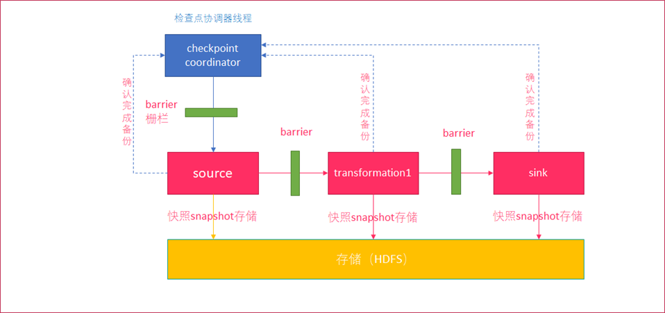
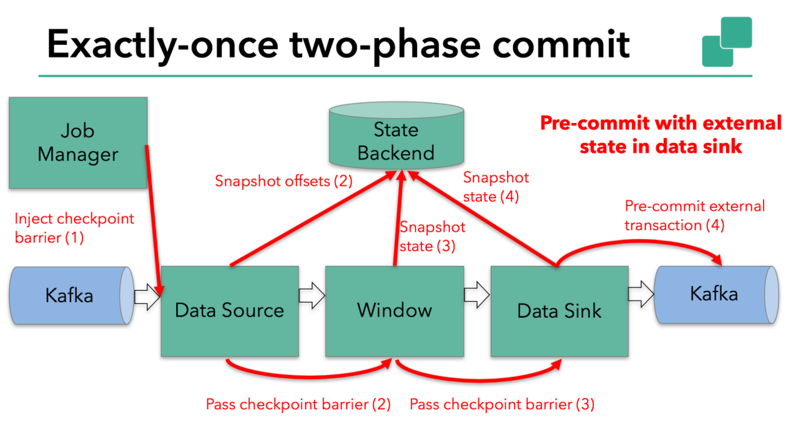

### 1.checkpoint

checkpoint是Flink容错的核心机制。它可以定期地将各个Operator处理的数据进行快照存储（
Snapshot ），flink会在输入的数据集上间隔性地生成checkpoint
barrier，通过栅栏（barrier）将间隔时间段内的数据划分到相应的checkpoint中，当应用出现异常时，operator就能从上一次快照中恢复所有算子之前的状态，从而保证数据的一致性。

{width="5.768055555555556in"
height="2.7152777777777777in"}

（1）checkpoint coordinator（协调器）线程周期生成 barrier
（栅栏），发送给每一个source

（2）source将当前的状态进行snapshot（可以保存到HDFS）

（3）source向coordinator确认snapshot已经完成

（4） source继续向下游transformation operator发送 barrier

（5）transformation operator重复source的操作，直到sink
operator向协调器确认snapshot完成

（6）coordinator确认完成本周期的snapshot

1.  ### 开启的时间间隔

    开启checkpoint时间间隔为1000ms（毫秒），根据实际情况，如果状态较大，适当增加间隔时间

env.enableCheckpointing(1000);

### exactly-once

（1）At Most once: 对于一条message,receiver最多收到一次(0次或1次).

可以达成At Most Once的策略:

sender把message发送给receiver.无论receiver是否收到message,sender都不再重发message.

（2）At Least once: 对于一条message,receiver最少收到一次(1次及以上).

可以达成At Least Once的策略:

sender把message发送给receiver.当receiver在规定时间内没有回复ACK或回复了error信息,那么sender重发这条message给receiver,直到sender收到receiver的ACK.

（3）Exactly once: 对于一条message,receiver确保只收到一次

{width="5.759722222222222in"
height="3.2423611111111112in"}

当检查点 Barrier
通过所有算子并且触发的快照回调成功完成时，预提交阶段结束。所有触发的状态快照都被视为该检查点的一部分。检查点是整个应用程序状态的快照，包括预先提交的外部状态。如果发生故障，我们可以回滚到上次成功完成快照的时间点。

下一步是通知所有算子检查点已成功完成。这是两阶段提交协议的提交阶段，JobManager
为应用程序中的每个算子发出检查点完成的回调。

操作：

可以选择exactly-once语义保证整个应用内端到端的数据一致性，这种情况比较适合对数据要求高情况，不允许数据丢失或者数据重复。

如果flink性能较弱情况下，使用at-least-once。

env.getCheckpointConfig().setCheckpointingMode(CheckpointingMode.***EXACTLY\_ONCE***);

1.  ### checkpoint超时

    一旦checkpoint执行时间超过阈值，flink会中断checkpoint过程，并按照超时处理。

    设置超时时间，默认10分钟

env.getCheckpointConfig().setCheckpointTimeout(60000);

1.  ### 检查点之间最小时间间隔

    设定两个checkpoint之间的最小时间间隔，防止出现例如状态数据过大而导致checkpoint执行时间过长，从而导致checkpoint积压过多，最终flink应用密集触发checkpoint操作。

    间隔500毫秒

env.getCheckpointConfig().setMinPauseBetweenCheckpoints(500);

1.  ### 最大并行执行的检查点数量

    默认只有一个检查点，根据实际情况可以同时触发多个checkpoint，提升checkpoint效率。

env.getCheckpointConfig().setMaxConcurrentCheckpoints(2);

### 1.6 failOnCheckpointingErrors

该参数决定了checkpoint执行过程中如果出现失败或者错误，任务是否同时被关闭，默认为True。

env.getCheckpointConfig().setFailOnCheckpointingErrors(**false**);

整体开发：

**package** com.state;\
\
**import** org.apache.flink.api.common.functions.MapFunction;\
**import** org.apache.flink.api.common.functions.RichFlatMapFunction;\
**import** org.apache.flink.api.common.state.StateTtlConfig;\
**import** org.apache.flink.api.common.state.ValueState;\
**import** org.apache.flink.api.common.state.ValueStateDescriptor;\
**import** org.apache.flink.api.common.time.Time;\
**import** org.apache.flink.api.common.typeinfo.TypeHint;\
**import** org.apache.flink.api.common.typeinfo.TypeInformation;\
**import** org.apache.flink.api.java.tuple.Tuple;\
**import** org.apache.flink.api.java.tuple.Tuple2;\
**import** org.apache.flink.configuration.Configuration;\
**import** org.apache.flink.streaming.api.CheckpointingMode;\
**import** org.apache.flink.streaming.api.datastream.DataStream;\
**import** org.apache.flink.streaming.api.datastream.DataStreamSource;\
**import**
org.apache.flink.streaming.api.environment.StreamExecutionEnvironment;\
**import** org.apache.flink.util.Collector;\
\
\
\
**public class** s5 {\
**public static void** main(String\[\] args) **throws** Exception {\
StreamExecutionEnvironment env =
StreamExecutionEnvironment.*getExecutionEnvironment*();\
env.enableCheckpointing(1000);\
env.getCheckpointConfig().setCheckpointingMode(CheckpointingMode.***EXACTLY\_ONCE***);\
env.getCheckpointConfig().setCheckpointTimeout(60000);\
env.getCheckpointConfig().setMinPauseBetweenCheckpoints(500);\
env.getCheckpointConfig().setMaxConcurrentCheckpoints(2);\
env.getCheckpointConfig().setFailOnCheckpointingErrors(**false**);\
DataStream&lt;Tuple2&lt;Long,Long&gt;&gt; a1 =
env.socketTextStream(**"192.168.8.201"**, 9999).map(**new**
MapFunction&lt;String, Tuple2&lt;Long,Long&gt;&gt;() {\
@Override\
**public** Tuple2&lt;Long,Long&gt; map(String s) **throws** Exception {\
**return new** Tuple2&lt;Long,Long&gt;(Long.*parseLong*(s.split(**"
"**)\[0\]),Long.*parseLong*(s.split(**" "**)\[1\]));\
}\
});\
StateTtlConfig ttlConfig = StateTtlConfig\
.*newBuilder*(Time.*seconds*(10))\
.setUpdateType(StateTtlConfig.UpdateType.***OnCreateAndWrite***)\
.setStateVisibility(StateTtlConfig.StateVisibility.***NeverReturnExpired***)\
.build();\
\
ValueStateDescriptor&lt;String&gt; stateDescriptor = **new**
ValueStateDescriptor&lt;&gt;(**"text state"**, String.**class**);\
stateDescriptor.enableTimeToLive(ttlConfig);\
\
a1.keyBy(0).flatMap(**new** CountWindowAverage()).print();\
env.execute(**"s3"**);\
\
\
}\
\
**public static class** CountWindowAverage **extends**
RichFlatMapFunction&lt;Tuple2&lt;Long, Long&gt;, Tuple2&lt;Long,
Long&gt;&gt; {\
**private transient** ValueState&lt;Tuple2&lt;Long, Long&gt;&gt;
**sum**;\
\
@Override\
**public void** flatMap(Tuple2&lt;Long, Long&gt; input,
Collector&lt;Tuple2&lt;Long, Long&gt;&gt; out) **throws** Exception {\
\
*// access the state value\
*Tuple2&lt;Long, Long&gt; currentSum = **sum**.value();\
\
*// update the count\
*currentSum.**f0** += 1;\
\
*// add the second field of the input value\
*currentSum.**f1** += input.**f1**;\
\
*// update the state\
***sum**.update(currentSum);\
\
*// if the count reaches 2, emit the average and clear the state\
***if** (currentSum.**f0** &gt;= 2) {\
out.collect(**new** Tuple2&lt;&gt;(input.**f0**, currentSum.**f1** /
currentSum.**f0**));\
**sum**.clear();\
}\
}\
\
@Override\
**public void** open(Configuration config) {\
ValueStateDescriptor&lt;Tuple2&lt;Long, Long&gt;&gt; descriptor =\
**new** ValueStateDescriptor&lt;&gt;(\
**"average"**, *// the state name\
*TypeInformation.*of*(**new** TypeHint&lt;Tuple2&lt;Long, Long&gt;&gt;()
{}), *// type information\
*Tuple2.*of*(0L, 0L)); *// default value of the state, if nothing was
set\
***sum** = getRuntimeContext().getState(descriptor);\
}\
}\
}
