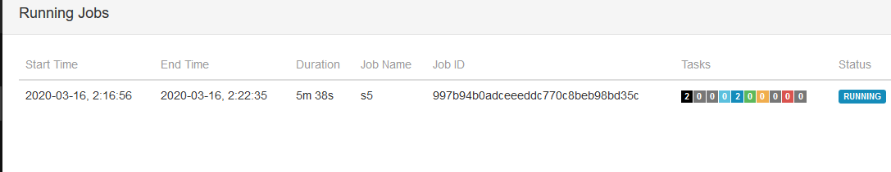

checkpoint：应用定时触发，用户保存状态，会过期，内部应用失败重启的时候使用，默认情况下cancel时，会删除之前的checkpoint。

savepoint：用户手动执行，不会过期，相当于备份，可以在cancel的时候使用。一般可以用于修改并行度，程序升级等等。

所以如果想要在程序停掉后重启，数据一致的情况下，强烈推荐使用cancel时做savepoint，当然，如果程序中没有涉及到state，可以不用。

1.1 配置文件修改

在flink-conf.yaml中配置savepoint存储位置，不是必须设置，如果设置了，那么做savepoint的时候，可以不指定位置，系统会默认使用你设置的位置。如果没有设置，那么在做savepoint的时候，必须指定位置，不然就会报错。

\[hadoop@h201 \~\]\$ vi flink-1.7.2/conf/flink-conf.yaml

state.savepoints.dir: hdfs://192.168.8.201:9000/flink-checkpoints

1.2 启动hadoop 和flink

1.3 启动 flink任务

开发：

**package** com.state;\
\
**import** org.apache.flink.api.common.functions.MapFunction;\
**import** org.apache.flink.api.common.functions.RichFlatMapFunction;\
**import** org.apache.flink.api.common.state.ValueState;\
**import** org.apache.flink.api.common.state.ValueStateDescriptor;\
**import** org.apache.flink.api.common.typeinfo.TypeHint;\
**import** org.apache.flink.api.common.typeinfo.TypeInformation;\
**import** org.apache.flink.api.java.tuple.Tuple2;\
**import** org.apache.flink.configuration.Configuration;\
**import** org.apache.flink.streaming.api.CheckpointingMode;\
**import** org.apache.flink.streaming.api.datastream.DataStream;\
**import**
org.apache.flink.streaming.api.environment.StreamExecutionEnvironment;\
**import** org.apache.flink.streaming.api.windowing.time.Time;\
**import** org.apache.flink.util.Collector;\
\
\
\
**public class** s5 {\
**public static void** main(String\[\] args) **throws** Exception {\
StreamExecutionEnvironment env =
StreamExecutionEnvironment.*getExecutionEnvironment*();\
env.enableCheckpointing(1000);\
env.getCheckpointConfig().setCheckpointingMode(CheckpointingMode.***EXACTLY\_ONCE***);\
env.getCheckpointConfig().setCheckpointTimeout(60000);\
env.getCheckpointConfig().setMinPauseBetweenCheckpoints(500);\
env.getCheckpointConfig().setMaxConcurrentCheckpoints(2);\
env.getCheckpointConfig().setFailOnCheckpointingErrors(**false**);\
DataStream&lt;Tuple2&lt;Long,Long&gt;&gt; a1 =
env.socketTextStream(**"192.168.8.201"**, 9999).map(**new**
MapFunction&lt;String, Tuple2&lt;Long,Long&gt;&gt;() {\
@Override\
**public** Tuple2&lt;Long,Long&gt; map(String s) **throws** Exception {\
**return new** Tuple2&lt;Long,Long&gt;(Long.*parseLong*(s.split(**"
"**)\[0\]),Long.*parseLong*(s.split(**" "**)\[1\]));\
}\
});\
\
a1.keyBy(0).flatMap(**new** CountWindowAverage()).print();\
env.execute(**"s5"**);\
\
}\
\
**public static class** CountWindowAverage **extends**
RichFlatMapFunction&lt;Tuple2&lt;Long, Long&gt;, Tuple2&lt;Long,
Long&gt;&gt; {\
**private transient** ValueState&lt;Tuple2&lt;Long, Long&gt;&gt;
**sum**;\
\
@Override\
**public void** flatMap(Tuple2&lt;Long, Long&gt; input,
Collector&lt;Tuple2&lt;Long, Long&gt;&gt; out) **throws** Exception {\
\
*// access the state value\
*Tuple2&lt;Long, Long&gt; currentSum = **sum**.value();\
\
*// update the count\
*currentSum.**f0** += 1;\
\
*// add the second field of the input value\
*currentSum.**f1** += input.**f1**;\
\
*// update the state\
***sum**.update(currentSum);\
\
*// if the count reaches 2, emit the average and clear the state\
***if** (currentSum.**f0** &gt;= 2) {\
out.collect(**new** Tuple2&lt;&gt;(input.**f0**, currentSum.**f1** /
currentSum.**f0**));\
}\
}\
\
@Override\
**public void** open(Configuration config) {\
ValueStateDescriptor&lt;Tuple2&lt;Long, Long&gt;&gt; descriptor =\
**new** ValueStateDescriptor&lt;&gt;(\
**"average"**, *// the state name\
*TypeInformation.*of*(**new** TypeHint&lt;Tuple2&lt;Long, Long&gt;&gt;()
{}), *// type information\
*Tuple2.*of*(0L, 0L)); *// default value of the state, if nothing was
set\
***sum** = getRuntimeContext().getState(descriptor);\
}\
}\
}

1.4 查看jobid

{width="5.763194444444444in"
height="1.11875in"}

1.5 启动savepoint

\[hadoop@h201 flink-1.7.2\]\$ bin/flink savepoint
997b94b0adceeeddc770c8beb98bd35c

1.6 恢复

\[hadoop@h201 flink-1.7.2\]\$ bin/flink run -s
hdfs://h201:9000/flink-checkpoints/savepoint-c24586-97d3805650cb
/home/hadoop/qq/q3flink12.jar
