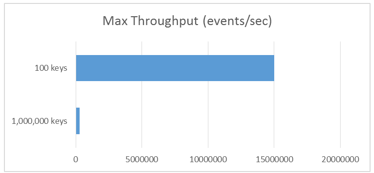
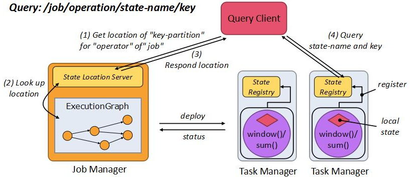
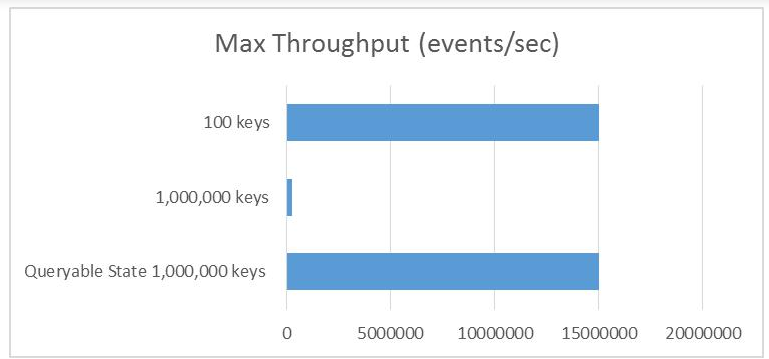
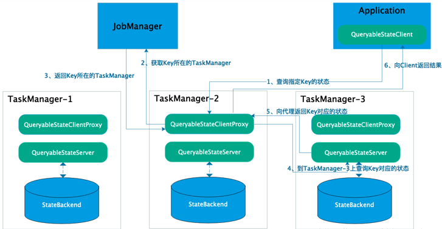
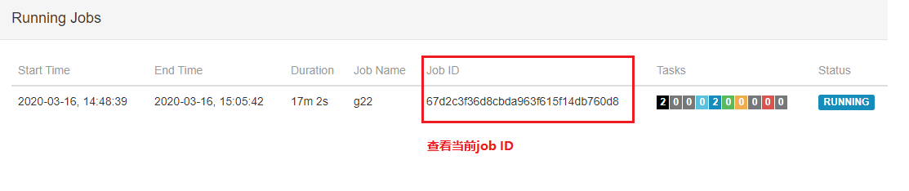
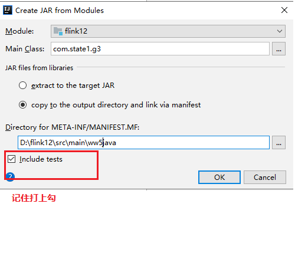

测试的最终结果是保持到持久化系统里面（比如Redis），然后我们把雅虎的测试和dataArtisans公司的测试结果对比一下：

{width="5.763194444444444in"
height="2.6659722222222224in"}

我们发现当Key的数量在100的时候，吞吐量明显比Key数量在1000000的时候要高很多，这是因为整个系统的瓶颈是在将数据写入到持久化系统里面！写的Key数量越多，消耗的时间就越长！所以社区才会引入可查询状态（Queryable
State）。

引入可查询状态的好处将有助于消除对键值存储（key-value
stores）之类的外部系统的依赖，这些键值存储在实践中经常是瓶颈，正如上图所示。将Flink内部的状态暴露给外部实际上是将数据库的很大一部分工作移动到流处理器中，这将提供高吞吐量查询，而且计算好的状态可以立即被访问。

1.  ### 可查询状态（Queryable State）原理

    {width="5.763194444444444in"
    height="2.5in"}

    整个过程如下：

    （1）、查询客户端请求了一个可查询状态：/job/operation/state-name/key，Flink会请求State
    Location Server得到 key-partition 的存储位置；

    （2）、而State Location Server会从ExecutionGraph中查找位置；

    （3）、当 key-partition 的存储位置找到之后，会提供给查询客户端；

    （4）、查询客户端根据状态存储的位置向相应的State\
    Registry查询 state-name 和 key；

    （5）、最后State\
    Registry将结果返回给查询客户端，这样客户端就得到了相应的状态信息。

    **整个过程并没有涉及到持久化系统，如果应用程序只对最新的实时结果感兴趣，那么这样的系统就完全可以了；如果应用程序会查询历史的状态结果，Flink的Query
    Service会把过去计算好的状态信息存储到持久化系统，这样用户既可以查询实时的状态信息，也可以查询历史的状态信息。**

    {width="5.767361111111111in"
    height="2.692361111111111in"}

    引入了可查询状态之后，即使处理的Key值过多，但是其吞吐量和100个key的吞吐量差不多！性能提升很多啊。

2.  ### Queryable State服务架构

    {width="5.763194444444444in"
    height="2.9881944444444444in"}

    Queryable State服务架构

    (1)QueryableStateClient:
    客户端。运行在外部系统。提交查询请求并接收最终返回的结果。

    (2)QueryableStateClientProxy:
    客户端代理。运行在每个TaskManager上。接收客户端的请求，找到Key对应的TaskManager，然后将请求转发给具体的查询服务，并负责最终向客户端返回结果。

    (3)QueryableStateServer:
    查询服务。运行在每个TaskManager上。处理来自客户端代理的请求并返回结果。

### 3：

### 3.1 pom.xml 依赖

&lt;**dependency**&gt;\
&lt;**groupId**&gt;org.apache.flink&lt;/**groupId**&gt;\
&lt;**artifactId**&gt;flink-streaming-java\_2.11&lt;/**artifactId**&gt;\
&lt;**version**&gt;1.7.2&lt;/**version**&gt;\
&lt;/**dependency**&gt;\
\
&lt;**dependency**&gt;\
&lt;**groupId**&gt;org.apache.flink&lt;/**groupId**&gt;\
&lt;**artifactId**&gt;flink-runtime-web\_2.11&lt;/**artifactId**&gt;\
&lt;**version**&gt;1.7.2&lt;/**version**&gt;\
&lt;/**dependency**&gt;\
\
&lt;**dependency**&gt;\
&lt;**groupId**&gt;org.apache.flink&lt;/**groupId**&gt;\
&lt;**artifactId**&gt;flink-queryable-state-runtime\_2.11&lt;/**artifactId**&gt;\
&lt;**version**&gt;1.7.2&lt;/**version**&gt;\
&lt;/**dependency**&gt;\
\
&lt;**dependency**&gt;\
&lt;**groupId**&gt;org.apache.flink&lt;/**groupId**&gt;\
&lt;**artifactId**&gt;flink-core&lt;/**artifactId**&gt;\
&lt;**version**&gt;1.7.2&lt;/**version**&gt;\
&lt;/**dependency**&gt;\
\
&lt;**dependency**&gt;\
&lt;**groupId**&gt;org.apache.flink&lt;/**groupId**&gt;\
&lt;**artifactId**&gt;flink-queryable-state-client-java\_2.11&lt;/**artifactId**&gt;\
&lt;**version**&gt;1.7.2&lt;/**version**&gt;\
&lt;/**dependency**&gt;

&lt;dependency&gt;

&lt;groupId&gt;org.slf4j&lt;/groupId&gt;

&lt;artifactId&gt;slf4j-nop&lt;/artifactId&gt;

&lt;version&gt;1.7.2&lt;/version&gt;

&lt;/dependency&gt;

### 3.2 基本配置

(1)复制flink
opt目录下的flink-queryable-state-runtime\_2.11-1.9.0.jar包到lib目录

\[hadoop@h201 flink-1.7.2\]\$ cp
opt/flink-queryable-state-runtime\_2.11-1.7.2.jar lib/

(2)

\[hadoop@h201 conf\]\$ vi conf/flink-conf.yaml

添加：

queryable-state.enable: true

### 3.3 开发

StateDescriptor的setQueryable方法使状态可查

#### 3.3.1 server端

**package** com.state1;\
\
**import** org.apache.flink.api.common.functions.MapFunction;\
**import** org.apache.flink.api.common.functions.RichFlatMapFunction;\
**import** org.apache.flink.api.common.state.ValueState;\
**import** org.apache.flink.api.common.state.ValueStateDescriptor;\
**import** org.apache.flink.api.common.typeinfo.TypeHint;\
**import** org.apache.flink.api.common.typeinfo.TypeInformation;\
**import** org.apache.flink.api.java.tuple.Tuple2;\
**import** org.apache.flink.configuration.Configuration;\
**import** org.apache.flink.runtime.state.filesystem.FsStateBackend;\
**import** org.apache.flink.streaming.api.datastream.DataStream;\
**import**
org.apache.flink.streaming.api.environment.StreamExecutionEnvironment;\
**import** org.apache.flink.util.Collector;\
\
\
\
**public class** g22 {\
**public static void** main(String\[\] args) **throws** Exception {\
StreamExecutionEnvironment env =
StreamExecutionEnvironment.*getExecutionEnvironment*();\
env.enableCheckpointing(1000);\
env.setStateBackend(**new**
FsStateBackend(**"hdfs://192.168.8.201:9000/flink-1"**));\
\
DataStream&lt;Tuple2&lt;Long,Long&gt;&gt; a1 =
env.socketTextStream(**"192.168.8.201"**, 9999).map(**new**
MapFunction&lt;String, Tuple2&lt;Long,Long&gt;&gt;() {\
@Override\
**public** Tuple2&lt;Long,Long&gt; map(String s) **throws** Exception {\
**return new** Tuple2&lt;Long,Long&gt;(Long.*parseLong*(s.split(**"
"**)\[0\]),Long.*parseLong*(s.split(**" "**)\[1\]));\
}\
});\
\
a1.keyBy(0).flatMap(**new** CountWindowAverage()).print();\
env.execute(**"g22"**);\
\
}\
\
**public static class** CountWindowAverage **extends**
RichFlatMapFunction&lt;Tuple2&lt;Long, Long&gt;, Tuple2&lt;Long,
Long&gt;&gt; {\
**private transient** ValueState&lt;Tuple2&lt;Long, Long&gt;&gt;
**sum**;\
\
@Override\
**public void** flatMap(Tuple2&lt;Long, Long&gt; input,
Collector&lt;Tuple2&lt;Long, Long&gt;&gt; out) **throws** Exception {\
\
*// access the state value\
*Tuple2&lt;Long, Long&gt; currentSum = **sum**.value();\
\
*// update the count\
*currentSum.**f0** += 1;\
\
*// add the second field of the input value\
*currentSum.**f1** += input.**f1**;\
\
*// update the state\
***sum**.update(currentSum);\
\
*// if the count reaches 2, emit the average and clear the state\
***if** (currentSum.**f0** &gt;= 2) {\
out.collect(**new** Tuple2&lt;&gt;(input.**f0**, currentSum.**f1** /
currentSum.**f0**));\
}\
}\
\
@Override\
**public void** open(Configuration config) {\
ValueStateDescriptor&lt;Tuple2&lt;Long, Long&gt;&gt; descriptor =\
**new** ValueStateDescriptor&lt;&gt;(\
**"average"**, *// the state name\
*TypeInformation.*of*(**new** TypeHint&lt;Tuple2&lt;Long, Long&gt;&gt;()
{}), *// type information\
*Tuple2.*of*(0L, 0L)); *// default value of the state, if nothing was
set\
*descriptor.setQueryable(**"q123"**);\
**sum** = getRuntimeContext().getState(descriptor);\
}\
}\
}

运行程序：

\[hadoop@h201 flink-1.7.2\]\$ bin/flink run
/home/hadoop/qq/ww2flink12.jar

#### 3.3.2查看jobid和运行的taskmanager

{width="5.761805555555555in"
height="1.211111111111111in"}

{width="5.758333333333334in"
height="0.5368055555555555in"}

#### 3.3.3 client端开发

**注意：jobid 和taskmanager的地址对应添加到脚本**

开发：

**package** com.state1;\
\
**import** org.apache.flink.api.common.JobID;\
**import** org.apache.flink.api.common.state.ValueState;\
\
**import** org.apache.flink.api.common.state.ValueStateDescriptor;\
\
**import** org.apache.flink.api.common.typeinfo.BasicTypeInfo;\
**import** org.apache.flink.api.common.typeinfo.TypeHint;\
**import** org.apache.flink.api.common.typeinfo.TypeInformation;\
\
**import** org.apache.flink.api.java.tuple.Tuple2;\
**import** org.apache.flink.queryablestate.client.QueryableStateClient;\
\
**import** java.util.concurrent.CompletableFuture;\
\
**public class** g3 {\
**public static void** main(String\[\] args) **throws** Exception {\
QueryableStateClient client = **new** QueryableStateClient(\
**"192.168.8.203"**, *// taskmanager的地址\
*9069);*// 默认是9069端口，可以在flink-conf.yaml文件中配置\
\
// the state descriptor of the state to be fetched.\
*ValueStateDescriptor&lt;Tuple2&lt;Long, Long&gt;&gt; descriptor =\
**new** ValueStateDescriptor&lt;&gt;(\
**"average"**,\
TypeInformation.*of*(**new** TypeHint&lt;Tuple2&lt;Long, Long&gt;&gt;()
{}));\
\
**while** (**true**) {\
CompletableFuture&lt;ValueState&lt;Tuple2&lt;Long, Long&gt;&gt;&gt;
resultFuture =\
client.getKvState(\
JobID.*fromHexString*(**"67d2c3f36d8cbda963f615f14db760d8"**), *//
从webui中获取JID\
***"q123"**, *// g22中设置的名字 descriptor.setQueryable("q123");\
*1L, *// key的值\
*BasicTypeInfo.***LONG\_TYPE\_INFO***, *// key 的类型\
*descriptor);\
\
*// now handle the returned value\
*resultFuture.thenAccept(response -&gt; {\
**try** {\
Tuple2&lt;Long, Long&gt; res = response.value();\
System.***out***.println(**"res: "** + res);\
} **catch** (Exception e) {\
e.printStackTrace();\
}\
});\
Thread.*sleep*(2000);\
}\
}\
}

解释：

CompletableFuture最终保存由queryableStateName具有ID的作业标识的可查询状态实例的状态值jobID。这key是您感兴趣的状态的Keys，
keyTypeInfo它将告诉Flink如何序列化/反序列化它。最后，stateDescriptor包含了请求的状态，即它的类型（必要的信息Value，Reduce等等），并就如何序列化/反序列化的必要信息。

细心的读者会注意到返回的future包含一个type值S，即一个State包含实际值的对象。这可以通过任何支持Flink状态类型：ValueState，ReduceState，ListState，MapState，
AggregatingState，和当前已过时FoldingState。

打包

{width="5.4375in"
height="4.520833333333333in"}

**整个工程目录导入到linux中**

\[hadoop@h201 ww5flink12\_jar\]\$ java -jar flink12.jar
