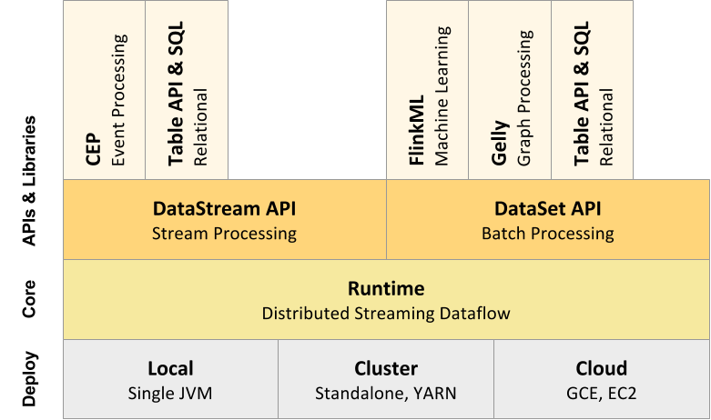
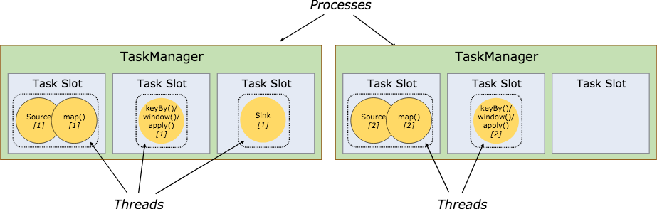
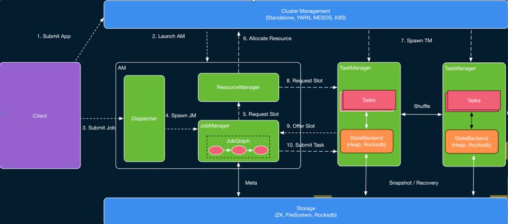
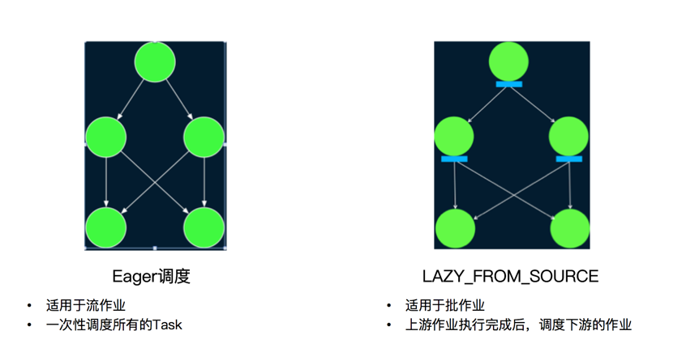
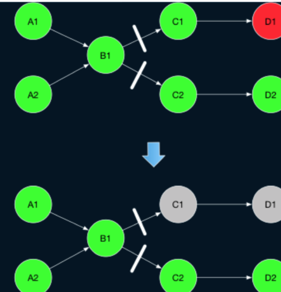

### 1.runtime

Flink
RunTime是介于底层部署与DataSteamApi或DataSetApi之间的一层，以JobGraph形式接收程序,将任务task提交到集群上执行，RunTime层可以适用不同底层部署模式。

{width="5.394444444444445in"
height="3.1909722222222223in"}

2.  ### solt分配

    {width="5.759027777777778in"
    height="1.8347222222222221in"}

    那么slot是如何保存和分配的呢？

    1.在Tm启动时，tm会将自己所拥有的slot用心跳的方式汇报给jm中的Resourcemanager组件，由SlotManager进行管理。

    2.当有任务提交过来到Jm后JobManager会向ResourceManager request
    slot，这时候ResourceManager就会分配一个Slot并向对应的Tm发送消息说，你拥有的这个slot我要分配给别人了。

    3.Tm收到请求后，会回复消息给Jm说，我的这个slot分配给你了

    4.Jm收到消息后，会将这个slot先缓存到slotPool中。

    5.JM会将task 提交到对应的Slot

    6.当task执行结束，tm会告诉resourcemanager任务结束了，这个slot被释放掉了

    7.resourcemanager会更新slot状态为free，可以供后续任务申请。（tm会定时发送slot的状态过来，避免free丢失导致的slot丢失）

3.  ### 作业提交

Flink作业提交有2种方式，一种是PerJob模式，一种是Session模式

PerJob模式

（1）TM和AM没有提前启动

独享Dispatcher和ResourceManager组件

按需申请资源

适合执行时间长，规模较大的任务

Session模式

（2）TM 和 AM是提前启动的

共享 Dispatcher和ResourceManager组件

资源是共享的，可以跑多个任务

适用于规模小，执行时间短的任务

以On-Yarn为例，描述一下任务的提交过程。主流程看下图

{width="5.759722222222222in"
height="2.540277777777778in"}

PerJob模式提交任务流程：

（1）Client向yarn的Resourcemanager提交一个任务

（2）Resourcemanager接收到请求，启动AppMaster进程

（3）Client提交JobGraph给Jm中的DisPatcher组件

（4）DisPatcher将JobGraph给JobManger

（5）JobManager向ResourceManager申请slot

（6）ResourceManager向yarn申请container启动tm进程

（7）tm进程汇报slot给ResourceManager

（8）ResourceManager告诉tm分配了哪个slot给任务了

（9）tm向Jm回复自己个一个slot属于你这个任务了，jm会将slot缓存到slotpool

（10）jm提交task

（11）task执行结束，tm告诉resourcemanager slot释放

Session模式提交任务流程：

session模式因为jm和tm是提前启动的，上述步骤的 1，2，6，7
没有，其他是一样的。

Flink作业有2中调度策略：

Eager调度 适用与流作业，一次性调度所有作业

Lazy\_FROM\_SOURCE
适用于批作业，上游作业完成后，调度下游作业，资源会比较省

{width="5.746527777777778in"
height="2.9in"}

### 4.错误恢复

Flink任务的错误有2大类，一种是tm执行失败（逻辑错误，tm挂了等），一种是Jm失败即Master失败，接下来看下这两种失败各自恢复的机制。

#### 4.1Task Failover

（1）Restart All 重启所有Task

（2）Restart-individual
只重启单个出错的Task，这种方式适用有限，适用与task间无连接的情况。

（3）Restart Region

Blocking数据落盘，可以直接读取，逻辑上仅重启通过pipeline边关联的Task

（Blocking依赖是结果存储在磁盘或其他，可以重新读取。pipeline依赖一般是只数据走网络的情况）

下图中B1执行完落盘,即blocking边。

A1-&gt;B1,A2-B2到B1即Pipeline边。

{width="5.7625in"
height="5.990972222222222in"}

#### 4.2Master Failover

如果Master开启了Ha，会通过zk进行选主，备用节点会转为主节点。目前master
failover会将全图重启。
