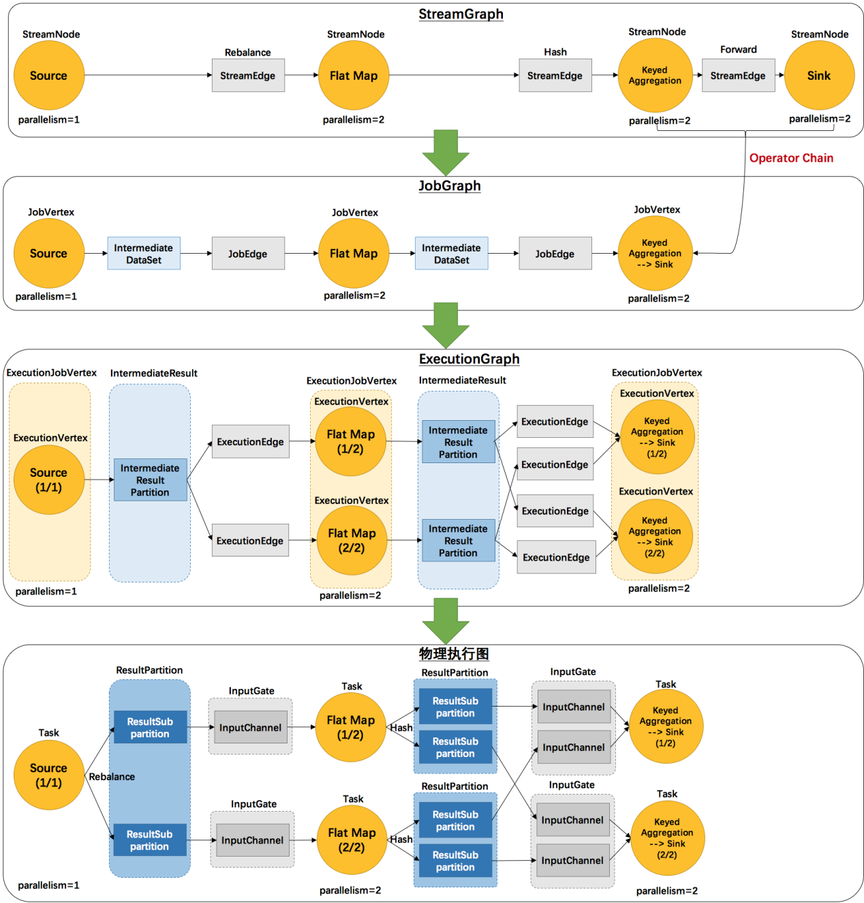
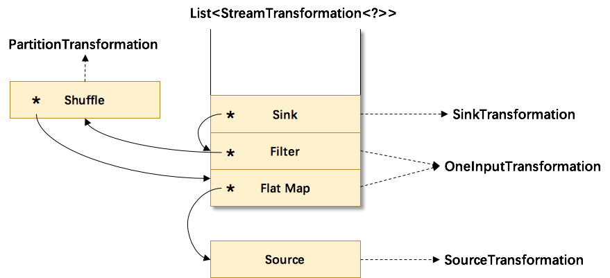
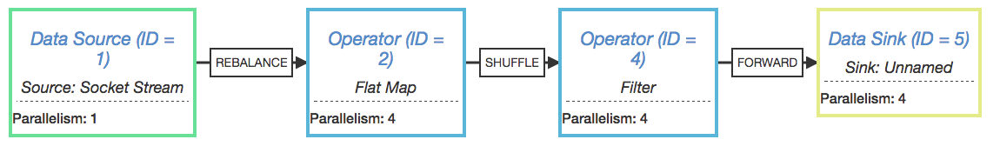

### 1.Graph

看起来有点乱，怎么有这么多不一样的图。实际上，还有更多的图。Flink
中的执行图可以分成四层：StreamGraph -&gt; JobGraph -&gt; ExecutionGraph
-&gt; 物理执行图。

（1）StreamGraph：是根据用户通过 Stream API
编写的代码生成的最初的图。用来表示程序的拓扑结构。

（2）JobGraph：StreamGraph经过优化后生成了 JobGraph，提交给 JobManager
的数据结构。主要的优化为，将多个符合条件的节点 chain
在一起作为一个节点，这样可以减少数据在节点之间流动所需要的序列化/反序列化/传输消耗。

（3）ExecutionGraph：JobManager 根据 JobGraph
生成ExecutionGraph。ExecutionGraph是JobGraph的并行化版本，是调度层最核心的数据结构。

（4）物理执行图：JobManager 根据 ExecutionGraph 对 Job
进行调度后，在各个TaskManager 上部署 Task
后形成的“图”，并不是一个具体的数据结构。

{width="5.763194444444444in"
height="6.0159722222222225in"}

（1）StreamGraph：根据用户通过 Stream API 编写的代码生成的最初的图。

StreamNode：用来代表 operator
的类，并具有所有相关的属性，如并发度、入边和出边等。

StreamEdge：表示连接两个StreamNode的边。

（2）JobGraph：StreamGraph经过优化后生成了 JobGraph，提交给 JobManager
的数据结构。

JobVertex：经过优化后符合条件的多个StreamNode可能会chain在一起生成一个JobVertex，即一个JobVertex包含一个或多个operator，JobVertex的输入是JobEdge，输出是IntermediateDataSet。

IntermediateDataSet：表示JobVertex的输出，即经过operator处理产生的数据集。producer是JobVertex，consumer是JobEdge。

JobEdge：代表了job graph中的一条数据传输通道。source 是
IntermediateDataSet，target 是
JobVertex。即数据通过JobEdge由IntermediateDataSet传递给目标JobVertex。

（3）ExecutionGraph：JobManager 根据 JobGraph
生成ExecutionGraph。ExecutionGraph是JobGraph的并行化版本，是调度层最核心的数据结构。

ExecutionJobVertex：和JobGraph中的JobVertex一一对应。每一个ExecutionJobVertex都有和并发度一样多的
ExecutionVertex。

ExecutionVertex：表示ExecutionJobVertex的其中一个并发子任务，输入是ExecutionEdge，输出是IntermediateResultPartition。

IntermediateResult：和JobGraph中的IntermediateDataSet一一对应。一个IntermediateResult包含多个IntermediateResultPartition，其个数等于该operator的并发度。

IntermediateResultPartition：表示ExecutionVertex的一个输出分区，producer是ExecutionVertex，consumer是若干个ExecutionEdge。

ExecutionEdge：表示ExecutionVertex的输入，source是IntermediateResultPartition，target是ExecutionVertex。source和target都只能是一个。

Execution：是执行一个 ExecutionVertex
的一次尝试。当发生故障或者数据需要重算的情况下 ExecutionVertex
可能会有多个 ExecutionAttemptID。一个 Execution 通过 ExecutionAttemptID
来唯一标识。JM和TM之间关于 task 的部署和 task status 的更新都是通过
ExecutionAttemptID 来确定消息接受者。

（4）物理执行图：JobManager 根据 ExecutionGraph 对 Job
进行调度后，在各个TaskManager 上部署 Task
后形成的“图”，并不是一个具体的数据结构。

Task：Execution被调度后在分配的 TaskManager 中启动对应的 Task。Task
包裹了具有用户执行逻辑的 operator。

ResultPartition：代表由一个Task的生成的数据，和ExecutionGraph中的IntermediateResultPartition一一对应。

ResultSubpartition：是ResultPartition的一个子分区。每个ResultPartition包含多个ResultSubpartition，其数目要由下游消费
Task 数和 DistributionPattern 来决定。

InputGate：代表Task的输入封装，和JobGraph中JobEdge一一对应。每个InputGate消费了一个或多个的ResultPartition。

InputChannel：每个InputGate会包含一个以上的InputChannel，和ExecutionGraph中的ExecutionEdge一一对应，也和ResultSubpartition一对一地相连，即一个InputChannel接收一个ResultSubpartition的输出。

2.  ### StreamGraph

    {width="5.759027777777778in"
    height="2.627083333333333in"}

    其中符号\*为input指针，指向上游的transformation，从而形成了一棵transformation树。然后，通过调用StreamGraphGenerator.generate(env,
    transformations)来生成StreamGraph。自底向上递归调用每一个transformation，也就是说处理顺序是Source-&gt;FlatMap-&gt;Shuffle-&gt;Filter-&gt;Sink。

    {width="5.761805555555555in"
    height="0.8416666666666667in"}

