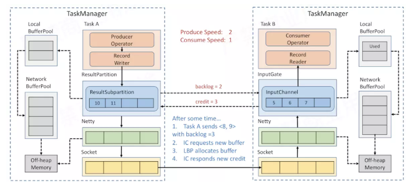

### 1.Flink 流处理为什么需要网络流控？

分析一个简单的 Flink
流任务，下图是一个简单的Flink流任务执行图：任务首先从 Kafka 中读取数据、
map 算子对数据进行转换、keyBy 按照指定 key 对数据进行分区（相同 key
的数据经过 keyBy 后分到同一个 subtask 实例中），keyBy 后对数据接着进行
map 转换，然后使用 Sink 将数据输出到外部存储。

{width="5.763888888888889in"
height="3.0145833333333334in"}

众所周知，在大数据处理中，无论是批处理还是流处理，单点处理的性能总是有限的，我们的单个
Job
一般会运行在多个节点上，多个节点共同配合来提升整个系统的处理性能。图中，任务被切分成
4 个可独立执行的 subtask（ A0、A1、B0、B1），在数据处理过程中，就会存在
shuffle（数据传输）的过程。例如，subtask A0 处理完的数据经过 keyBy
后发送到 subtask B0、B1 所在节点去处理。

那么问题来了，下图中，上游 Producer 向下游 Consumer
发送数据，在发送端和接受端都有相应的 Send Buffer 和 Receive
Buffer，但是上游 Producer 生成数据的速率比下游 Consumer
消费数据的速率快。Producer 生产数据 2MB/s， Consumer 消费数据
1MB/s，Receive Buffer 只有 5MB，所以过了5秒后，接收端的 Receive Buffer
满了。（可以把下图中的 Producer 当做上面案例中的 subtask A0，把下图中的
Consumer 当做上面案例中的 subtask B0）

{width="5.7652777777777775in"
height="1.6159722222222221in"}

下游接收区的 Receive Buffer
有限，如果上游一直有源源不断的数据，那么将会面临着以下两个情况：

下游消费者会丢弃新到达的数据，因为下游消费者的缓冲区放不下

为了不丢弃数据，所以下游消费者的 Receive Buffer
持续扩张，最后耗尽消费者的内存，OOM，程序挂掉

常识告诉我们，这两种情况在生产环境都是不能接受的，第一种会把数据丢弃、第二种会把我们的应用程序挂掉。所以，该问题的解决方案不应该是下游
Receive Buffer 一直累积数据，而是上游 Producer 发现下游 Consumer
处理比较慢之后，应该在 Producer 端做出限流的策略，防止在下游 Consumer
端无限制的数据堆积。

那上游 Producer 端该如何做限流呢？可以采用下图所示静态限流的策略：

{width="5.763888888888889in"
height="1.929861111111111in"}

静态限速的思想就是，提前已知下游 Consumer 的消费速率，然后通过在上游
Producer 端使用类似令牌桶的思想，限制 Producer
端生产数据的速率，从而控制上游 Producer 端向下游 Consumer
端发送数据的速率。但是静态限速会存在问题：

通常无法事先预估下游 Consumer 端能承受的最大速率

就算通过某种方式预估出下游 Consumer
端能承受的最大速率，下游应用程序也可能会因为网络抖动、 CPU
共享竞争、内存紧张、IO阻塞等原因造成下游应用程序的吞吐量降低，然后又会出现上面所说的下游接收区的
Receive Buffer
有限，上游一直有源源不断的数据发送到下游的问题，还是会造成下游要么丢数据，要么为了不丢数据
buffer 不断扩充导致下游 OOM的问题

综上所述，我们发现了，上游 Producer
端必须有一个限流的策略，且静态限流是不可靠的，于是就需要一个动态限流的策略。可以采用下图动态反馈所示：

{width="5.7652777777777775in"
height="1.3847222222222222in"}

下游 Consumer 端会频繁地向上游 Producer 端进行动态反馈，告诉 Producer
下游 Consumer 的负载能力，从而 Producer 端动态调整向下游 Consumer
发送数据的速率实现 Producer 端的动态限流。当 Consumer
端处理较慢时，Consumer 将负载反馈到 Producer
端，Producer端会根据反馈适当降低 Producer 自身从上游或者 Source
端读数据的速率来降低向下游 Consumer 发送数据的速率。当 Consumer
处理负载能力提升后，又及时向 Producer 端反馈，Producer
会通过提升从上游或 Source
端读数据的速率来提升向下游发送数据的速率。通过这个动态反馈来提升整个系统的吞吐量。

补充一点，如下图所示，假如我们的 Job 分为 Task A、B、C，Task A 是 Source
Task、Task B 处理数据、Task C 是 Sink Task。假如 Task C
由于各种原因吞吐量降低，会将负载信息反馈给 Task B，Task B 会降低向 Task
C 发送数据的速率，此时如果 Task B 如果还是一直从 Task A
读取数据，那么按照同样的道理，数据会把 Task B 的 Send Buffer 和 Receive
Buffer 撑爆，又会出现上面描述的问题。所以，当 Task B 的 Send Buffer 和
Receive Buffer 被用完后，Task B 会用同样的原理将负载信息反馈给 Task
A，Task A 收到 Task B 的负载信息后，会降低 给 Task B
发送数据的速率，以此类推。

{width="5.763888888888889in"
height="1.2444444444444445in"}

上面这个流程，就是 Flink 动态限流（反压机制）的简单描述。我们可以看到
Flink 的反压其实是从下游往上游传播的，一直往上传播到 Source Task
后，Source Task 最终会降低从 Source 端读取数据的速率。如果下游 Task C
的负载能力提升后，会及时反馈给 Task B，于是 Task B 会提升往 Task C
发送数据的速率，Task B 又将负载提升的信息反馈给 Task A，Task A
就会提升从 Source 端读取数据的速率，从而提升整个系统的负载能力。

读到这里，我们应该知道 Flink 为什么需要一个网络流控机制了，并且知道
Flink 的网络流控机制必须是一个动态反馈的过程。但是还有以下几个问题：

数据具体是怎么从上游 Producer 端发送到下游 Consumer 端的？

Flink
的动态限流具体是怎么实现的？下游的负载能力和压力是如何传递给上游的？

我们带着这两个问题，学习下面的 Flink 网络流控与反压机制

### 2.Flink V1.5 版之前网络流控介绍

在 Flink V1.5 版之前，其实 Flink
并没有刻意做上述所说的动态反馈。那么问题来了，没有做上述的动态反馈机制，Flink
难道不怕数据丢失或者上游和下游的一些 Buffer
把内存撑爆吗？当然不怕了，因为 Flink
已经依赖其他机制来实现了所谓的动态反馈。其实很简单，让我们继续往下看。

如下图所示，对于一个 Flink 任务，动态反馈可以抽象成以下两个阶段：

跨 Task，动态反馈如何从下游 Task 的 Receive Buffer 反馈给上游 Task 的
Send Buffer

当下游 Task C 的 Receive Buffer 满了，如何告诉上游 Task B
应该降低数据发送速率

当下游 Task C 的 Receive Buffer 空了，如何告诉上游 Task B
应该提升数据发送速率

注：这里又分了两种情况，Task B 和 Task C
可能在同一台节点上运行，也有可能不在同一个台节点运行

Task B 和 Task C 在同一台节点上运行指的是：一台节点运行了一个或多个
TaskManager，包含了多个 Slot，Task B 和 Task C 都运行在这台节点上，且
Task B 是 Task C 的上游，给 Task C 发送数据。此时 Task B 给 Task C
发送数据实际上是同一个 JVM 内的数据发送，所以不存在网络通信

Task B 和 Task C 不在同一台节点上运行指的是：Task B 和 Task C
运行在不同的 TaskManager 中，且 Task B 是 Task C 的上游，给 Task C
发送数据。此时 Task B 给 Task C 发送数据是跨节点的，所以会存在网络通信

Task 内，动态反馈如何从内部的 Send Buffer 反馈给内部的 Receive Buffer

当 Task B 的 Send Buffer 满了，如何告诉 Task B 内部的 Receive Buffer
下游 Send Buffer 满了、下游处理性能不行了？因为要让 Task B 的 Receive
Buffer 感受到压力，才能把下游的压力传递到 Task A

当 Task B 的 Send Buffer 空了，如何告诉 Task B 内部的 Receive Buffer
下游 Send Buffer 空了，下游处理性能很强，上游加快处理数据吧

{width="5.763888888888889in"
height="1.21875in"}

跨 TaskManager，反压如何向上游传播

先了解一下 Flink 的 TaskManager 之间网络传输的数据流向：

{width="5.761805555555555in"
height="3.09375in"}

图中，我们可以看到 TaskManager A 给 TaskManager B 发送数据，TaskManager
A 做为 Producer，TaskManager B 做为 Consumer。Producer 端的 Operator
实例会产生数据，最后通过网络发送给 Consumer 端的 Operator 实例。Producer
端 Operator 实例生产的数据首先缓存到 TaskManager 内部的 NetWork
Buffer。NetWork 依赖 Netty 来做通信，Producer 端的 Netty 内部有
ChannelOutbound Buffer，Consumer 端的 Netty 内部有 ChannelInbound
Buffer。Netty 最终还是要通过 Socket 发送网络请求，Socket 这一层也会有
Buffer，Producer 端有 Send Buffer，Consumer 端有 Receive Buffer。

总结一下，现在有两个 TaskManager A、B，TaskManager A 中 Producer
Operator 处理完的数据由 TaskManager B 中 Consumer Operator 处理。那么
Producer Operator 处理完的数据是怎么到达 Consumer Operator 的？首先
Producer Operator
从自己的上游或者外部数据源读取到数据后，对一条条的数据进行处理，处理完的数据首先输出到
Producer Operator 对应的 NetWork Buffer 中。Buffer
写满或者超时后，就会触发将 NetWork Buffer 中的数据拷贝到 Producer 端
Netty 的 ChannelOutbound Buffer，之后又把数据拷贝到 Socket 的 Send
Buffer 中，这里有一个从用户态拷贝到内核态的过程，最后通过 Socket
发送网络请求，把 Send Buffer 中的数据发送到 Consumer 端的 Receive
Buffer。数据到达 Consumer 端后，再依次从 Socket 的 Receive Buffer 拷贝到
Netty 的 ChannelInbound Buffer，再拷贝到 Consumer Operator 的 NetWork
Buffer，最后 Consumer Operator 就可以读到数据进行处理了。这就是两个
TaskManager 之间的数据传输过程，我们可以看到发送方和接收方各有三层的
Buffer。

了解了数据传输流程，我们再具体了解一下跨 TaskManager
的反压过程，如下图所示，Producer 端生产数据速率为 2，Consumer
消费数据速率为 1。持续下去，下游消费较慢，Buffer 容量又是有限的，那
Flink 反压是怎么做的？

{width="5.768055555555556in"
height="2.5708333333333333in"}

上面介绍后，我们知道每个 Operator 计算数据时，输出和输入都有对应的
NetWork Buffer，这个 NetWork Buffer 对应到 Flink 就是图中所示的
ResultSubPartition 和 InputChannel。ResultSubPartition 和 InputChannel
都是向 LocalBufferPool 申请 Buffer 空间，然后 LocalBufferPool 再向
NetWork BufferPool 申请内存空间。这里，NetWork BufferPool 是 TaskManager
内所有 Task 共享的 BufferPool，TaskManager 初始化时就会向堆外内存申请
NetWork BufferPool。LocalBufferPool 是每个 Task 自己的
BufferPool，假如一个 TaskManager 内运行着 5 个 Task，那么就会有 5 个
LocalBufferPool，但 TaskManager 内永远只有一个 NetWork BufferPool。Netty
的 Buffer
也是初始化时直接向堆外内存申请内存空间。虽然可以申请，但是必须明白内存申请肯定是有限制的，不可能无限制的申请，我们在启动任务时可以指定该任务最多可能申请多大的内存空间用于
NetWork Buffer。

我们继续分析我们的场景， Producer 端生产数据速率为2，Consumer
端消费数据速率为1。数据从 Task A 的 ResultSubPartition
按照上面的流程最后传输到 Task B 的 InputChannel 供 Task B
读取并计算。持续一段时间后，由于 Task B 消费比较慢，导致 InputChannel
被占满了，所以 InputChannel 向 LocalBufferPool 申请新的 Buffer
空间，LocalBufferPool 分配给 InputChannel 一些 Buffer。

{width="5.763194444444444in"
height="2.6395833333333334in"}

再持续一段时间后，InputChannel 重复向 LocalBufferPool 申请 Buffer
空间，导致 LocalBufferPool 也满了，所以 LocalBufferPool 向 NetWork
BufferPool 申请 Buffer 空间，NetWork BufferPool 给 LocalBufferPool 分配
Buffer。

{width="5.7659722222222225in"
height="2.6020833333333333in"}

再持续下去，NetWork BufferPool 满了，或者说 NetWork BufferPool
不能把自己的 Buffer 全分配给 Task B 对应的 LocalBufferPool ，因为
TaskManager 上一般会运行了多个 Task，每个 Task 只能使用 NetWork
BufferPool 中的一部分。所以，可以认为 Task B 把自己可以使用的
InputChannel 、 LocalBufferPool 和 NetWork BufferPool 都用完了。此时
Netty 还想把数据写入到 InputChannel，但是发现 InputChannel 满了，所以
Socket 层会把 Netty 的 autoRead disable，Netty 不会再从 Socket
中去读消息。可以看到下图中多个 ❌，表示 Buffer
已满，数据已经不能往下游写了，发生了阻塞。

{width="5.763888888888889in"
height="2.592361111111111in"}由于 Netty 不从 Socket 的 Receive Buffer
读数据了，所以很快 Socket 的 Receive Buffer 就会变满，TCP 的 Socket
通信有动态反馈的流控机制，会把容量为0的消息反馈给上游发送端，所以上游的
Socket 就不会往下游再发送数据 。

{width="5.761805555555555in"
height="2.573611111111111in"}

Task A 持续生产数据，发送端 Socket 的 Send Buffer 很快被打满，所以 Task
A 端的 Netty 也会停止往 Socket 写数据。

{width="5.766666666666667in"
height="2.6166666666666667in"}

接下来，数据会在 Netty 的 Buffer 中缓存数据，但 Netty 的 Buffer
是无界的。但可以设置 Netty 的高水位，即：设置一个 Netty 中 Buffer
的上限。所以每次 ResultSubPartition 向 Netty 中写数据时，都会检测 Netty
是否已经到达高水位，如果达到高水位就不会再往 Netty 中写数据，防止 Netty
的 Buffer 无限制的增长。

{width="5.764583333333333in"
height="2.6465277777777776in"}

接下来，数据会在 Task A 的 ResultSubPartition 中累积，ResultSubPartition
满了后，会向 LocalBufferPool 申请新的 Buffer 空间，LocalBufferPool
分配给 ResultSubPartition 一些 Buffer。

{width="5.768055555555556in"
height="2.604861111111111in"}

持续下去 LocalBufferPool 也会用完，LocalBufferPool 再向 NetWork
BufferPool 申请 Buffer。

{width="5.766666666666667in"
height="2.598611111111111in"}

然后 NetWork BufferPool 也会用完，或者说 NetWork BufferPool 不能把自己的
Buffer 全分配给 Task A 对应的 LocalBufferPool ，因为 TaskManager
上一般会运行了多个 Task，每个 Task 只能使用 NetWork BufferPool
中的一部分。此时，Task A 已经申请不到任何的 Buffer 了，Task A 的 Record
Writer 输出就被 wait ，Task A 不再生产数据。

{width="5.766666666666667in"
height="2.6666666666666665in"}

通过上述的这个流程，来动态反馈，保障各个 Buffer
都不会因为数据太多导致内存溢出。上面描述了整个阻塞的流程，当下游 Task B
持续消费，Buffer
的可用容量会增加，所有被阻塞的数据通道会被一个个打开，之后 Task A
又可以开始正常的生产数据了。

之前介绍，Task 之间的数据传输可能存在上游的 Task A 和下游的 Task B
运行在同一台节点的情况，整个流程与上述类似，只不过由于 Task A 和 B
运行在同一个 JVM，所以不需要网络传输的环节，Task B 的 InputChannel
会直接从 Task A 的 ResultSubPartition 读取数据。

Task 内部，反压如何向上游传播

假如 Task A 的下游所有 Buffer 都占满了，那么 Task A 的 Record Writer
会被 block，Task A 的 Record Reader、Operator、Record Writer
都属于同一个线程，所以 Task A 的 Record Reader 也会被 block。

{width="5.761805555555555in"
height="3.2715277777777776in"}

然后可以把这里的 Task A 类比成上面所说的 Task B，Task A
上游持续高速率发送数据到 Task A 就会导致可用的 InputChannel、
LocalBufferPool 和 NetWork BufferPool 都会被用完。然后 Netty 、Socket
同理将压力传输到 Task A 的上游。

{width="5.763194444444444in"
height="3.2909722222222224in"}

假设 Task A 的上游是 Task X，那么 Task A 将压力反馈给 Task X 的过程与
Task B 将压力反馈给 Task A 的过程是一样的。整个 Flink
的反压是从下游往上游传播的，一直传播到 Source Task，Source Task
有压力后，会降低从外部组件中读取数据的速率，例如：Source Task 会降低从
Kafka 中读取数据的速率，来降低整个 Flink Job
中缓存的数据，从而降低负载。

所以得出的结论是：Flink 1.5之前并没有特殊的机制来处理反压，因为 Flink
中的数据传输相当于已经提供了应对反压的机制。

Flink V1.5 版之前的反压策略存在的问题

看着挺完美的反压机制，其实是有问题的。如下图所示，我们的任务有4个
SubTask，SubTask A 是 SubTask B的上游，即 SubTask A 给 SubTask B
发送数据。Job 运行在两个 TaskManager中， TaskManager 1 运行着 SubTask
A.1 和 SubTask A.2， TaskManager 2 运行着 SubTask B.3 和 SubTask
B.4。现在假如由于CPU共享或者内存紧张或者磁盘IO瓶颈造成 SubTask B.4
遇到瓶颈、处理速率有所下降，但是上游源源不断地生产数据，所以导致 SubTask
A.2 与 SubTask B.4 产生反压。

{width="5.761805555555555in"
height="2.7472222222222222in"}

这里需要明确一点：不同 Job 之间的每个（远程）网络连接将在 Flink
的网络堆栈中获得自己的TCP通道。 但是，如果同一 Task 的不同 SubTask
被安排到同一个TaskManager，则它们与其他 TaskManager
的网络连接将被多路复用并共享一个TCP信道以减少资源使用。例如，图中的 A.1
-&gt; B.3、A.1 -&gt; B.4、A.2 -&gt; B.3、A.2 -&gt; B.4
这四条将会多路复用共享一个 TCP 信道。

现在 SubTask B.3 并没有压力，从上面跨 TaskManager
的反压流程，我们知道当上图中 SubTask A.2 与 SubTask B.4 产生反压时，会把
TaskManager1 端该任务对应 Socket 的 Send Buffer 和 TaskManager2
端该任务对应 Socket 的 Receive Buffer 占满，多路复用的 TCP
通道已经被占住了，会导致 SubTask A.1 和 SubTask A.2 要发送给 SubTask B.3
的数据全被阻塞了，从而导致本来没有压力的 SubTask B.3
现在接收不到数据了。所以，Flink 1.5 版之前的反压机制会存在当一个 Task
出现反压时，可能导致其他正常的 Task 接收不到数据。

Credit的反压策略实现原理

Flink 1.5 之后，为了解决上述所描述的问题，引入了基于 Credit
的反压机制。如下图所示，反压机制作用于 Flink 的应用层，即在
ResultSubPartition 和 InputChannel 这一层引入了反压机制。每次上游
SubTask A.2 给下游 SubTask B.4 发送数据时，会把 Buffer 中的数据和上游
ResultSubPartition 堆积的数据量 Backlog
size发给下游，下游会接收上游发来的数据，并向上游反馈目前下游现在的
Credit 值，Credit 值表示目前下游可以接收上游的 Buffer 量，1 个Buffer
等价于 1 个 Credit 。

{width="5.763194444444444in"
height="2.6805555555555554in"}

例如，上游 SubTask A.2 发送完数据后，还有 5 个 Buffer
被积压，那么会把发送数据和 Backlog size = 5 一块发送给下游 SubTask
B.4，下游接受到数据后，知道上游积压了 5 个Buffer，于是向 Buffer Pool
申请 Buffer，由于容量有限，下游 InputChannel 目前仅有 2 个 Buffer
空间，所以，SubTask B.4 会向上游 SubTask A.2 反馈 Channel Credit =
2。然后上游下一次最多只给下游发送 2 个 Buffer
的数据，这样每次上游发送的数据都是下游 InputChannel 的 Buffer
可以承受的数据量，所以通过这种反馈策略，保证了不会在公用的 Netty 和 TCP
这一层数据堆积而影响其他 SubTask 通信。

ResultSubPartition 会把 buffer 和 backlog size
同时发送给下游，下游向上游反馈
credit。再用一个案例来详细地描述一下整个过程。

{width="5.763194444444444in"
height="3.3305555555555557in"}

Task A 向 Task B 发送了数据 &lt;8,9&gt; 和 backlog size =3，下游
InputChannel 接受完 &lt;8,9&gt; 后，发现上游目前积压了 3
条数据，但是自己的缓冲区不够，于是向 LocalBufferPool 申请 buffer
空间，申请成功后，向上游反馈 credit = 3，表示下游目前可以接受 3
条记录（实际上是以 Buffer 为单位，而不是记录数，Flink
将真实记录序列化后的二进制数据放到 Buffer 中），然后上游下次最多发送 3
条数据给下游。

{width="5.763194444444444in"
height="2.6152777777777776in"}

持续下去，上游生产数据速率比下游消费速率快，所以 LocalBufferPool 和
NetWork BufferPool 都会被申请完，下游的 InputChannel
没有可用的缓冲区了，所以会向上游反馈 credit =
0，然后上游就不会发送数据到 Netty。所以基于 Credit 的反压策略不会导致
Netty 和 Socket
的数据积压。当然上游也不会一直不发送数据到下游，上游会定期地仅发送
backlog size 给下游，直到下游反馈 credit &gt; 0
时，上游就会继续发送真正的数据到下游了。

{width="5.7625in"
height="2.5770833333333334in"}

基于 Credit
的反压机制还带来了一个优势：由于我们在发送方和接收方之间缓存较少的数据，可能会更早地将反压反馈给上游，缓冲更多数据只是把数据缓冲在内存中，并没有提高处理性能。

Flink 如何在吞吐量和延迟之间做权衡？

Flink 天然支持流式处理，即每来一条数据就能处理一条，而不是像 Spark
Streaming 一样，完全是微批处理。但是为了提高吞吐量，默认使用的 Flink
并不是每来一条数据就处理一条。那这个到底是怎么控制的呢？

我们分析了上述的网络传输后，知道每个 SubTask
输出的数据并不是直接输出到下游，而是在 ResultSubPartition 中有一个
Buffer 用来缓存一批数据后，再 Flush 到 Netty 发送到下游
SubTask。那到底哪些情况会触发 Buffer Flush 到 Netty 呢？

Buffer 变满时

Buffer timeout 时

特殊事件来临时，例如：CheckPoint 的 barrier 来临时

Flink 在数据传输时，会把数据序列化成二进制然后写到 Buffer 中，当 Buffer
满了，需要
Flush（默认为32KiB，通过taskmanager.memory.segment-size设置）。但是当流量低峰或者测试环节，可能1分钟都没有
32 KB的数据，就会导致1分钟内的数据都积攒在 Buffer 中不会发送到下游 Task
去处理，从而导致数据出现延迟，这并不是我们想看到的。所以 Flink 有一个
Buffer timeout 的策略，意思是当数据量比较少，Buffer
一直没有变满时，后台的 Output flusher 线程会强制地将 Buffer 中的数据
Flush 到下游。Flink 中默认 timeout 时间是 100ms，即：Buffer
中的数据要么变满时 Flush，要么最多等 100ms 也会 Flush
来保证数据不会出现很大的延迟。当然这个可以通过
env.setBufferTimeout(timeoutMillis) 来控制超时时间。

timeoutMillis &gt; 0 表示最长等待 timeoutMillis 时间，就会flush

timeoutMillis = 0 表示每条数据都会触发
flush，直接将数据发送到下游，相当于没有Buffer了(避免设置为0，可能导致性能下降)

timeoutMillis = -1 表示只有等到 buffer满了或
CheckPoint的时候，才会flush。相当于取消了 timeout 策略

严格来讲，Output flusher 不提供任何保证——它只向 Netty 发送通知，而 Netty
线程会按照能力与意愿进行处理。这也意味着如果存在反压，则 Output flusher
是无效的。言外之意，如果反压很严重，下游 Buffer
都满了，当然不能强制一直往下游发数据。

一些特殊的消息如果通过 RecordWriter 发送，也会触发立即 Flush
缓存的数据。其中最重要的消息包括 Checkpoint barrier 以及
end-of-partition 事件，这些事件应该尽快被发送，而不应该等待 Buffer
被填满或者 Output flusher 的下一次 Flush。当然如果出现反压，CheckPoint
barrier 也会等待，不能发送到下游。

引入 Network buffers
以获得更高的资源利用率和更高的吞吐量，代价是让一些记录在 Buffer
中等待一段时间。虽然可以通过缓冲区超时给出此等待时间的上限，但你可能知道有关这两个维度（延迟和吞吐量）之间权衡的更多信息：显然，无法同时获得这两者。下图是
Flink 官网的博客展示的不同的 buffer timeout
下对应的吞吐量，从0毫秒开始（每个记录都
flush）到100毫秒（默认值），测试在具有 100 个节点每个节点 8 个 Slot
的群集上运行，每个节点运行没有业务逻辑的
Task，因此只用于测试网络协议栈。为了进行比较，还测试了低延迟改进之前的
Flink 1.4 版本。

{width="5.764583333333333in"
height="2.3895833333333334in"}

如图，使用 Flink 1.5+，即使是非常低的 Buffer
timeout（例如1ms，对于低延迟场景）也提供高达超时默认参数（100ms）75％
的最大吞吐，但会缓存更少的数据。但是笔者仍然不理解为什么 timeout
设置为0时，吞吐量竟然能比 Flink 1.4 的吞吐量提高那么多。Credit
只是解决了反压的问题，并不能优化低延迟的吞吐量。杨华老师的回答是网络协议栈做了其他优化而且性能测试是在特定场景下做的
