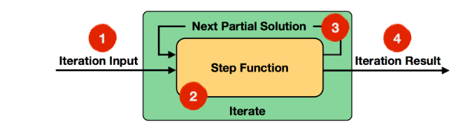
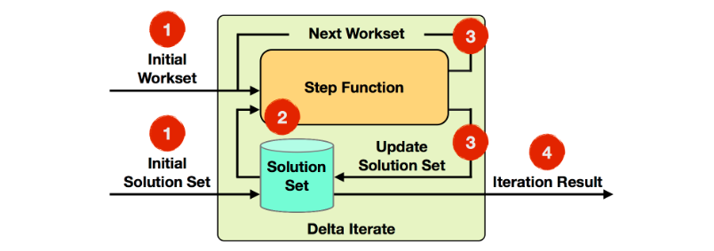
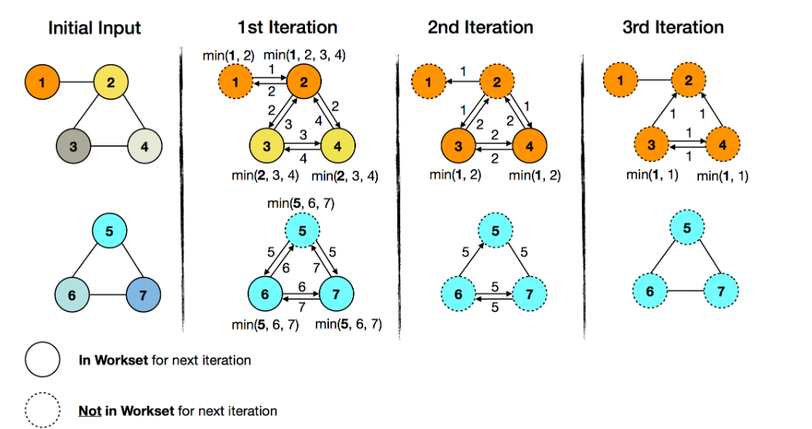

1.  ### 什么是迭代计算

     一个养殖场引进一只刚出生的新品种兔子，这种兔子从出生的下一个月开始，每月重生一只兔子，重生的兔子也如此繁殖。如果所有的兔子都不死去，问到第 12 个月时，该豢养场共有兔子多少只? 

    在Flink中，对于批处理作业，也提供了相应的迭代运算，主要分为下面两大类：

    Bulk Iterate

    Delta Iterate

### 2.1Bulk Iterate

这种迭代方式称为全量迭代，它会将整个数据输入，经过一定的迭代次数，最终得到你想要的结果{width="5.763194444444444in"
height="1.6034722222222222in"}

分为4步

(1)Iteration Input（迭代输入）：是初始输入值或者上一次迭代计算的结果

(2)Step
Function（step函数）：它迭代计算DataSet，由一系列的operator组成，比如map，flatMap，join等，取决于具体的业务逻辑。

(3)Next Partial
Solution（中间结果）：每一次迭代计算的结果，被发送到下一次迭代计算中。

(4)Iteration
Result（迭代结果）：最后一次迭代输出的结果，被输出到datasink或者发送到下游处理。

### 2.2 开发

**package** com.ds;\
\
**import** org.apache.flink.api.common.functions.MapFunction;\
**import** org.apache.flink.api.java.DataSet;\
**import** org.apache.flink.api.java.ExecutionEnvironment;\
**import** org.apache.flink.api.java.operators.IterativeDataSet;\
\
**public class** ds4 {\
**public static void** main(String\[\] args)**throws** Exception{\
ExecutionEnvironment env =
ExecutionEnvironment.*getExecutionEnvironment*();\
**int** iterativeNum=12;\
IterativeDataSet&lt;Integer&gt;
init1=env.fromElements(1).iterate(iterativeNum);\
DataSet&lt;Integer&gt; mapResult=init1.map(**new**
MapFunction&lt;Integer, Integer&gt;() {\
@Override\
**public** Integer map(Integer a) **throws** Exception {\
**int** aa = a+a\*1;\
**return** aa;\
}\
});\
DataSet&lt;Integer&gt; result=init1.closeWith(mapResult);\
result.print();\
}\
}

结果：4096

### 3.Delta Iterate

这种迭代方式称为增量迭代，它并不是每次去迭代全量的数据，而是有两个数据集，WorkSet和SolutionSet，每次输入这两个数据集进行迭代运算（这两个数据集可以相等），然后对workset进行迭代运算并且不断的更新solutionset，直到达到迭代次数或者workset为空，输出迭代计算结果。

**在比较大的数据量情况下，对性能有显著的提升。**

{width="5.761805555555555in"
height="2.0284722222222222in"}

(1)Iteration Input：读取初始WorkSet和初始Solution
Set作为第一次迭代计算的输入。

(2)Step
Function：step函数，每次迭代计算dataset，由map，flatmap以及join等操作组成的，具体有业务逻辑决定。

(3)Next Workset/Update Solution Set：Next
WorkSet驱动迭代计算，将计算结果反馈到下一次迭代计算中，Solution
Set将被不断的更新。两个数据集都在step函数中被迭代计算。

(4)Iteration Result：在最后一次迭代计算完成后，Solution
Set将被输出或者输入下游处理。

1,23,4组成了一个连通图，在这个连通图中，对每一个顶点进行编号，求出ID值最小的顶点，比如上面的图一中最小值是1。如果初始输入值是一条条边，我们最终要计算输出形如这样的元组对（vertixID，minimumID），比如（1,1），（2,1），（3,1），（4,1）

{width="5.758333333333334in"
height="3.046527777777778in"}

第一次迭代

对于第一个子图，ID 1 会和ID2进行比较，并且ID 2变成ID 1的颜色。ID 3 和ID
4会接收到ID 2 并与其进行比较，使得ID 3 ID4变成ID 2的颜色。此时就可以next
worker里就会减去未改变的顶点1.

对于第二个子图，第一次遍历ID 6 ID7就会变成ID 5的颜色，结束遍历。Next
work里会减去未改变的顶点5.

第二次迭代

此时next work里的顶点由于已经减去顶点 1
和顶点5，所以只剩顶点(2,3,4,6,7)。在第二次迭代之后，第二个子图就不会在变化了，next
workset里不会有其顶点，然而第一个子图，由于顶点3和4又一次变化，所以还需要第三次迭代。此时，第一个子图就是热数据，第二个子图就是冷数据。计算就变成了针对第一个子图的局部计算，针对第一个子图的顶点3和顶点4进行计算。

第三次迭代

由于顶点3和4都不会变化，next workset就为空了，然后就会终止迭代。

**3.1开发**

**package** com.ds;\
\
**import** org.apache.flink.api.common.functions.FlatJoinFunction;\
**import** org.apache.flink.api.common.functions.FlatMapFunction;\
**import** org.apache.flink.api.common.functions.JoinFunction;\
**import** org.apache.flink.api.common.functions.MapFunction;\
**import** org.apache.flink.api.java.DataSet;\
**import** org.apache.flink.api.java.ExecutionEnvironment;\
**import** org.apache.flink.api.java.aggregation.Aggregations;\
**import** org.apache.flink.api.java.operators.DeltaIteration;\
**import** org.apache.flink.api.java.tuple.Tuple2;\
**import** org.apache.flink.util.Collector;\
\
**public class** ds5 {\
**public static void** main(String\[\] args) **throws** Exception {\
**final** ExecutionEnvironment env=
ExecutionEnvironment.*getExecutionEnvironment*();\
**int** iterativeNum=100;\
\
*//顶点\
*DataSet&lt;Long&gt; vertix=env.fromElements(1L,2L,3L,4L,5L,6L,7L);\
*//边\
*DataSet&lt;Tuple2&lt;Long,Long&gt;&gt; edges=env.fromElements(\
Tuple2.*of*(1L, 2L),\
Tuple2.*of*(2L, 3L),\
Tuple2.*of*(2L, 4L),\
Tuple2.*of*(3L, 4L),\
Tuple2.*of*(5L, 6L),\
Tuple2.*of*(5L, 7L),\
Tuple2.*of*(6L, 7L)\
);\
*//单向边转为双向边\
*edges=edges.flatMap(**new** FlatMapFunction&lt;Tuple2&lt;Long,Long&gt;,
Tuple2&lt;Long,Long&gt;&gt;() {\
@Override\
**public void** flatMap(Tuple2&lt;Long, Long&gt; tuple,
Collector&lt;Tuple2&lt;Long, Long&gt;&gt; collector) **throws**
Exception {\
collector.collect(tuple);\
collector.collect(Tuple2.*of*(tuple.**f1**,tuple.**f0**));\
}\
});\
\
*//initialSolutionSet，将顶点映射为(vertix,vertix)的形式\
*DataSet&lt;Tuple2&lt;Long,Long&gt;&gt;
initialSolutionSet=vertix.map(**new** MapFunction&lt;Long,
Tuple2&lt;Long, Long&gt;&gt;() {\
@Override\
**public** Tuple2&lt;Long, Long&gt; map(Long vertix) **throws**
Exception {\
**return** Tuple2.*of*(vertix,vertix);\
}\
});\
*//initialWorkSet\
*DataSet&lt;Tuple2&lt;Long,Long&gt;&gt;
initialWorkSet=vertix.map(**new** MapFunction&lt;Long, Tuple2&lt;Long,
Long&gt;&gt;() {\
@Override\
**public** Tuple2&lt;Long, Long&gt; map(Long vertix) **throws**
Exception {\
**return** Tuple2.*of*(vertix,vertix);\
}\
});\
*//第一个字段做迭代运算\
*DeltaIteration&lt;Tuple2&lt;Long,Long&gt;,Tuple2&lt;Long,Long&gt;&gt;
iterative=\
initialSolutionSet.iterateDelta(initialWorkSet,iterativeNum,0);\
*//数据集合边做join操作，然后求出当前顶点的邻居顶点的最小ID值\
*DataSet&lt;Tuple2&lt;Long,Long&gt;&gt;
changes=iterative.getWorkset().join(edges).where(0).equalTo(0).with(**new**
NeighborWithComponentIDJoin())\
.groupBy(0).aggregate(Aggregations.***MIN***,1)\
*//和solution set进行join操作，更新solution
set，如果当前迭代结果中的最小ID小于solution中的ID值，则发送到下一次迭代运算中继续运算，否则不发送\
*.join(iterative.getSolutionSet()).where(0).equalTo(0)\
.with(**new** ComponetIDFilter());\
\
*//关闭迭代计算\
*DataSet&lt;Tuple2&lt;Long,Long&gt;&gt;
result=iterative.closeWith(changes,changes);\
\
result.print();\
}\
\
\
**public static class** NeighborWithComponentIDJoin **implements**
JoinFunction&lt;Tuple2&lt;Long,Long&gt;,Tuple2&lt;Long,Long&gt;,Tuple2&lt;Long,Long&gt;&gt;
{\
\
@Override\
**public** Tuple2&lt;Long, Long&gt; join(Tuple2&lt;Long, Long&gt; t1,
Tuple2&lt;Long, Long&gt; t2) **throws** Exception {\
**return** Tuple2.*of*(t2.**f1**,t1.**f1**);\
}\
}\
\
**public static class** ComponetIDFilter **implements**
FlatJoinFunction&lt;Tuple2&lt;Long,Long&gt;,Tuple2&lt;Long,Long&gt;,Tuple2&lt;Long,Long&gt;&gt;
{\
\
@Override\
**public void** join(Tuple2&lt;Long, Long&gt; t1, Tuple2&lt;Long,
Long&gt; t2, Collector&lt;Tuple2&lt;Long, Long&gt;&gt; collector)
**throws** Exception {\
**if**(t1.**f1**&lt;t2.**f1**){\
collector.collect(t1);\
}\
}\
}\
}

结果：

(3,1)

(7,5)

(6,5)

(1,1)

(5,5)

(4,1)

(2,1)
