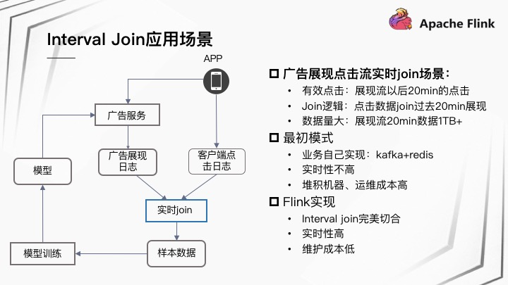

### 1.Flink 在快手应用场景

{width="5.767361111111111in"
height="3.2444444444444445in"}

{width="5.767361111111111in"
height="3.2444444444444445in"}

Flink 在快手应用的类别主要分为三大类：

80%
统计监控：实时统计，包括各项数据的指标，监控项报警，用于辅助业务进行实时分析和监控；

15% 数据处理：对数据的清洗、拆分、Join 等逻辑处理，例如大 Topic
的数据拆分、清洗；

5% 数据处理：实时业务处理，针对特定业务逻辑的实时处理，例如实时调度。

{width="5.767361111111111in"
height="3.2444444444444445in"}

### Flink集群规模

{width="5.767361111111111in"
height="3.2444444444444445in"}

快手目前集群规模有 1500 台左右，作业数量大约是 500
左右，日处理条目数总共有 1.7 万亿，峰值处理条目数大约是 3.7
千万。集群部署都是 On Yarn
模式，分为离线集群和实时集群两类集群，其中离线集群混合部署，机器通过标签进行物理隔离，实时集群是
Flink 专用集群，针对隔离性、稳定性要求极高的业务部署

2.  ### 技术应用场景

    3.1{width="5.767361111111111in"
    height="3.2444444444444445in"}

    3.2

    {width="5.767361111111111in"
    height="3.2444444444444445in"}

    3.3

    {width="5.759722222222222in"
    height="3.2in"}

