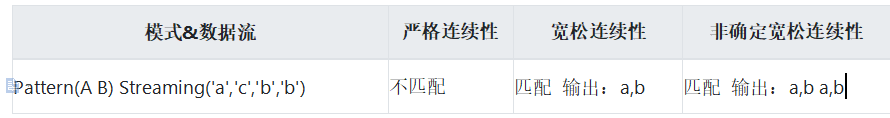

### 1.什么是 CEP

CEP的意思是复杂事件处理，例如：起床--&gt;洗漱--&gt;吃饭--&gt;上班等一系列串联起来的事件流形成的模式称为CEP。如果发现某一次起床后没有刷牙洗脸亦或是吃饭就直接上班，就可以把这种非正常的事件流匹配出来进行分析，看看今天是不是起晚了。

### 2.CEP能干什么

如果想使用CEP就需要知道场景模型中会遇到哪些问题，
CEP中对那些数据比较敏感。或则那些是我们关心的重点，如果一些数据循环出现，那么这个数据可能就是有问题的，就可能发生风险的，比如我们银行卡在短时间内，多地刷卡，也就是在1小时内同一个卡，刷了60笔交易，也就是一分钟一笔交易，这个在我们的常识中，你觉得这可能吗？所以这时候这个卡我们就会被判断为被盗刷。而CEP该如何识别那？

在CEP中有within函数，也就是限定时间交易多少笔，也就是如果大于60比交易，而这个交易信息记录为一个信息事件，可对于发生了60次，可以使用time函数。通过CEP轻松使用提供的函数，来实现我们的判断。

### 3.Flink CEP 应用场景

（1）风险控制：对用户异常行为模式进行实时检测，当一个用户发生了不该发生的行为，判定这个用户是不是有违规操作的嫌疑。

（2）策略营销：用预先定义好的规则对用户的行为轨迹进行实时跟踪，对行为轨迹匹配预定义规则的用户实时发送相应策略的推广。

（3）运维监控：灵活配置多指标、多依赖来实现更复杂的监控模式。

### 4.Flink CEP 程序结构

定义事件模式

pattern：前一个模式

next/followedBy/...：开始一个新的模式

where：模式的内容

filter：核心处理逻辑

### 5.模式的有效期

由于模式的匹配事件存放在状态中进行管理，所以需要设置一个全局的有效期（within）。
若不指定有效期，匹配事件会一直保存在状态中不会被清除。至于有效期能开多大，要依据具体使用场景和数据量来衡量，关键要看匹配的事件有多少，随着匹配的事件增多，新到达的消息遍历之前的匹配事件会增加CPU、内存的消耗，并且随着状态变大，数据倾斜也会越来越严重。

### 6.模式间的联系

主要分为三种：严格连续性（next/notNext），宽松连续性（followedBy/notFollowedBy），和非确定宽松连续性（followedByAny）。

{width="6.284722222222222in"
height="0.8333333333333334in"}

### 7.条件（where）

对于每个模式，可以指定接受事件必须满足的条件，用来“传入”到模式中，
可以通过pattern.where（），pattern.or（）或pattern.until（）方法指定事件属性的条件。
条件可以分为IterativeConditions（迭代条件）和SimpleConditions（简单条件）。

迭代条件：这是最常见的条件类型。
这是可以如何指定一个条件，该条件基于先前接受的事件的属性或其子集的统计信息来接受后续事件。

8.  ### 开发

    1.  #### 导入pom依赖

&lt;dependency&gt;

&lt;groupId&gt;org.apache.flink&lt;/groupId&gt;

&lt;artifactId&gt;flink-cep\_2.11&lt;/artifactId&gt;

&lt;version&gt;1.7.2&lt;/version&gt;

&lt;/dependency&gt;

1.  #### 开发

    用户的登录行为数据都会以LoginEvent的行式记录下来，每次失败或者成功以及错误都会记录下来，一般客户端都会进行检验，正常的用户不可能在一秒钟之内登录错误多次，这时候我就得怀疑这部分数据是不是机器对用户的密码进行暴力破解，如果有需要我们得将这些攻击IP进行封锁。

**package** com.sqll;\
\
**import** org.apache.flink.cep.CEP;\
**import** org.apache.flink.cep.PatternStream;\
**import** org.apache.flink.cep.pattern.Pattern;\
**import** org.apache.flink.cep.pattern.conditions.IterativeCondition;\
**import** org.apache.flink.streaming.api.datastream.DataStream;\
**import**
org.apache.flink.streaming.api.environment.StreamExecutionEnvironment;\
**import** org.apache.flink.streaming.api.windowing.time.Time;\
\
**import** java.io.Serializable;\
**import** java.util.Arrays;\
**import** java.util.List;\
**import** java.util.Map;\
\
**public class** cep1 {\
\
**public static void** main(String\[\] args) **throws** Exception {\
StreamExecutionEnvironment env =
StreamExecutionEnvironment.*getExecutionEnvironment*();\
DataStream&lt;LoginEvent&gt; loginEventStream =
env.fromCollection(Arrays.*asList*(\
**new** LoginEvent(**"1"**,**"192.168.0.1"**,**"fail"**),\
**new** LoginEvent(**"1"**,**"192.168.0.1"**,**"fail"**),\
**new** LoginEvent(**"1"**,**"192.168.0.1"**,**"fail"**),\
**new** LoginEvent(**"3"**,**"192.168.0.2"**,**"fail"**),\
**new** LoginEvent(**"3"**,**"192.168.0.2"**,**"fail"**),\
**new** LoginEvent(**"2"**,**"192.168.10,10"**,**"success"**)\
\
));\
\
Pattern&lt;LoginEvent, LoginEvent&gt; loginFailPattern =
Pattern.&lt;LoginEvent&gt;\
*begin*(**"begin"**)\
.where(**new** IterativeCondition&lt;LoginEvent&gt;() {\
@Override\
**public boolean** filter(LoginEvent loginEvent, Context context)
**throws** Exception {\
**return** loginEvent.getType().equals(**"fail"**);\
}\
})\
.next(**"next"**)\
.where(**new** IterativeCondition&lt;LoginEvent&gt;() {\
@Override\
**public boolean** filter(LoginEvent loginEvent, Context context)
**throws** Exception {\
**return** loginEvent.getType().equals(**"fail"**);\
}\
})\
.within(Time.*seconds*(1));\
\
PatternStream&lt;LoginEvent&gt; patternStream = CEP.*pattern*(\
loginEventStream.keyBy(LoginEvent::getUserId),\
loginFailPattern);\
\
DataStream&lt;LoginWarning&gt; loginFailDataStream =
patternStream.select((Map&lt;String, List&lt;LoginEvent&gt;&gt; pattern)
-&gt; {\
List&lt;LoginEvent&gt; first = pattern.get(**"begin"**);\
List&lt;LoginEvent&gt; second = pattern.get(**"next"**);\
**return new**
LoginWarning(second.get(0).getUserId(),second.get(0).getIp(),
second.get(0).getType());\
});\
\
loginFailDataStream.print();\
\
env.execute();\
}\
**public static class** LoginEvent **implements** Serializable {\
**private** String **userId**;*//用户ID\
***private** String **ip**;*//登录IP\
***private** String **type**;*//登录类型\
\
***public** LoginEvent() {\
}\
\
**public** LoginEvent(String userId, String ip, String type) {\
**this**.**userId** = userId;\
**this**.**ip** = ip;\
**this**.**type** = type;\
}\
\
**public** String getType() {\
**return type**;\
}\
\
**public** String getUserId() {\
**return userId**;\
}\
\
**public** String getIp() {\
**return ip**;\
}\
\
**public void** setUserId(String userId){\
**this**.**userId**=userId;\
}\
**public void** setIp(String ip){\
**this**.**ip** = ip;\
}\
**public void** setType(String type){\
**this**.**type** = type;\
}\
}\
**public static class** LoginWarning **implements** Serializable {\
**private** String **userId**;\
**private** String **type**;\
**private** String **ip**;\
\
**public** LoginWarning() {\
}\
\
**public** LoginWarning(String userId, String type, String ip) {\
**this**.**userId** = userId;\
**this**.**type** = type;\
**this**.**ip** = ip;\
}\
@Override\
**public** String toString(){\
**return userId**+**" "**+**type**+**" "**+**ip**;\
}\
}\
}
