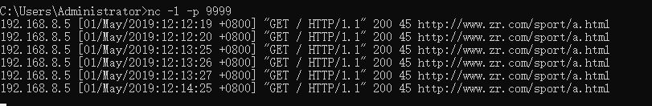
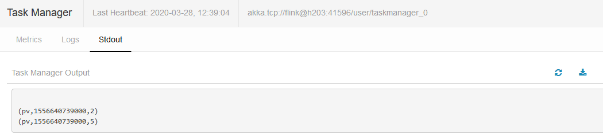

1.  ### 什么是pv ，uv

    （1）PV（page view）

    浏览量和访问次数是呼应的。用户访问网站时每打开一个页面，就记为1个PV。同一个页面被访问多次，浏览量也会累积。一个网站的浏览量越高，说明这个网站的知名度越高，内容越受用户喜欢。一味地重视PV也是没有太大意义的（PV跟点击量差不多吧）。

    PV是一个重要的指标，反映了网站内容是否对用户有足够的吸引力。对于竞价而言，只能是侧面反映，因为我们设置了访问URL。很多用户需求也非常明确，来到网站之后，往往只会寻找自己需求的产品，所以一味地重视PV也是没有太大意义的。应该把重点内容展示给目标客户就可以了，就没必要一味地追求PV值，追求那些转化率、跳出率、UV、转化次数等那才是重点。

    （2）UV（Unique Visitor）

    指独立访客访问数，统计1天内访问某站点的用户数(以 cookie
    为依据)，一台电脑终端为一个访客。可以理解成访问某网站的电脑的数量。网站判断来访电脑的身份是通过来访电脑的
    cookies 实现的。如果更换了 IP 后但不清除
    cookies，再访问相同网站，该网站的统计中 UV 数是不变的。

    访问日志数据

    192.168.8.5 \[01/May/2019:12:12:19 +0800\] "GET / HTTP/1.1" 200 45
    http://www.zr.com/sport/a.html

    192.168.8.5 \[01/May/2019:12:21:15 +0800\] "GET / HTTP/1.1" 200 45
    http://www.zr.com/sport/a.html

    192.168.8.5 \[01/May/2019:12:21:19 +0800\] "GET / HTTP/1.1" 200 45
    http://www.zr.com/sport/b.html

    192.168.8.15 \[01/May/2019:12:21:19 +0800\] "GET / HTTP/1.1" 200 45
    http://www.zr.com/news/a.html

    192.168.8.15 \[01/May/2019:12:21:22 +0800\] "GET / HTTP/1.1" 200 45
    http://www.zr.com/news/b.html

    192.168.8.15 \[01/May/2019:12:20:19 +0800\] "GET / HTTP/1.1" 200 45
    http://www.zr.com/news/b.html

    192.168.8.55 \[01/May/2019:12:21:19 +0800\] "GET / HTTP/1.1" 200 45
    http://www.zr.com/music/a.html

    192.168.8.55 \[01/May/2019:12:21:25 +0800\] "GET / HTTP/1.1" 200 45
    http://www.zr.com/music/a.html

2.  ### 开发

#### Pv

**package** com.a;\
\
**import** org.apache.flink.api.common.functions.MapFunction;\
**import** org.apache.flink.api.java.tuple.Tuple3;\
**import** org.apache.flink.streaming.api.TimeCharacteristic;\
**import** org.apache.flink.streaming.api.datastream.DataStream;\
**import**
org.apache.flink.streaming.api.datastream.SingleOutputStreamOperator;\
**import**
org.apache.flink.streaming.api.environment.StreamExecutionEnvironment;\
**import**
org.apache.flink.streaming.api.functions.timestamps.BoundedOutOfOrdernessTimestampExtractor;\
**import**
org.apache.flink.streaming.api.windowing.assigners.SlidingEventTimeWindows;\
**import** org.apache.flink.streaming.api.windowing.time.Time;\
\
**import** java.text.SimpleDateFormat;\
**import** java.util.Calendar;\
**import** java.util.Locale;\
\
**public class** pv1 {\
**public static void** main(String\[\] args)**throws** Exception {\
StreamExecutionEnvironment env =
StreamExecutionEnvironment.*getExecutionEnvironment*();\
env.setStreamTimeCharacteristic(TimeCharacteristic.***EventTime***);\
\
DataStream&lt;Tuple3&lt;String, Long, Integer&gt;&gt; s1 =
env.socketTextStream(**"192.168.8.66"**, 9999)\
.map(**new** MapFunction&lt;String, Tuple3&lt;String, Long,
Integer&gt;&gt;() {\
@Override\
**public** Tuple3&lt;String, Long, Integer&gt; map(String s) **throws**
Exception {\
String a2 = s.split(**" "**)\[1\].substring(1);\
Calendar cc = Calendar.*getInstance*();\
cc.setTime(**new** SimpleDateFormat(**"d/MMM/yyyy:h:m:s"**,
Locale.***ENGLISH***).parse(a2));\
Long a3 = cc.getTimeInMillis();\
*//System.out.println(a3);\
\
***return new** Tuple3&lt;&gt;(**"pv"**, a3, 1);\
}\
});\
DataStream&lt;Tuple3&lt;String, Long, Integer&gt;&gt; s2 =
s1.assignTimestampsAndWatermarks(\
**new** BoundedOutOfOrdernessTimestampExtractor&lt;Tuple3&lt;String,
Long, Integer&gt;&gt;(Time.*seconds*(5L)) {\
@Override\
**public long** extractTimestamp(Tuple3&lt;String, Long, Integer&gt;
stringLongIntegerTuple3) {\
**return** stringLongIntegerTuple3.**f1**;\
}\
}\
).keyBy(0)\
.window(SlidingEventTimeWindows.*of*(Time.*hours*(1L),
Time.*seconds*(60L)))\
.sum(2);\
s2.print();\
env.execute(**"pv"**);\
}\
}

{width="5.761805555555555in"
height="0.9375in"}

{width="5.763888888888889in"
height="1.2958333333333334in"}

#### UV

**package** com.a;\
\
**import** org.apache.flink.api.common.functions.MapFunction;\
**import** org.apache.flink.api.java.tuple.Tuple3;\
**import** org.apache.flink.streaming.api.TimeCharacteristic;\
**import** org.apache.flink.streaming.api.datastream.DataStream;\
**import**
org.apache.flink.streaming.api.datastream.SingleOutputStreamOperator;\
**import**
org.apache.flink.streaming.api.environment.StreamExecutionEnvironment;\
**import**
org.apache.flink.streaming.api.functions.timestamps.BoundedOutOfOrdernessTimestampExtractor;\
**import**
org.apache.flink.streaming.api.windowing.assigners.TumblingEventTimeWindows;\
**import** org.apache.flink.streaming.api.windowing.time.Time;\
\
**import** java.text.SimpleDateFormat;\
**import** java.util.Calendar;\
**import** java.util.Locale;\
\
**public class** uv1 {\
**public static void** main(String\[\] args)**throws** Exception{\
StreamExecutionEnvironment env =
StreamExecutionEnvironment.*getExecutionEnvironment*();\
env.setStreamTimeCharacteristic(TimeCharacteristic.***EventTime***);\
\
DataStream&lt;Tuple3&lt;String, Long, Integer&gt;&gt; s1 =
env.socketTextStream(**"192.168.8.66"**, 9999).map(**new**
MapFunction&lt;String, Tuple3&lt;String, Long, Integer&gt;&gt;() {\
@Override\
**public** Tuple3&lt;String, Long, Integer&gt; map(String s) **throws**
Exception {\
String a1 = s.split(**" "**)\[0\];\
String a2 = s.split(**" "**)\[1\].substring(1);\
Calendar cc = Calendar.*getInstance*();\
cc.setTime(**new** SimpleDateFormat(**"d/MMM/yyyy:h:m:s"**,
Locale.***ENGLISH***).parse(a2));\
Long a3 = cc.getTimeInMillis();\
*//System.out.println(a3);\
\
***return new** Tuple3&lt;&gt;(a1, a3, 1);\
}\
});\
\
\
DataStream&lt;Tuple3&lt;String,Long,Integer&gt;&gt; s11 =
s1.assignTimestampsAndWatermarks(\
**new** BoundedOutOfOrdernessTimestampExtractor&lt;Tuple3&lt;String,
Long, Integer&gt;&gt;(Time.*seconds*(10)) {\
@Override\
**public long** extractTimestamp(Tuple3&lt;String, Long, Integer&gt;
element) {\
**return** element.**f1**; }\
}\
).keyBy(0).window(TumblingEventTimeWindows.*of*(Time.*hours*(1L)))\
.sum(2);\
\
SingleOutputStreamOperator&lt;Tuple3&lt;String, Long, Integer&gt;&gt;
s12 = s11.map(**new** MapFunction&lt;Tuple3&lt;String, Long,
Integer&gt;, Tuple3&lt;String, Long, Integer&gt;&gt;() {\
@Override\
**public** Tuple3&lt;String, Long, Integer&gt; map(Tuple3&lt;String,
Long, Integer&gt; stringLongIntegerTuple3) **throws** Exception {\
String u1 = **"uv"**;\
**int** u3 = 1;\
**return new** Tuple3&lt;String, Long, Integer&gt;(u1,
stringLongIntegerTuple3.**f1**, u3);\
}\
}).keyBy(0).sum(2);\
s12.print();\
env.execute(**"uv"**);\
}\
}
