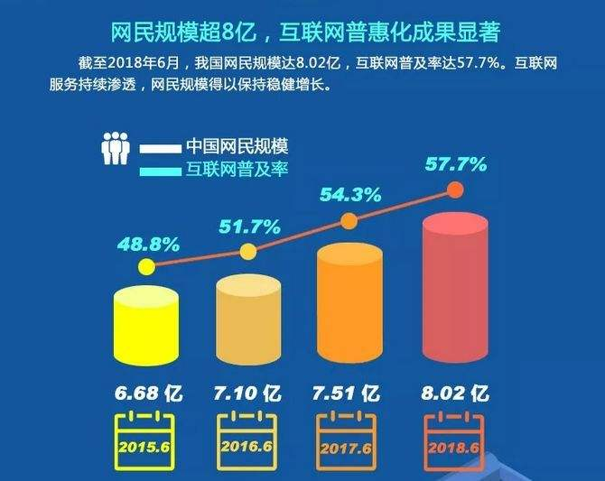
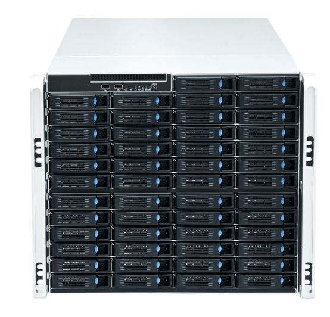
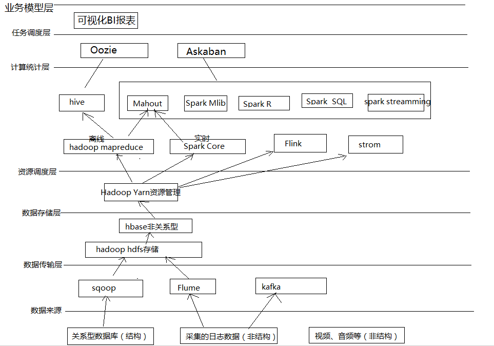
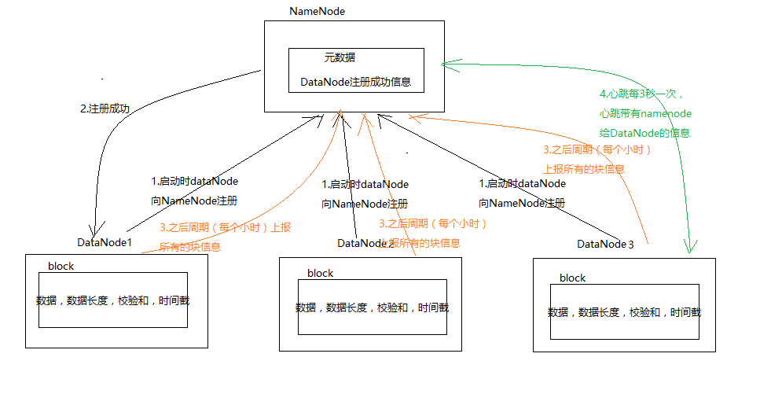

第一章：hadoop介绍\
 {#第一章hadoop介绍 .ListParagraph}
===================

课程安排
========

知识点1：大数据技术介绍

知识点2：大数据技术框架

知识点3：大数据应用行业

知识点4：hadoop简介

大数据技术介绍
==============

数据的来源
----------

{width="5.791666666666667in"
height="4.607400481189852in"}

{width="4.1875in"
height="2.429507874015748in"}

{width="2.7708333333333335in"
height="2.660799431321085in"}

{width="4.635416666666667in"
height="2.4712445319335083in"}

在早期，数据是通过调查问卷的方式进行，但互联网的兴起，数据的调查不需要问卷方式，可以通过用户的操作行为来记录并进行统计，且并数据是大规模的存储在存储服务器集群中。

什么是大数据
------------

大数据（big
data），IT行业术语，是指无法在一定时间范围内用常规软件工具进行捕捉、管理和处理的数据集合，是需要新处理模式才能具有更强的决策力、洞察发现力和流程优化能力的海量、高增长率和多样化的信息资产。

主要特征：海量数据存储和海量数据分析

单位运算：

1 Byte =8 bit

1 KB = 1,024 Bytes = 8192 bit

1 MB = 1,024 KB = 1,048,576 Bytes

1 GB = 1,024 MB = 1,048,576 KB

1 TB = 1,024 GB = 1,048,576 MB

1 PB = 1,024 TB = 1,048,576 GB

1 EB = 1,024 PB = 1,048,576 TB

1 ZB = 1,024 EB = 1,048,576 PB

1 YB = 1,024 ZB = 1,048,576 EB

1 BB = 1,024 YB = 1,048,576 ZB

1 NB = 1,024 BB = 1,048,576 YB

1 DB = 1,024 NB = 1,048,576 BB

大数据的特点
------------

5V特点：大量、高速、多样、价值、真实性

大数据技术框架
==============

常用的技术框架：

Hadoop、Zookeeper、Hive、Flume、Kafka、Hbase、Sqoop、Oozie、Askaban、Kylin、Impala、Hue、Kudu、Kudu、Atlas、Griffin、Kettle、ClickHouse、DataX、Ambari、Ranger、Spark、Flink、Docker、Beam、Filebeat、InfluxDB、MaxWell、NiFi、Phoenix、Pulsar、Saiku、Sentry、Superset、Tableau、Kubernetes、Airflow等

大数据业务处理流程
------------------

产品经理（分析需求：统计用户的回头率）
数据部门搭建开发平台分析业务指标数据可视化（报表，大屏展示）

大数据部分人员分配（中大型公司）
--------------------------------

大数据部门：平台组（大数据运维）、数据仓库组（ETL工程师【数据清洗】数据仓库建模工程师等）、数据挖掘组(算法工程师、推荐工程师、用户画像工程师)、报表开发组（javaEE）

初步了解认识大数据框架技术分层综合使用
--------------------------------------

{width="10.032649825021872in"
height="7.021813210848644in"}

大数据应用行业
==============

金融行业：

在用户画像的基础上，银行可以根据用户的年龄、资产规模、理财偏好等，对用户群进行精准定位，分析出潜在的金融服务需求。

电商行业：

电子商务企业获得精准的数据分析，可以更好地了解用户的需求，制定合理的营销策略，从而给用户推广更感兴趣的产品，提高营销成功率。

行政政府：

在智慧政府模式下，通过大数据技术，政府得以“感知”社会的发展变化需求，行政决策更加科学化、公共服务更加精准化、资源配置更加合理化。

电信行业：

电信行业拥有庞大的数据，大数据技术可以应用于网络管理、客户关系管理、企业运营管理等，并且使数据对外商业化，实现单独盈利。

医疗行业：

医疗行业通过临床数据对比、实时统计分析、远程病人数据分析、就诊行为分析等，辅助医生进行临床决策，规范诊疗路径，提高医生的工作效率。

hadoop简介
==========

什么是hadoop
------------

官网：[*http://hadoop.apache.org/*](http://hadoop.apache.org/)

Hadoop是一个由Apache基金会所开发的分布式系统基础架构。用户可以在不了解分布式底层细节的情况下，开发分布式程序。充分利用集群的威力进行高速运算和存储。

Hadoop实现了一个分布式文件系统（Hadoop Distributed File
System），简称HDFS。HDFS有高容错性的特点，并且设计用来部署在低廉的（low-cost）硬件上。

Hadoop的框架最核心的设计就是：HDFS和MapReduce。HDFS为海量的数据提供了存储，而MapReduce则为海量的数据提供了计算。

可以说google是hadoop设计思想来源：

Google文件系统GFSGoogle文件系统(Google File
System,GFS)是一个大型的分布式文件系统。 HDFS存储原理。

MapReduce MR 分布式运算原理

BigTable Hbase数据库

{width="2.0613265529308835in"
height="0.5208333333333334in"}

Hadoop版本
----------

Hadoop的三大版本：apache，Cloudera, Hortonworks

Apache 原始版本： 入门首选

[*http://hadoop.apache.org/*](http://hadoop.apache.org/)

Cloudera：大型公司使用较多的版本。比较稳定。

Cloudera hadoop:
[*https://www.cloudera.com/*](https://www.cloudera.com/)

Hortonworks：文档比较好。

[*https://hortonworks.com/*](https://hortonworks.com/)

Hadoop优势
----------

1.  高可用性：hadoop有多个数据副本，即使某些机器存储出现问题，也不会导致数据丢失。

2.  可扩展性：在集群中，可以无限扩展节点。

3.  高效性：在mapreduce中运算，hadoop集群是并行操作的，可以使用更快速度来处理运算。

4.  高容错性：当某台节点运行任务失败，可以重新分配任务到别的节点进行运算

Hadoop新旧版本对比
------------------

Hadoop1.x版本：

HDFS(分布式文件存储)、MapReduce(资源调度与计算)、Common(辅助工具：配置模块、RPC通信、序列化、日志操作)

Hadoop2.x版本：

HDFS(分布式文件存储)、MapReduce(计算)、Yarn(资源调度)、Common(辅助工具：配置模块、RPC通信、序列化、日志操作)

HDFS架构
--------

1.  NameNode(nn): 存储文件的元数据信息

2.  DataNode(dn)：在本地文件系统中存储的数据块

3.  Secondary NameNode: 用于监控HDFS状态，每隔一段时间元数据的快照信息

YARN架构与MapReduce架构
-----------------------

### YARN架构

ResouceManager(RM):处理客户端请求，启动/监控applicationMaster、监控NodeManager、资源分配与调度。

applicationMaster: 数据切分、应用程序资源分配、监控任务与容错。

NodeManager(NM):
单个节点上的资源、处理ResourceManager提交的请求、处理applicationMaster的命令。

Container:
对任务运行环境抽象，封装了CPU,内存以及要使用的资源环境，启动命令来运行相关的资源。

{width="7.364583333333333in"
height="4.125in"}

### MapReduce架构

MapReduce分为两个阶段： Map、Redurce

1.Map阶段是并行处理数据

2.Redurce阶段对map阶段统计的结果进行汇总

本章总结
========

介绍数据的来源，数据量大规模，因此，我们存储大规模的数据，出现分布式存储集群。要统计分析数据，使用分布式运算框架。并对hadoop进行架构与节点初步认识，方便搭建集群。
