第二章：hadoop安装\
 {#第二章hadoop安装 .ListParagraph}
===================

课程安排
========

知识点1：hadoop运行环境配置

知识点2：了解hadoop运行模式

知识点3：本地运行模式安装

知识点4：伪分布式运行模式安装

知识点5：完全分布式安装

hadoop运行环境配置
==================

安装linux系统虚拟机
-------------------

参考前面的课程内容

修改虚拟机的静态ip
------------------

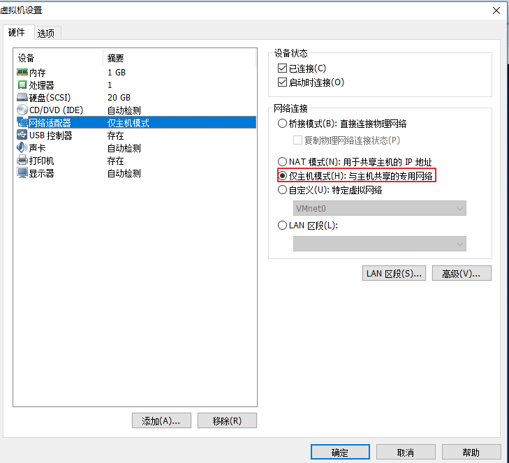{width="7.59375in" height="6.90625in"}

配置网络：

{width="6.0in" height="0.21875in"}

{width="4.489583333333333in"
height="1.5625in"}

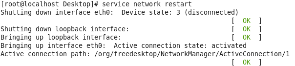{width="6.291666666666667in"
height="1.40625in"}

修改主机名
----------

\[root@localhost \~\]\# vim /etc/sysconfig/network

{width="2.0520833333333335in"
height="0.5104166666666666in"}

修改主机名与ip的映射关系：

\[root@localhost \~\]\# vim /etc/hosts

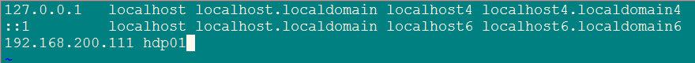{width="9.166666666666666in"
height="0.8333333333333334in"}

关闭防火墙
----------

\[root@localhost \~\]\# service iptables stop/start/stutus

设置启动时防火墙的关闭状态

\[root@localhost \~\]\# chkconfig iptables off

创建icss用户
------------

\[root@localhost \~\]\# useradd icss

\[root@localhost \~\]\# passwd icss

配置icss用户具有root权限
------------------------

{width="5.072916666666667in"
height="0.7708333333333334in"}

创建文件夹并修改归属
--------------------

创建文件夹用于安装软件：

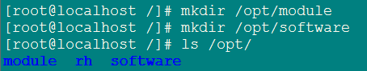{width="4.729166666666667in"
height="0.9270833333333334in"}

修改文件夹所有者与组：

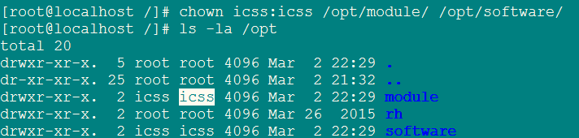{width="7.416666666666667in"
height="1.7708333333333333in"}

安装jdk
-------

### 卸载原有的jdk

\[root@localhost software\]\# rpm -qa | grep java

tzdata-java-2016c-1.el6.noarch

java-1.7.0-openjdk-1.7.0.99-2.6.5.1.el6.x86\_64

java-1.6.0-openjdk-1.6.0.38-1.13.10.4.el6.x86\_64

\[root@localhost software\]\# rpm -e --nodeps
java-1.6.0-openjdk-1.6.0.38-1.13.10.4.el6.x86\_64

\[root@localhost software\]\# rpm -e --nodeps
java-1.7.0-openjdk-1.7.0.99-2.6.5.1.el6.x86\_64

### 安装jdk1.8

解压jdk:

\[root@localhost software\]\# tar -zxvf jdk-8u144-linux-x64.tar.gz -C
/opt/module/

配置环境变量：

\[root@localhost software\]\# vim /etc/profile

export JAVA\_HOME=/opt/module/jdk1.8.0\_144

export PATH=\$PATH:\$JAVA\_HOME/bin

生效配置的环境变量：

\[root@localhost software\]\# source /etc/profile

查看java版本：

\[root@localhost software\]\# java -version

java version "1.8.0\_144"

Java(TM) SE Runtime Environment (build 1.8.0\_144-b01)

Java HotSpot(TM) 64-Bit Server VM (build 25.144-b01, mixed mode)

修改非图形方式启动linux系统
---------------------------

\[root@localhost \~\]\#vim /etc/inittab

{width="5.739583333333333in"
height="1.375in"}

了解hadoop运行模式
==================

1.独立(本地)运行模式:

无需任何守护进程,所有的程序都运行在同一个JVM上执行。在独立模式下调试MR程序非常高效方便。所以一般该模式主要是在学习或者开发阶段调试使用
。

2.伪分布式模式:

Hadoop守护进程运行在本地机器上,模拟一个小规模的集群,换句话说,可以配置一台机器的Hadoop集群,伪分布式是完全分布式的一个特例。

3.完全分布式模式:

Hadoop守护进程运行在一个集群上

独立(本地)运行模式安装
======================

下载hadoop
----------

[*https://archive.apache.org/dist/hadoop/core/hadoop-2.7.2/*](https://archive.apache.org/dist/hadoop/core/hadoop-2.7.2/)

上传hadoop安装包并解压
----------------------

\[icss@hdp01 software\]\$ tar -zxvf hadoop-2.7.2.tar.gz -C /opt/module/

\[icss@hdp01 module\]\$ mv hadoop-2.7.2/ hadoop

Hadoop环境变量配置
------------------

\[icss@hdp01 hadoop\]\$ sudo vim /etc/profile

{width="5.0in" height="0.90625in"}

注意：需要重启linux，配置的环境变量才生效。

测试本地运行模式
----------------

> \$ mkdir input
>
> \$ cp etc/hadoop/\*.xml input
>
> \$ bin/hadoop jar
> share/hadoop/mapreduce/hadoop-mapreduce-examples-3.2.1.jar grep input
> output 'dfs\[a-z.\]+'
>
> \$ cat output/\*

伪分布式模式-HDFS配置
=====================

配置java路径
------------

\[icss@hdp01 hadoop\]\$ vim hadoop-env.sh

{width="4.875in"
height="0.7604166666666666in"}

配置core-site.xml
-----------------

\[icss@hdp01 hadoop\]\$ vim core-site.xml

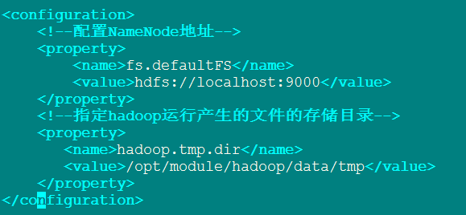{width="6.03125in"
height="2.7916666666666665in"}

配置hdfs-site.xml
-----------------

\[icss@hdp01 hadoop\]\$ vim hdfs-site.xml

{width="4.385416666666667in"
height="1.6354166666666667in"}

启动集群
--------

注意：在首次启动时要对文件系统进行格式化

\[icss@hdp01 hadoop\]\$ bin/hdfs namenode –format

### 同时启动NameNode和DataNode

\[icss@hdp01 hadoop\]\$ sbin/start-dfs.sh

### 启动NameNode节点

\[icss@hdp01 hadoop\]\$ sbin/hadoop-daemon.sh start namenode

查看进程：

\[icss@hdp01 hadoop\]\$ jps

2306 Jps

2267 NameNode

### 启动DataNode节点

\[icss@hdp01 hadoop\]\$ sbin/hadoop-daemon.sh start datanode

查看web端hdfs文件系统
---------------------

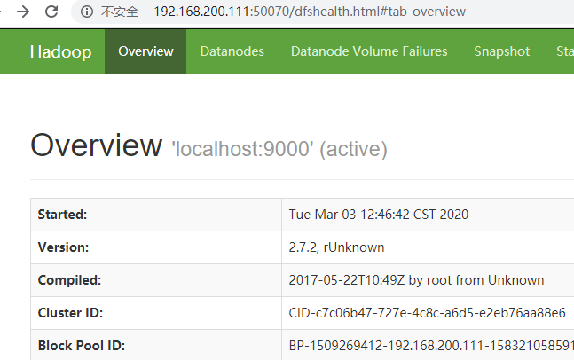{width="6.739583333333333in"
height="4.229166666666667in"}

测试Hdfs文件系统
----------------

\[icss@hdp01 hadoop\]\$ bin/hdfs dfs -mkdir /user/icss/input

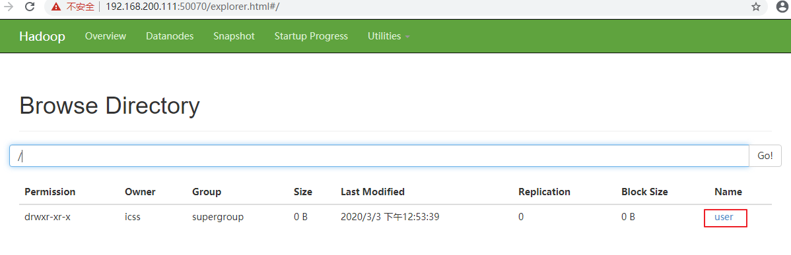{width="12.479166666666666in"
height="4.041666666666667in"}

伪分布式模式-YARN配置
=====================

配置jdk路径
-----------

\[icss@hdp01 hadoop\]\$ vim yarn-env.sh

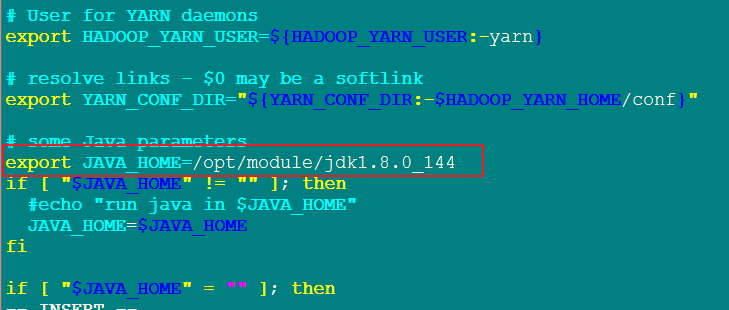{width="7.59375in"
height="3.2291666666666665in"}

配置yarn-site.xml
-----------------

\[icss@hdp01 hadoop\]\$ vim yarn-site.xml

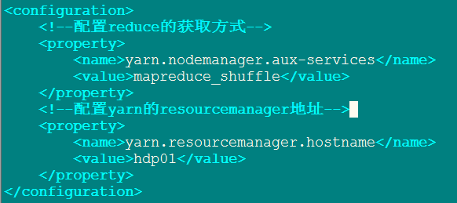{width="6.0625in"
height="2.6979166666666665in"}

配置jdk路径
-----------

\[icss@hdp01 hadoop\]\$ vim mapred-env.sh

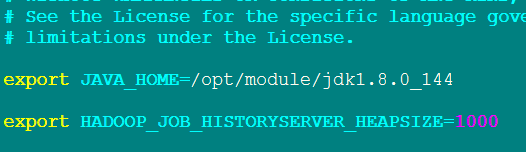{width="5.479166666666667in"
height="1.5833333333333333in"}

配置mapred-site.xml
-------------------

\[icss@hdp01 hadoop\]\$ mv mapred-site.xml.template mapred-site.xml

{width="5.8125in"
height="1.6770833333333333in"}

启动集群
--------

启动resourcemanager:

\[icss@hdp01 hadoop\]\$ sbin/yarn-daemon.sh start resourcemanager

启动nodemanager:

\[icss@hdp01 hadoop\]\$ sbin/yarn-daemon.sh start nodemanager

在浏览器中查看yarn集群
----------------------

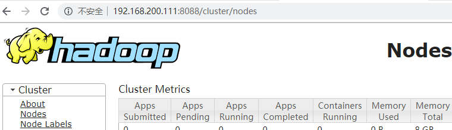{width="7.916666666666667in"
height="2.2916666666666665in"}

配置历史服务器
==============

配置mapred-site.xml
-------------------

\[icss@hdp01 hadoop\]\$ vim mapred-site.xml

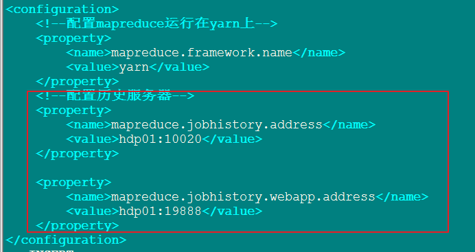{width="7.208333333333333in"
height="3.8229166666666665in"}

启动历史服务器
--------------

\[icss@hdp01 hadoop\]\$ sbin/mr-jobhistory-daemon.sh start historyserver

查看进程
--------

\[icss@hdp01 hadoop\]\$ jps

3235 NodeManager

4551 JobHistoryServer

2359 DataNode

4584 Jps

2986 ResourceManager

2267 NameNode

浏览器查看历史服务器
--------------------

{width="6.84375in"
height="2.6145833333333335in"}

测试yarn执行单词统计
--------------------

### 上传文件到HDFS存储

\[icss@hdp01 hadoop\]\$ bin/hdfs dfs -put /home/icss/input/word.txt
hdfs://localhost:9000/user/icss/input

### 执行单词统计

\[icss@hdp01 hadoop\]\$ hadoop jar
/opt/module/hadoop/share/hadoop/mapreduce/hadoop-mapreduce-examples-2.7.2.jar
wordcount hdfs://localhost:9000/user/icss/input
hdfs://localhost:9000/user/icss/output

### 查询历史服务器记录

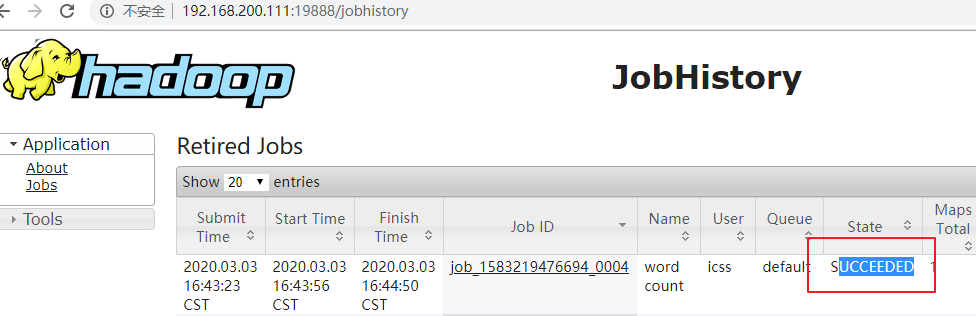{width="10.166666666666666in"
height="3.2916666666666665in"}

完全分布式安装
==============

Hadoop的运行环境配置
--------------------

见前面的配置

集群时间同步
------------

时间同步的方式：指定一台服务器为时间同步服务器，其它机器与它的时间进行同步。

配置ntp时间同步服务器
---------------------

查看是否安装ntp软件：

\[icss@hdp01 \~\]\$ rpm -qa |grep ntp

fontpackages-filesystem-1.41-1.1.el6.noarch

ntpdate-4.2.6p5-10.el6.centos.x86\_64

ntp-4.2.6p5-10.el6.centos.x86\_64

### 配置ntp服务器端（必须以root用户进行配置）

\[root@hdp01 \~\]\# vim /etc/ntp.conf

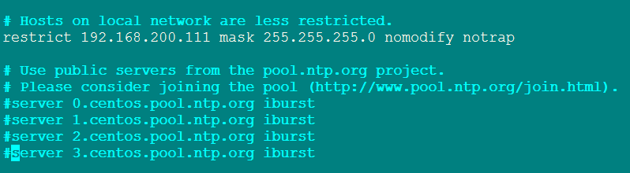{width="8.3125in"
height="2.2916666666666665in"}

{width="6.916666666666667in"
height="1.3854166666666667in"}

### Ntp客户端配置（必须以root用户进行配置）

\[root@hdp01 \~\]\# vim /etc/ntp.conf

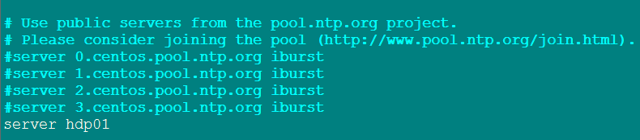{width="8.229166666666666in"
height="1.8125in"}

### 查看ntp的状态

\[root@hdp01 \~\]\# service ntpd status

### 启动ntp服务

\[root@hdp01 \~\]\# service ntpd start

### 把ntpd加入开机启动

\[root@hdp01 \~\]\# chkconfig ntpd on

SSH免密登录原理
---------------

### Ssh使用

\[root@hdp01 \~\]\# ssh 主机名或ip

### 在本机上生成公钥和私钥

\[root@hdp01 \~\]\# ssh-keygen -t rsa

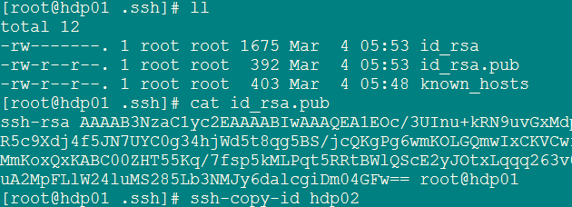{width="6.5625in" height="2.375in"}

### 文件说明

known\_hosts ：记录ssh访问过的计算机公钥

id\_rsa：生成的私钥

id\_rsa.pub：生成的公钥

authorized\_keys：记录免密码登录的服务器公钥

### 免密登录原理

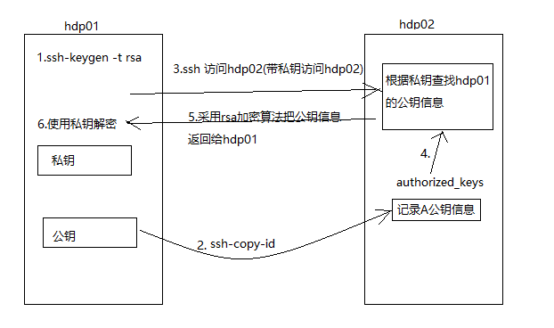{width="6.479166666666667in"
height="3.8333333333333335in"}

### 所有的机器配置免密码登录

所有机器都要配置免密码登录

\[root@hdp03 \~\]\# ssh-copy-id hdp01

\[root@hdp03 \~\]\# ssh-copy-id hdp02

\[root@hdp03 \~\]\# ssh-copy-id hdp03

scp与rsync的使用
----------------

### scp远程复制

scp –r 源目录 目标目录

如：

\[icss@hdp01 \~\]\$ scp -r input/ icss@hdp02:/home/icss/

### rsync远程复制

\[icss@hdp01 output\]\$ rsync -rvl /home/icss/output
icss@hdp02:/home/icss/

-r 递归复制目录

-v 显示复制的过程

-l 拷贝符号连接

### scp和rsync区别

使用rsync要比scp的复制速度快，因为rsync只对差异文件进行复制。

编写集群文件复制脚本
--------------------

### 创建脚本目录

\[icss@hdp01 \~\]\$ mkdir bin

### 编写集群复制的脚本

{width="7.447916666666667in"
height="5.625in"}

集群规划
--------

  ----------------------------------------------------------
         Hdp01         Hdp02             Hdp03
  ------ ------------- ----------------- -------------------
  HDFS   NameNode      DataNode          SecondaryNameNode
                                         
         DataNode                        DataNode

  YARN   NodeManager   ResourceManager   NodeManager
                                         
                       NodeManager       
  ----------------------------------------------------------

配置集群
--------

### HDFS配置

#### 配置core-site.xml

  --------------------------------------------------------
  &lt;configuration&gt;
  
  &lt;!--配置NameNode地址--&gt;
  
  &lt;property&gt;
  
  &lt;name&gt;fs.defaultFS&lt;/name&gt;
  
  &lt;value&gt;hdfs://hdp01:9000&lt;/value&gt;
  
  &lt;/property&gt;
  
  &lt;!--指定hadoop运行产生的文件的存储目录--&gt;
  
  &lt;property&gt;
  
  &lt;name&gt;hadoop.tmp.dir&lt;/name&gt;
  
  &lt;value&gt;/opt/module/hadoop/data/tmp&lt;/value&gt;
  
  &lt;/property&gt;
  
  &lt;/configuration&gt;
  --------------------------------------------------------

#### 配置hadoop-env.sh

修改jdk路径：

export JAVA\_HOME=/opt/module/jdk1.8.0\_144

#### 配置hdfs-site.xml

\[icss@hdp01 hadoop\]\$ vim hdfs-site.xml

  --------------------------------------------------------------
  &lt;configuration&gt;
  
  &lt;!--指定副本的数量--&gt;
  
  &lt;property&gt;
  
  &lt;name&gt;dfs.replication&lt;/name&gt;
  
  &lt;value&gt;3&lt;/value&gt;
  
  &lt;/property&gt;
  
  &lt;!--配置SecondaryNameNode--&gt;
  
  &lt;property&gt;
  
  &lt;name&gt;dfs.namenode.secondary.http-address&lt;/name&gt;
  
  &lt;value&gt;hdp03:50090&lt;/value&gt;
  
  &lt;/property&gt;
  
  &lt;/configuration&gt;
  --------------------------------------------------------------

### YARN配置

#### 修改yarn的jdk环境 yarn-env.sh

export JAVA\_HOME=/opt/module/jdk1.8.0\_144

#### 配置yarn-site.xml

  --------------------------------------------------------
  &lt;configuration&gt;
  
  &lt;!--配置reduce的获取方式--&gt;
  
  &lt;property&gt;
  
  &lt;name&gt;yarn.nodemanager.aux-services&lt;/name&gt;
  
  &lt;value&gt;mapreduce\_shuffle&lt;/value&gt;
  
  &lt;/property&gt;
  
  &lt;!--配置yarn的resourcemanager地址--&gt;
  
  &lt;property&gt;
  
  &lt;name&gt;yarn.resourcemanager.hostname&lt;/name&gt;
  
  &lt;value&gt;hdp02&lt;/value&gt;
  
  &lt;/property&gt;
  
  &lt;/configuration&gt;
  --------------------------------------------------------

#### 配置mapreduce

配置jdk环境：

\[icss@hdp01 hadoop\]\$ vim mapred-env.sh

export JAVA\_HOME=/opt/module/jdk1.8.0\_144

\[icss@hdp01 hadoop\]\$ vim mapred-site.xml

  --------------------------------------------------------------
  &lt;configuration&gt;
  
  &lt;!--配置mapreduce运行在yarn上--&gt;
  
  &lt;property&gt;
  
  &lt;name&gt;mapreduce.framework.name&lt;/name&gt;
  
  &lt;value&gt;yarn&lt;/value&gt;
  
  &lt;/property&gt;
  
  &lt;!--配置历史服务器--&gt;
  
  &lt;property&gt;
  
  &lt;name&gt;mapreduce.jobhistory.address&lt;/name&gt;
  
  &lt;value&gt;hdp01:10020&lt;/value&gt;
  
  &lt;/property&gt;
  
  &lt;property&gt;
  
  &lt;name&gt;mapreduce.jobhistory.webapp.address&lt;/name&gt;
  
  &lt;value&gt;hdp01:19888&lt;/value&gt;
  
  &lt;/property&gt;
  
  &lt;/configuration&gt;
  --------------------------------------------------------------

### 把配置好的集群配置文件进行同步

\[icss@hdp01 module\]\$ cprsync hadoop/

测试集群
--------

### 配置slaves

\[icss@hdp01 hadoop\]\$ vi slaves

hdp01

hdp02

hdp03

### 第一次启动集群格式化namenode元数据

\[icss@hdp01 hadoop\]\$ hadoop namenode –format

### 进行集群数据同步

\[icss@hdp01 module\]\$ cprsync hadoop/

### 启动集群HDFS命令

#### 启动namenode节点

\[icss@hdp01 hadoop\]\$ sbin/hadoop-daemon.sh start namenode

#### 启动datanode节点

\[icss@hdp01 hadoop\]\$ sbin/hadoop-daemon.sh start datanode

#### 启动secondarynamenode节点

\[icss@hdp03 hadoop\]\$ sbin/hadoop-daemon.sh start secondarynamenode

#### 查看进程

\[icss@hdp01 hadoop\]\$ jps

26756 DataNode

26664 NameNode

26829 Jps

\[icss@hdp02 hadoop\]\$ jps

19671 Jps

19598 DataNode

\[icss@hdp03 hadoop\]\$ jps

20049 Jps

19909 DataNode

20007 SecondaryNameNode

### 启动集群YRAN命令

#### 启动resourcemanager

\[icss@hdp02 hadoop\]\$ sbin/yarn-daemon.sh start resourcemanager

#### 启动nodemanager

\[icss@hdp02 hadoop\]\$ sbin/yarn-daemon.sh start nodemanager

#### 查看进程

\[icss@hdp01 hadoop\]\$ jps

26756 DataNode

26664 NameNode

26872 NodeManager

26971 Jps

\[icss@hdp02 hadoop\]\$ jps

20052 Jps

19708 ResourceManager

19598 DataNode

19951 NodeManager

\[icss@hdp03 hadoop\]\$ jps

19909 DataNode

20198 Jps

20007 SecondaryNameNode

20095 NodeManager

### 通过网页查看

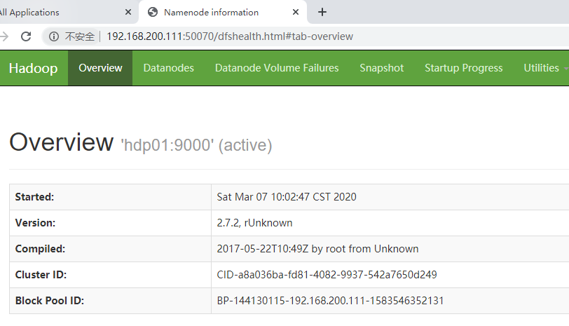{width="8.458333333333334in"
height="4.84375in"}

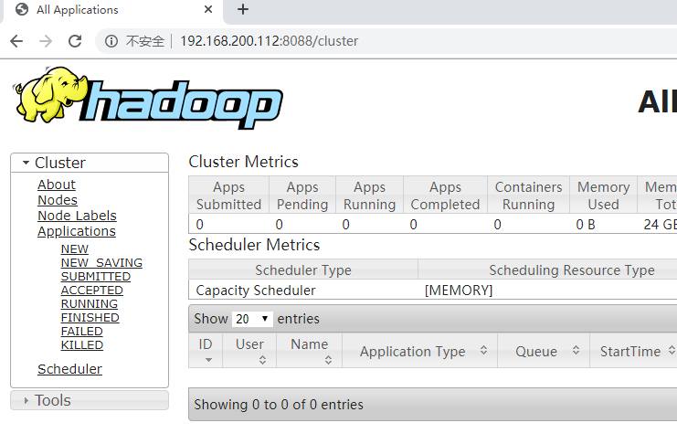{width="7.71875in" height="5.0625in"}

集群启动、停止命令
------------------

### 单个组件启动、停止命令

#### HDFS启动/停止

sbin/hadoop-daemon.sh start|stop namenode|datanode|secondarynamenode

#### YARN启动/停止

sbin/yarn-daemon.sh start|stop resourcemanager|nodemanager

### 每个模块启动/停止（前提配置ssh免密码登录）

#### HDFS启动/停止

\[icss@hdp01 hadoop\]\$ sbin/start-dfs.sh

\[icss@hdp01 hadoop\]\$ sbin/stop-dfs.sh

#### YARN启动/停止

\[icss@hdp02 hadoop\]\$ sbin/start-yarn.sh

\[icss@hdp02 hadoop\]\$ sbin/stop-yarn.sh

### 全部集群启动/停止 （不建议使用）

\[icss@hdp02 hadoop\]\$ sbin/start-all.sh

\[icss@hdp02 hadoop\]\$ sbin/stop-all.sh

本章总结
========

Hadoop的安装，安装hadoop运行环境配置，了解运行模式：本地模式与安装、伪分布式模式与安装、完全分布式模式与安装。
