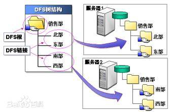
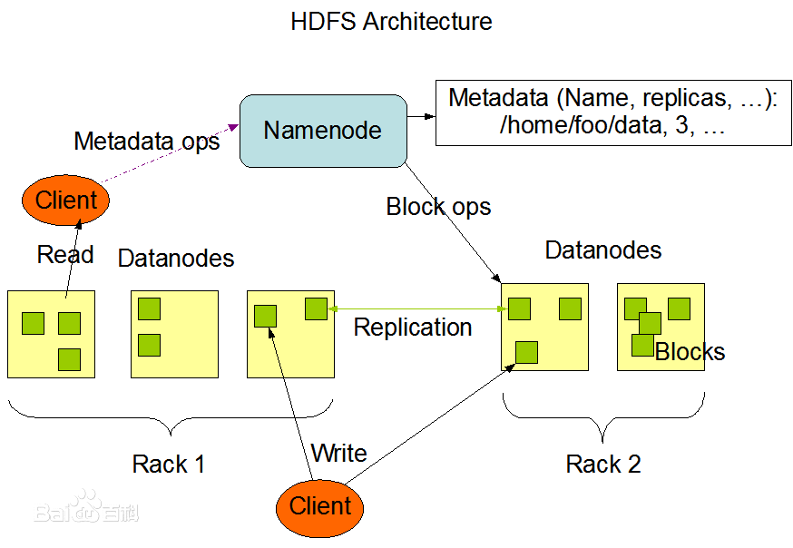
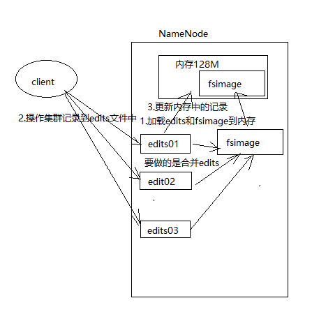
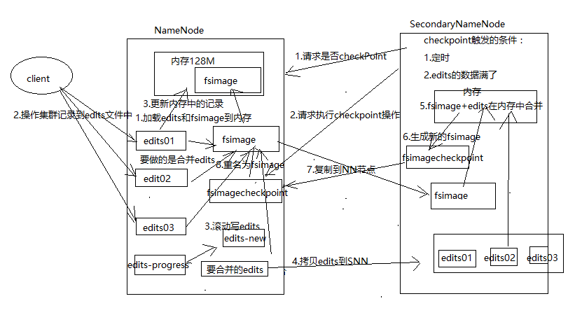
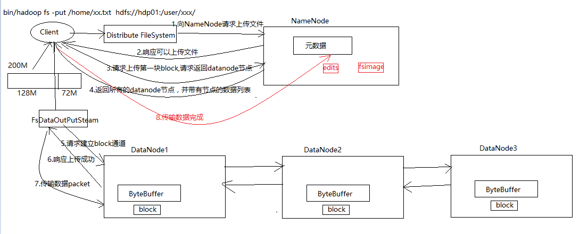
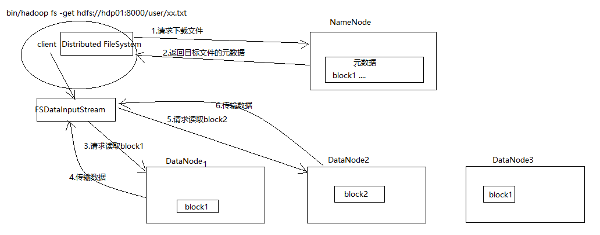
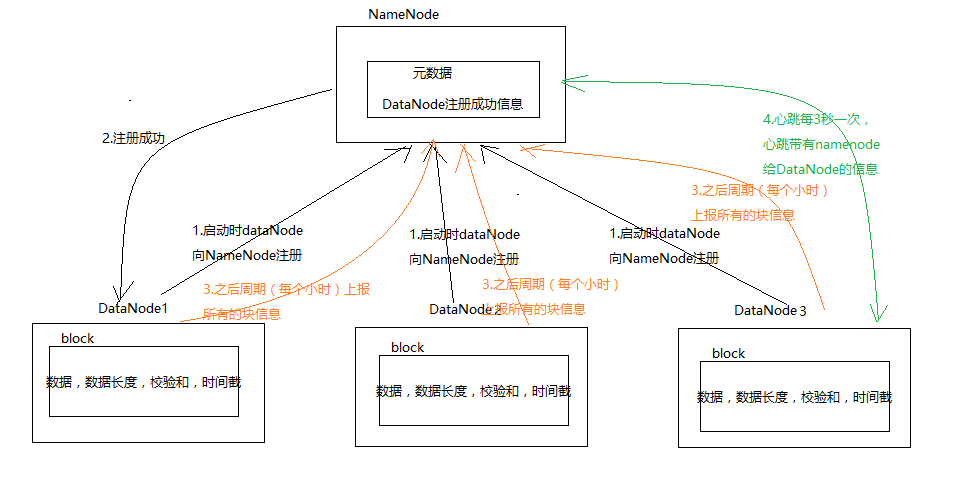
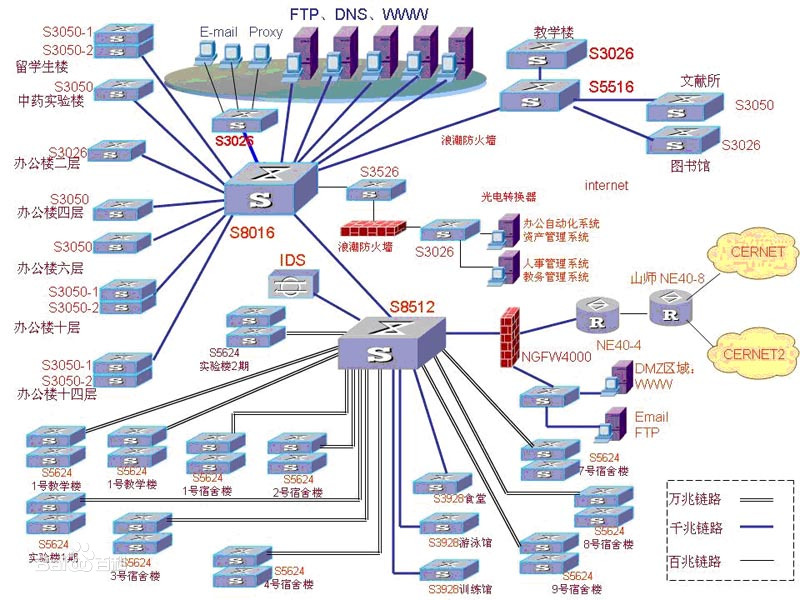

第三章：hadoop存储HDFS\
 {#第三章hadoop存储hdfs .ListParagraph}
=======================

课程安排
========

知识点1：DFS介绍

知识点2：HDFS概念及体系结构

知识点3：HDFS的优点和缺点

知识点4：HDFS shell命令

知识点5：NameNode和SecondaryNameNode工作机制

知识点6：HDFS读/写文件流程

知识点7：DataNode工作机制及Block的副本放置策略、机架感知、安全模式

知识点8：集群间数据复制、小文件存档、快照管理与回收站机制

DFS介绍
=======

Microsoft文件分布系统 (DFS)
是一个网络服务器组件，它能够使你更容易地在网络上查询和管理数据。分布式文件系统是将分布于不同电脑上的文件组合为单一的名称空间，并使得在网络上建立一个单一的、层次化多重文件服务器和服务器共享的工作更为方便的途径。

{width="6.496527777777778in"
height="4.305161854768154in"}

HDFS概念及体系结构
==================

HDFS的产生背景
--------------

随着数据量越来越大，在一台计算机中无法存储大规模的数据，需要多台计算机进行共同存储数据，这种存储方式称为分布式文件存储系统，HDFS是分布式文件系统当中的一种。

HDFS概念
--------

HDFS是一种文件存储系统，用于存放文件的，通过目录树的方式来定位文件，类似于dfs通过分布式集群的方式对数据进行存储。由很多的服务器进行串联进行共同工作。共同存储的服务器都有自已的角色。

HDFS设计的理念适合一次存储，多次读写场景，不支持文件的修改。适合用于数据分析。所以，它不像硬动硬盘可以对数据方便的去修改，也不像网络网盘（百度网盘）应用。

HDFS体系结构
------------

{width="6.102648731408574in"
height="4.217391732283464in"}

从架构中可以看到HDFS由四部分组成：

HDFS Client,NameNode,DataNode,SecondaryNameNode

Client: 客户端

1.  对文件切分。上传文件时，client会把文件切成多个块（block）,然后进行存储。

2.  与NameNode交互，获取文件的位置。

3.  与DataNode交互，读写文件。

4.  提供命令访问HDFS集群并管理集群。

NameNode: Master节点 管理节点

1.  管理HDFS的命名空间

2.  管理数据块（block）映射信息。

3.  配置副本策略

4.  处理客户端的读写请求

DataNode: 是slave DataNode执行具体的操作。

1.  存储真实的数据块

2.  执行读、写数据块的操作

SecondaryNameNode: NameNode助理

1.  辅助NameNode分担工作量

2.  定时合并Fsimage和edit，并推送给NameNode

3.  在紧急的情况下，可以辅助恢复NameNode

HDFS文件块大小
--------------

HDFS中的文件在物理上是分块存储（block），块的大小可以通过配置参数(
dfs.blocksize)来规定，默认大小在hadoop2.x版本中是128M，老版本中是64M。

HDFS的块比磁盘的块大，其目的是为了最小化寻址开销。如果块设置得足够大，从磁盘传输数据的时间会明显大于定位这个块开始位置所需的时间。因而，传输一个由多个块组成的文件的时间取决于磁盘传输速率。

如果寻址时间约为10ms，而传输速率为100MB/s，为了使寻址时间仅占传输时间的1%，我们要将块大小设置约为100MB。默认的块大小128MB。

块的大小：10ms\*100\*100M/s = 100M

HDFS的优点和缺点
----------------

一．优点：

1．高容错性：

1.  数据有多个副本，提高容错性。

2.  当一个副本丢失了，可以自动恢复。

2．适合大数据处理

（1） 数据规模：能够处理PB级别数据。

（2） 文件规模：能够处理百万级别以上的文件数。

3\. 流式数据访问： 它是保证文件数据一致性

4\. 可以部署到低廉设备上，通过副本的机制保证数据一致性

二．缺点：

1.不适合低延时的数据处理，做不到毫秒级的数据处理。

2.无法高效对大量小文件进行处理

3.并发写入，不支持文件的随机修改

HDFS shell命令
==============

基本语法：

bin/hadoop fs 具体命令

查看命令：

bin/hadoop fs

  -------------------------------------------------------------------------------------------------------------------------------
  \[icss@hdp01 hadoop\]\$ bin/hadoop fs
  
  Usage: hadoop fs \[generic options\]
  
  \[-appendToFile &lt;localsrc&gt; ... &lt;dst&gt;\]
  
  \[-cat \[-ignoreCrc\] &lt;src&gt; ...\]
  
  \[-checksum &lt;src&gt; ...\]
  
  \[-chgrp \[-R\] GROUP PATH...\]
  
  \[-chmod \[-R\] &lt;MODE\[,MODE\]... | OCTALMODE&gt; PATH...\]
  
  \[-chown \[-R\] \[OWNER\]\[:\[GROUP\]\] PATH...\]
  
  \[-copyFromLocal \[-f\] \[-p\] \[-l\] &lt;localsrc&gt; ... &lt;dst&gt;\]
  
  \[-copyToLocal \[-p\] \[-ignoreCrc\] \[-crc\] &lt;src&gt; ... &lt;localdst&gt;\]
  
  \[-count \[-q\] \[-h\] &lt;path&gt; ...\]
  
  \[-cp \[-f\] \[-p | -p\[topax\]\] &lt;src&gt; ... &lt;dst&gt;\]
  
  \[-createSnapshot &lt;snapshotDir&gt; \[&lt;snapshotName&gt;\]\]
  
  \[-deleteSnapshot &lt;snapshotDir&gt; &lt;snapshotName&gt;\]
  
  \[-df \[-h\] \[&lt;path&gt; ...\]\]
  
  \[-du \[-s\] \[-h\] &lt;path&gt; ...\]
  
  \[-expunge\]
  
  \[-find &lt;path&gt; ... &lt;expression&gt; ...\]
  
  \[-get \[-p\] \[-ignoreCrc\] \[-crc\] &lt;src&gt; ... &lt;localdst&gt;\]
  
  \[-getfacl \[-R\] &lt;path&gt;\]
  
  \[-getfattr \[-R\] {-n name | -d} \[-e en\] &lt;path&gt;\]
  
  \[-getmerge \[-nl\] &lt;src&gt; &lt;localdst&gt;\]
  
  \[-help \[cmd ...\]\]
  
  \[-ls \[-d\] \[-h\] \[-R\] \[&lt;path&gt; ...\]\]
  
  \[-mkdir \[-p\] &lt;path&gt; ...\]
  
  \[-moveFromLocal &lt;localsrc&gt; ... &lt;dst&gt;\]
  
  \[-moveToLocal &lt;src&gt; &lt;localdst&gt;\]
  
  \[-mv &lt;src&gt; ... &lt;dst&gt;\]
  
  \[-put \[-f\] \[-p\] \[-l\] &lt;localsrc&gt; ... &lt;dst&gt;\]
  
  \[-renameSnapshot &lt;snapshotDir&gt; &lt;oldName&gt; &lt;newName&gt;\]
  
  \[-rm \[-f\] \[-r|-R\] \[-skipTrash\] &lt;src&gt; ...\]
  
  \[-rmdir \[--ignore-fail-on-non-empty\] &lt;dir&gt; ...\]
  
  \[-setfacl \[-R\] \[{-b|-k} {-m|-x &lt;acl\_spec&gt;} &lt;path&gt;\]|\[--set &lt;acl\_spec&gt; &lt;path&gt;\]\]
  
  \[-setfattr {-n name \[-v value\] | -x name} &lt;path&gt;\]
  
  \[-setrep \[-R\] \[-w\] &lt;rep&gt; &lt;path&gt; ...\]
  
  \[-stat \[format\] &lt;path&gt; ...\]
  
  \[-tail \[-f\] &lt;file&gt;\]
  
  \[-test -\[defsz\] &lt;path&gt;\]
  
  \[-text \[-ignoreCrc\] &lt;src&gt; ...\]
  
  \[-touchz &lt;path&gt; ...\]
  
  \[-truncate \[-w\] &lt;length&gt; &lt;path&gt; ...\]
  
  \[-usage \[cmd ...\]\]
  
  Generic options supported are
  
  -conf &lt;configuration file&gt; specify an application configuration file
  
  -D &lt;property=value&gt; use value for given property
  
  -fs &lt;local|namenode:port&gt; specify a namenode
  
  -jt &lt;local|resourcemanager:port&gt; specify a ResourceManager
  
  -files &lt;comma separated list of files&gt; specify comma separated files to be copied to the map reduce cluster
  
  -libjars &lt;comma separated list of jars&gt; specify comma separated jar files to include in the classpath.
  
  -archives &lt;comma separated list of archives&gt; specify comma separated archives to be unarchived on the compute machines.
  
  The general command line syntax is
  
  bin/hadoop command \[genericOptions\] \[commandOptions\]
  -------------------------------------------------------------------------------------------------------------------------------

查看单个命令详细帮助：

bin/hadoop fs –help 具体命令

常用的命名示例：

\[icss@hdp01 hadoop\]\$ bin/hadoop fs -cat /icsstest/NOTICE.txt

\[icss@hdp01 hadoop\]\$ bin/hadoop fs -ls /icsstest

\[icss@hdp01 hadoop\]\$ bin/hadoop fs -mkdir /icsstest

\[icss@hdp01 hadoop\]\$ bin/hadoop fs -rm -r /icsstest

NameNode工作机制
================

理解镜像（Fsimage）原理
-----------------------

Namenode在格式化时，就会在hadoop数据目录中/opt/module/hadoop/data/tmp/dfs/name/current生成一些文件：

  ----------------------------------------------------------------------------------------
  -rw-rw-r--. 1 icss icss 42 Mar 15 05:20 edits\_0000000000000000145-0000000000000000146
  
  -rw-rw-r--. 1 icss icss 1048576 Mar 15 05:20 edits\_inprogress\_0000000000000000147
  
  -rw-rw-r--. 1 icss icss 356 Mar 15 04:20 fsimage\_0000000000000000144
  
  -rw-rw-r--. 1 icss icss 62 Mar 15 04:20 fsimage\_0000000000000000144.md5
  
  -rw-rw-r--. 1 icss icss 356 Mar 15 05:20 fsimage\_0000000000000000146
  
  -rw-rw-r--. 1 icss icss 62 Mar 15 05:20 fsimage\_0000000000000000146.md5
  
  -rw-rw-r--. 1 icss icss 4 Mar 15 05:20 seen\_txid
  
  -rw-rw-r--. 1 icss icss 206 Mar 14 05:21 VERSION
  ----------------------------------------------------------------------------------------

1.  镜像Fsimage:
    它是HDFS的元数据信息，会将datanode节点的数据生成目录，namenode可以根据该目录找到datanode节点中的文件。

2.  edits\_数字：edit文件记录用户最新的操作信息。

3.  seen\_txid：保存一个数字，这个数据记录最后一个edit\_数字。

4.  每次nameNode在启动时，会加载fsimage到内存中，并且从edit\_0开始到seen\_txid结束的edit文件，对edit文件与fsimage文件进行合并操作。

NameNode工作机制
----------------

{width="4.65625in" height="4.65625in"}

1.  第一次启动NameNode格式化后，创建fsimage和edits文件。如果不是第一次启动，直接加载编辑日志和镜像文件到内存。

2.  客户端对元数据进行增删改的请求。

3.  NameNode记录操作日志，更新滚动日志。

4.  NameNode在内存中对数据进行增删改查。

SecondaryNameNode工作机制
-------------------------

{width="8.65625in" height="4.6875in"}

1.  Secondary
    NameNode询问NameNode是否需要checkpoint。直接带回NameNode是否检查结果。

2.  Secondary NameNode请求执行checkpoint。

3.  NameNode滚动正在写的edits日志。

4.  将滚动前的编辑日志和镜像文件拷贝到Secondary NameNode。

5.  Secondary NameNode加载编辑日志和镜像文件到内存，并合并。

6.  生成新的镜像文件fsimage.chkpoint。

7.  拷贝fsimage.chkpoint到NameNode。

8.  NameNode将fsimage.chkpoint重新命名成fsimage。

Checkpoint时间修改配置
----------------------

### Hdfs默认checkpoint时间

每隔一个小时，secondaryNameNode进行一次checkpoint.

### Hdfs-site.xml

  ---------------------------------------------------------
  &lt;!—修改SecondaryNameNode的Checkpoint时间--&gt;
  
  &lt;property&gt;
  
  &lt;name&gt;dfs.namenode.checkpoint.period&lt;/name&gt;
  
  &lt;value&gt;3600&lt;/value&gt;
  
  &lt;/property&gt;
  ---------------------------------------------------------

### Hdfs-site.xml

先指定每隔多少时间进行一次edits检查，当edits操作量满多少量级时，进行checkpoint.

  ----------------------------------------------------------------
  &lt;!—修改nameNode的edits文件操作量-&gt;
  
  &lt;property&gt;
  
  &lt;name&gt;dfs.namenode.checkpoint.txns&lt;/name&gt;
  
  &lt;value&gt;1000000&lt;/value&gt;
  
  &lt;/property&gt;
  
  &lt;!—指定每隔多少时间进行一次edits检查-&gt;
  
  &lt;property&gt;
  
  &lt;name&gt;dfs.namenode.checkpoint.check.period &lt;/name&gt;
  
  &lt;value&gt;60&lt;/value&gt;
  
  &lt;/property&gt;
  ----------------------------------------------------------------

NameNode故障处理
----------------

### 关闭NameNode进程

Kill -9 namenode

### 删除NameNode节点的故障数据

\[icss@hdp01 name\]\$ rm -rf /opt/module/hadoop/data/tmp/dfs/name/\*

### 在SecondaryNameNode的节点复制数据到NameNode节点

\[icss@hdp03 name\]\$ scp –r /opt/module/hadoop/data/tmp/dfs/name/\*
icss@hdp01:/ /opt/module/hadoop/data/tmp/dfs/name/

### 重启NameNode节点

\[icss@hdp01 name\]\$ bin/hadoop-daemon.sh start namenode

HDFS写入流程
============

{width="11.510416666666666in"
height="4.59375in"}

1.  客户端通过Distributed
    FileSystem模块向NameNode请求上传文件，NameNode检查目标文件是否已存在，父目录是否存在。

2.  NameNode返回是否可以上传。

3.  客户端请求第一个 block上传到哪几个datanode服务器上。

4.  NameNode返回3个datanode节点，分别为datanode1、 datanode2、
    datanode3。

5.  客户端通过FSDataOutputStream模块请求datanode1上传数据，
    datanode1收到请求会继续调用datanode2，然后datanode2调用datanode3，将这个通信管道建立完成。

6.  datanode1、 datanode2、 datanode3逐级应答客户端。

7.  客户端开始往datanode1上传第一个block（先从磁盘读取数据放到一个本地内存缓存），以packet为单位，
    datanode1收到一个packet就会传给datanode2， datanode2传给datanode3；
    datanode1每传一个packet会放入一个应答队列等待应答。

8.  当一个block传输完成之后，客户端再次请求NameNode上传第二个block的服务器。（重复执行3-7步）。

HDFS读数据流程
==============

{width="10.75in"
height="4.229166666666667in"}

1.  客户端通过Distributed
    FileSystem向NameNode请求下载文件，NameNode通过查询元数据，找到文件块所在的DataNode地址。

2.  挑选一台DataNode（就近原则，然后随机）服务器，请求读取数据。

3.  DataNode开始传输数据给客户端（从磁盘里面读取数据输入流，以packet为单位来做校验）。

4.  客户端以packet为单位接收，先在本地缓存，然后写入目标文件。

DataNode
========

DataNode工作机制
----------------

{width="10.072916666666666in"
height="5.21875in"}

1.  一个数据块在DataNode上以文件形式存储在磁盘上，包括两个文件，一个是数据本身，一个是元数据包括数据块的长度，块数据的校验和，以及时间戳。

2.  DataNode启动后向NameNode注册，通过后，周期性（1小时）的向NameNode上报所有的块信息。

3.  心跳是每3秒一次，心跳返回结果带有NameNode给该DataNode的命令如复制块数据到另一台机器，或删除某个数据块。如果超过10分钟没有收到某个DataNode的心跳，则认为该节点不可用。

4.  集群运行中可以安全加入和退出一些机器。

数据完整性
----------

1.当DataNode读取数据块时，它会计算总和（checkSum）。

2.如果计算的数据块，与较检值不一样时，说明这个数据块（block）坏了。

3.client在读取数据块时，就切换到其它机器来下载。

4.DataNode节点对坏掉的数据块进行同步。

使用CRC较验数据块。（对于CRC算法有兴趣的同学自已通过网络学习）

掉线时限参数设置
----------------

DataNode进程死亡或者网络故障造成DataNode无法与NameNode通信，NameNode不会立即把该节点判定为死亡，要经过一段时间，这段时间暂称作超时时长。HDFS默认的超时时长为10分钟+30秒。如果定义超时时间为timeout，则超时时长的计算公式为：

timeout = 2 \* dfs.namenode.heartbeat.recheck-interval + 10 \*
dfs.heartbeat.interval。

而默认的dfs.namenode.heartbeat.recheck-interval
大小为5分钟，dfs.heartbeat.interval默认为3秒。

需要注意的是hdfs-site.xml
配置文件中的heartbeat.recheck.interval的单位为毫秒，dfs.heartbeat.interval的单位为秒。

&lt;property&gt;

&lt;name&gt;dfs.namenode.heartbeat.recheck-interval&lt;/name&gt;

&lt;value&gt;300000&lt;/value&gt;

&lt;/property&gt;

&lt;property&gt;

&lt;name&gt; dfs.heartbeat.interval &lt;/name&gt;

&lt;value&gt;3&lt;/value&gt;

&lt;/property&gt;

服役新节点
----------

1）在namenode的/opt/module/hadoop/etc/hadoop目录下创建dfs.hosts文件

vi dfs.hosts 添加如下主机名称（包含新服役的节点）

2）在namenode的hdfs-site.xml配置文件中增加dfs.hosts属性

&lt;property&gt;

&lt;name&gt;dfs.hosts&lt;/name&gt;

&lt;value&gt;/opt/module/hadoop/etc/hadoop/dfs.hosts&lt;/value&gt;

&lt;/property&gt;

3）刷新namenode

hdfs dfsadmin -refreshNodes

4）更新resourcemanager节点

yarn rmadmin –refreshNodes

5）在NameNode的slaves文件中增加新主机名称

6）单独命令启动新的数据节点和节点管理器

启动datanode: sbin/hadoop-daemon.sh start datanode

启动nodeManager: sbin/yarn-daemon.sh start nodemanager

7）在web浏览器上检查是否ok

退役旧数据节点
--------------

1)
在namenode的/opt/module/hadoop/etc/hadoop目录下创建dfs.hosts.exclude文件

vi dfs.hosts.exclude

添加如下主机名称（要退役的节点）

2）在namenode的hdfs-site.xml配置文件中增加dfs.hosts.exclude属性

&lt;property&gt;

&lt;name&gt;dfs.hosts.exclude&lt;/name&gt;

&lt;value&gt;/opt/module/hadoop/etc/hadoop/dfs.hosts.exclude&lt;/value&gt;

&lt;/property&gt;

3）刷新namenode、刷新resourcemanager

hdfs dfsadmin –refreshNodes

yarn rmadmin –refreshNodes

4）检查web浏览器，退役节点的状态为decommission in
progress（退役中），说明数据节点正在复制块到其他节点。

5）等待退役节点状态为decommissioned（所有块已经复制完成），停止该节点及节点资源管理器。注意：如果副本数是3，服役的节点小于等于3，是不能退役成功的，需要修改副本数后才能退役。

sbin/hadoop-daemon.sh stop datanode

sbin/yarn-daemon.sh stop nodemanager

6）从include文件中删除退役节点，再运行刷新节点的命令

（1）从namenode的dfs.hosts文件中删除退役节点

（2）刷新namenode，刷新resourcemanager

7）从namenode的slave文件中删除退役节点

安全模式
========

NameNode启动时，首先将映像文件（fsimage）载入内存，并执行编辑日志（edits）中的各项操作。一旦在内存中成功建立文件系统元数据的映像，则创建一个新的fsimage文件和一个空的编辑日志。此时，NameNode开始监听DataNode请求。但是此刻，NameNode运行在安全模式，即NameNode的文件系统对于客户端来说是只读的。

系统中的数据块的位置并不是由NameNode维护的，而是以块列表的形式存储在DataNode中。在系统的正常操作期间，NameNode会在内存中保留所有块位置的映射信息。在安全模式下，各个DataNode会向NameNode发送最新的块列表信息，NameNode了解到足够多的块位置信息之后，即可高效运行文件系统。

如果满足“最小副本条件”，NameNode会在30秒钟之后就退出安全模式。所谓的最小副本条件指的是在整个文件系统中99.9%的块满足最小副本级别（默认值：dfs.replication.min=1）。在启动一个刚刚格式化的HDFS集群时，因为系统中还没有任何块，所以NameNode不会进入安全模式。

基本语法

集群处于安全模式，不能执行重要操作（写操作）。集群启动完成后，自动退出安全模式。

（1）bin/hdfs dfsadmin -safemode get （功能描述：查看安全模式状态）

（2）bin/hdfs dfsadmin -safemode enter （功能描述：进入安全模式状态）

（3）bin/hdfs dfsadmin -safemode leave （功能描述：离开安全模式状态）

（4）bin/hdfs dfsadmin -safemode wait （功能描述：等待安全模式状态）

机架感知和Block的副本放置策略
=============================

网络拓扑
--------

网络拓扑(Network
Topology)结构是指用传输介质互连各种设备的物理布局。指构成网络的成员间特定的物理的即真实的、或者逻辑的即虚拟的排列方式。如果两个网络的连接结构相同我们就说它们的网络拓扑相同，尽管它们各自内部的物理接线、节点间距离可能会有不同。

{width="8.333333333333334in"
height="6.25in"}

节点间距离： 两个连接点到最近的共同祖先的距离总和。

因为在网络传输的过程中，节点间距离远的传输效率较低。所以，节点间距离近效率越高。

机架感知和Block的副本放置策略
-----------------------------

官方ip地址：

[*http://hadoop.apache.org/docs/r2.7.2/hadoop-project-dist/hadoop-common/RackAwareness.html*](http://hadoop.apache.org/docs/r2.7.2/hadoop-project-dist/hadoop-common/RackAwareness.html)

[*http://hadoop.apache.org/docs/r2.7.2/hadoop-project-dist/hadoop-hdfs/HdfsDesign.html\#Data\_Replication*](http://hadoop.apache.org/docs/r2.7.2/hadoop-project-dist/hadoop-hdfs/HdfsDesign.html)

Hadoop1.x版本副本存放策略：

第一个副本client端所处的节点上，如果客户端在集群外上传，随机选一个。

第二个副本和第一个副本位于不相同机架的随机节点上。

第三个副本和第二个副本位于相同机架，节点随机。

Hadoop2.x副本节点选择：

第一个副本在Client所处的节点上。如果客户端在集群外，随机选一个。

第二个副本和第一个副本位于相同机架，随机节点。

第三个副本位于不同机架，随机节点。

Hadoop2.x新特性
===============

集群间数据复制
--------------

scp实现两个远程主机之间的文件复制

scp -r xxx.txt [*icss@hdp01:/user/xxx.txt* *// 推
push*](mailto:root@hadoop103:/user/atguigu/hello.txt)

scp -r [*icss@hdp02:/user/xxx.txt xxx.txt* *// 拉
pull*](mailto:root@hadoop103:/user/atguigu/hello.txt%20%20hello.txt)

scp -r [*icss@hdp03:/user/xxx.txt* *icss@hdp04:/user/*
*//是通过本地主机中转实现两个远程主机的文件复制；如果在两个远程主机之间ssh没有配置的情况下可以使用该方式。*](mailto:root@hadoop103:/user/atguigu/hello.txt)

采用discp命令实现两个hadoop集群之间的递归数据复制

\[icss@hdp02 hadoop\]\$ bin/hadoop distcp hdfs://hdp01:9000/user/xxx.txt
hdfs://hdp03:9000/user/xxx.txt

小文件存档
----------

1）hdfs存储小文件弊端

每个文件均按块存储，每个块的元数据存储在NameNode的内存中，因此hadoop存储小文件会非常低效。因为大量的小文件会耗尽NameNode中的大部分内存。但注意，存储小文件所需要的磁盘容量和存储这些文件原始内容所需要的磁盘空间相比也不会增多。例如，一个1MB的文件以大小为128MB的块存储，使用的是1MB的磁盘空间，而不是128MB。

2）解决存储小文件办法之一

Hadoop存档文件或HAR文件，是一个更高效的文件存档工具，它将文件存入HDFS块，在减少NameNode内存使用的同时，允许对文件进行透明的访问。具体说来，Hadoop存档文件对内还是一个一个独立文件，对NameNode而言却是一个整体，减少了NameNode的内存。

归档文件：

\[icss@hdp01 hadoop\]\$ bin/hadoop archive myarchive.har -p /user/icss/
/user/arc/

查看归档文件:

\[icss@hdp01 hadoop\]\$ bin/hadoop -lsr /user/arc/myarchive.har

\[icss@hdp01 hadoop\]\$ bin/hadoop -lsr har:///myarchive.har

解压归档文件：

\[icss@hdp01 hadoop\]\$ bin/hadoop -cp har:///myarchive.har /\*
/user/icss/

快照管理
--------

快照相当于对目录做一个备份。并不会立即复制所有文件，而是指向同一个文件。当写入发生时，才会产生新文件。

1）基本语法

（1）hdfs dfsadmin -allowSnapshot 路径
（功能描述：开启指定目录的快照功能）

（2）hdfs dfsadmin -disallowSnapshot 路径
（功能描述：禁用指定目录的快照功能，默认是禁用）

（3）hdfs dfs -createSnapshot 路径 （功能描述：对目录创建快照）

（4）hdfs dfs -createSnapshot 路径 名称 （功能描述：指定名称创建快照）

（5）hdfs dfs -renameSnapshot 路径 旧名称 新名称
（功能描述：重命名快照）

（6）hdfs lsSnapshottableDir （功能描述：列出当前用户所有可快照目录）

（7）hdfs snapshotDiff 路径1 路径2
（功能描述：比较两个快照目录的不同之处）

（8）hdfs dfs -deleteSnapshot &lt;path&gt; &lt;snapshotName&gt; 
（功能描述：删除快照）

回收站
------

1）默认回收站

默认值fs.trash.interval=0，0表示禁用回收站，可以设置删除文件的存活时间。

默认值fs.trash.checkpoint.interval=0，检查回收站的间隔时间。如果该值为0，则该值设置和fs.trash.interval的参数值相等。要求fs.trash.checkpoint.interval&lt;=fs.trash.interval。

2）启用回收站

修改core-site.xml，配置垃圾回收时间为1分钟。

&lt;property&gt;

&lt;name&gt;fs.trash.interval&lt;/name&gt;

&lt;value&gt;1&lt;/value&gt;

&lt;/property&gt;

3）查看回收站

回收站在集群中的；路径：/user/icss/.Trash/….

4）修改访问垃圾回收站用户名称

进入垃圾回收站用户名称，默认是dr.who，修改为icss用户

\[core-site.xml\]

&lt;property&gt;

&lt;name&gt;hadoop.http.staticuser.user&lt;/name&gt;

&lt;value&gt;icss&lt;/value&gt;

&lt;/property&gt;

5）通过程序删除的文件不会经过回收站，需要调用moveToTrash()才进入回收站

Trash trash = New Trash(conf);

trash.moveToTrash(path);

6）恢复回收站数据

\[icss@hdp02 hadoop\]\$ hadoop fs -mv
/user/icss/.Trash/Current/user/icss/input /user/icss/input

7）清空回收站

\[icss@hdp02 hadoop\]\$ hadoop fs -expunge

本章总结
========

通过本章的学习，对hdfs的概念，优点与缺点，hdfs的系统架构的认识，学会hdfs
shell相关的命令操作，理解hdfs的读写文件原理，nameNode和SecondaryName,DataNode工作机制，Fsimage原理，NameNode故障处理等知识。
