第四章：HDFS编程\
 {#第四章hdfs编程 .ListParagraph}
=================

课程安排
========

知识点1：HDFS的客户端准备环境

知识点2：HDFS文件上传api操作

知识点3：HDFS文件下载api操作

知识点4：HDFS文件夹删除api操作

知识点5：HDFS文件名更改api操作

知识点6：HDFS文件详情查看api操作

知识点7：HDFS文件和文件夹的判断

知识点8：HDFS文件上传的I/O流操作

知识点9：HDFS文件下载的I/O流操作

知识点10：HDFS定位文件读取操作

HDFS的客户端准备环境
====================

安装JDK并配置环境变量
---------------------

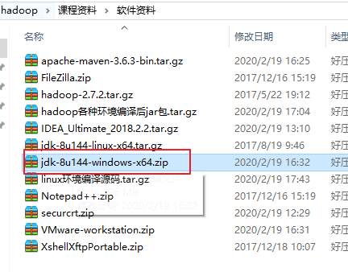{width="4.5in"
height="3.5208333333333335in"}

安装Idea开发工具
----------------

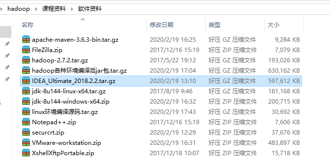{width="7.0in" height="3.5in"}

参考文档进行安装：

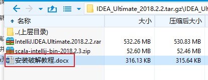{width="4.3125in"
height="1.6770833333333333in"}

配置hadoop开发环境
------------------

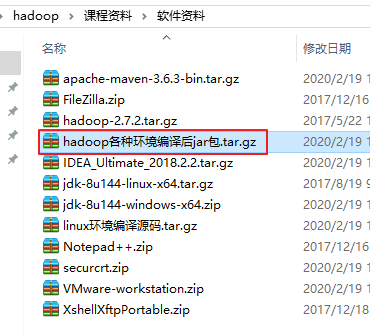{width="3.8541666666666665in"
height="3.5in"}

### 配置环境变量

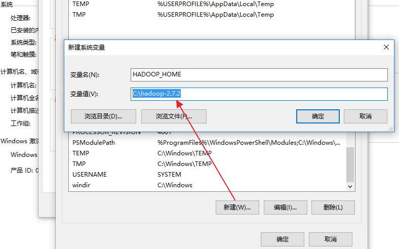{width="8.208333333333334in"
height="5.125in"}

### 配置path路径

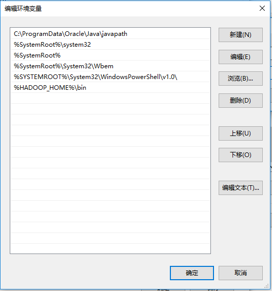{width="5.520833333333333in"
height="5.90625in"}

HDFS编程api入门
===============

创建maven工程
-------------

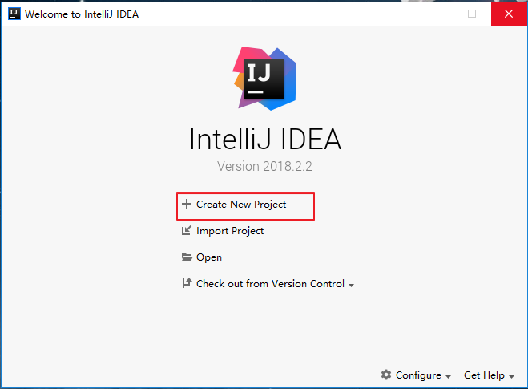{width="6.864583333333333in"
height="5.052083333333333in"}

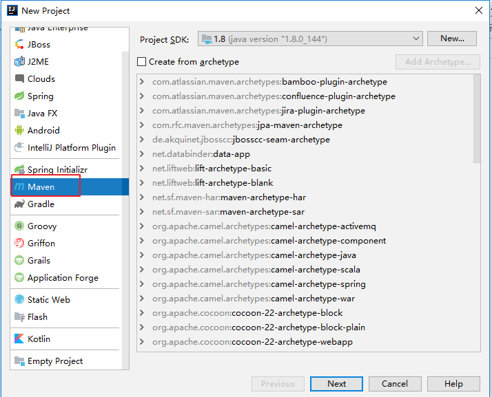{width="7.4375in"
height="6.010416666666667in"}

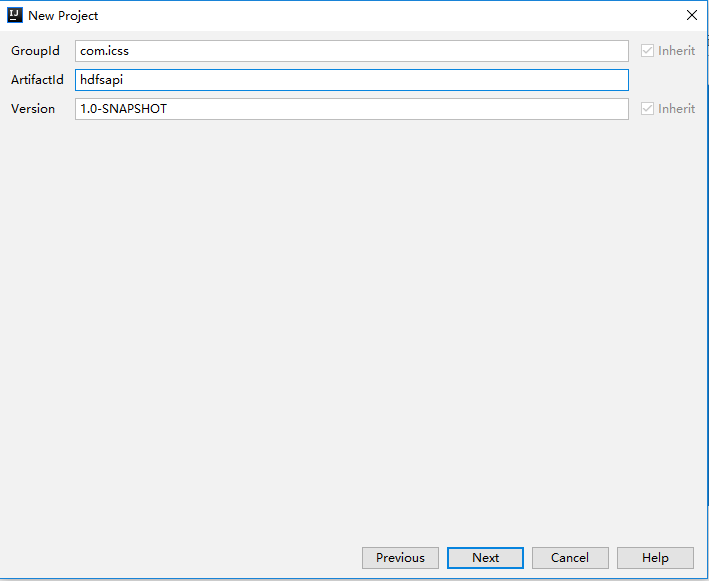{width="7.385416666666667in"
height="6.052083333333333in"}

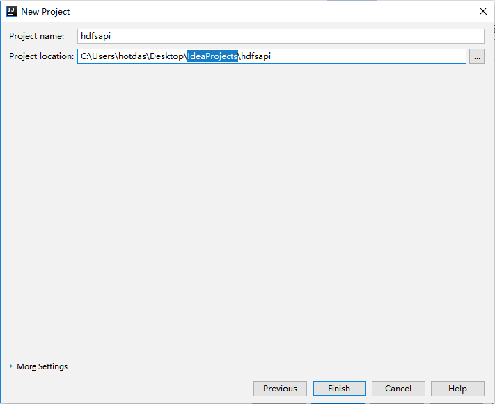{width="7.40625in"
height="6.052083333333333in"}

导入工程依赖
------------

  ------------------------------------------------------------------
  &lt;**dependencies**&gt;\
  \
  *&lt;!-- 导入单元测试依赖--&gt;\
  *&lt;**dependency**&gt;\
  &lt;**groupId**&gt;junit&lt;/**groupId**&gt;\
  &lt;**artifactId**&gt;junit&lt;/**artifactId**&gt;\
  &lt;**version**&gt;RELEASE&lt;/**version**&gt;\
  &lt;/**dependency**&gt;\
  \
  *&lt;!--导入日志依赖--&gt;\
  *&lt;**dependency**&gt;\
  &lt;**groupId**&gt;org.apache.logging.log4j&lt;/**groupId**&gt;\
  &lt;**artifactId**&gt;log4j-core&lt;/**artifactId**&gt;\
  &lt;**version**&gt;2.8.2&lt;/**version**&gt;\
  &lt;/**dependency**&gt;\
  \
  *&lt;!-- 导入hadoop相关的依赖--&gt;\
  *&lt;**dependency**&gt;\
  &lt;**groupId**&gt;org.apache.hadoop&lt;/**groupId**&gt;\
  &lt;**artifactId**&gt;hadoop-common&lt;/**artifactId**&gt;\
  &lt;**version**&gt;2.7.2&lt;/**version**&gt;\
  &lt;/**dependency**&gt;\
  \
  &lt;**dependency**&gt;\
  &lt;**groupId**&gt;org.apache.hadoop&lt;/**groupId**&gt;\
  &lt;**artifactId**&gt;hadoop-client&lt;/**artifactId**&gt;\
  &lt;**version**&gt;2.7.2&lt;/**version**&gt;\
  &lt;/**dependency**&gt;\
  \
  &lt;**dependency**&gt;\
  &lt;**groupId**&gt;org.apache.hadoop&lt;/**groupId**&gt;\
  &lt;**artifactId**&gt;hadoop-hdfs&lt;/**artifactId**&gt;\
  &lt;**version**&gt;2.7.2&lt;/**version**&gt;\
  &lt;/**dependency**&gt;\
  \
  &lt;/**dependencies**&gt;
  ------------------------------------------------------------------

配置日志属性
------------

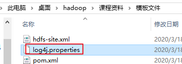{width="3.75in"
height="1.3333333333333333in"}

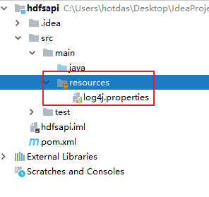{width="3.0833333333333335in"
height="2.90625in"}

需求
----

通过hdfs客户端编程api实现创建目录功能。

### 配置域名与ip的映射关系

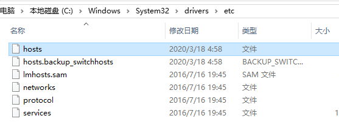{width="5.802083333333333in"
height="2.125in"}

192.168.200.111 hdp01

192.168.200.112 hdp02

192.168.200.113 hdp03

### 程序实现

  ---------------------------------------------------------------------------------------------------
  **public class** HdfsMkdir {\
  \
  @Test\
  **public void** testMkdirs() **throws** Exception{\
  *//1.获取文件系统\
  *Configuration configuration = **new** Configuration();\
  \
  FileSystem fs = FileSystem.*get*(**new** URI(**"hdfs://hdp01:9000"**),configuration,**"icss"**);\
  \
  *//2.创建目录\
  *fs.mkdirs(**new** Path(**"/user/icss/"**));\
  \
  *//3.关闭\
  *fs.close();\
  \
  }\
  }
  ---------------------------------------------------------------------------------------------------

### 测试效果

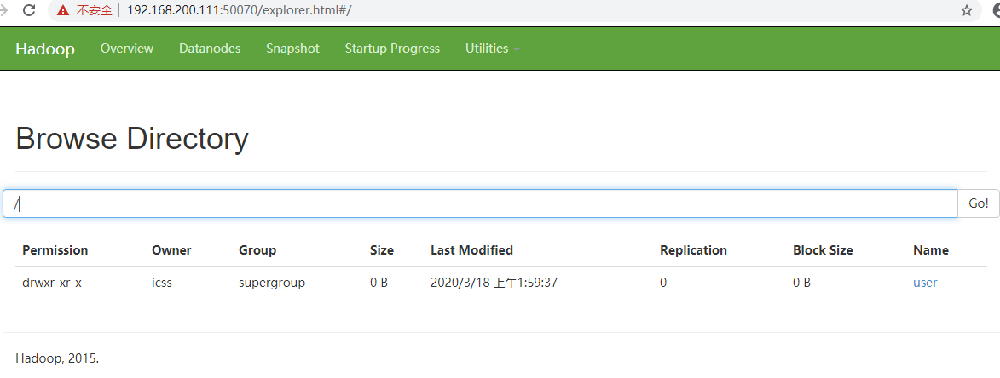{width="12.21875in" height="4.625in"}

HDFS文件上传api
===============

研究参数的优先级
----------------

参数的优先顺序：代码的设置属性优先级最高 classpath路径下的配置文件
服务器的默认配置

编写测试代码
------------

  --------------------------------------------------------------------------------------------------------------
  */\*\*\
  \* 文件上传\
  \*/\
  *@Test\
  **public void** testCopyFileFromlocal() **throws** Exception{\
  *//1.获取文件系统\
  *Configuration configuration = **new** Configuration();\
  \
  *//指定配置信息\
  *configuration.set(**"dfs.replication"**,**"2"**);\
  \
  FileSystem fs = FileSystem.*get*(**new** URI(**"hdfs://hdp01:9000"**),configuration,**"icss"**);\
  \
  *//2.创建目录\
  *fs.copyFromLocalFile(**new** Path(**"C:/Users/hotdas/Desktop/test.txt"**),**new** Path(**"/test2.txt"**));\
  \
  *//3.关闭\
  *fs.close();\
  \
  System.***out***.println(**"upload success!"**);\
  \
  }
  --------------------------------------------------------------------------------------------------------------

Hdfs-site.xml配置文件 
----------------------

  ---------------------------------------------------------------------------
  *&lt;?***xml-stylesheet type="text/xsl" href="configuration.xsl"***?&gt;\
  *&lt;**configuration**&gt;\
  *&lt;!--指定副本的数量--&gt;\
  *&lt;**property**&gt;\
  &lt;**name**&gt;dfs.replication&lt;/**name**&gt;\
  &lt;**value**&gt;1&lt;/**value**&gt;\
  &lt;/**property**&gt;\
  \
  &lt;/**configuration**&gt;
  ---------------------------------------------------------------------------

HDFS文件下载api
===============

编写测试代码
------------

  ------------------------------------------------------------------------------------------------------------------------------
  */\*\*\
  \* 文件下载\
  \*/\
  *@Test\
  **public void** testCopyToLocalFile() **throws** Exception{\
  *//1.获取文件系统\
  *Configuration configuration = **new** Configuration();\
  \
  *//指定配置信息\
  //configuration.set("dfs.replication","2");\
  \
  *FileSystem fs = FileSystem.*get*(**new** URI(**"hdfs://hdp01:9000"**),configuration,**"icss"**);\
  \
  *//2.创建下载\
  //Boolean delSrc:是否将原文件删除\
  //Path src:指定下载的文件路径,\
  //Path dst:指定文件下载到的路径,\
  //Boolean useRawLocalFileSystem:是否开启文件较检\
  *fs.copyToLocalFile(**false**,**new** Path(**"/test.txt"**),**new** Path(**"C:/Users/hotdas/Desktop/test.txt"**),**true**);\
  *//3.关闭\
  *fs.close();\
  \
  System.***out***.println(**"success!"**);\
  \
  }
  ------------------------------------------------------------------------------------------------------------------------------

文件下载参数如下
----------------

copyToLocalFile(*Boolean delSrc, Path src, Path dst, Boolean
useRawLocalFileSystem*);

*//Boolean delSrc:是否将原文件删除\
//Path src:指定下载的文件路径,\
//Path dst:指定文件下载到的路径,\
//Boolean useRawLocalFileSystem:是否开启文件较检\
*

HDFS文件夹删除api
=================

编写测试代码
------------

  ----------------------------------------------------------------------------------------------------
  */\*\*\
  \* 文件夹删除\
  \*/\
  *@Test\
  **public void** testDeleteFile() **throws** Exception{\
  *//1.获取文件系统\
  *Configuration configuration = **new** Configuration();\
  \
  *//指定配置信息\
  //configuration.set("dfs.replication","2");\
  \
  *FileSystem fs = FileSystem.*get*(**new** URI(**"hdfs://hdp01:9000"**),configuration,**"icss"**);\
  \
  *//2.文件夹删除\
  *fs.delete(**new** Path(**"/user/"**),**true**);\
  *//3.关闭\
  *fs.close();\
  \
  System.***out***.println(**"success!"**);\
  \
  }
  ----------------------------------------------------------------------------------------------------

HDFS文件名更改api操作
=====================

编写测试代码
------------

  ----------------------------------------------------------------------------------------------------
  */\*\*\
  \* 文件名更改\
  \*/\
  *@Test\
  **public void** testRename() **throws** Exception{\
  *//1.获取文件系统\
  *Configuration configuration = **new** Configuration();\
  \
  *//指定配置信息\
  //configuration.set("dfs.replication","2");\
  \
  *FileSystem fs = FileSystem.*get*(**new** URI(**"hdfs://hdp01:9000"**),configuration,**"icss"**);\
  \
  *//2.文件名更改操作\
  *fs.rename(**new** Path(**"/test2.txt"**),**new** Path(**"/test3.txt"**));\
  *//3.关闭\
  *fs.close();\
  \
  System.***out***.println(**"success!"**);\
  \
  }
  ----------------------------------------------------------------------------------------------------

HDFS查看文件详情api操作
=======================

每个文件都会有：文件名称，权限，长度，块信息

编写测试代码
------------

  ------------------------------------------------------------------------------------------------------
  */\*\*\
  \* 文件详情查看\
  \*/\
  *@Test\
  **public void** testListFile() **throws** Exception{\
  *//1.获取文件系统\
  *Configuration configuration = **new** Configuration();\
  \
  *//指定配置信息\
  //configuration.set("dfs.replication","2");\
  \
  *FileSystem fs = FileSystem.*get*(**new** URI(**"hdfs://hdp01:9000"**),configuration,**"icss"**);\
  \
  *//2.获取文件的详情信息\
  *RemoteIterator&lt;LocatedFileStatus&gt; listFiles = fs.listFiles(**new** Path(**"/"**), **true**);\
  \
  \
  **while** (listFiles.hasNext()){\
  LocatedFileStatus status = listFiles.next();\
  \
  *//输出详情\
  //文件名称\
  *System.***out***.println(**"文件名称="**+status.getPath().getName());\
  \
  *//长度\
  *System.***out***.println(**"文件长度="**+status.getLen());\
  \
  *//权限\
  *System.***out***.println(**"文件权限="**+status.getPermission());\
  \
  *//组\
  *System.***out***.println(**"文件的组信息="**+status.getGroup());\
  \
  *//获取存储的块信息\
  *BlockLocation\[\] blockLocations = status.getBlockLocations();\
  **for** (BlockLocation blockLocation : blockLocations){\
  \
  *//获取块的主机节点\
  *String\[\] hosts = blockLocation.getHosts();\
  \
  **for** (String host:hosts){\
  System.***out***.println(**"块主机="**+host);\
  }\
  }\
  \
  \
  }\
  \
  *//3.关闭\
  *fs.close();\
  \
  System.***out***.println(**"success!"**);\
  \
  }
  ------------------------------------------------------------------------------------------------------

判断HDFS文件或文件夹
====================

编写测试代码
------------

  ----------------------------------------------------------------------------------------------------
  */\*\*\
  \* 判断文件与文件夹\
  \*/\
  *@Test\
  **public void** testListStatus() **throws** Exception{\
  *//1.获取文件系统\
  *Configuration configuration = **new** Configuration();\
  \
  *//指定配置信息\
  //configuration.set("dfs.replication","2");\
  \
  *FileSystem fs = FileSystem.*get*(**new** URI(**"hdfs://hdp01:9000"**),configuration,**"icss"**);\
  \
  *//2.获取文件的详情信息\
  *FileStatus\[\] fileStatuses = fs.listStatus(**new** Path(**"/"**));\
  \
  **for** (FileStatus fileStatus:fileStatuses){\
  *//判断是文件或文件夹\
  ***if** (fileStatus.isFile()){\
  *//是文件\
  *System.***out***.println(**"file="**+fileStatus.getPath().getName());\
  }**else**{\
  *//是文件夹\
  *System.***out***.println(**"dir="**+fileStatus.getPath().getName());\
  }\
  }\
  \
  *//3.关闭\
  *fs.close();\
  \
  System.***out***.println(**"success!"**);\
  \
  }
  ----------------------------------------------------------------------------------------------------

通过I/O流方式实现HDFS文件上传
=============================

  --------------------------------------------------------------------------------------------------------------------
  */\*\*\
  \* 通过I/O流上传文件\
  \*/\
  *@Test\
  **public void** testPutFileToHDFS() **throws** Exception{\
  *//1.获取文件系统\
  *Configuration configuration = **new** Configuration();\
  \
  *//指定配置信息\
  //configuration.set("dfs.replication","2");\
  \
  *FileSystem fs = FileSystem.*get*(**new** URI(**"hdfs://hdp01:9000"**),configuration,**"icss"**);\
  \
  *//2.创建输入流\
  *FileInputStream fileInputStream = **new** FileInputStream(**new** File(**"C:/Users/hotdas/Desktop/test.txt"**));\
  \
  *//3.获取输出流\
  *FSDataOutputStream fsDataOutputStream = fs.create(**new** Path(**"/test2.txt"**));\
  \
  *//4.对接流\
  *IOUtils.*copyBytes*(fileInputStream,fsDataOutputStream,configuration);\
  \
  *//5.关闭资源\
  *IOUtils.*closeStream*(fileInputStream);\
  IOUtils.*closeStream*(fsDataOutputStream);\
  \
  *//6.关闭\
  *fs.close();\
  \
  System.***out***.println(**"success!"**);\
  \
  }
  --------------------------------------------------------------------------------------------------------------------

通过I/O流方式实现HDFS文件下载
=============================

  -----------------------------------------------------------------------------------------------------------------------
  */\*\*\
  \* 通过I/O流下载文件\
  \*/\
  *@Test\
  **public void** testgetFileFromHDFS() **throws** Exception{\
  *//1.获取文件系统\
  *Configuration configuration = **new** Configuration();\
  \
  *//指定配置信息\
  //configuration.set("dfs.replication","2");\
  \
  *FileSystem fs = FileSystem.*get*(**new** URI(**"hdfs://hdp01:9000"**),configuration,**"icss"**);\
  \
  *//2.创建输入流\
  *FSDataInputStream fsDataInputStream = fs.open(**new** Path(**"/test2.txt"**));\
  \
  *//3.获取输出流\
  *FileOutputStream fileOutputStream = **new** FileOutputStream(**new** File(**"C:/Users/hotdas/Desktop/file.txt"**));\
  *//4.对接流\
  *IOUtils.*copyBytes*(fsDataInputStream,fileOutputStream,configuration);\
  \
  *//5.关闭资源\
  *IOUtils.*closeStream*(fsDataInputStream);\
  IOUtils.*closeStream*(fileOutputStream);\
  \
  *//6.关闭\
  *fs.close();\
  \
  System.***out***.println(**"success!"**);\
  \
  }
  -----------------------------------------------------------------------------------------------------------------------

HDFS定位读取文件
================

下载第一块
----------

  ----------------------------------------------------------------------------------------------------------------------------------------
  */\*\*\
  \* 下载第一块\
  \*/\
  *@Test\
  **public void** testReadOneFile() **throws** Exception{\
  *//1.获取文件系统\
  *Configuration configuration = **new** Configuration();\
  \
  *//指定配置信息\
  //configuration.set("dfs.replication","2");\
  \
  *FileSystem fs = FileSystem.*get*(**new** URI(**"hdfs://hdp01:9000"**),configuration,**"icss"**);\
  \
  *//2.创建输入流\
  *FSDataInputStream fsDataInputStream = fs.open(**new** Path(**"/hadoop-2.7.2.tar.gz"**));\
  \
  *//3.获取输出流\
  *FileOutputStream fileOutputStream = **new** FileOutputStream(**new** File(**"C:/Users/hotdas/Desktop/hadoop-2.7.2.tar.gz.park1"**));\
  \
  *//4.读取128M文件块\
  ***byte**\[\] buf = **new byte**\[1024\];\
  \
  **for** (**int** i=0; i&lt;1024\*128; i++){\
  fsDataInputStream.read(buf);\
  fileOutputStream.write(buf);\
  }\
  \
  \
  *//5.关闭资源\
  *IOUtils.*closeStream*(fsDataInputStream);\
  IOUtils.*closeStream*(fileOutputStream);\
  \
  *//6.关闭\
  *fs.close();\
  \
  System.***out***.println(**"success!"**);\
  \
  }
  ----------------------------------------------------------------------------------------------------------------------------------------

下载第二块
----------

  ----------------------------------------------------------------------------------------------------------------------------------------
  */\*\*\
  \* 下载第二块\
  \*/\
  *@Test\
  **public void** testReadTwoFile() **throws** Exception{\
  *//1.获取文件系统\
  *Configuration configuration = **new** Configuration();\
  \
  *//指定配置信息\
  //configuration.set("dfs.replication","2");\
  \
  *FileSystem fs = FileSystem.*get*(**new** URI(**"hdfs://hdp01:9000"**),configuration,**"icss"**);\
  \
  *//2.创建输入流\
  *FSDataInputStream fsDataInputStream = fs.open(**new** Path(**"/hadoop-2.7.2.tar.gz"**));\
  \
  *//3.定位读取:从128M位置开始读取\
  *fsDataInputStream.seek(1024\*1024\*128);\
  \
  *//4.获取输出流\
  *FileOutputStream fileOutputStream = **new** FileOutputStream(**new** File(**"C:/Users/hotdas/Desktop/hadoop-2.7.2.tar.gz.park2"**));\
  \
  *//5.流复制\
  *IOUtils.*copyBytes*(fsDataInputStream,fileOutputStream,configuration);\
  \
  *//6.关闭资源\
  *IOUtils.*closeStream*(fsDataInputStream);\
  IOUtils.*closeStream*(fileOutputStream);\
  \
  *//7.关闭\
  *fs.close();\
  \
  System.***out***.println(**"success!"**);\
  \
  }
  ----------------------------------------------------------------------------------------------------------------------------------------

测试数据块
----------

在cmd命令窗口中合并数据块，并且使用解压软件查看：

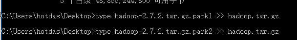{width="6.333333333333333in"
height="0.8645833333333334in"}

本章总结
========

通过本章内容学习，同学们学会了HDFS常见的Api操作（文件下载、上传、文件名更改、删除、判断是否是文件夹等），还学会了通过I/O流来实现文件的上传与下载，并且实现定位下载功能。
