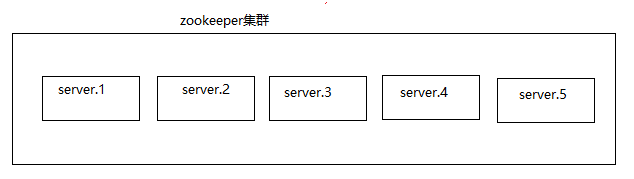

第五章：Zookeeper\
 {#第五章zookeeper .ListParagraph}
==================

课程安排
========

知识点1：zookeeper介绍

知识点2：zookeeper安装

知识点3：zookeeper内部原理

知识点4：zookeeper实践

zookeeper介绍
=============

什么是Zookeeper
---------------

ZooKeeper是一个分布式的，开放源码的分布式应用程序协调服务，是Google的Chubby一个开源的实现，是Hadoop和Hbase的重要组件。它是一个为分布式应用提供一致性服务的软件，提供的功能包括：配置维护、域名服务、分布式同步、组服务等。

ZooKeeper的目标就是封装好复杂易出错的关键服务，将简单易用的接口和性能高效、功能稳定的系统提供给用户。

ZooKeeper包含一个简单的原语集，提供Java和C的接口。

官方网站：[*http://zookeeper.apache.org/*](http://zookeeper.apache.org/)

{width="11.1875in"
height="6.322916666666667in"}

Zookeeper特点
-------------

{width="8.75in"
height="4.322916666666667in"}

1)  Zookeeper是由一个reader,多个follower组成的集群。

2)  Leader是由follower选举产生，Leader负载投票发起和决议，更新系统状态。

3)  Follower用于接收客户端的请求并返回结果，在leader的选举中参与投票。

4)  集群中只有半数以上的机器存活，集群才可以使用。

5)  整合集群中数据一致，每个serer会保存一个副本，无论客户端连接到哪个server，数据都是一致的。

6)  更新请求是按顺序执行。

7)  保证数据的原子性，一次更新成功要么是成功，要么是失败。

8)  数据的实时性，客户端在更新数据时，在一定的时间范围内，数据是一致的。

Zookeeper数据结构
-----------------

Zookeeper数据结构与unix文件系统的结构是一样的。整体可以看成一颗树，每颗树的节点称为一个znode.每个znode节点存储1M数据，每个znode节点有了一个唯一的访问路径。

{width="3.7916666666666665in"
height="2.4479166666666665in"}

应用场景
--------

统一命名服务、统一配置管理、统一集群配置、服务节点统一上下线、软负载均衡服务。

### 统一命名服务

在分布式的情况下，经常会对应用/服务进程进行统一命名，方便记忆。

{width="6.770833333333333in"
height="4.499384295713035in"}

### 统一配置管理

在分布式的环境，集群的配置文件一般要进行同步处理，如果能够统一一份配置，然后集群加载同一份配置文件，那么就可以轻松实现配置文件的同步功能。

{width="6.71875in"
height="4.197916666666667in"}

### 统一集群管理

{width="5.416666666666667in"
height="3.9583333333333335in"}

在分布式集群中，实时检测每个节点状态变化是必须的，可以交给zookeeper进行管理，通过监听这个zonde的变化实时的处理服务器集群。举例：hbase数据库使用zookeeper来实现监控与选举。

### 服务器的节点动态上下线

{width="5.541666666666667in"
height="4.78125in"}

客户端能够实时的洞察到服务器的上线与下线。

### 实现负载均衡

{width="7.53125in" height="3.8125in"}

Zookeeper安装
=============

下载
----

{width="3.3854166666666665in"
height="4.375in"}

单机版本安装
------------

### 上传安装包到linux

### 解压并改名

\[icss@hdp01 software\]\$ tar -zxvf zookeeper-3.4.14.tar.gz -C
/opt/module/

\[icss@hdp01 software\]\$ cd /opt/module/

\[icss@hdp01 module\]\$ mv zookeeper-3.4.14/ zookeeper

### 配置修改

\[icss@hdp01 zookeeper\]\$ cd conf/

\[icss@hdp01 conf\]\$ mv zoo\_sample.cfg zoo.cfg

\[icss@hdp01 zookeeper\]\$ mkdir /opt/module/zookeeper/data

\[icss@hdp01 zookeeper\]\$ vim conf/zoo.cfg

{width="8.78125in"
height="6.197916666666667in"}

### Zookeeper启动、关闭、查看状态

\[icss@hdp01 zookeeper\]\$ bin/zkServer.sh start/stop/status

{width="6.458333333333333in"
height="1.8958333333333333in"}

### 查看进程

{width="3.7395833333333335in"
height="0.7604166666666666in"}

Zookeeper配置文件解释
---------------------

Zoo.cfg文件：

1.  tickTime: 是zk通信心跳数，单位为豪秒。

2.  initLimit：Leader和follower初始化的时限。

3.  syncLimit：Leader与follower同步通信时限。

4.  dataDir：数据存储的目录

5.  clientPort：客户端连接端口

zookeeper的客户端操作
---------------------

### 启动客户端

\[icss@hdp01 zookeeper\]\$ bin/zkCli.sh

### 显示帮助

\[zk: localhost:2181(CONNECTED) 0\] help

### 创建节点

\[zk: localhost:2181(CONNECTED) 3\] create /user abc

### 获取节点的值

\[zk: localhost:2181(CONNECTED) 5\] get /user

### 修改节点的值 

\[zk: localhost:2181(CONNECTED) 6\] set /user 111111

### 创建临时节点

\[zk: localhost:2181(CONNECTED) 1\] create -e /user2 user2

说明：临时节点在退出客户端时消失。

### 删除节点

\[zk: localhost:2181(CONNECTED) 4\] rmr /user

分布式的安装
------------

### 解压zookeeper

\[icss@hdp01 software\]\$ tar -zxvf zookeeper-3.4.14.tar.gz -C
/opt/module/

\[icss@hdp01 software\]\$ cd /opt/module/

\[icss@hdp01 module\]\$ mv zookeeper-3.4.14/ zookeepe

### 创建data目录

\[icss@hdp01 zookeeper\]\$ mkdir /opt/module/zookeeper/data

### 更改配置文件名称

\[icss@hdp01 conf\]\$ mv zoo\_sample.cfg zoo.cfg

### 配置集群

\[icss@hdp01 zookeeper\]\$ vim conf/zoo.cfg

{width="7.791666666666667in"
height="5.072916666666667in"}

Server.N=H:P:O

N:是一个数字，表示为几号服务器。

H:服务器ip的主机名。

P:这个集群中leader服务器的通信端口。

O:用于选举leader时的内部通信端口。

### 修改服务器标识（三台服务器有三台不同的myid标识）

\[icss@hdp01 zookeeper\]\$ touch myid

\[icss@hdp01 zookeeper\]\$ echo 1 &gt;&gt; data/myid

### 同步集群

\[icss@hdp01 module\]\$ cprsync zookeeper/

### 更改myid的标识

\[icss@hdp02 zookeeper\]\$ echo 2 &gt; data/myid

\[icss@hdp03 zookeeper\]\$ echo 3 &gt; data/myid

### 启动集群

分别启动每台服务器zk:

\[icss@hdp03 zookeeper\]\$ bin/zkServer.sh start

分别查看每台服务器状态：

\[icss@hdp01 zookeeper\]\$ bin/zkServer.sh status

ZooKeeper JMX enabled by default

Using config: /opt/module/zookeeper/bin/../conf/zoo.cfg

Mode: follower

\[icss@hdp02 zookeeper\]\$ bin/zkServer.sh status

ZooKeeper JMX enabled by default

Using config: /opt/module/zookeeper/bin/../conf/zoo.cfg

Mode: leader

\[icss@hdp03 zookeeper\]\$ bin/zkServer.sh status

ZooKeeper JMX enabled by default

Using config: /opt/module/zookeeper/bin/../conf/zoo.cfg

Mode: follower

编写zk的shell脚本
-----------------

  ------------------------------------------------------------------------------------
  \#!/bin/bash
  
  massage="Use: \$0 (start|stop|status|restart)"
  
  if \[ \$\# -lt 1 \];then
  
  echo \$massage
  
  exit 1
  
  fi
  
  usecommon=\$1
  
  brokers="hdp01 hdp02 hdp03"
  
  ZK\_HOME="/opt/module/zookeeper"
  
  for broker in \$brokers
  
  do
  
  echo "-------\$usecommon zkServer cluster on \$broker-------------------------"
  
  ssh \$broker -C "source /etc/profile; sh \${ZK\_HOME}/bin/zkServer.sh \$usecommon"
  
  sleep 2s
  
  done
  
  exit 0
  ------------------------------------------------------------------------------------

Zookeeper内部原理
=================

选举机制
--------

Zookeeper选举机制两大原则：

1.  只有机器一半以上存活，才有选举机制。

2.  Myid数值大者有优先的领导权。

注意：整个集群当，必须有leader集群才能进行工作。

举例说明选举流程：

{width="6.604166666666667in"
height="1.8645833333333333in"}

1.  服务器1启动，此时只有一台服务器在启动，发出的报文没有任何的服务器进行响应，所以选举会处于一个Looking状态。

2.  服务器2启动，它与服务器1进行通信，互相交换选举结果，由于两者都没有历史数据，所以id值大的会胜出，但是由于集群没有达到半数以上，选举出来的服务器不生效，所有服务器处于Looking状态。

3.  服务器3启动，根据前面的分析，服务器3的id值比选举出来的2值大，所以此时3就是leader.注意现在的集群的存活数量已超过半。所有服务器不再处于Looking状态。

4.  服务器4启动，但是leader已经产生，那么此时的服务器4只能小弟（follower）

5.  服务器5启动，同4.

节点类型
--------

{width="5.166666666666667in"
height="2.3125in"}

### Znode节点的数据类型

短暂（ephemeral）: 客户端关闭时，节点的信息会自动删除。

持久（persistent）: 客户端关闭时，节点的信息不会自动删除 。

### Zonde节点四种形式（默认persistent）

1.  持久化目录节点（persistent）：客户端连接与否，该节点是存在的。

2.  持久化顺序编号的目录节点（persistent\_sequential）:客户端连接与否，该节点依然存在的，zk会对该节点进行顺序编号。

3.  临时节点（ephemeral）：客户端断开连接，该节点会删除。

4.  临时顺序编号节点（ephemeral\_sequential）：客户端关闭时，节点的信息会自动删除。但是zookeeper会给该节点进行顺序编号。

Stat结构体
----------

cZxid ：每次修改时会生成一个唯一的值，其实就是zookeeper事务id.

ctime : 被创建时产生的毫秒数。

mZxid ：最后更新Zxid

mtime ：最后修改毫秒数

pZxid：每次更新节点时，子节点会产生zxid

cversion : 使用版本号来记录更新的次数。

dataVersion ：数据的版本号

aclVersion ：访问控制列的变化号

ephemeralOwner ：如果是临时节点，这个节点拥有者是session
Id，如果不是临时节点，值为0

dataLength ：数据的长度

numChildren ：有多少个子节点

监听器原理
----------

{width="7.864583333333333in"
height="2.7291666666666665in"}

监听的流程：

1.  首先集群启动时，会有一个main线程。

2.  Main线程通过用户使用zkCli.sh客户端创建两个线程，一个是connect网络通信息的连接，另外一个是listener负责监听数据变化。

3.  通过connect线程将注册监听事件发送给zookeeper.

4.  Zookeeper接收到监听事件时，会把监听事件注册到监听列表中。

5.  Zookeeper监听的事件的路径或数据发生变化时，会把变化的消息发送给监听器。

6.  Listener接收到事件变化时会调用process对数据进行处理。

写数据流程
----------

{width="8.8125in" height="3.5in"}

Zookeeper实践
=============

Java客户端操作api
-----------------

### 创建工程

{width="7.427083333333333in"
height="6.0625in"}

{width="7.40625in"
height="6.010416666666667in"}

### 导入依赖

  -----------------------------------------------------------------------------------------------------------
  *&lt;?***xml version="1.0" encoding="UTF-8"***?&gt;\
  *&lt;**project xmlns="http://maven.apache.org/POM/4.0.0"\
  xmlns:xsi="http://www.w3.org/2001/XMLSchema-instance"\
  xsi:schemaLocation="http://maven.apache.org/POM/4.0.0 http://maven.apache.org/xsd/maven-4.0.0.xsd"**&gt;\
  &lt;**modelVersion**&gt;4.0.0&lt;/**modelVersion**&gt;\
  \
  &lt;**groupId**&gt;com.icss&lt;/**groupId**&gt;\
  &lt;**artifactId**&gt;zkapi&lt;/**artifactId**&gt;\
  &lt;**version**&gt;1.0-SNAPSHOT&lt;/**version**&gt;\
  \
  \
  &lt;**dependencies**&gt;\
  *&lt;!--单元测试依赖--&gt;\
  *&lt;**dependency**&gt;\
  &lt;**groupId**&gt;junit&lt;/**groupId**&gt;\
  &lt;**artifactId**&gt;junit&lt;/**artifactId**&gt;\
  &lt;**version**&gt;4.12&lt;/**version**&gt;\
  &lt;**scope**&gt;test&lt;/**scope**&gt;\
  &lt;/**dependency**&gt;\
  \
  *&lt;!-- 导入zk依赖--&gt;\
  *&lt;**dependency**&gt;\
  &lt;**groupId**&gt;org.apache.zookeeper&lt;/**groupId**&gt;\
  &lt;**artifactId**&gt;zookeeper&lt;/**artifactId**&gt;\
  &lt;**version**&gt;3.4.14&lt;/**version**&gt;\
  &lt;/**dependency**&gt;\
  \
  *&lt;!--日志依赖--&gt;\
  *&lt;**dependency**&gt;\
  &lt;**groupId**&gt;log4j&lt;/**groupId**&gt;\
  &lt;**artifactId**&gt;log4j&lt;/**artifactId**&gt;\
  &lt;**version**&gt;1.2.16&lt;/**version**&gt;\
  &lt;/**dependency**&gt;\
  \
  &lt;**dependency**&gt;\
  &lt;**groupId**&gt;org.slf4j&lt;/**groupId**&gt;\
  &lt;**artifactId**&gt;slf4j-api&lt;/**artifactId**&gt;\
  &lt;**version**&gt;1.6.1&lt;/**version**&gt;\
  &lt;/**dependency**&gt;\
  \
  \
  &lt;/**dependencies**&gt;\
  &lt;/**project**&gt;
  -----------------------------------------------------------------------------------------------------------

### 导入log4.properties

{width="3.0520833333333335in"
height="2.8125in"}

### 创建zk客户端

  ------------------------------------------------------------------------------------------
  **public class** ZKApiClient {\
  \
  **private static** String *connectString* =**"hdp01:2181,hdp02:2181,hdp03:2181"**;\
  \
  **private static int** *sessionTimeOut*=2000;\
  \
  **private** ZooKeeper **zkClient**;\
  \
  \
  \
  *//在运行前获取zkClient\
  *@Before\
  **public void** init() **throws** Exception{\
  \
  **zkClient** = **new** ZooKeeper(*connectString*, *sessionTimeOut*, **new** Watcher() {\
  **public void** process(WatchedEvent watchedEvent) {\
  *//收到事件通知后回调函数\
  *System.***out***.println(watchedEvent.getType()+**"---"**+watchedEvent.getPath());\
  \
  *//设置监听\
  \
  ***try** {\
  **zkClient**.getChildren(**"/"**,**true**);\
  } **catch** (Exception e) {\
  e.printStackTrace();\
  }\
  \
  }\
  });\
  \
  }\
  \
  \
  \
  \
  }
  ------------------------------------------------------------------------------------------

### 创建子节点

  --------------------------------------------------------------------------------------------------------------------------------
  */\*\*\
  \* 创建子节点\
  \*/\
  *@Test\
  **public void** textCreate() **throws** Exception {\
  \
  *//参数： 1.要创建节点的路径，2.节点数据，3.节点的权限 4.节点的类型\
  ***zkClient**.create(**"/idea"**,**"ideatest"**.getBytes(), ZooDefs.Ids.***OPEN\_ACL\_UNSAFE***,CreateMode.***PERSISTENT***);\
  \
  }
  --------------------------------------------------------------------------------------------------------------------------------

### 获取子节点并监听

  -----------------------------------------------------------------------------
  */\*\*\
  \* 获取子节点并监听\
  \*/\
  *@Test\
  **public void** getChildren() **throws** Exception{\
  List&lt;String&gt; children = **zkClient**.getChildren(**"/"**, **true**);\
  **for** (String child: children){\
  System.***out***.println(child);\
  }\
  \
  *//阻塞\
  *Thread.*sleep*(Long.***MAX\_VALUE***);\
  \
  }
  -----------------------------------------------------------------------------

### 判断节点是否存在

  --------------------------------------------------------------------
  */\*\*\
  \* 判断节点是否存在\
  \*/\
  *@Test\
  **public void** znodeExist() **throws** Exception{\
  \
  Stat stat = **zkClient**.exists(**"/idea1"**, **false**);\
  \
  System.***out***.println(stat==**null**?**"不存在"**:**"存在"**);\
  }
  --------------------------------------------------------------------

本章总结
========

通过本章学习，同学们学会了安装zookeeper分布式集群，并且理解zookeeper的内部原理及应用场景。
