第七章：Hadoop-I/O\
 {#第七章hadoop-io .ListParagraph}
===================

课程安排
========

知识点1： 序列化介绍

知识点2： java序列化机制

知识点3: hadoop序列化原理

知识点4：常见的序列化类型

知识点5：writable类、compalare、writablecompalare类

知识点6：hadoop数据压缩

序列化介绍
==========

什么是序列化
------------

序列化把内存中的对，转换成字节序列，方便进行存储与网络传输。

反序列化就是装字节序列，转换成内存对象，方便进行数据的持久化。

为什么要实现序列化
------------------

一般来说：“活的”对象只存在内存中，关机或断电就没有了。“活的”对象只能在本地计算机上使用，不能被发送到网络上的另外一台计算机，为了传输到另外一台计算机，必须
把当前有“活的”对象，发送到运程计算机中。

为什么不使用java序列化
----------------------

Java序列化是一个重量级的序列化框架。一个对象被序列化后，会附带很多无有用的信息（各种校验信息、header、继承体系），不方便进行网络中传输。所以，在hadoop中自已开发了一套序列化机制。

Hadoop序列化特点：

1.紧凑：紧凑序列化格式方便在网络上传输，带宽的可以最有效的使用起来。

2.快速:
在相同时间和相同带宽的情况下，减少了序列化资源的大小，传输速度比较快。

3.可扩展： 协议传输，定义新的协议（为了满足自已的序列化特征进行打造）。

4.互操作： 能支持不同语言对客户端与服务端进行交互。

java序列化原理
==============

java序列化对象到磁盘
--------------------

### JDKSerializeExample

  ---------------------------------------------------------------------------------------------------------------------------
  **import** java.io.FileOutputStream;\
  **import** java.io.ObjectOutputStream;\
  \
  **public class** JDKSerializeExample {\
  \
  *//把对象序列化到磁盘\
  ***public static void** main(String\[\] args) **throws** Exception{\
  \
  *//会员对象\
  *Member member = **new** Member(**"张三"**,20,**true**,20000);\
  \
  *//把对象序列化到磁盘\
  *ObjectOutputStream objectOutputStream = **new** ObjectOutputStream(**new** FileOutputStream(**"d:/test/member.obj"**));\
  \
  *//输出对象信息到文件中\
  *objectOutputStream.writeObject(member);\
  \
  *//关闭\
  *objectOutputStream.close();\
  \
  }\
  }
  ---------------------------------------------------------------------------------------------------------------------------

### Member对象

  ---------------------------------------------------------------------------------------
  **public class** Member {\
  \
  **private** String **name**;\
  **private int age**;\
  **private boolean marray**;\
  **private double sallay**;\
  \
  **public** Member(String name, **int** age, **boolean** marray, **double** sallay) {\
  **this**.**name** = name;\
  **this**.**age** = age;\
  **this**.**marray** = marray;\
  **this**.**sallay** = sallay;\
  }\
  \
  **public** String getName() {\
  **return name**;\
  }\
  \
  **public void** setName(String name) {\
  **this**.**name** = name;\
  }\
  \
  **public int** getAge() {\
  **return age**;\
  }\
  \
  **public void** setAge(**int** age) {\
  **this**.**age** = age;\
  }\
  \
  **public boolean** isMarray() {\
  **return marray**;\
  }\
  \
  **public void** setMarray(**boolean** marray) {\
  **this**.**marray** = marray;\
  }\
  \
  **public double** getSallay() {\
  **return sallay**;\
  }\
  \
  **public void** setSallay(**double** sallay) {\
  **this**.**sallay** = sallay;\
  }\
  }
  ---------------------------------------------------------------------------------------

### 运行报错

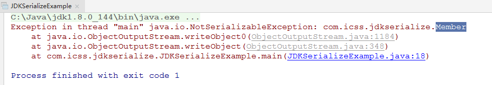{width="10.010416666666666in"
height="1.7291666666666667in"}

### 解决方法

*//Serializable只是一个标注,用于标识该对象允许被序列化\
***public class** Member **implements** Serializable

Java序列化对象到另一台计算机
----------------------------

### 开发接收对象的服务端

  --------------------------------------------------------------------------------
  **import** java.io.InputStream;\
  **import** java.io.ObjectInputStream;\
  **import** java.io.ObjectOutputStream;\
  **import** java.net.ServerSocket;\
  **import** java.net.Socket;\
  \
  *//接收网络对象的服务端\
  ***public class** JDKSerializeSocketServer {\
  \
  **public static void** main(String\[\] args) **throws** Exception{\
  \
  ServerSocket serverSocket = **new** ServerSocket(9999);\
  Socket socket = serverSocket.accept();\
  \
  InputStream inputStream = socket.getInputStream();\
  \
  ObjectInputStream objectInputStream = **new** ObjectInputStream(inputStream);\
  \
  Member member =(Member) objectInputStream.readObject();\
  \
  System.***out***.println(member.getName());\
  \
  \
  *//关闭\
  *objectInputStream.close();\
  inputStream.close();\
  \
  }\
  }
  --------------------------------------------------------------------------------

### 开发发送对象的客户端

  ------------------------------------------------------------------------------------
  **public class** JDKSerializeSocketClient {\
  *//把对象传给网络另一个程序\
  ***public static void** main(String\[\] args) **throws** Exception{\
  \
  *//会员对象\
  *Member member = **new** Member(**"张三"**,20,**true**,20000);\
  \
  *//把对象传给网络另一个程序\
  *Socket socket = **new** Socket(**"localhost"**,9999);\
  \
  OutputStream outputStream = socket.getOutputStream();\
  \
  ObjectOutputStream objectOutputStream = **new** ObjectOutputStream(outputStream);\
  \
  objectOutputStream.writeObject(member);\
  \
  \
  *//关闭\
  *objectOutputStream.close();\
  socket.close();\
  \
  }\
  }
  ------------------------------------------------------------------------------------

自定义序列化不使用java序列化实现对象到磁盘
------------------------------------------

### 自定义对象序列化到磁盘

  --------------------------------------------------------------------------------------------
  **public class** CustomSerializeExample {\
  \
  **public static void** main(String\[\] args) **throws** Exception {\
  *//会员对象\
  *Member member = **new** Member(**"张三"**,20,**true**,20000);\
  \
  FileOutputStream fileOutputStream = **new** FileOutputStream(**"d:/test/mymember.obj"**);\
  \
  *//DataOutputStream可以帮我们把各种编码(包括字符串)按照对应的编码机制进行编码\
  *DataOutputStream dataOutputStream = **new** DataOutputStream(fileOutputStream);\
  \
  dataOutputStream.writeUTF(member.getName());\
  dataOutputStream.writeInt(member.getAge());\
  dataOutputStream.writeBoolean(member.isMarray());\
  dataOutputStream.writeDouble(member.getSallay());\
  \
  dataOutputStream.close();\
  fileOutputStream.close();\
  \
  }\
  }
  --------------------------------------------------------------------------------------------

### 测试结果

通过对比JDK的序列化,自定义的序列化大小远远小于jdk的序列化对象大小.

### 自定义反序列化

  ------------------------------------------------------------------------------------------
  *//反序列化\
  ***public class** CustomDeserializeExample {\
  \
  **public static void** main(String\[\] args) **throws** Exception {\
  \
  *//读取自定义的序列化文件\
  *FileInputStream fileInputStream = **new** FileInputStream(**"d:/test/mymember.obj"**);\
  \
  *//DataInputStream可以帮我们把各种编码(包括字符串)按照对应的编码机制进行解码\
  *DataInputStream dataInputStream = **new** DataInputStream(fileInputStream);\
  \
  String name = dataInputStream.readUTF();\
  **int** age = dataInputStream.readInt();\
  **boolean** marray = dataInputStream.readBoolean();\
  \
  System.***out***.println(**"name="**+name+**", age="**+age+**", marray="**+marray);\
  \
  dataInputStream.close();\
  fileInputStream.close();\
  \
  }\
  }
  ------------------------------------------------------------------------------------------

### 测试结果

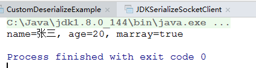{width="4.40625in"
height="1.1770833333333333in"}

Hadoop的序列化类型
==================

Java常见的类型对应hadoop的类型:

  Java类型   Hadoop的Writable类型
  ---------- ----------------------
  Boolean    BooleanWriable
  byte       byteWritable
  Int        IntWritable
  float      FloatWritable
  long       LongWritable
  double     DoubleWritable
  String     Text
  map        MapWritable
  array      ArrayWritable

MapReduce入门
=============

MapReduce定义
-------------

MapReduce是一个分布式运算程序的编程框架,用于开发数据分析,它也是”hadoop运算的核心”框架!

MapReduce核心功能是一个运行在hadoop集群上的一个数据分析编程框架,将用户的编程的逻辑代码结合自已自带的核心组件,这些核心组件大大的降低用户在分布式运算中处理的问题.

MapReduce优缺点
---------------

### 优点

1.  MapReduce易于编程.它是一个实现了大部分业务的运算框架调度问题,可以运行在低廉的设备.也就是一个分布式程序.

2.  良好的扩展性,当机器不能满足统计业务时,可以通过添加机器的方式来提高运算业务.

3.  高容错性,MapReduce的实现了高容错性,通过一台计算机无法计算结果时,对业务分析的任务可以进行重新分配,直到任务完成.

4.  适合PB级的数据的离线计算处理.MapReduce很难做到豪秒级返回结果,它处理的效率达不到实时的效果.

### 缺点

MapReduce不擅长做实时运算或流式处理,DAG(有向图) 计算.

MapReduce编程的核心思想
-----------------------

面试题: 如何在1M内存的计算机上,统计1G的数据?

MapReduce编程的核心思想分为两个阶段:

阶段1.把大任务分成一个个小任务分配到不同的计算机进行并行运算的过程,这个过程称为MapTask阶段(把小任务分别计算的过程)。

阶段2.对结果进行汇总输入阶段,ReduceTask阶段(把MapTask分析的结果进行汇总阶段)

MapReduce概要的执行过程
-----------------------

### 分析MapReduce总体执行过程

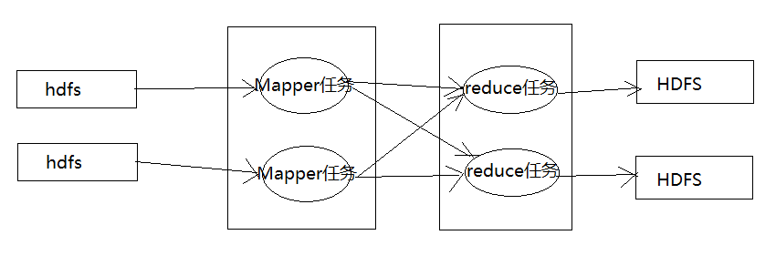{width="8.854166666666666in"
height="3.0416666666666665in"}

MapReduce运行的时候，通过Mapper运行任务读取HDFS中的数据文件，然后调用自已的方法，处理数据，最后进行输出。Reduce任务会接收Mapper输出数据，把Mapper的输出的数据作为自已输入的数据，调用自已的方法，最后把结果输出到HDFS文件中。

### Mapper的执行流程

每个Mapper任务是一个java进程，它会读取HDFS中的文件
，解释成很多的键值对，经过map方法处理后，转换成很多的键值对进行输出，整个mapper过程可以分为几个重要的阶段：

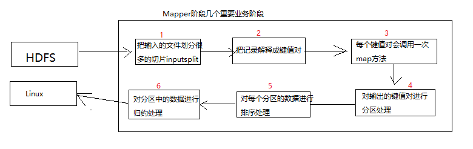{width="8.125in" height="2.5625in"}

1.  第一阶段是把输入的文件按照一定的标准分片（inputsplit）,每个输入片的大小是固定的。

2.  第二阶段是对输入的切片解释成键值对，“键”是每一行起始位置，“值”是每一行的文本内容。

3.  第三阶段是调用Mapper中的map方法，有多少个键值对就会调用多少次map方法。每次调用map方法，会输出零个或者多个键值对。

4.  第四阶段是按照一定的规则对第三阶段的输出的键值对进行分区。分区的数量就是reduce运行的任务数。

5.  第五阶段是按照 一定规则对分区中的数据进行排序。

6.  第軣阶段对数据进行归约处理，相当于局部汇总数据。

### Reduce任务执行流程

每个Reducer任务是一个java进程。Reducer任务会接收Mapper端的输出，处理归约后写入到hdfs中。

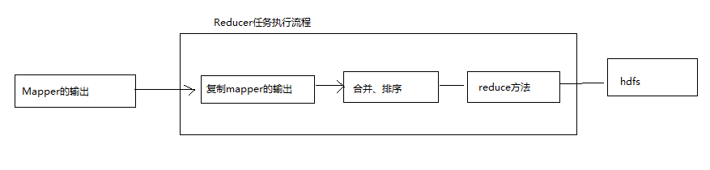{width="9.135416666666666in"
height="2.1875in"}

1.  第一个阶段是Reduce会从Mapper主动复制键值对。

2.  第二阶段是把复制的本地数据，全部进行合并处理（把分散的数据合并在一起），进行排序操作。

3.  第三阶段是对排序后的键值对调用reduce方法进行合并，键相同的会调用一次reduce方法，每次调用会产生结果。最终把结果输出到HDFS文件中。

总结：在使用MapReduce进行数据分析时，大部分的工作是覆盖map方法和reduce方法。

单词统计入门案例
----------------

需求：有一个流量数据的单词文本words.txt,要求统计输出每个单词出现的次数。

### 数据准备

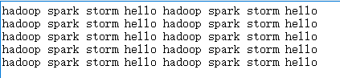{width="4.40625in"
height="1.0104166666666667in"}

### 分析数据

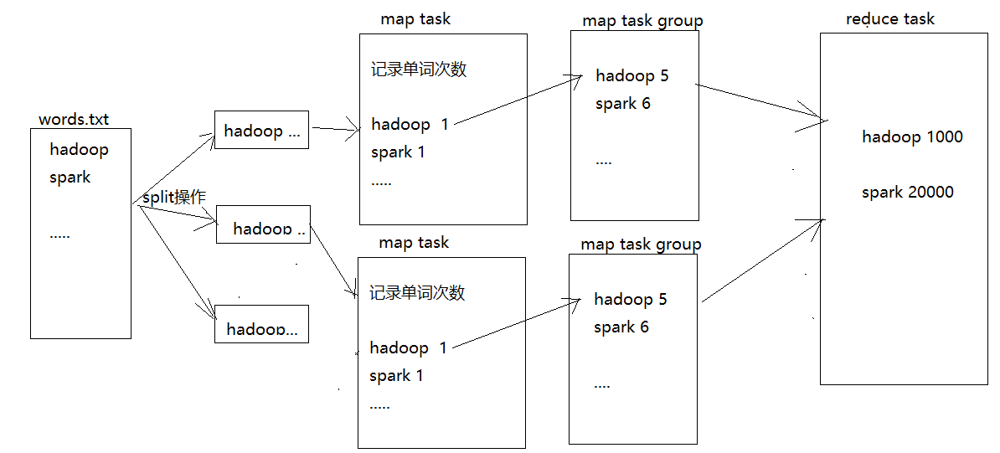{width="8.32223097112861in"
height="3.7707928696412947in"}

### 创建maven工程

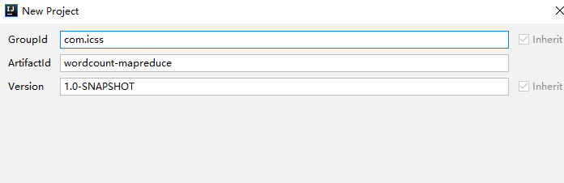{width="7.25in"
height="2.3541666666666665in"}

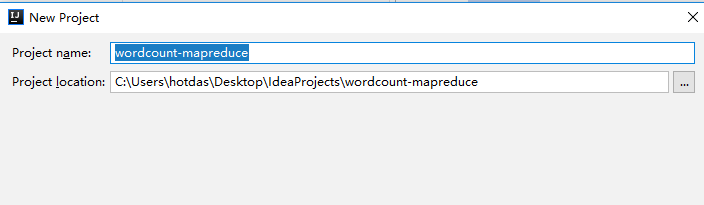{width="7.333333333333333in"
height="2.1354166666666665in"}

### 导入依赖

  -----------------------------------------------------------------------------------------------------------
  *&lt;?***xml version="1.0" encoding="UTF-8"***?&gt;\
  *&lt;**project xmlns="http://maven.apache.org/POM/4.0.0"\
  xmlns:xsi="http://www.w3.org/2001/XMLSchema-instance"\
  xsi:schemaLocation="http://maven.apache.org/POM/4.0.0 http://maven.apache.org/xsd/maven-4.0.0.xsd"**&gt;\
  &lt;**modelVersion**&gt;4.0.0&lt;/**modelVersion**&gt;\
  \
  &lt;**groupId**&gt;com.icss&lt;/**groupId**&gt;\
  &lt;**artifactId**&gt;wordcount-mapreduce&lt;/**artifactId**&gt;\
  &lt;**version**&gt;1.0-SNAPSHOT&lt;/**version**&gt;\
  \
  &lt;**dependencies**&gt;\
  *&lt;!-- 单元测试依赖 --&gt;\
  *&lt;**dependency**&gt;\
  &lt;**groupId**&gt;junit&lt;/**groupId**&gt;\
  &lt;**artifactId**&gt;junit&lt;/**artifactId**&gt;\
  &lt;**version**&gt;RELEASE&lt;/**version**&gt;\
  &lt;**scope**&gt;test&lt;/**scope**&gt;\
  &lt;/**dependency**&gt;\
  \
  *&lt;!-- 日志核心依赖 --&gt;\
  *&lt;**dependency**&gt;\
  &lt;**groupId**&gt;org.apache.logging.log4j&lt;/**groupId**&gt;\
  &lt;**artifactId**&gt;log4j-core&lt;/**artifactId**&gt;\
  &lt;**version**&gt;2.8.2&lt;/**version**&gt;\
  &lt;/**dependency**&gt;\
  \
  *&lt;!-- hadoop-common 依赖--&gt;\
  *&lt;**dependency**&gt;\
  &lt;**groupId**&gt;org.apache.hadoop&lt;/**groupId**&gt;\
  &lt;**artifactId**&gt;hadoop-common&lt;/**artifactId**&gt;\
  &lt;**version**&gt;2.7.2&lt;/**version**&gt;\
  &lt;/**dependency**&gt;\
  \
  *&lt;!-- hadoop-client 依赖--&gt;\
  *&lt;**dependency**&gt;\
  &lt;**groupId**&gt;org.apache.hadoop&lt;/**groupId**&gt;\
  &lt;**artifactId**&gt;hadoop-client&lt;/**artifactId**&gt;\
  &lt;**version**&gt;2.7.2&lt;/**version**&gt;\
  &lt;/**dependency**&gt;\
  \
  *&lt;!--导入HDFS依赖--&gt;\
  *&lt;**dependency**&gt;\
  &lt;**groupId**&gt;org.apache.hadoop&lt;/**groupId**&gt;\
  &lt;**artifactId**&gt;hadoop-hdfs&lt;/**artifactId**&gt;\
  &lt;**version**&gt;2.7.2&lt;/**version**&gt;\
  &lt;/**dependency**&gt;\
  \
  \
  \
  &lt;/**dependencies**&gt;\
  \
  &lt;/**project**&gt;
  -----------------------------------------------------------------------------------------------------------

### 导入 log4j配置文件 

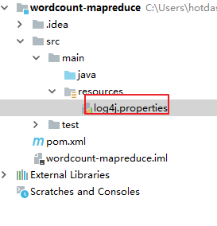{width="2.84375in"
height="2.9583333333333335in"}

### 编写mapper类

1.必须继承Mapper&lt;输入的key,输入value,输出key,输出value&gt;

2.必须使用Hadoop序列化类型

  -----------------------------------------------------------------------------------------------------------------------
  **public class** WordCountMapper **extends** Mapper&lt;LongWritable, Text,Text, IntWritable&gt; {\
  Text **k** = **new** Text();\
  IntWritable **v** = **new** IntWritable(1);\
  \
  @Override\
  **protected void** map(LongWritable key, Text value, Context context) **throws** IOException, InterruptedException {\
  *//1.获取一行\
  *String line = value.toString();\
  \
  *//2.切割单词\
  *String\[\] words = line.split(**" "**);\
  \
  *//3.输出\
  ***for** (String word: words){\
  **k**.set(word);\
  context.write(**k**,**v**);\
  }\
  }\
  }
  -----------------------------------------------------------------------------------------------------------------------

### 编写reduce

必须继承Reducer&lt;Text,IntWritable,Text,IntWritable&gt;

必须使用hadoop序列化类

  ------------------------------------------------------------------------------------------------------------------------------------------
  **public class** WordCountReducer **extends** Reducer&lt;Text,IntWritable,Text, IntWritable&gt; {\
  \
  **int sum**;\
  IntWritable **v** = **new** IntWritable();\
  \
  @Override\
  **protected void** reduce(Text key, Iterable&lt;IntWritable&gt; values, Context context) **throws** IOException, InterruptedException {\
  *//1.累加\
  ***sum** =0;\
  **for** (IntWritable count:values){\
  **sum** +=count.get();\
  }\
  \
  \
  \
  *//2.输出\
  ***v**.set(**sum**);\
  context.write(key,**v**);\
  }\
  }
  ------------------------------------------------------------------------------------------------------------------------------------------

### 编写驱动类

  ----------------------------------------------------------------------
  **public class** WordCountDriver {\
  \
  **public static void** main(String\[\] args) **throws** Exception {\
  *//1.获取配置信息和封装job任务\
  *Configuration configuration = **new** Configuration();\
  Job job = Job.*getInstance*(configuration);\
  \
  *//2.设置jar加载路径\
  *job.setJarByClass(WordCountDriver.**class**);\
  \
  *//3.设置mapper和reducer的类\
  *job.setMapperClass(WordCountMapper.**class**);\
  job.setReducerClass(WordCountReducer.**class**);\
  \
  \
  *//4.设置mapper的输出类型\
  *job.setMapOutputKeyClass(Text.**class**);\
  job.setMapOutputValueClass(IntWritable.**class**);\
  \
  \
  *//5.设置reducer的输出类型\
  *job.setOutputKeyClass(Text.**class**);\
  job.setOutputValueClass(IntWritable.**class**);\
  \
  *//6.设置输入和输出路径\
  *FileInputFormat.*setInputPaths*(job,**new** Path(args\[0\]));\
  FileOutputFormat.*setOutputPath*(job,**new** Path(args\[1\]));\
  \
  *//7.提交任务\
  ***boolean** result = job.waitForCompletion(**true**);\
  \
  System.*exit*(result? 0 : 1);\
  \
  \
  \
  }\
  }
  ----------------------------------------------------------------------

本地测试 
---------

1.  在windows中配置HADOOP\_HOME环境变量

2.  在idea工具中直接调试

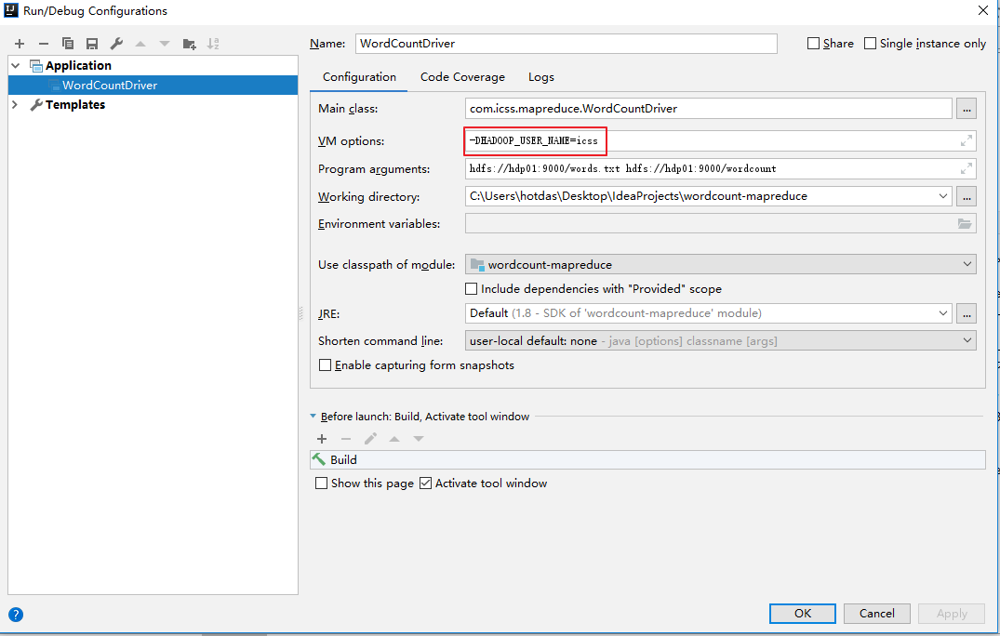{width="11.197916666666666in"
height="7.125in"}

1.  查看统计结果

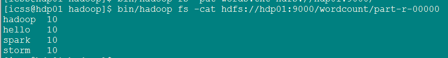{width="9.40625in"
height="1.2291666666666667in"}

在集群上进行测试
----------------

### 添加build环境依赖

  --------------------------------------------------------------------------------
  &lt;**build**&gt;\
  &lt;**plugins**&gt;\
  &lt;**plugin**&gt;\
  &lt;**artifactId**&gt;maven-compiler-plugin&lt;/**artifactId**&gt;\
  &lt;**version**&gt;2.3.2&lt;/**version**&gt;\
  &lt;**configuration**&gt;\
  &lt;**source**&gt;1.8&lt;/**source**&gt;\
  &lt;**target**&gt;1.8&lt;/**target**&gt;\
  &lt;/**configuration**&gt;\
  &lt;/**plugin**&gt;\
  &lt;**plugin**&gt;\
  &lt;**artifactId**&gt;maven-assembly-plugin &lt;/**artifactId**&gt;\
  &lt;**configuration**&gt;\
  &lt;**descriptorRefs**&gt;\
  &lt;**descriptorRef**&gt;jar-with-dependencies&lt;/**descriptorRef**&gt;\
  &lt;/**descriptorRefs**&gt;\
  &lt;**archive**&gt;\
  &lt;**manifest**&gt;\
  &lt;**mainClass**&gt;com.icss.mapreduce.WordCountDriver&lt;/**mainClass**&gt;\
  &lt;/**manifest**&gt;\
  &lt;/**archive**&gt;\
  &lt;/**configuration**&gt;\
  &lt;**executions**&gt;\
  &lt;**execution**&gt;\
  &lt;**id**&gt;make-assembly&lt;/**id**&gt;\
  &lt;**phase**&gt;package&lt;/**phase**&gt;\
  &lt;**goals**&gt;\
  &lt;**goal**&gt;single&lt;/**goal**&gt;\
  &lt;/**goals**&gt;\
  &lt;/**execution**&gt;\
  &lt;/**executions**&gt;\
  &lt;/**plugin**&gt;\
  &lt;/**plugins**&gt;\
  &lt;/**build**&gt;
  --------------------------------------------------------------------------------

### 打包程序并上传到集群中

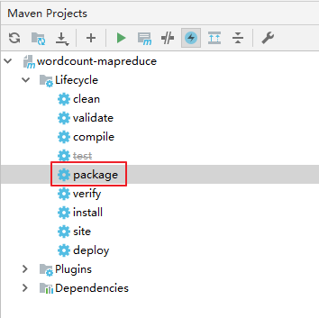{width="3.6875in"
height="3.6770833333333335in"}

### 在集群上运行程序

\[icss@hdp01 software\]\$ hadoop jar
wordcount-mapreduce-1.0-SNAPSHOT-jar-with-dependencies.jar
hdfs://hdp01:9000/words.txt hdfs://hdp01:9000/wordcount2

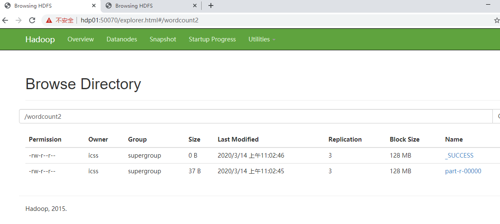{width="12.322916666666666in"
height="5.520833333333333in"}

自定义bean实现序列化排序案例
============================

说明：Writable
是hadoop的序列化接口类，Comparable是hadoop中实现自定义比较的接口，WritableComparable可以自定义实现序列化排序。

业务需求
--------

需求：
在电信行业中，采集了大量的手机数据，统计每个手机号总上传流量，下载流量，总流量。

数据格式：

1363157993055 13560436666 C4-17-FE-BA-DE-D9:CMCC 120.196.100.99 18 15
1116 954 200

输出的数据格式：

13560436666 1116 954 2017

手机号码 上传流量 下载流量 总流量

思路分析
--------

### Map阶段

1.  读取每行数据，切分数据。

2.  抽取手机号 上传流量 下载流量

3.  以手机号作为key，自定义Bean对象作为value输出。

### Reduce阶段

1.  累加上传流量和下载流量，求得总流量

2.  自定义Bean对象，并且把bean对象作为key传输。

3.  MapReduce程序在处理数据的过程中，会对数据进行排序，排序的依据就是map端输出的key.如果要实现自已排序的规则，考虑排序的因素放入key,在key实现排序的方法。

编写程序
--------

### 自定义Bean

+-----------------------------------------------------------------------+
| **package** com.icss.sortmapreduce;\                                  |
| \                                                                     |
| **import** org.apache.hadoop.io.Writable;\                            |
| \                                                                     |
| **import** java.io.DataInput;\                                        |
| **import** java.io.DataOutput;\                                       |
| **import** java.io.IOException;\                                      |
| \                                                                     |
| **public class** FlowBean **implements** Writable {\                  |
| \                                                                     |
| **private long upFlow**;*//上传流量\                                  |
| ***private long downFlow**;*//下载流量\                               |
| ***private long sumFlow**;*//总流量\                                  |
| \                                                                     |
| ***public** FlowBean() {\                                             |
| }\                                                                    |
| \                                                                     |
| **public** FlowBean(**long** upFlow, **long** downFlow) {\            |
| **this**.**upFlow** = upFlow;\                                        |
| **this**.**downFlow** = downFlow;\                                    |
| **this**.**sumFlow** = upFlow+downFlow;\                              |
| }                                                                     |
|                                                                       |
| **public long** getUpFlow() {\                                        |
| **return upFlow**;\                                                   |
| }\                                                                    |
| \                                                                     |
| **public void** setUpFlow(**long** upFlow) {\                         |
| **this**.**upFlow** = upFlow;\                                        |
| }\                                                                    |
| \                                                                     |
| **public long** getDownFlow() {\                                      |
| **return downFlow**;\                                                 |
| }\                                                                    |
| \                                                                     |
| **public void** setDownFlow(**long** downFlow) {\                     |
| **this**.**downFlow** = downFlow;\                                    |
| }\                                                                    |
| \                                                                     |
| **public long** getSumFlow() {\                                       |
| **return sumFlow**;\                                                  |
| }\                                                                    |
| \                                                                     |
| **public void** setSumFlow(**long** sumFlow) {\                       |
| **this**.**sumFlow** = sumFlow;\                                      |
| }\                                                                    |
| \                                                                     |
| *//写序列化的方法\                                                    |
| *@Override\                                                           |
| **public void** write(DataOutput out) **throws** IOException {\       |
| out.writeLong(**upFlow**);\                                           |
| out.writeLong(**downFlow**);\                                         |
| out.writeLong(**sumFlow**);\                                          |
| }\                                                                    |
| \                                                                     |
| *//反序列化方法\                                                      |
| *@Override\                                                           |
| **public void** readFields(DataInput in) **throws** IOException {\    |
| **this**.**upFlow** = in.readLong();\                                 |
| **this**.**downFlow** =in.readLong();\                                |
| **this**.**sumFlow** = in.readLong();\                                |
| }\                                                                    |
| \                                                                     |
| @Override\                                                            |
| **public** String toString() {\                                       |
| **return "FlowBean{"** +\                                             |
| **"upFlow="** + **upFlow** +\                                         |
| **", downFlow="** + **downFlow** +\                                   |
| **", sumFlow="** + **sumFlow** +\                                     |
| **'}'**;\                                                             |
| }\                                                                    |
| }                                                                     |
+-----------------------------------------------------------------------+

### 编写Mapper

  -----------------------------------------------------------------------------------------------------------------------
  **public class** FlowCountMapper **extends** Mapper&lt;LongWritable, Text,Text,FlowBean&gt; {\
  \
  Text **k** = **new** Text();\
  \
  \
  @Override\
  **protected void** map(LongWritable key, Text value, Context context) **throws** IOException, InterruptedException {\
  *//1.获取一行数数据\
  *String line = value.toString();\
  \
  *//2.切割字段\
  *String\[\] split = line.split(**"\\t"**);\
  \
  *//3.获取需要的字段数据\
  *String phoneNum = split\[1\];*//手机号码\
  ***long** upFlow = Long.*parseLong*(split\[split.**length**-3\]);*//上传流量\
  ***long** downFlow = Long.*parseLong*(split\[split.**length**-2\]);*//下载流量\
  \
  //4.输出\
  *context.write(**new** Text(phoneNum),**new** FlowBean(upFlow,downFlow));\
  \
  }\
  }
  -----------------------------------------------------------------------------------------------------------------------

### 编写Reducer

  ---------------------------------------------------------------------------------------------------------------------------------------
  **public class** FlowCountReducer **extends** Reducer&lt;Text,FlowBean,Text,FlowBean&gt; {\
  \
  @Override\
  **protected void** reduce(Text key, Iterable&lt;FlowBean&gt; values, Context context) **throws** IOException, InterruptedException {\
  **long** sum\_upFlow=0;\
  **long** sum\_downFlow=0;\
  \
  \
  *//累加上传流量和下载流量\
  ***for** (FlowBean flowBean :values){\
  sum\_upFlow += flowBean.getUpFlow();\
  sum\_downFlow +=flowBean.getDownFlow();\
  }\
  \
  *//封装对象\
  *FlowBean bean = **new** FlowBean(sum\_upFlow,sum\_downFlow);\
  \
  *//输出\
  *context.write(key,bean);\
  }\
  }
  ---------------------------------------------------------------------------------------------------------------------------------------

### 编写驱动

  ----------------------------------------------------------------------
  **public class** FlowCountDriver {\
  \
  **public static void** main(String\[\] args) **throws** Exception {\
  \
  *//1.获取配置信息和封装job任务\
  *Configuration configuration = **new** Configuration();\
  Job job = Job.*getInstance*(configuration);\
  \
  *//2.设置jar加载路径\
  *job.setJarByClass(FlowCountDriver.**class**);\
  \
  *//3.设置mapper和reducer的类\
  *job.setMapperClass(FlowCountMapper.**class**);\
  job.setReducerClass(FlowCountReducer.**class**);\
  \
  \
  *//4.设置mapper的输出类型\
  *job.setMapOutputKeyClass(Text.**class**);\
  job.setMapOutputValueClass(FlowBean.**class**);\
  \
  \
  *//5.设置reducer的输出类型\
  *job.setOutputKeyClass(Text.**class**);\
  job.setOutputValueClass(FlowBean.**class**);\
  \
  *//6.设置输入和输出路径\
  *FileInputFormat.*setInputPaths*(job,**new** Path(args\[0\]));\
  FileOutputFormat.*setOutputPath*(job,**new** Path(args\[1\]));\
  \
  *//7.提交任务\
  ***boolean** result = job.waitForCompletion(**true**);\
  \
  System.*exit*(result? 0 : 1);\
  \
  \
  }\
  }
  ----------------------------------------------------------------------

Hadoop数据压缩
==============

数据压缩介绍
------------

压缩技术能够有效减少底层存储系统（HDFS）读写字节数。压缩提高了网络带宽和磁盘空间的效率。在Hadoop下，尤其是数据规模很大和工作负载密集的情况下，使用数据压缩显得非常重要。在这种情况下，I/O操作和网络数据传输要花大量的时间。还有，Shuffle与Merge过程同样也面临着巨大的I/O压力。

鉴于磁盘I/O和网络带宽是Hadoop的宝贵资源，数据压缩对于节省资源、最小化磁盘I/O和网络传输非常有帮助。不过，尽管压缩与解压操作的CPU开销不高，其性能的提升和资源的节省并非没有代价。

如果磁盘I/O和网络带宽影响了MapReduce作业性能，在任意MapReduce阶段启用压缩都可以改善端到端处理时间并减少I/O和网络流量。

压缩**Mapreduce的一种优化策略：通过压缩编码对Mapper或者Reducer的输出进行压缩，以减少磁盘IO，**提高MR程序运行速度（但相应增加了cpu运算负担）。

注意：压缩特性运用得当能提高性能，但运用不当也可能降低性能。

基本原则：

（1）运算密集型的job，少用压缩

（2）IO密集型的job，多用压缩

MapReduce支持的压缩编码
-----------------------

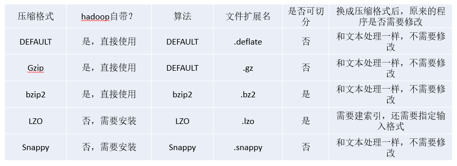{width="9.260416666666666in"
height="3.375in"}
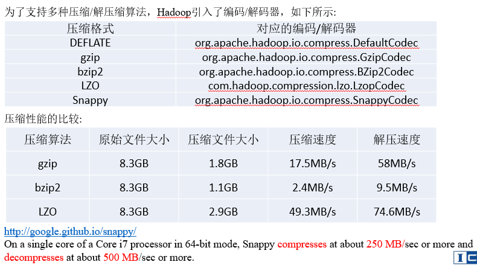{width="8.229166666666666in"
height="4.572916666666667in"}

压缩方式选择
------------

### Gzip压缩

优点：压缩率比较高，而且压缩/解压速度也比较快；hadoop本身支持，在应用中处理gzip格式的文件就和直接处理文本一样；大部分linux系统都自带gzip命令，使用方便。

缺点：不支持split。

应用场景：

当每个文件压缩之后在130M以内的（1个块大小内），都可以考虑用gzip压缩格式。例如说一天或者一个小时的日志压缩成一个gzip文件，运行mapreduce程序的时候通过多个gzip文件达到并发。hive程序，streaming程序，和java写的mapreduce程序完全和文本处理一样，压缩之后原来的程序不需要做任何修改。

### Bzip2压缩

优点：支持split；具有很高的压缩率，比gzip压缩率都高；hadoop本身支持，但不支持native；在linux系统下自带bzip2命令，使用方便。

缺点：压缩/解压速度慢；不支持native。

应用场景：适合对速度要求不高，但需要较高的压缩率的时候，可以作为mapreduce作业的输出格式；或者输出之后的数据比较大，处理之后的数据需要压缩存档减少磁盘空间并且以后数据用得比较少的情况；或者对单个很大的文本文件想压缩减少存储空间，同时又需要支持split，而且兼容之前的应用程序（即应用程序不需要修改）的情况。

### Lzo压缩

优点：压缩/解压速度也比较快，合理的压缩率；支持split，是hadoop中最流行的压缩格式；可以在linux系统下安装lzop命令，使用方便。

缺点：压缩率比gzip要低一些；hadoop本身不支持，需要安装；在应用中对lzo格式的文件需要做一些特殊处理（为了支持split需要建索引，还需要指定inputformat为lzo格式）。

应用场景：一个很大的文本文件，压缩之后还大于200M以上的可以考虑，而且单个文件越大，lzo优点越越明显。

### Snappy压缩

优点：高速压缩速度和合理的压缩率。

缺点：不支持split；压缩率比gzip要低；hadoop本身不支持，需要安装；

应用场景：当Mapreduce作业的Map输出的数据比较大的时候，作为Map到Reduce的中间数据的压缩格式；或者作为一个Mapreduce作业的输出和另外一个Mapreduce作业的输入。

压缩位置选择
------------

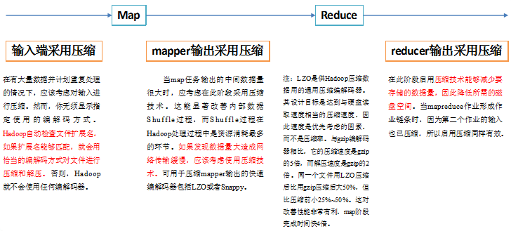{width="7.631443569553806in"
height="3.4479166666666665in"}

压缩参数配置
------------

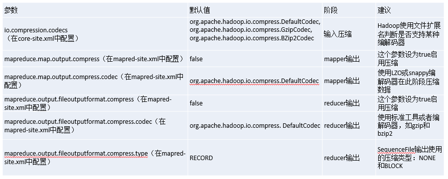{width="9.364583333333334in"
height="3.75in"}

压缩实操案例
------------

测试以下压缩方式：

DEFLATE org.apache.hadoop.io.compress.DefaultCodec

gzip org.apache.hadoop.io.compress.GzipCodec

bzip2 org.apache.hadoop.io.compress.BZip2Codec

### 数据流压缩和解压缩

  ---------------------------------------------------------------------------------------------------------------------
  **package** com.icss.compress;\
  \
  **import** org.apache.hadoop.conf.Configuration;\
  **import** org.apache.hadoop.fs.Path;\
  **import** org.apache.hadoop.io.IOUtils;\
  **import** org.apache.hadoop.io.compress.CompressionCodec;\
  **import** org.apache.hadoop.io.compress.CompressionCodecFactory;\
  **import** org.apache.hadoop.io.compress.CompressionInputStream;\
  **import** org.apache.hadoop.io.compress.CompressionOutputStream;\
  **import** org.apache.hadoop.util.ReflectionUtils;\
  \
  **import** java.io.File;\
  **import** java.io.FileInputStream;\
  **import** java.io.FileOutputStream;\
  \
  **public class** TestCompress {\
  \
  **public static void** main(String\[\] args) **throws** Exception{\
  *compress*(**"C:/Users/hotdas/Desktop/LICENSE.txt"**,**"org.apache.hadoop.io.compress.BZip2Codec"**);\
  \
  *deCompress*(**"C:/Users/hotdas/Desktop/LICENSE.txt.bz2"**);\
  }\
  \
  \
  */\*\*\
  \* 压缩\
  \*/\
  ***public static void** compress(String fileName,String method) **throws** Exception{\
  *//1.获取输入流\
  *FileInputStream fileInputStream = **new** FileInputStream(**new** File(fileName));\
  \
  *//2.实现数据压缩\
  *Class&lt;?&gt; aClass = Class.*forName*(method);\
  CompressionCodec codec = (CompressionCodec) ReflectionUtils.*newInstance*(aClass,**new** Configuration());\
  *//3.输出流\
  *FileOutputStream fileOutputStream = **new** FileOutputStream(**new** File(fileName)+codec.getDefaultExtension());\
  CompressionOutputStream outputStream = codec.createOutputStream(fileOutputStream);\
  \
  *//4.复制数据流\
  *IOUtils.*copyBytes*(fileInputStream,outputStream,1024\*1024\*5,**false**);\
  \
  *//5.关闭资源\
  *fileInputStream.close();\
  outputStream.close();\
  fileOutputStream.close();\
  \
  }\
  \
  */\*\*\
  \* 解压缩\
  \*/\
  ***public static void** deCompress(String fileName) **throws** Exception{\
  \
  *//1.校验是否可以解压缩\
  *CompressionCodecFactory compressionCodecFactory = **new** CompressionCodecFactory(**new** Configuration());\
  CompressionCodec codec = compressionCodecFactory.getCodec(**new** Path(fileName));\
  \
  **if** (codec==**null**){\
  System.***out***.println(**"没有可以解压的文件"**+fileName);\
  **return**;\
  }\
  \
  *//2.获取输入流\
  *CompressionInputStream inputStream = codec.createInputStream(**new** FileInputStream(**new** File(fileName)));\
  \
  *//3.获取输出流\
  *FileOutputStream fileOutputStream = **new** FileOutputStream(**new** File(fileName+**".dec"**));\
  \
  *//4.复制内容\
  *IOUtils.*copyBytes*(inputStream,fileOutputStream,1024\*1024\*5,**false**);\
  \
  *//5.关闭\
  *inputStream.close();\
  fileOutputStream.close();\
  \
  }\
  }
  ---------------------------------------------------------------------------------------------------------------------

### Map输出压缩

  ------------------------------------------------------------------------------------------------------------------------
  **package** com.icss.mapreduce;\
  \
  **import** org.apache.hadoop.conf.Configuration;\
  **import** org.apache.hadoop.fs.Path;\
  **import** org.apache.hadoop.io.IntWritable;\
  **import** org.apache.hadoop.io.Text;\
  **import** org.apache.hadoop.io.compress.BZip2Codec;\
  **import** org.apache.hadoop.io.compress.CompressionCodec;\
  **import** org.apache.hadoop.mapreduce.Job;\
  **import** org.apache.hadoop.mapreduce.lib.input.FileInputFormat;\
  **import** org.apache.hadoop.mapreduce.lib.output.FileOutputFormat;\
  \
  **public class** WordCountDriver {\
  \
  **public static void** main(String\[\] args) **throws** Exception {\
  *//1.获取配置信息和封装job任务\
  *Configuration configuration = **new** Configuration();\
  \
  *//开启map端压缩\
  *configuration.setBoolean(**"mapreduce.map.output.compress"**,**true**);\
  *//设置压缩格式\
  *configuration.setClass(**"mapreduce.map.output.compress.codec"**, BZip2Codec.**class**, CompressionCodec.**class**);\
  \
  Job job = Job.*getInstance*(configuration);\
  \
  *//2.设置jar加载路径\
  *job.setJarByClass(WordCountDriver.**class**);\
  \
  *//3.设置mapper和reducer的类\
  *job.setMapperClass(WordCountMapper.**class**);\
  job.setReducerClass(WordCountReducer.**class**);\
  \
  \
  *//4.设置mapper的输出类型\
  *job.setMapOutputKeyClass(Text.**class**);\
  job.setMapOutputValueClass(IntWritable.**class**);\
  \
  \
  *//5.设置reducer的输出类型\
  *job.setOutputKeyClass(Text.**class**);\
  job.setOutputValueClass(IntWritable.**class**);\
  \
  *//6.设置输入和输出路径\
  *FileInputFormat.*setInputPaths*(job,**new** Path(args\[0\]));\
  FileOutputFormat.*setOutputPath*(job,**new** Path(args\[1\]));\
  \
  *//7.提交任务\
  ***boolean** result = job.waitForCompletion(**true**);\
  \
  System.*exit*(result? 0 : 1);\
  \
  \
  \
  }\
  }
  ------------------------------------------------------------------------------------------------------------------------

### Reducer输出压缩

  ------------------------------------------------------------------------------------------------------------------------
  **package** com.icss.mapreduce;\
  \
  **import** org.apache.hadoop.conf.Configuration;\
  **import** org.apache.hadoop.fs.Path;\
  **import** org.apache.hadoop.io.IntWritable;\
  **import** org.apache.hadoop.io.Text;\
  **import** org.apache.hadoop.io.compress.BZip2Codec;\
  **import** org.apache.hadoop.io.compress.CompressionCodec;\
  **import** org.apache.hadoop.mapreduce.Job;\
  **import** org.apache.hadoop.mapreduce.lib.input.FileInputFormat;\
  **import** org.apache.hadoop.mapreduce.lib.output.FileOutputFormat;\
  \
  **public class** WordCountDriver {\
  \
  **public static void** main(String\[\] args) **throws** Exception {\
  *//1.获取配置信息和封装job任务\
  *Configuration configuration = **new** Configuration();\
  \
  *//开启map端压缩\
  *configuration.setBoolean(**"mapreduce.map.output.compress"**,**true**);\
  *//设置压缩格式\
  *configuration.setClass(**"mapreduce.map.output.compress.codec"**, BZip2Codec.**class**, CompressionCodec.**class**);\
  \
  Job job = Job.*getInstance*(configuration);\
  \
  *//2.设置jar加载路径\
  *job.setJarByClass(WordCountDriver.**class**);\
  \
  *//3.设置mapper和reducer的类\
  *job.setMapperClass(WordCountMapper.**class**);\
  job.setReducerClass(WordCountReducer.**class**);\
  \
  \
  *//4.设置mapper的输出类型\
  *job.setMapOutputKeyClass(Text.**class**);\
  job.setMapOutputValueClass(IntWritable.**class**);\
  \
  \
  *//5.设置reducer的输出类型\
  *job.setOutputKeyClass(Text.**class**);\
  job.setOutputValueClass(IntWritable.**class**);\
  \
  *//6.设置输入和输出路径\
  *FileInputFormat.*setInputPaths*(job,**new** Path(args\[0\]));\
  FileOutputFormat.*setOutputPath*(job,**new** Path(args\[1\]));\
  \
  *//开启reducer输入压缩\
  *FileOutputFormat.*setCompressOutput*(job,**true**);\
  \
  *//设置压缩格式\
  *FileOutputFormat.*setOutputCompressorClass*(job,BZip2Codec.**class**);\
  \
  \
  *//7.提交任务\
  ***boolean** result = job.waitForCompletion(**true**);\
  \
  System.*exit*(result? 0 : 1);\
  \
  \
  \
  }\
  }
  ------------------------------------------------------------------------------------------------------------------------

本章总结
========

通过本章的学习，学会mapreduce的基本使用，hadoop序列化机制，java序列化机制，Writable,实现自定义Bean来实现序列化排序功能，学会了Hadoop数据压缩，理解数据压缩使用方法，知道为什么使用等这些知识！
