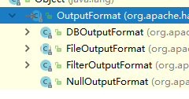

第八章：MapReduce原理机制\
==========================

课程安排
========

知识点1：MapReduce工作流程

知识点2：InputFormat数据输入

知识点3：MapTask工作机制

知识点4：ReduceTask工作机制

知识点5：OutputFormat数据输出

MapReduce工作流程
=================

Mapper阶段工作流程
------------------

{width="5.833333333333333in"
height="2.5949354768153983in"}

Reducer阶段工作流程
-------------------

{width="5.833333333333333in"
height="1.9952132545931758in"}

思考缓存区如何配置
------------------

缓冲区的大小会影响到mapReduce程序的执行效率，原则上说，缓冲区越大效率就越高（读取磁盘的次数变低），MapReduce的执行速度就会越快。

缓冲区可能通过调整参数进行配置，参数： io.sort.mb 默认是100M

InputFormat数据输入
===================

分析job任务提交流程
-------------------

+-----------------------------------------------------------------------+
| job.waitForCompletion(**true**);                                      |
|                                                                       |
| submit();                                                             |
|                                                                       |
| //建立连接                                                            |
|                                                                       |
| connect();                                                            |
|                                                                       |
| //创建提交job的代理                                                   |
|                                                                       |
| **new** Cluster(getConfiguration())                                   |
|                                                                       |
| //提交 job                                                            |
|                                                                       |
| submitter.submitJobInternal(Job.**this**, **cluster**);               |
|                                                                       |
| //创建集群任提交的stag路径                                            |
|                                                                       |
| Path jobStagingArea = JobSubmissionFiles.*getStagingDir*(cluster,     |
| conf);                                                                |
|                                                                       |
| //获取jobid并创建job路径                                              |
|                                                                       |
| JobID jobId = **submitClient**.getNewJobID();                         |
|                                                                       |
| Path submitJobDir = **new** Path(jobStagingArea, jobId.toString());   |
|                                                                       |
| //复制jar包到集群                                                     |
|                                                                       |
| copyAndConfigureFiles(job, submitJobDir);                             |
|                                                                       |
| //计算切片并生成切片规划文件 job.split                                |
|                                                                       |
| **int** maps = writeSplits(job, submitJobDir);                        |
|                                                                       |
| //向集群写入的stag规划文件 xml文件                                    |
|                                                                       |
| writeConf(conf, submitJobFile);                                       |
|                                                                       |
| conf.writeXml(out);                                                   |
|                                                                       |
| //提交job并返回提交的状态                                             |
|                                                                       |
| status = **submitClient**.submitJob(\                                 |
| jobId, submitJobDir.toString(), job.getCredentials());                |
+-----------------------------------------------------------------------+

FileInputFormat源码解析
-----------------------

//向集群中写切片信息

**int** maps = writeSplits(job, submitJobDir);

//判断文件是否要切片

**if** (jConf.getUseNewMapper()) {\
maps = writeNewSplits(job, jobSubmitDir);\
} **else** {\
maps = writeOldSplits(jConf, jobSubmitDir);\
}

//切片存放在List集合中

List&lt;InputSplit&gt; splits = input.getSplits(job);

//这里是一个抽象方法，根据数据块的信息内容选择不同类型的实现来切割文件

**public abstract** List&lt;InputSplit&gt; getSplits(JobContext context\
)

//调用FileInputFormat对数据进行切割

**public** List&lt;InputSplit&gt; getSplits(JobContext job)

//获取文件切片块大小

**long** minSize = Math.*max*(getFormatMinSplitSize(),
*getMinSplitSize*(job));\
**long** maxSize = *getMaxSplitSize*(job);

//获取总文件的长度

Path path = file.getPath();\
**long** length = file.getLen();

//获取文件块数

blkLocations = ((LocatedFileStatus) file).getBlockLocations();

**long** blockSize = file.getBlockSize();

//切割文件块

**long** splitSize = computeSplitSize(blockSize, minSize, maxSize);

//切文件的具体方法

**long** bytesRemaining = length;\
**while** (((**double**) bytesRemaining)/splitSize &gt;
***SPLIT\_SLOP***) {\
**int** blkIndex = getBlockIndex(blkLocations, length-bytesRemaining);\
splits.add(makeSplit(path, length-bytesRemaining, splitSize,\
blkLocations\[blkIndex\].getHosts(),\
blkLocations\[blkIndex\].getCachedHosts()));\
bytesRemaining -= splitSize;\
}\
\
**if** (bytesRemaining != 0) {\
**int** blkIndex = getBlockIndex(blkLocations, length-bytesRemaining);\
splits.add(makeSplit(path, length-bytesRemaining, bytesRemaining,\
blkLocations\[blkIndex\].getHosts(),\
blkLocations\[blkIndex\].getCachedHosts()));\
}

默认情况：块的大小=blocksize

FileInputFormat切片机制
-----------------------

### 在默认FileInputFormat切片机制

1.  简单的按照文件的长度进行切片

2.  切片的大小默认是block块大小

3.  切割时不考虑数据的完整，而是对每个符合条件的切片进行切割

### 有参数配置FileInputFormat切片机制

通过前面源码的FileInputFormat分析：

计算切片大小的逻辑Math.max(minSize, Math.min(maxSize, blockSize)

切片的大小由几个值决定：

mapreduce.input.fileinputformat.split.minsize = 1 默认值为1

mapreduce.input.fileinputformat.split.maxsize = Long.maxValue 默认值
Long.maxValue

CombineTextInputFormat切片机制
------------------------------

关于对大量小文进行优化策略：

1.  在默认的情况下，使用FileInputFormat对数据进行切片，如果在大量的小文件的情况下，切片的数量很多，导致maptask的任务数很多，处理效率低。

2.  优化策略

    a.  最好的方法将多个小文件合并后上传到HDFS中。

    b.  补救方法：如果在HDFS中存在大量的小文件，使用CombineTextInputFormat进行切割（对大量小文件合并后再进行切割）

3.  使用方法

> //如果在默认的情况下，会使用FileInputFormat进行对文件切割，对默认的FileInputFormat进行修改

  ---------------------------------------------------------------
  job.setInputFormatClass(CombineTextInputFormat.**class**);\
  CombineTextInputFormat.*setMinInputSplitSize*(job,213213);\
  CombineTextInputFormat.*setMaxInputSplitSize*(job,123123123);
  ---------------------------------------------------------------

InputFormat接口的实现类
-----------------------

InputFormat的实现类：

{width="2.53125in" height="1.4375in"}

{width="2.5208333333333335in"
height="1.6354166666666667in"}

Maptask工作机制
===============

并行度的决定机制
----------------

MaskTask的并行度决定了map阶段的任务的处理并行度，并影响到整个job的处理速度。

Maptask的并行度（任务个数）由客户端的提交切片的个数决定。

一个job的map阶段的并行度是由客户端提交job的切片的个数决定。

每个切片会分配一个maptask来处理。

每个切片默认的大小为blocksize的大小。

切片不考虑完整性。

Maptask工作机制
---------------

{width="5.833333333333333in"
height="2.5949354768153983in"}

1.  Read阶段

> Maptask任务通过用户写的RecorderReader去读取文件，通过（inputsplit）把文件切分成块然后进行key/value的读取。

1.  Map阶段

> 是由节点将数据进行解释出key/value,通过map方法把数据交给用户，用户就可以根据自已的业务逻辑对数据进行处理，产生一系列的数据key/value.

1.  Collect收集阶段

> 用户对map阶段的数据，通过outputcontroller输出结果。可以对数据进行缓冲区操作，比如：排序，合并等。

1.  溢写阶段

> 当缓冲区的数据满了，mapreduce会将数据写入磁盘（临时文件进行存储），在写入磁盘的过程中，可以对数据进行排序，合并，压缩等操作。

1.  Combiner阶段

> 当所有的数据处理完成后，Maptask会对这些临时文件进行合并，确定maptask最终会生一个大的合并后的文件（先分区再合并）。

ReduceTask工作机制
==================

设置ReduceTask的并发度
----------------------

ReduceTask的并发度同时可以影响整个任务完成效率，可以设置ReduceTask的任务数量。但是maptask的并行是不可以修改的。

//修改并行度

job.setNumReduceTasks(10);

注意：

（1）如果job的并行度设置为0，表示没有reduce阶段，只有map的输出。

（2）reducetask默认值就是1，所以输出文件个数为一个。

（3）如果数据分布不均匀，就有可能在reduce阶段产生数据倾斜

（4）reducetask数量并不是任意设置，还要考虑业务逻辑需求，有些情况下，需要计算全局汇总结果，就只能有1个reducetask。

（5）具体多少个reducetask，需要根据集群性能而定。

（6）如果分区数不是1，但是reducetask为1，是否执行分区过程。答案是：不执行分区过程。因为在maptask的源码中，执行分区的前提是先判断reduceNum个数是否大于1。不大于1肯定不执行。

ReduceTask工作机制
------------------

{width="5.833333333333333in"
height="1.9952132545931758in"}

1.  Copy阶段：ReduceTask会从maptask远程拷贝一块数据，如果没有溢出内存，直接拷贝到内存，否则，溢写到磁盘。

2.  Merge阶段：在拷贝数据的同时，ReduceTask会启动两个后台线程，对内存和磁盘上的文件进行合并，防止内存的文件过多，而磁盘的文件过少。

3.  Sort阶段：聚合数据，将相同key的数据合并到一起，在里边使用到排序分组等。

4.  Reduce阶段： 将统计计算后的结果写出HDFS中。

OutputFormat数据输出
====================

OutputFormat接口实现类
----------------------

OutputFormat是mapreduce输出的基类，所有的输出必须实现OutputFormat接口。

以下是它的实现类：

{width="2.5in" height="1.3125in"}

### DBOutputFormat数据库的输出

默认使用数据库相关的操作。

### TextOutputFormat文本输出

TextOutputFormat默认以行的方式写出文本内容。它的key和value可以是任意类型，原因类中调用toString()方法。

### SequenceFileOutputFormat 

SequenceFileOutputFormat将它的输出写为一个顺序文件。

自定义输入与输出
================

InputFormat输入的自定义
-----------------------

步骤：

1.  自定义一个类继承 FileInputFormat类

2.  改写RecordReader方法，实现读取数据kv

3.  在输出时使用SequenceFileOutputFormat输出合的文件

OutputFormat输出的自定义
------------------------

步骤：

1.  自定义一个类继承FileOutputFormat类

2.  改写recordWrite,具体实现自已的write()方法。

自定义输入与输出实操
====================

自定义InputFormat案例实操
-------------------------

需求:无论hdfs还是mapreduce，对于小文件都有损效率，实践中，又难免面临处理大量小文件的场景，此时，就需要有相应解决方案。将多个小文件合并成一个文件SequenceFile，SequenceFile里面存储着多个文件，存储的形式为文件路径+名称为key，文件内容为value。

### 答案

（1）自定义InputFromat

  -------------------------------------------------------------------------------------------------------------------------
  package com.icss.mapreduce.inputformat;
  
  import java.io.IOException;
  
  import org.apache.hadoop.fs.Path;
  
  import org.apache.hadoop.io.BytesWritable;
  
  import org.apache.hadoop.io.NullWritable;
  
  import org.apache.hadoop.mapreduce.InputSplit;
  
  import org.apache.hadoop.mapreduce.JobContext;
  
  import org.apache.hadoop.mapreduce.RecordReader;
  
  import org.apache.hadoop.mapreduce.TaskAttemptContext;
  
  import org.apache.hadoop.mapreduce.lib.input.FileInputFormat;
  
  // 定义类继承FileInputFormat
  
  public class WholeFileInputformat extends FileInputFormat&lt;NullWritable, BytesWritable&gt;{
  
  @Override
  
  protected boolean isSplitable(JobContext context, Path filename) {
  
  return false;
  
  }
  
  @Override
  
  public RecordReader&lt;NullWritable, BytesWritable&gt; createRecordReader(InputSplit split, TaskAttemptContext context)
  
  throws IOException, InterruptedException {
  
  WholeRecordReader recordReader = new WholeRecordReader();
  
  recordReader.initialize(split, context);
  
  return recordReader;
  
  }
  
  }
  -------------------------------------------------------------------------------------------------------------------------

（2）自定义RecordReader

  -----------------------------------------------------------------------------------------------------------------
  package com.icss.mapreduce.inputformat;
  
  import java.io.IOException;
  
  import org.apache.hadoop.conf.Configuration;
  
  import org.apache.hadoop.fs.FSDataInputStream;
  
  import org.apache.hadoop.fs.FileSystem;
  
  import org.apache.hadoop.fs.Path;
  
  import org.apache.hadoop.io.BytesWritable;
  
  import org.apache.hadoop.io.IOUtils;
  
  import org.apache.hadoop.io.NullWritable;
  
  import org.apache.hadoop.mapreduce.InputSplit;
  
  import org.apache.hadoop.mapreduce.RecordReader;
  
  import org.apache.hadoop.mapreduce.TaskAttemptContext;
  
  import org.apache.hadoop.mapreduce.lib.input.FileSplit;
  
  public class WholeRecordReader extends RecordReader&lt;NullWritable, BytesWritable&gt;{
  
  private Configuration configuration;
  
  private FileSplit split;
  
  private boolean processed = false;
  
  private BytesWritable value = new BytesWritable();
  
  @Override
  
  public void initialize(InputSplit split, TaskAttemptContext context) throws IOException, InterruptedException {
  
  this.split = (FileSplit)split;
  
  configuration = context.getConfiguration();
  
  }
  
  @Override
  
  public boolean nextKeyValue() throws IOException, InterruptedException {
  
  if (!processed) {
  
  // 1 定义缓存区
  
  byte\[\] contents = new byte\[(int)split.getLength()\];
  
  FileSystem fs = null;
  
  FSDataInputStream fis = null;
  
  try {
  
  // 2 获取文件系统
  
  Path path = split.getPath();
  
  fs = path.getFileSystem(configuration);
  
  // 3 读取数据
  
  fis = fs.open(path);
  
  // 4 读取文件内容
  
  IOUtils.readFully(fis, contents, 0, contents.length);
  
  // 5 输出文件内容
  
  value.set(contents, 0, contents.length);
  
  } catch (Exception e) {
  
  }finally {
  
  IOUtils.closeStream(fis);
  
  }
  
  processed = true;
  
  return true;
  
  }
  
  return false;
  
  }
  
  @Override
  
  public NullWritable getCurrentKey() throws IOException, InterruptedException {
  
  return NullWritable.get();
  
  }
  
  @Override
  
  public BytesWritable getCurrentValue() throws IOException, InterruptedException {
  
  return value;
  
  }
  
  @Override
  
  public float getProgress() throws IOException, InterruptedException {
  
  return processed? 1:0;
  
  }
  
  @Override
  
  public void close() throws IOException {
  
  }
  
  }
  -----------------------------------------------------------------------------------------------------------------

（3）SequenceFileMapper处理流程

  ---------------------------------------------------------------------------------------------------------
  package com.icss.mapreduce.inputformat;
  
  import java.io.IOException;
  
  import org.apache.hadoop.io.BytesWritable;
  
  import org.apache.hadoop.io.NullWritable;
  
  import org.apache.hadoop.io.Text;
  
  import org.apache.hadoop.mapreduce.Mapper;
  
  import org.apache.hadoop.mapreduce.lib.input.FileSplit;
  
  public class SequenceFileMapper extends Mapper&lt;NullWritable, BytesWritable, Text, BytesWritable&gt;{
  
  Text k = new Text();
  
  @Override
  
  protected void setup(Mapper&lt;NullWritable, BytesWritable, Text, BytesWritable&gt;.Context context)
  
  throws IOException, InterruptedException {
  
  // 1 获取文件切片信息
  
  FileSplit inputSplit = (FileSplit) context.getInputSplit();
  
  // 2 获取切片名称
  
  String name = inputSplit.getPath().toString();
  
  // 3 设置key的输出
  
  k.set(name);
  
  }
  
  @Override
  
  protected void map(NullWritable key, BytesWritable value,
  
  Context context)
  
  throws IOException, InterruptedException {
  
  context.write(k, value);
  
  }
  
  }
  ---------------------------------------------------------------------------------------------------------

（4）SequenceFileReducer处理流程

  ----------------------------------------------------------------------------------------------------
  package com.icss.mapreduce.inputformat;
  
  import java.io.IOException;
  
  import org.apache.hadoop.io.BytesWritable;
  
  import org.apache.hadoop.io.Text;
  
  import org.apache.hadoop.mapreduce.Reducer;
  
  public class SequenceFileReducer extends Reducer&lt;Text, BytesWritable, Text, BytesWritable&gt; {
  
  @Override
  
  protected void reduce(Text key, Iterable&lt;BytesWritable&gt; values, Context context)
  
  throws IOException, InterruptedException {
  
  context.write(key, values.iterator().next());
  
  }
  
  }
  ----------------------------------------------------------------------------------------------------

（5）SequenceFileDriver处理流程

  -------------------------------------------------------------------------------------------------------------
  package com.icss.mapreduce.inputformat;
  
  import java.io.IOException;
  
  import org.apache.hadoop.conf.Configuration;
  
  import org.apache.hadoop.fs.Path;
  
  import org.apache.hadoop.io.BytesWritable;
  
  import org.apache.hadoop.io.Text;
  
  import org.apache.hadoop.mapreduce.Job;
  
  import org.apache.hadoop.mapreduce.lib.input.FileInputFormat;
  
  import org.apache.hadoop.mapreduce.lib.output.FileOutputFormat;
  
  import org.apache.hadoop.mapreduce.lib.output.SequenceFileOutputFormat;
  
  public class SequenceFileDriver {
  
  public static void main(String\[\] args) throws IOException, ClassNotFoundException, InterruptedException {
  
  args = new String\[\] { "e:/input/inputinputformat", "e:/output1" };
  
  Configuration conf = new Configuration();
  
  Job job = Job.getInstance(conf);
  
  job.setJarByClass(SequenceFileDriver.class);
  
  job.setMapperClass(SequenceFileMapper.class);
  
  job.setReducerClass(SequenceFileReducer.class);
  
  // 设置输入的inputFormat
  
  job.setInputFormatClass(WholeFileInputformat.class);
  
  // 设置输出的outputFormat
  
  job.setOutputFormatClass(SequenceFileOutputFormat.class);
  
  job.setMapOutputKeyClass(Text.class);
  
  job.setMapOutputValueClass(BytesWritable.class);
  
  job.setOutputKeyClass(Text.class);
  
  job.setOutputValueClass(BytesWritable.class);
  
  FileInputFormat.setInputPaths(job, new Path(args\[0\]));
  
  FileOutputFormat.setOutputPath(job, new Path(args\[1\]));
  
  boolean result = job.waitForCompletion(true);
  
  System.exit(result ? 0 : 1);
  
  }
  
  }
  -------------------------------------------------------------------------------------------------------------

自定义OutputFormat案例实操
--------------------------

需求:过滤输入的log日志中是否包含icss

（1）包含icss的网站输出到e:/icss.log

（2）不包含icss的网站输出到e:/other.log

### 答案

（1）自定义一个outputformat

  ---------------------------------------------------------------------------------------
  package com.icss.mapreduce.outputformat;
  
  import java.io.IOException;
  
  import org.apache.hadoop.io.NullWritable;
  
  import org.apache.hadoop.io.Text;
  
  import org.apache.hadoop.mapreduce.RecordWriter;
  
  import org.apache.hadoop.mapreduce.TaskAttemptContext;
  
  import org.apache.hadoop.mapreduce.lib.output.FileOutputFormat;
  
  public class FilterOutputFormat extends FileOutputFormat&lt;Text, NullWritable&gt;{
  
  @Override
  
  public RecordWriter&lt;Text, NullWritable&gt; getRecordWriter(TaskAttemptContext job)
  
  throws IOException, InterruptedException {
  
  // 创建一个RecordWriter
  
  return new FilterRecordWriter(job);
  
  }
  
  }
  ---------------------------------------------------------------------------------------

（2）具体的写数据RecordWriter

  --------------------------------------------------------------------------------------------
  package com.icss.mapreduce.outputformat;
  
  import java.io.IOException;
  
  import org.apache.hadoop.fs.FSDataOutputStream;
  
  import org.apache.hadoop.fs.FileSystem;
  
  import org.apache.hadoop.fs.Path;
  
  import org.apache.hadoop.io.NullWritable;
  
  import org.apache.hadoop.io.Text;
  
  import org.apache.hadoop.mapreduce.RecordWriter;
  
  import org.apache.hadoop.mapreduce.TaskAttemptContext;
  
  public class FilterRecordWriter extends RecordWriter&lt;Text, NullWritable&gt; {
  
  FSDataOutputStream icssOut = null;
  
  FSDataOutputStream otherOut = null;
  
  public FilterRecordWriter(TaskAttemptContext job) {
  
  // 1 获取文件系统
  
  FileSystem fs;
  
  try {
  
  fs = FileSystem.get(job.getConfiguration());
  
  // 2 创建输出文件路径
  
  Path icssPath = new Path("e:/icss.log");
  
  Path otherPath = new Path("e:/other.log");
  
  // 3 创建输出流
  
  icssOut = fs.create(icssPath);
  
  otherOut = fs.create(otherPath);
  
  } catch (IOException e) {
  
  e.printStackTrace();
  
  }
  
  }
  
  @Override
  
  public void write(Text key, NullWritable value) throws IOException, InterruptedException {
  
  // 判断是否包含“icss”输出到不同文件
  
  if (key.toString().contains("icss")) {
  
  icssOut.write(key.toString().getBytes());
  
  } else {
  
  otherOut.write(key.toString().getBytes());
  
  }
  
  }
  
  @Override
  
  public void close(TaskAttemptContext context) throws IOException, InterruptedException {
  
  // 关闭资源
  
  if (icssOut != null) {
  
  icssOut.close();
  
  }
  
  if (otherOut != null) {
  
  otherOut.close();
  
  }
  
  }
  
  }
  --------------------------------------------------------------------------------------------

（3）编写FilterMapper

  -----------------------------------------------------------------------------------------
  package com.icss.mapreduce.outputformat;
  
  import java.io.IOException;
  
  import org.apache.hadoop.io.LongWritable;
  
  import org.apache.hadoop.io.NullWritable;
  
  import org.apache.hadoop.io.Text;
  
  import org.apache.hadoop.mapreduce.Mapper;
  
  public class FilterMapper extends Mapper&lt;LongWritable, Text, Text, NullWritable&gt;{
  
  Text k = new Text();
  
  @Override
  
  protected void map(LongWritable key, Text value, Context context)
  
  throws IOException, InterruptedException {
  
  // 1 获取一行
  
  String line = value.toString();
  
  k.set(line);
  
  // 3 写出
  
  context.write(k, NullWritable.get());
  
  }
  
  }
  -----------------------------------------------------------------------------------------

（4）编写FilterReducer

  --------------------------------------------------------------------------------------------
  package com.icss.mapreduce.outputformat;
  
  import java.io.IOException;
  
  import org.apache.hadoop.io.NullWritable;
  
  import org.apache.hadoop.io.Text;
  
  import org.apache.hadoop.mapreduce.Reducer;
  
  public class FilterReducer extends Reducer&lt;Text, NullWritable, Text, NullWritable&gt; {
  
  @Override
  
  protected void reduce(Text key, Iterable&lt;NullWritable&gt; values, Context context)
  
  throws IOException, InterruptedException {
  
  String k = key.toString();
  
  k = k + "\\r\\n";
  
  context.write(new Text(k), NullWritable.get());
  
  }
  
  }
  --------------------------------------------------------------------------------------------

（5）编写FilterDriver

  -----------------------------------------------------------------------------------
  package com.icss.mapreduce.outputformat;
  
  import org.apache.hadoop.conf.Configuration;
  
  import org.apache.hadoop.fs.Path;
  
  import org.apache.hadoop.io.NullWritable;
  
  import org.apache.hadoop.io.Text;
  
  import org.apache.hadoop.mapreduce.Job;
  
  import org.apache.hadoop.mapreduce.lib.input.FileInputFormat;
  
  import org.apache.hadoop.mapreduce.lib.output.FileOutputFormat;
  
  public class FilterDriver {
  
  public static void main(String\[\] args) throws Exception {
  
  args = **new** String\[\] { "e:/input/inputoutputformat", "e:/output2" };
  
  Configuration conf = new Configuration();
  
  Job job = Job.getInstance(conf);
  
  job.setJarByClass(FilterDriver.class);
  
  job.setMapperClass(FilterMapper.class);
  
  job.setReducerClass(FilterReducer.class);
  
  job.setMapOutputKeyClass(Text.class);
  
  job.setMapOutputValueClass(NullWritable.class);
  
  job.setOutputKeyClass(Text.class);
  
  job.setOutputValueClass(NullWritable.class);
  
  // 要将自定义的输出格式组件设置到job中
  
  job.setOutputFormatClass(FilterOutputFormat.class);
  
  FileInputFormat.setInputPaths(job, new Path(args\[0\]));
  
  // 虽然我们自定义了outputformat，但是因为我们的outputformat继承自fileoutputformat
  
  // 而fileoutputformat要输出一个\_SUCCESS文件，所以，在这还得指定一个输出目录
  
  FileOutputFormat.setOutputPath(job, new Path(args\[1\]));
  
  boolean result = job.waitForCompletion(true);
  
  System.exit(result ? 0 : 1);
  
  }
  
  }
  -----------------------------------------------------------------------------------

本章总结
========

通过本章学习，同学们学会MapReduce的工作流程，MapTask工作机制，ReducerTask工作机制，InputFormat/OutputFormat相关的操作。
