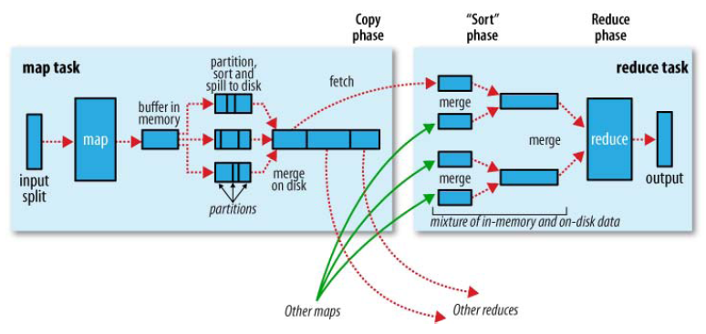
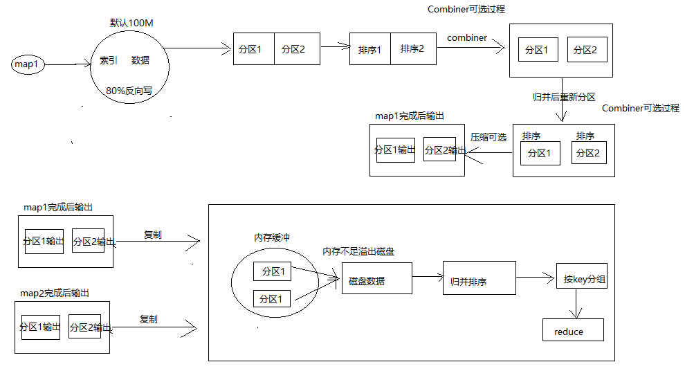

第九章：MapReduce shuffle笔记\
 {#第九章mapreduce-shuffle笔记 .ListParagraph}
==============================

课程安排
========

知识点1：shuffer机制

知识点2：Partition分区

知识点3：自定义Partitioner分区

知识点4：Combiner合并

知识点5：GroupingComparator分组（辅助排序）

shuffer机制
===========

Mapreduce确保每个reducer的输入都是按键排序的。系统执行排序的过程（即将map输出作为输入传给reducer）称为shuffle。

{width="6.660344488188977in"
height="3.158069772528434in"}

{width="7.947916666666667in"
height="4.407481408573928in"}

Partition分区
=============

默认partition分区

public class HashPartitioner&lt;K, V&gt; extends Partitioner&lt;K, V&gt;
{

public int getPartition(K key, V value, int numReduceTasks) {

return (key.hashCode() & Integer.MAX\_VALUE) % numReduceTasks;

}

}

默认分区是根据key的hashCode对reduceTasks个数取模得到的。用户没法控制哪个key存储到哪个分区。

自定义Partitioner分区
=====================

自定义Partitioner分区步骤：

1.自定义类继承Partitioner，重写getPartition()方法。

2.在job驱动中，设置自定义partitioner。

3.自定义partition后，要根据自定义partitioner的逻辑设置相应数量的reduce
task。

Partition分区案例实操
=====================

需求
----

将统计结果按照手机归属地不同省份输出到不同文件中（分区）。

需求分析
--------

（1）Mapreduce中会将map输出的kv对，按照相同key分组，然后分发给不同的reducetask。默认的分发规则为：根据key的hashcode%reducetask数来分发。

（2）如果要按照我们自己的需求进行分组，则需要改写数据分发（分组）组件Partitioner。

自定义一个CustomPartitioner继承抽象类：Partitioner

（3）在job驱动中，设置自定义partitioner。

job.setPartitionerClass(CustomPartitioner.class)

编写代码
--------

### 自定义分区

  -----------------------------------------------------------------------------------
  **public class** CustomPartitioner **extends** Partitioner&lt;Text,FlowBean&gt;{\
  @Override\
  **public int** getPartition(Text key, FlowBean value, **int** numPartitions) {\
  \
  **int** partition =4;\
  \
  *//获取手机的前三位\
  *String preNum = key.toString().substring(0, 3);\
  \
  **if** (**"136"**.equals(preNum)){\
  partition = 0;\
  }**else if**(**"137"**.equals(preNum)){\
  partition = 1;\
  }**else if** (**"138"**.equals(preNum)){\
  partition = 2;\
  }**else if**(**"139"**.equals(preNum)){\
  partition = 3;\
  }\
  \
  **return** partition;\
  }\
  }
  -----------------------------------------------------------------------------------

### 指定分区器并设置reduceTask数量

  ----------------------------------------------------------------------
  **package** com.icss.sortmapreduce;\
  \
  **import** org.apache.hadoop.conf.Configuration;\
  **import** org.apache.hadoop.fs.Path;\
  **import** org.apache.hadoop.io.Text;\
  **import** org.apache.hadoop.mapreduce.Job;\
  **import** org.apache.hadoop.mapreduce.lib.input.FileInputFormat;\
  **import** org.apache.hadoop.mapreduce.lib.output.FileOutputFormat;\
  \
  **public class** FlowCountDriver {\
  \
  **public static void** main(String\[\] args) **throws** Exception {\
  \
  *//1.获取配置信息和封装job任务\
  *Configuration configuration = **new** Configuration();\
  Job job = Job.*getInstance*(configuration);\
  \
  *//2.设置jar加载路径\
  *job.setJarByClass(FlowCountDriver.**class**);\
  \
  *//3.设置mapper和reducer的类\
  *job.setMapperClass(FlowCountMapper.**class**);\
  job.setReducerClass(FlowCountReducer.**class**);\
  \
  \
  *//4.设置mapper的输出类型\
  *job.setMapOutputKeyClass(Text.**class**);\
  job.setMapOutputValueClass(FlowBean.**class**);\
  \
  \
  *//5.设置reducer的输出类型\
  *job.setOutputKeyClass(Text.**class**);\
  job.setOutputValueClass(FlowBean.**class**);\
  \
  *//设置自定义分区\
  *job.setPartitionerClass(CustomPartitioner.**class**);\
  *//指定分区的数量\
  *job.setNumReduceTasks(1);\
  \
  *//6.设置输入和输出路径\
  *FileInputFormat.*setInputPaths*(job,**new** Path(args\[0\]));\
  FileOutputFormat.*setOutputPath*(job,**new** Path(args\[1\]));\
  \
  *//7.提交任务\
  ***boolean** result = job.waitForCompletion(**true**);\
  \
  System.*exit*(result? 0 : 1);\
  \
  \
  }\
  }
  ----------------------------------------------------------------------

WritableComparable排序
======================

WritableComparable排序分析
--------------------------

排序是MapReduce框架中最重要的操作之一。Map Task和Reduce
Task均会对数据（按照key）进行排序。该操作属于Hadoop的默认行为。任何应用程序中的数据均会被排序，而不管逻辑上是否需要。默认排序是按照字典顺序排序，且实现该排序的方法是快速排序。

对于Map
Task，它会将处理的结果暂时放到一个缓冲区中，当缓冲区使用率达到一定阈值后，再对缓冲区中的数据进行一次排序，并将这些有序数据写到磁盘上，而当数据处理完毕后，它会对磁盘上所有文件进行一次合并，以将这些文件合并成一个大的有序文件。

对于Reduce Task，它从每个Map
Task上远程拷贝相应的数据文件，如果文件大小超过一定阈值，则放到磁盘上，否则放到内存中。如果磁盘上文件数目达到一定阈值，则进行一次合并以生成一个更大文件；如果内存中文件大小或者数目超过一定阈值，则进行一次合并后将数据写到磁盘上。当所有数据拷贝完毕后，Reduce
Task统一对内存和磁盘上的所有数据进行一次合并。

每个阶段的默认排序：部分排序、全排序、辅助排序（GroupingComparator分组）、二次排序。

自定义排序WritableComparable原理：bean对象实现WritableComparable接口重写compareTo方法，就可以实现排序

@Override

**public** **int** compareTo(FlowBean o) {

// 倒序排列，从大到小

**return** **this**.sumFlow &gt; o.getSumFlow() ? -1 : 1;

}

自定义排序
----------

自定义排序WritableComparable原理：

bean对象实现WritableComparable接口重写compareTo方法，就可以实现排序

### 自定义FlowBean类实现WritableComparable

  --------------------------------------------------------------------------------
  **package** com.icss.sortmapreduce;\
  \
  **import** org.apache.hadoop.io.Writable;\
  **import** org.apache.hadoop.io.WritableComparable;\
  \
  **import** java.io.DataInput;\
  **import** java.io.DataOutput;\
  **import** java.io.IOException;\
  \
  **public class** FlowBean **implements** WritableComparable&lt;FlowBean&gt; {\
  \
  **private long upFlow**;*//上传流量\
  ***private long downFlow**;*//下载流量\
  ***private long sumFlow**;*//总流量\
  \
  ***public** FlowBean() {\
  **super**();\
  }\
  \
  **public** FlowBean(**long** upFlow, **long** downFlow) {\
  **this**.**upFlow** = upFlow;\
  **this**.**downFlow** = downFlow;\
  **this**.**sumFlow** = upFlow+downFlow;\
  }\
  \
  \
  **public void** set(**long** upFlow, **long** downFlow) {\
  **this**.**upFlow** = upFlow;\
  **this**.**downFlow** = downFlow;\
  **this**.**sumFlow** = upFlow+downFlow;\
  }\
  \
  **public long** getUpFlow() {\
  **return upFlow**;\
  }\
  \
  **public void** setUpFlow(**long** upFlow) {\
  **this**.**upFlow** = upFlow;\
  }\
  \
  **public long** getDownFlow() {\
  **return downFlow**;\
  }\
  \
  **public void** setDownFlow(**long** downFlow) {\
  **this**.**downFlow** = downFlow;\
  }\
  \
  **public long** getSumFlow() {\
  **return sumFlow**;\
  }\
  \
  **public void** setSumFlow(**long** sumFlow) {\
  **this**.**sumFlow** = sumFlow;\
  }\
  \
  *//写序列化的方法\
  *@Override\
  **public void** write(DataOutput out) **throws** IOException {\
  out.writeLong(**upFlow**);\
  out.writeLong(**downFlow**);\
  out.writeLong(**sumFlow**);\
  }\
  \
  *//反序列化方法\
  *@Override\
  **public void** readFields(DataInput in) **throws** IOException {\
  **this**.**upFlow** = in.readLong();\
  **this**.**downFlow** =in.readLong();\
  **this**.**sumFlow** = in.readLong();\
  }\
  \
  @Override\
  **public int** compareTo(FlowBean o) {\
  *// 倒序排列，从大到小\
  ***return this**.**sumFlow** &gt; o.getSumFlow() ? -1 : 1;\
  }\
  \
  @Override\
  **public** String toString() {\
  **return "FlowBean{"** +\
  **"upFlow="** + **upFlow** +\
  **", downFlow="** + **downFlow** +\
  **", sumFlow="** + **sumFlow** +\
  **'}'**;\
  }\
  }
  --------------------------------------------------------------------------------

### FlowCountMapper

  -----------------------------------------------------------------------------------------------------------------------
  **package** com.icss.sortmapreduce;\
  \
  **import** org.apache.hadoop.io.LongWritable;\
  **import** org.apache.hadoop.io.Text;\
  **import** org.apache.hadoop.mapreduce.Mapper;\
  \
  **import** java.io.IOException;\
  \
  **public class** FlowCountMapper **extends** Mapper&lt;LongWritable, Text,FlowBean,Text&gt; {\
  \
  FlowBean **flowBean** = **new** FlowBean();\
  Text **k** = **new** Text();\
  \
  \
  @Override\
  **protected void** map(LongWritable key, Text value, Context context) **throws** IOException, InterruptedException {\
  *//1.获取一行数数据\
  *String line = value.toString();\
  \
  *//2.切割字段\
  *String\[\] split = line.split(**"\\t"**);\
  \
  *//3.获取需要的字段数据\
  *String phoneNum = split\[1\];*//手机号码\
  ***long** upFlow = Long.*parseLong*(split\[split.**length**-3\]);*//上传流量\
  ***long** downFlow = Long.*parseLong*(split\[split.**length**-2\]);*//下载流量\
  \
  ***flowBean**.set(upFlow,downFlow);\
  **k**.set(phoneNum);\
  \
  *//4.输出\
  *context.write(**flowBean**,**k**);\
  \
  }\
  }
  -----------------------------------------------------------------------------------------------------------------------

### FlowCountReducer

  ---------------------------------------------------------------------------------------------------------------------------------------
  **package** com.icss.sortmapreduce;\
  \
  **import** org.apache.hadoop.io.Text;\
  **import** org.apache.hadoop.mapreduce.Reducer;\
  \
  **import** java.io.IOException;\
  \
  **public class** FlowCountReducer **extends** Reducer&lt;FlowBean,Text,Text,FlowBean&gt; {\
  \
  @Override\
  **protected void** reduce(FlowBean key, Iterable&lt;Text&gt; values, Context context) **throws** IOException, InterruptedException {\
  **long** sum\_upFlow=0;\
  **long** sum\_downFlow=0;\
  \
  \
  *//累加上传流量和下载流量\
  ***for** (Text text :values){\
  *//输出\
  *context.write(text,key);\
  }\
  \
  \
  }\
  }
  ---------------------------------------------------------------------------------------------------------------------------------------

FlowCountDriver

### FlowCountDriver

  ----------------------------------------------------------------------
  **package** com.icss.sortmapreduce;\
  \
  **import** org.apache.hadoop.conf.Configuration;\
  **import** org.apache.hadoop.fs.Path;\
  **import** org.apache.hadoop.io.Text;\
  **import** org.apache.hadoop.mapreduce.Job;\
  **import** org.apache.hadoop.mapreduce.lib.input.FileInputFormat;\
  **import** org.apache.hadoop.mapreduce.lib.output.FileOutputFormat;\
  \
  **public class** FlowCountDriver {\
  \
  **public static void** main(String\[\] args) **throws** Exception {\
  \
  *//1.获取配置信息和封装job任务\
  *Configuration configuration = **new** Configuration();\
  Job job = Job.*getInstance*(configuration);\
  \
  *//2.设置jar加载路径\
  *job.setJarByClass(FlowCountDriver.**class**);\
  \
  *//3.设置mapper和reducer的类\
  *job.setMapperClass(FlowCountMapper.**class**);\
  job.setReducerClass(FlowCountReducer.**class**);\
  \
  \
  *//4.设置mapper的输出类型\
  *job.setMapOutputKeyClass(FlowBean.**class**);\
  job.setMapOutputValueClass(Text.**class**);\
  \
  \
  *//5.设置reducer的输出类型\
  *job.setOutputKeyClass(FlowBean.**class**);\
  job.setOutputValueClass(Text.**class**);\
  \
  \
  \
  *//6.设置输入和输出路径\
  *FileInputFormat.*setInputPaths*(job,**new** Path(args\[0\]));\
  FileOutputFormat.*setOutputPath*(job,**new** Path(args\[1\]));\
  \
  *//7.提交任务\
  ***boolean** result = job.waitForCompletion(**true**);\
  \
  System.*exit*(result? 0 : 1);\
  \
  \
  }\
  }
  ----------------------------------------------------------------------

Combiner合并
============

1）combiner是MR程序中Mapper和Reducer之外的一种组件。

2）combiner组件的父类就是Reducer。

3）combiner和reducer的区别在于运行的位置：

Combiner是在每一个maptask所在的节点运行;

Reducer是接收全局所有Mapper的输出结果；

4）combiner的意义就是对每一个maptask的输出进行局部汇总，以减小网络传输量。

5）combiner能够应用的前提是不能影响最终的业务逻辑，而且，combiner的输出kv应该跟reducer的输入kv类型要对应起来。

> Mapper
>
> 3 5 7 -&gt;(3+5+7)/3=5
>
> 2 6 -&gt;(2+6)/2=4
>
> Reducer
>
> (3+5+7+2+6)/5=23/5 不等于 (5+4)/2=9/2

自定义combiner合并
==================

定义一个类继承Reducer,重写reduce()方法
--------------------------------------

在job驱动类中设置
-----------------

Job.setCombinerClass(自定义的类)

自定义combiner案例
------------------

以单词统计为例，通过自定义combiner求单词个数。=

### WordCountCombiner

  ------------------------------------------------------------------------------------------------------------------------------------------
  **package** com.icss.mapreduce;\
  \
  **import** org.apache.hadoop.io.IntWritable;\
  **import** org.apache.hadoop.io.Text;\
  **import** org.apache.hadoop.mapreduce.Reducer;\
  \
  **import** java.io.IOException;\
  \
  **public class** WordCountCombiner **extends** Reducer&lt;Text, IntWritable,Text,IntWritable&gt; {\
  @Override\
  **protected void** reduce(Text key, Iterable&lt;IntWritable&gt; values, Context context) **throws** IOException, InterruptedException {\
  *//汇总\
  ***int** count = 0;\
  **for** (IntWritable value : values){\
  count += value.get();\
  }\
  *//输出\
  *context.write(key,**new** IntWritable(count));\
  }\
  }
  ------------------------------------------------------------------------------------------------------------------------------------------

### 在job的驱动类中使用

  -------------------------------------------------------------------------------------------------------------
  **package** com.icss.mapreduce;\
  \
  **import** org.apache.hadoop.conf.Configuration;\
  **import** org.apache.hadoop.fs.Path;\
  **import** org.apache.hadoop.io.IntWritable;\
  **import** org.apache.hadoop.io.Text;\
  **import** org.apache.hadoop.io.compress.BZip2Codec;\
  **import** org.apache.hadoop.io.compress.CompressionCodec;\
  **import** org.apache.hadoop.mapreduce.Job;\
  **import** org.apache.hadoop.mapreduce.lib.input.CombineFileInputFormat;\
  **import** org.apache.hadoop.mapreduce.lib.input.CombineTextInputFormat;\
  **import** org.apache.hadoop.mapreduce.lib.input.FileInputFormat;\
  **import** org.apache.hadoop.mapreduce.lib.output.FileOutputFormat;\
  \
  **public class** WordCountDriver {\
  \
  **public static void** main(String\[\] args) **throws** Exception {\
  *//1.获取配置信息和封装job任务\
  *Configuration configuration = **new** Configuration();\
  \
  *//开启map端压缩\
  //configuration.setBoolean("mapreduce.map.output.compress",true);\
  //设置压缩格式\
  //configuration.setClass("mapreduce.map.output.compress.codec", BZip2Codec.class, CompressionCodec.class);\
  \
  *Job job = Job.*getInstance*(configuration);\
  \
  *//2.设置jar加载路径\
  *job.setJarByClass(WordCountDriver.**class**);\
  \
  *//3.设置mapper和reducer的类\
  *job.setMapperClass(WordCountMapper.**class**);\
  job.setReducerClass(WordCountReducer.**class**);\
  \
  \
  *//4.设置mapper的输出类型\
  *job.setMapOutputKeyClass(Text.**class**);\
  job.setMapOutputValueClass(IntWritable.**class**);\
  \
  \
  *//5.设置reducer的输出类型\
  *job.setOutputKeyClass(Text.**class**);\
  job.setOutputValueClass(IntWritable.**class**);\
  \
  *//开启局部合并\
  *job.setCombinerClass(WordCountCombiner.**class**);\
  \
  *//6.设置输入和输出路径\
  *FileInputFormat.*setInputPaths*(job,**new** Path(args\[0\]));\
  FileOutputFormat.*setOutputPath*(job,**new** Path(args\[1\]));\
  \
  *//开启reducer输入压缩\
  //FileOutputFormat.setCompressOutput(job,true);\
  \
  //设置压缩格式\
  //FileOutputFormat.setOutputCompressorClass(job,BZip2Codec.class);\
  \
  \
  //7.提交任务\
  ***boolean** result = job.waitForCompletion(**true**);\
  \
  System.*exit*(result? 0 : 1);\
  \
  \
  \
  }\
  }
  -------------------------------------------------------------------------------------------------------------

GroupingComparator分组
======================

GroupingComparator分组: 对reduce阶段的数据根据某一个或几个字段进行分组。

需求
----

有如下订单数据

订单id 商品id 成交金额

0000001 Pdt\_01 222.8

0000001 Pdt\_06 25.8

0000002 Pdt\_03 522.8

0000002 Pdt\_04 122.4

0000002 Pdt\_05 722.4

0000003 Pdt\_01 222.8

0000003 Pdt\_02 33.8

求出每一个订单中最贵的商品?

代码实现
--------

### 定义订单信息OrderBean

  -------------------------------------------------------------------------
  package com.icss.mapreduce.order;
  
  import java.io.DataInput;
  
  import java.io.DataOutput;
  
  import java.io.IOException;
  
  import org.apache.hadoop.io.WritableComparable;
  
  public class OrderBean implements WritableComparable&lt;OrderBean&gt; {
  
  private int order\_id; // 订单id号
  
  private double price; // 价格
  
  public OrderBean() {
  
  super();
  
  }
  
  public OrderBean(int order\_id, double price) {
  
  super();
  
  this.order\_id = order\_id;
  
  this.price = price;
  
  }
  
  @Override
  
  public void write(DataOutput out) throws IOException {
  
  out.writeInt(order\_id);
  
  out.writeDouble(price);
  
  }
  
  @Override
  
  public void readFields(DataInput in) throws IOException {
  
  order\_id = in.readInt();
  
  price = in.readDouble();
  
  }
  
  @Override
  
  public String toString() {
  
  return order\_id + "\\t" + price;
  
  }
  
  public int getOrder\_id() {
  
  return order\_id;
  
  }
  
  public void setOrder\_id(int order\_id) {
  
  this.order\_id = order\_id;
  
  }
  
  public double getPrice() {
  
  return price;
  
  }
  
  public void setPrice(double price) {
  
  this.price = price;
  
  }
  
  // 二次排序
  
  @Override
  
  public int compareTo(OrderBean o) {
  
  int result;
  
  if (order\_id &gt; o.getOrder\_id()) {
  
  result = 1;
  
  } else if (order\_id &lt; o.getOrder\_id()) {
  
  result = -1;
  
  } else {
  
  // 价格倒序排序
  
  result = price &gt; o.getPrice() ? -1 : 1;
  
  }
  
  return result;
  
  }
  
  }
  -------------------------------------------------------------------------

### 编写OrderSortMapper

  --------------------------------------------------------------------------------------------------------------
  package com.icss.mapreduce.order;
  
  import java.io.IOException;
  
  import org.apache.hadoop.io.LongWritable;
  
  import org.apache.hadoop.io.NullWritable;
  
  import org.apache.hadoop.io.Text;
  
  import org.apache.hadoop.mapreduce.Mapper;
  
  public class OrderMapper extends Mapper&lt;LongWritable, Text, OrderBean, NullWritable&gt; {
  
  OrderBean k = new OrderBean();
  
  @Override
  
  protected void map(LongWritable key, Text value, Context context) throws IOException, InterruptedException {
  
  // 1 获取一行
  
  String line = value.toString();
  
  // 2 截取
  
  String\[\] fields = line.split("\\t");
  
  // 3 封装对象
  
  k.setOrder\_id(Integer.*parseInt*(fields\[0\]));
  
  k.setPrice(Double.*parseDouble*(fields\[2\]));
  
  // 4 写出
  
  context.write(k, NullWritable.*get*());
  
  }
  
  }
  --------------------------------------------------------------------------------------------------------------

### 编写OrderSortPartitioner

  ------------------------------------------------------------------------------------------------
  **package** com.icss.mapreduce.order;
  
  **import** org.apache.hadoop.io.NullWritable;
  
  **import** org.apache.hadoop.mapreduce.Partitioner;
  
  **public** **class** OrderPartitioner **extends** Partitioner&lt;OrderBean, NullWritable&gt; {
  
  @Override
  
  **public** **int** getPartition(OrderBean key, NullWritable value, **int** numReduceTasks) {
  
  **return** (key.getOrder\_id() & Integer.***MAX\_VALUE***) % numReduceTasks;
  
  }
  
  }
  ------------------------------------------------------------------------------------------------

### 编写OrderSortGroupingComparator

  -------------------------------------------------------------------------------
  **package** com.icss.mapreduce.order;
  
  **import** org.apache.hadoop.io.WritableComparable;
  
  **import** org.apache.hadoop.io.WritableComparator;
  
  **public** **class** OrderGroupingComparator **extends** WritableComparator {
  
  **protected** OrderGroupingComparator() {
  
  **super**(OrderBean.**class**, **true**);
  
  }
  
  @SuppressWarnings("rawtypes")
  
  @Override
  
  **public** **int** compare(WritableComparable a, WritableComparable b) {
  
  OrderBean aBean = (OrderBean) a;
  
  OrderBean bBean = (OrderBean) b;
  
  **int** result;
  
  **if** (aBean.getOrder\_id() &gt; bBean.getOrder\_id()) {
  
  result = 1;
  
  } **else** **if** (aBean.getOrder\_id() &lt; bBean.getOrder\_id()) {
  
  result = -1;
  
  } **else** {
  
  result = 0;
  
  }
  
  **return** result;
  
  }
  
  }
  -------------------------------------------------------------------------------

### 编写OrderSortReducer

  -----------------------------------------------------------------------------------------------------------------
  **package** com.icss.mapreduce.order;
  
  **import** java.io.IOException;
  
  **import** org.apache.hadoop.io.NullWritable;
  
  **import** org.apache.hadoop.mapreduce.Reducer;
  
  **public** **class** OrderReducer **extends** Reducer&lt;OrderBean, NullWritable, OrderBean, NullWritable&gt; {
  
  @Override
  
  **protected** **void** reduce(OrderBean key, Iterable&lt;NullWritable&gt; values, Context context)
  
  **throws** IOException, InterruptedException {
  
  context.write(key, NullWritable.*get*());
  
  }
  
  }
  -----------------------------------------------------------------------------------------------------------------

### 编写OrderSortDriver

  ------------------------------------------------------------------------------------------
  **package** com.icss.mapreduce.order;
  
  **import** java.io.IOException;
  
  **import** org.apache.hadoop.conf.Configuration;
  
  **import** org.apache.hadoop.fs.Path;
  
  **import** org.apache.hadoop.io.NullWritable;
  
  **import** org.apache.hadoop.mapreduce.Job;
  
  **import** org.apache.hadoop.mapreduce.lib.input.FileInputFormat;
  
  **import** org.apache.hadoop.mapreduce.lib.output.FileOutputFormat;
  
  **public** **class** OrderDriver {
  
  **public** **static** **void** main(String\[\] args) **throws** Exception, IOException {
  
  // 1 获取配置信息
  
  Configuration conf = **new** Configuration();
  
  Job job = Job.*getInstance*(conf);
  
  // 2 设置jar包加载路径
  
  job.setJarByClass(OrderDriver.**class**);
  
  // 3 加载map/reduce类
  
  job.setMapperClass(OrderMapper.**class**);
  
  job.setReducerClass(OrderReducer.**class**);
  
  // 4 设置map输出数据key和value类型
  
  job.setMapOutputKeyClass(OrderBean.**class**);
  
  job.setMapOutputValueClass(NullWritable.**class**);
  
  // 5 设置最终输出数据的key和value类型
  
  job.setOutputKeyClass(OrderBean.**class**);
  
  job.setOutputValueClass(NullWritable.**class**);
  
  // 6 设置输入数据和输出数据路径
  
  FileInputFormat.*setInputPaths*(job, **new** Path(args\[0\]));
  
  FileOutputFormat.*setOutputPath*(job, **new** Path(args\[1\]));
  
  // 10 设置reduce端的分组
  
  job.setGroupingComparatorClass(OrderGroupingComparator.**class**);
  
  // 7 设置分区
  
  job.setPartitionerClass(OrderPartitioner.**class**);
  
  // 8 设置reduce个数
  
  job.setNumReduceTasks(3);
  
  // 9 提交
  
  **boolean** result = job.waitForCompletion(**true**);
  
  System.*exit*(result ? 0 : 1);
  
  }
  
  }
  ------------------------------------------------------------------------------------------

本章小结
========

通过本章的学习，对shuffe机制有了深入的认识，并且对shuffle过程中的分区，排序与合并的过程以及自定义都有了深入的认识。
