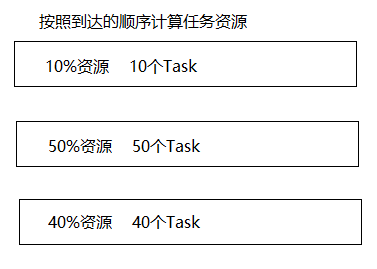

第十一章：YARN\
 {#第十一章yarn .ListParagraph}
===============

课程安排
========

知识点1：YARN介绍

知识点2：YARN的基本架构

知识点3：YARN的工作机制

知识点4：资源调度器

知识点5：任务推测执行

YARN
====

YARN介绍
--------

Apache Hadoop YARN 是一种资源协调者，是 Hadoop2.x
通用资源调度系统，为上层应用提供统一的资源管理和调度，YARN为集群在利用率、资源统一管理和数据共享等方面带来了巨大好处。

YARN的基本架构
--------------

YARN主要由ResourceManager、NodeManager、ApplicationMaster和Container等多个组件构成。

{width="7.020833333333333in"
height="4.3705850831146105in"}

### ResourceManager\
RM是一个全局的资源管理器，集群里只有一个，负责整个系统的资源管理和分配，包括处理客户端请求、启动/监控APP master、监控nodemanager、资源的分配与调度。它主要由两个组件构成：调度器（Scheduler）和应用程序管理器（Applications Manager,AsM）。\
（1）调度器\
调度器根据容量、队列等限制条件（如每个队列分配一定的资源，最多执行一定数量的作业等），将系统中的资源分配给各个正在运行的应用程序。需要注意的是，该调度咄咄逼人是一个“纯调度器”，它不再从事任何与具体应用程序相关的工作，比如不负责监控或者跟踪应用的执行状态等，也不负责重新启动国应用执行失败或者硬件故障而产生的失败任务，这些均交由应用程序相关的ApplicationMaster完成。调度器仅根据各个应用程序的资源需求进行资源分配，而资源分配单位用一个抽象概念“资源容器”（Resource Container,简称Contrainer）表示，Container是一个动态资源分配单位，它将内存、cpu、磁盘、网络等资源封装在一起，从而限定每个任务使用的资源量。此外，该调度器是一个可插拔的组件，用户可根据自己的需要设计新的调度器，YARN提供了多种直接可用的调度器，比如Fair Scheduler和Capacity Schduler等。

（2）应用程序管理\
应用程序管理器负责管理整个系统中所有应用程序，包括应用程序提交，与调度器协商资源以启动ApplicationMaster、监控ApplicationMaster运行状态并在失败时重新启动它等

### ApplicationMaster(AM)\
管理YARN内运行的应用程序的每个实例。\
功能：\
数据切分\
为应用程序申请资源并进一步分配给内部任务。\
任务监控与容错\
负责协调来自resourcemanager的资源，并通过nodemanager监视任务的执行和资源使用情况。

### NodeManager(NM)\
Nodemanager整个集群有多个，负责每个节点上的资源和使用。\
功能：\
单个节点上的资源管理和任务。\
处理来自于resourcemanager的命令。\
处理来自域app master的命令。？？？

NodeManager管理着抽象容器，这些抽象容器代表着一些特定程序使用针对每个节点的资源。\
NodeManager定时地向RM汇报本节点上的资源使用情况和各个Container的运行状态（cpu和内存等资源）

### Container

Container是YARN中的资源抽象，它封装了某个节点上的多维度资源，如内存、CPU、磁盘、网络等，当AM向RM申请资源时，RM为AM返回的资源便是用Container表示的。YARN会为每个任务分配一个Container，且该任务只能使用该Container中描述的资源。需要注意的是，Container不同于MRv1中的slot，它是一个动态的资源划分单位，是根据应用程序的需求动态生成的。目前为止，YARN仅支持CPU和内存两种资源，且使用了轻量级资源隔离机制Cgroups进行资源隔离。\
功能：\
对task环境的抽象\
描述一系列信息\
任务运行资源的集合（cpu、内存、io等）\
任务运行环境

YARN的工作机制
--------------

> {width="8.618686570428697in"
> height="4.677083333333333in"}

1.  Mr程序提交到客户端所在的节点。

2.  Yarnrunner向Resourcemanager申请一个Application。

3.  rm将该应用程序的资源路径返回给yarnrunner。

4.  该程序将运行所需资源提交到HDFS上。

5.  程序资源提交完毕后，申请运行mrAppMaster。

6.  RM将用户的请求初始化成一个task。

7.  其中一个NodeManager领取到task任务。

8.  该NodeManager创建容器Container，并产生MRAppmaster。

9.  Container从HDFS上拷贝资源到本地。

10. MRAppmaster向RM 申请运行maptask资源。

11. RM将运行maptask任务分配给另外两个NodeManager，另两个NodeManager分别领取任务并创建容器。

12. MR向两个接收到任务的NodeManager发送程序启动脚本，这两个NodeManager分别启动maptask，maptask对数据分区排序。

13. MrAppMaster等待所有maptask运行完毕后，向RM申请容器，运行reduce
    task。

14. reduce task向maptask获取相应分区的数据。

15. 程序运行完毕后，MR会向RM申请注销自己。

资源调度器
----------

Hadoop作业调度器主要有三种：FIFO Scheduler（先进先出调度器）、Capacity
Scheduler（容量调度器）和Fair Scheduler（公平调度器）。

Hadoop2.7.2默认的资源调度器是Capacity Scheduler。

yarn-default.xml：

&lt;property&gt;

&lt;description&gt;The class to use as the resource
scheduler.&lt;/description&gt;

&lt;name&gt;yarn.resourcemanager.scheduler.class&lt;/name&gt;

&lt;value&gt;org.apache.hadoop.yarn.server.resourcemanager.scheduler.capacity.CapacityScheduler&lt;/value&gt;

&lt;/property&gt;

### FIFO先进先出调度器

{width="6.875in"
height="2.0833333333333335in"}

### Capacity Scheduler容量调度器

{width="3.9270833333333335in"
height="2.8020833333333335in"}

1.  支持多个队列，每个队列配置一定的资源量，每个队列按照FIFO的调度策略。

2.  为了阻止同一个用户作业独占用资源，同一个用户提交的作业被调度器限定。

3.  首先，计算队列中正在运行的任务数与计算应该分得的资源数的比值，选择比值小的队列。

4.  其次，按照Job任务优先级与提交顺序，同时考虑集群资源限制，然后对队列进行排序。

### Fair Scheduler公平调度器

支持多用户多资源多队列，每个队列中的资源量可以分配的，同一个队列中的作业公平共享队列中的所有资源。

任务推测执行
------------

1）作业完成时间取决于最慢的任务完成时间

一个作业由若干个Map任务和Reduce任务构成。因硬件老化、软件Bug等，某些任务可能运行非常慢。

典型案例：系统中有99%的Map任务都完成了，只有少数几个Map老是进度很慢，完不成，怎么办？

2）推测执行机制：

发现拖后腿的任务，比如某个任务运行速度远慢于任务平均速度。为拖后腿任务启动一个备份任务，同时运行。谁先运行完，则采用谁的结果。

3）执行推测任务的前提条件

（1）每个task只能有一个备份任务；

（2）当前job已完成的task必须不小于0.05（5%）

（3）开启推测执行参数设置。Hadoop2.7.2
mapred-site.xml文件中默认是打开的。

&lt;property&gt;

&lt;name&gt;mapreduce.map.speculative&lt;/name&gt;

&lt;value&gt;true&lt;/value&gt;

&lt;description&gt;If true, then multiple instances of some map tasks
may be executed in parallel.&lt;/description&gt;

&lt;/property&gt;

&lt;property&gt;

&lt;name&gt;mapreduce.reduce.speculative&lt;/name&gt;

&lt;value&gt;true&lt;/value&gt;

&lt;description&gt;If true, then multiple instances of some reduce tasks

may be executed in parallel.&lt;/description&gt;

&lt;/property&gt;

4）不能启用推测执行机制情况

（1）任务间存在严重的负载倾斜；

（2）特殊任务，比如任务向数据库中写数据。

本章小结
========

通过本章学习，同学们学会YARN是资源管理系统，基本架构由4部分组成，每个成组成部分的主要的作用都理解，理解了YARN的工作机制和资源调度器，包括任务推测执行。
