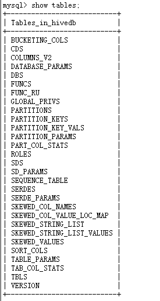

1hive原理

1.1什么是hive

Hive是建立在Hadoop基础上的数据仓库基础架构。它提供了一系列的工具，可以用来进行数据提取转化加载（ETL），这是一种可以存储、查询和分析存储在
Hadoop 中的大规模数据的机制。Hive 定义了简单的类 SQL 查询语言，称为 QL
，它允许熟悉 SQL 的用户查询数据。同时，这个语言也允许熟悉 MapReduce
开发者的开发自定义的 mapper 和 reducer 来处理内建的 mapper 和 reducer
无法完成的复杂的分析工作。

{width="5.458333333333333in"
height="4.682638888888889in"}

Hive是SQL解析引擎，将SQL转换为Map/reducer
job然后在Hadoop执行。Hive的表其实就是HDFS的目录，按表名把文件夹分开。如果是分区表，则分区值是子文件夹，可以直接在Map/Reduce
Job里使用这些数据。

Hive把HQL语句转换成MR任务后，采用批处理的方式对海量数据进行处理。数据仓库存储的是静态数据，很适合采用MR进行批处理。Hive还提供了一系列对数据进行提取、转换、加载的工具，可以存储、查询和分析存储在HDFS上的数据。

1.2Hive中的SQL与传统SQL区别

{width="5.583333333333333in"
height="3.063888888888889in"}

1.3各组件的基本功能

用户接口主要由三个：CLI、JDBC/ODBC和WebGUI。其中，CLI为shell命令行；JDBC/ODBC是Hive的JAVA实现，与传统数据库JDBC类似；WebGUI是通过浏览器访问Hive。

元数据存储：Hive
将元数据存储在数据库中。Hive中的元数据包括表的名字，表的列和分区及其属性，表的属性（是否为外部表等），表的数据所在目录等。

解释器、编译器、优化器完成 HQL
查询语句从词法分析、语法分析、编译、优化以及查询计划的生成。生成的查询计划存储在HDFS
中，并在随后有 MapReduce 调用执行。

{width="5.611805555555556in"
height="2.5694444444444446in"}

1.4 hive工作过程

{width="5.768055555555556in"
height="2.0493055555555557in"}

详细版

{width="5.96875in"
height="3.111111111111111in"}

(1)用户提交查询等任务给Driver。

(2)编译器获得该用户的任务Plan。

(3)编译器Compiler根据用户任务去MetaStore中获取需要的Hive的元数据信息。

(4)编译器Compiler得到元数据信息，对任务进行编译，先将HiveQL转换为抽象语法树，然后将抽象语法树转换成查询块，将查询块转化为逻辑的查询计划，重写逻辑查询计划，将逻辑计划转化为物理的计划（MapReduce）,
最后选择最佳的策略。

(5)将最终的计划提交给Driver。

(6)Driver将计划Plan转交给ExecutionEngine去执行，获取元数据信息，提交给JobTracker或者SourceManager执行该任务，任务会直接读取HDFS中文件进行相应的操作。

(7)获取执行的结果。

(8)取得并返回执行结果。

1.5 元数据

元数据（Meta Date），主要记录数据仓库中模型的定义、各层级间的映射关

系、监控数据仓库的数据状态及 ETL 的任务运行状态。一般会通过元数据资料库

（Metadata Repository）来统一地存储和管理元数据，其主要目的是使数据仓

库的设计、部署、操作和管理能达成协同和一致。

{width="2.8645833333333335in"
height="5.364583333333333in"}

(1) ### version（存储Hive版本的元数据表）

    {width="5.166666666666667in"
    height="0.9270833333333334in"}

(2) ### DBS（hive数据库相关的元数据表）

    {width="4.8125in"
    height="1.4583333333333333in"}

(3) ### TBLS（Hive表和视图相关的元数据表）

{width="5.34375in"
height="2.5104166666666665in"}

  ---------------------- ---------------------------------------
  TBL\_ID                表ID
  CREATE\_TIME           创建时间
  DB\_ID                 数据库ID
  LAST\_ACCESS\_TIME     上次访问时间
  OWNER                  所有者
  RETENTION              保留字段
  SD\_ID                 序列化配置信息（对应SDS表中的SD\_ID）
  TBL\_NAME              表名
  TBL\_TYPE              表类型
  VIEW\_EXPANDED\_TEXT   视图详细的HQL语句
  VIEW\_ORIGINAL\_TEXT   视图原始的HQL语句
  ---------------------- ---------------------------------------

### (4)table\_params（Hive表和视图相关的元数据表）

{width="4.697916666666667in"
height="1.21875in"}

### (5)sds（Hive文件存储信息相关的元数据表）

{width="5.677083333333333in"
height="2.1666666666666665in"}

  ---------------------------- ------------------
  SD\_ID                        
  CD\_ID                       字段信息ID
  INPUT\_FORMAT                文件输入格式
  IS\_COMPRESSED               是否压缩
  IS\_STOREDASSUBDIRECTORIES   是否以子目录存储
  LOCATION                     HDFS路径
  NUM\_BUCKETS                 分桶数量
  OUTPUT\_FORMAT               文件输出格式
  SERDE\_ID                    序列化类ID
  字段                         说明
  ---------------------------- ------------------

(6) ### partitions（Hive表分区相关的元数据表）

    {width="4.96875in"
    height="1.71875in"}

  -------------------- -------------------
  字段                 字段说明 

  PART\_ID              分区ID

  CREATE\_TIME          分区创建时间

  LAST\_ACCESS\_TIME    最后一次访问时间

  PART\_NAME            分区名称

                        分区存储ID
                       
  SD\_ID               

                        表ID
                       
  TBL\_ID              
  -------------------- -------------------

### (7)partition\_keys（Hive表分区相关的元数据表）

{width="4.6875in"
height="1.46875in"}

  --------------- --------------
  字段名称        字段说明
  TBL\_ID         表ID
  PKEY\_COMMENT   分区字段说明
  PKEY\_NAME      分区字段名称
  PKEY\_TYPE      分区字段类型
  INTEGER\_IDX    分区字段顺序
  --------------- --------------

