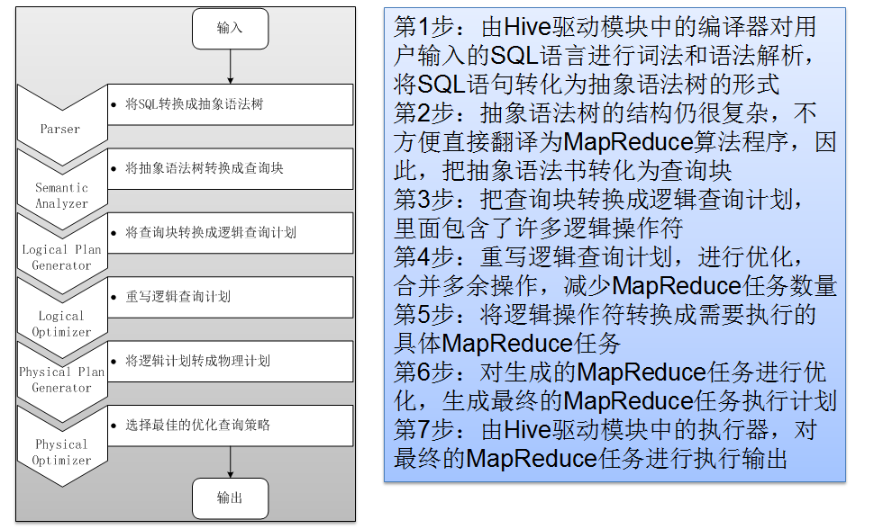

1.SQL
Parse：Antlr定义SQL的语法规则，完成SQL词法，语法解析，将SQL转化为抽象语法树(AST)

2.Analyzer：遍历AST，抽象出查询的基本组成单元QueryBlock(QB)

3.Logical Plain：遍历QueryBlock，翻译为执行操作树Operator Tree

4.Logical Optimizer：逻辑层优化器进行Operator
Tree变换，合并不必要的ReduceSinkOperator，减少shuffle数据量;

5.Phsical Plain：遍历Operator Tree，翻译为MapReduce任务

6.Phsical
Optimizer：物理层优化器对MapReduce任务的优化(如使用MapJoin优化器)，生成最终的执行计划;

{width="5.768055555555556in"
height="3.4604166666666667in"}
