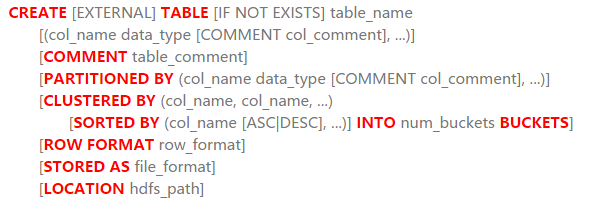
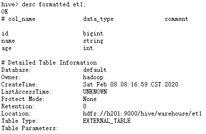

1.  创建表

    {width="5.7659722222222225in"
    height="1.9861111111111112in"}

    1.  ### 内部表

        数据存储在Hive的数据仓库目录下，删除表时，除了删除元数据，还会删除实际表文件，内部表数据存储的位置是hive.metastore.warehouse.dir

        创建内部表

        hive&gt; create table if not exists abc (id bigint, name string,
        age int) row format delimited fields terminated by ',';

hive&gt; show tables;

本地导入数据

\[hadoop@h201 \~\]\$ cat h1.txt

10001,zs,20

20002,ls,30

30003,ww,40

40004,zl,50

50005,tq,60

60006,qq,70

hive&gt; load data local inpath '/home/hadoop/h1.txt' into table abc;

hive&gt; select \* from abc;

复制表

hive&gt; create table t1 as select \* from abc;

hive&gt; dfs -ls /hive/warehouse/t1;

创建表同时载入原有表结构

hive&gt; create table t2 like abc;

hive&gt; desc t2;

OK

id bigint

name string

age int

1.  ### 临时表

    hive&gt; create temporary table t3 as select \* from abc;

### 1.3外部表

带external参数为外部表，数据并不存储在Hive的数据仓库目录下，删除表时，只是删除元数据，并不删除实际表文件。

hive&gt; create external table et1(id bigint,name string,age int) row
format delimited fields terminated by ',';

导入数据

hive&gt; load data local inpath '/home/hadoop/h1.txt' overwrite into
table et1;

hive&gt; select \* from et1;

hive&gt; desc formatted et1;

{width="4.416666666666667in"
height="2.875in"}

验证外部表

hive&gt; drop table et1;

hive&gt; desc det1;

FAILED: SemanticException \[Error 10001\]: Table not found det1

(表已经不存在了，证明元数据已经被删除)

hive&gt; dfs -ls /hive/warehouse/et1;

Found 1 items

-rwxr-xr-x 2 hadoop supergroup 72 2020-02-08 08:19
/hive/warehouse/et1/h1.txt

(hdfs上的文件依然存在)

1.  ### 表管理

    hive&gt; select \* from t1;

    OK

    10001 zs 20

    20002 ls 30

    30003 ww 40

    40004 zl 50

    50005 tq 60

    60006 qq 70

    1.  添加字段

        hive&gt; alter table t1 add columns(sal bigint);

        hive&gt; desc t1;

        OK

        id bigint

        name string

        age int

        sal bigint

    2.  删除字段

        使用替换方式删除字段

        hive&gt; alter table t1 replace columns(id bigint,name string);

