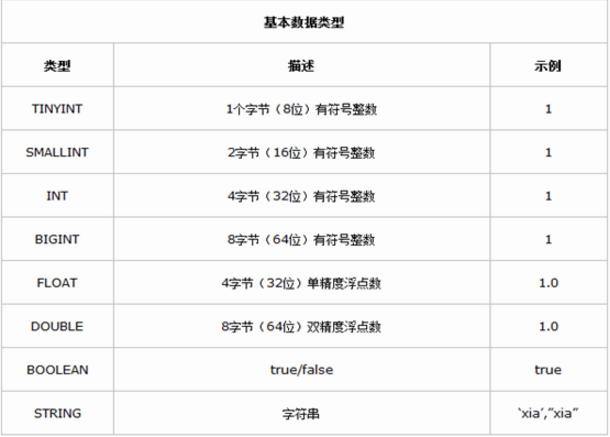
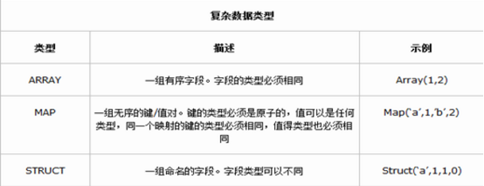

### 1.原始数据类型

（1）整型

TINYINT — 微整型，只占用1个字节，只能存储0-255的整数。

SMALLINT– 小整型，占用2个字节，存储范围–32768 到 32767。

INT– 整型，占用4个字节，存储范围-2147483648到2147483647。

BIGINT– 长整型，占用8个字节，存储范围-2\^63到2\^63-1。

（2）布尔型

BOOLEAN — TRUE/FALSE

（3）浮点型

FLOAT– 单精度浮点数。

DOUBLE– 双精度浮点数。

（4）字符串型

STRING– 不设定长度。

{width="5.763194444444444in"
height="4.128472222222222in"}

### 2.复合数据类型

Structs：一组由任意数据类型组成的结构。比如，定义一个字段C的类型为STRUCT
{a INT; b STRING}，则可以使用a和C.b来获取其中的元素值；

Maps：和Java中的Map相同，即存储K-V对的；

Arrays：数组；

{width="5.766666666666667in"
height="2.2159722222222222in"}

(1) #### Array

    hive&gt; create table xx1(id int,name string,xingge
    array&lt;string&gt;)

    &gt; row format delimited fields terminated by ' '

    &gt; collection items terminated by ',';

    原始数据

    \[hadoop@h201 hhh\]\$ cat xx1.txt

    101 zs haha,hehe,heihei

    102 ls haha,gaga,wawa

    载入数据

    hive&gt; load data local inpath '/home/hadoop/hhh/xx1.txt' into
    table xx1;

    查看

    hive&gt; select \* from xx1;

    hive&gt; select name,xingge\[1\] from xx1;

(2) #### Map

    hive&gt; create table xx2(id int,name string,score
    map&lt;string,int&gt;)

    &gt; row format delimited fields terminated by ' '

    &gt; collection items terminated by ','

    &gt; map keys terminated by ':';

    数据源

    \[hadoop@h201 hhh\]\$ cat xx2.txt

    101 zs math:90,china:99,art:98

    102 ls math:50,china:30,art:10

    载入数据

    hive&gt; load data local inpath '/home/hadoop/hhh/xx2.txt' into
    table xx2;

    查看数据

    hive&gt; select \* from xx2;

    查看key对应得值

    hive&gt; select name,score\['math'\] from xx2;

#### (3)Structs

hive&gt; create table xx3(id int,course
struct&lt;course:string,score:int&gt;)

&gt; row format delimited fields terminated by ' '

&gt; collection items terminated by ',';

原始数据

\[hadoop@h201 hhh\]\$ cat xx3.txt

101 english,80

102 math,90

103 chinese,100

载入数据

hive&gt; load data local inpath '/home/hadoop/hhh/xx3.txt' into table
xx3;

查看数据

hive&gt; select \* from xx3;

hive&gt; select course.course from xx3;

hive&gt; select course.score from xx3;
