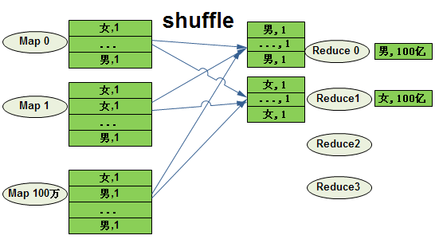
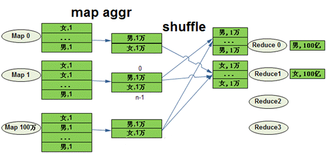

1.  ### 什么是数据倾斜

    数据倾斜主要表现在，map/reduce程序执行时，reduce节点大部分执行完毕，但是有一个或者几个reduce节点运行很慢，导致整个程序的处理时间很长，这是因为某一个key的条数比其他key多很多(有时是百倍或者千倍之多)，这条Key所在的reduce节点所处理的数据量比其他节点就大很多，从而导致某几个节点迟迟运行不完。

2.  ### hive优化数据倾斜

    1.  #### map端聚合（group by造成数据倾斜）

Group By 中的计算均衡优化

select gender,count(1) from user1 group by gender;

{width="5.739583333333333in"
height="3.2291666666666665in"}

如果没有map端的部分聚合优化，map直接把groupby\_key
当作reduce\_key发送给reduce做聚合，就会导致计算不均衡的现象。虽然map有100万个，但是reduce只有两个在做聚合，每个reduce处理100亿条记录。

**hive.map.aggr=true**

**Map 端部分聚合，相当于Combiner**

{width="5.7652777777777775in"
height="2.7055555555555557in"}

**开发：**

创建表

create table user1(id int,gender string)

row format delimited fields terminated by ','

stored as textfile;

create table user2(id int,age int)

row format delimited fields terminated by ','

stored as textfile;

原始数据

\[hadoop@h201 hhh\]\$ cat user1.txt

10001,male

10002,female

10003,male

10004,female

10005,male

\[hadoop@h201 hhh\]\$ cat user2.txt

10001,20

10002,30

10003,40

10004,50

10005,60

导入数据

hive&gt; load data local inpath '/home/hadoop/hhh/user1.txt' into table
user1;

hive&gt; insert into user1 select \* from user1;

反复多次插入数据

hive&gt; load data local inpath '/home/hadoop/hhh/user2.txt' into table
user2;

set hive.map.aggr=true;

set hive.groupby.mapaggr.checkinterval = 100000;

set hive.map.aggr.hash.min.reduction=0.5;

说明：

Map开始的时候先尝试给前100000
条记录做hash聚合，如果聚合后的记录数/100000&gt;0.5说明这个groupby\_key没有什么重复的，再继续做局部聚合没有意义，100000
以后就自动把聚合开关关掉

2.3

#### 2.2 count(distinct)造成数据倾斜

**注意：**

**工作中无论是distinct还是count(distinct
user\_id)的操作，都不建议使用，因为distinct本身会有一个全局排序的过程，导致计算效率很低，通常会以group
by的方式替换**

select count(distinct gender) from user1;

替换为

select count(\*) from user1 group by gender;

#### 2.3聚合时存在大量null值 {#聚合时存在大量null值 .ListParagraph}

如果Null值较多，会导致分到Null值的Reduce处理的数据量过大，产生数据倾斜。

（1）select时

select count(\*) from user1 group by gender;

替换为

select count(\*) from user1 where gender is not null group by gender;

2.  join时

    select a.gender,b.age from (select id,gender from user1 where id is
    not null) a

    join (select id,age from user2 where id is not null) b

    where a.id=b.id;

3.  当user1表id为空需要保留时并替换成随机值

    select a.id,a.gender,b.id,b.age from user1 a left join user2 b

    on case when a.id is null then concat(99,111) else a.id end = b.id;

#### 2.4 不同数据类型关联产生数据倾斜

创建user3表（id字段为string）

create table user3(id string,address string)

row format delimited fields terminated by ','

stored as textfile;

原始数据

\[hadoop@h201 hhh\]\$ cat user3.txt

10001,bj

aa123,sh

aa199,sh

10002,gz

10003,hb

导入数据

hive&gt; load data local inpath '/home/hadoop/hhh/user3.txt' into table
user3;

当按照两个表的id 进行join 操作的时候，默认的hash操作会按照int类型的id
进行分配，这样就会导致所有的string
类型的id就被分到同一个reducer当中,造成数据倾斜。

**修改为：**

select a.gender,b.address from user1 a join user3 b

on b.id = cast(a.id as string);

#### 2.5 大小表关联查询产生数据倾斜

**方法1：**

Hive在进行join时，按照join的key进行分发，而在join左边的表的数据会首先读入内存，如果左边表的key相对分散，读入内存的数据会比较小，join任务执行会比较快。
而如果左边的表key比较集中，而这张表的数据量很大，那么数据倾斜就会比较严重，而如果这张表是小表，则还是应该把这张表放在join左边。原则即是小表在左，大表在右。

假设user1上有10亿条数据，user2上有5万条数据，遵循小表在左面的原则，应该user2
join user1。

hive&gt; select user2.age,user1.gender from user2 join user1 where
user2.id=user1.id;

**方法2：**

map
join解决小表关联大表造成的数据倾斜问题，其是将其中做连接的小表（全量数据）分发到所有Map端进行Join，从而避免了reduce任务，当小表全量数据很小的时候可进行此操作。

hive&gt; select /\* +mapjoin(user2) \*/ user2.age,user1.gender from
user2 join user1 where user2.id=user1.id;
