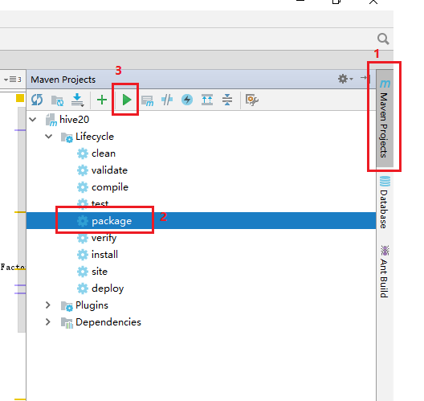
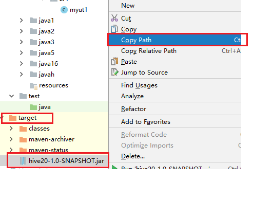

UDTF(User-Defined Table-Generating
Functions)用来解决输入一行输出多行(one-to-many maping)的需求。

### 1.编写UDTF流程：

（1）继承org.apache.hadoop.hive.ql.udf.generic.GenericUDTF。

（2）实现initialize()，process()，close()三个方法。

（3）UDTF首先会调用initialize()方法，此方法返回UDTF的返回行的信息(返回个数，类型)。

（4）初始化完成后会调用process()方法，对传入的参数进行处理，可以通过forward()方法把结果返回。

（5）最后调用close()对需要清理的方法进行清理。

### 2.原始数据

create table student11(

id int,

name string,

hobby string)

row format delimited fields terminated by ' ';

\[hadoop@h201 hhh\]\$ cat student11.txt

1001 zs sport:pingpong,sport:basketball,music:folk

1002 ls sport:football,music:rock,art:draw

1003 ww music:rap,sport:basketball

hive&gt; load data local inpath '/home/hadoop/hhh/student11.txt'
overwrite into table student11;

3.  ### 开发

    分割爱好字段，多行显示

**package** com.hzr;\
\
**import** java.util.ArrayList;\
**import** java.util.List;\
\
**import** org.apache.hadoop.hive.ql.udf.generic.GenericUDTF;\
**import** org.apache.hadoop.hive.ql.exec.UDFArgumentException;\
**import** org.apache.hadoop.hive.ql.metadata.HiveException;\
**import**
org.apache.hadoop.hive.serde2.objectinspector.ObjectInspector;\
**import**
org.apache.hadoop.hive.serde2.objectinspector.ObjectInspectorFactory;\
**import**
org.apache.hadoop.hive.serde2.objectinspector.StructObjectInspector;\
**import**
org.apache.hadoop.hive.serde2.objectinspector.primitive.PrimitiveObjectInspectorFactory;\
\
**public class** myudtf1 **extends** GenericUDTF{\
\
@Override\
**public void** close() **throws** HiveException {\
}\
\
@Override\
**public** StructObjectInspector initialize(ObjectInspector\[\] args)\
**throws** UDFArgumentException {\
List&lt;String&gt; fieldNames = **new** ArrayList&lt;String&gt;();\
List&lt;ObjectInspector&gt; fieldOIs = **new**
ArrayList&lt;ObjectInspector&gt;();\
fieldNames.add(**"c1"**);\
fieldOIs.add(PrimitiveObjectInspectorFactory.***javaStringObjectInspector***);\
fieldNames.add(**"c2"**);\
fieldOIs.add(PrimitiveObjectInspectorFactory.***javaStringObjectInspector***);\
\
**return**
ObjectInspectorFactory.*getStandardStructObjectInspector*(fieldNames,fieldOIs);\
}\
\
@Override\
**public void** process(Object\[\] args) **throws** HiveException {\
String input = args\[0\].toString();\
String\[\] test = input.split(**","**);\
**for**(**int** i=0; i&lt;test.**length**; i++) {\
**try** {\
String\[\] result = test\[i\].split(**":"**);\
forward(result);\
} **catch** (Exception e) {\
**continue**;\
}\
}\
}\
}

### 4.打包执行

{width="5.5in"
height="5.197916666666667in"}

找到打包位置

{width="5.541666666666667in"
height="4.052083333333333in"}

4.2拷贝到Linux上

\[hadoop@h201 \~\]\$ cp /ff/hivejar/myudtf.jar /home/hadoop/qq/

4.3 执行udtf

添加jar包到hive中

hive&gt; add jar /home/hadoop/qq/myudtf.jar;

创建UDTF函数 udtf11

hive&gt; create temporary function udtf11 as 'com.hzr.myudtf1';

查看数据

hive&gt; select \* from student11;

OK

1001 zs sport:pingpong,sport:basketball,music:folk

1002 ls sport:football,music:rock,art:draw

1003 ww music:rap,sport:basketball

显示字段名

hive&gt; set hive.cli.print.header=true;

应用UDTF函数

hive&gt; select udtf11(hobby) from student11;
