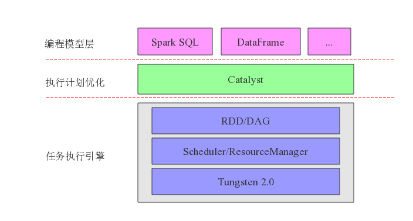
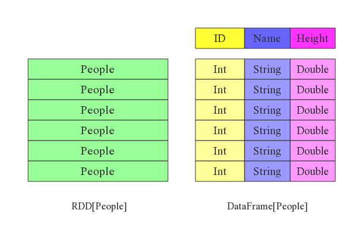
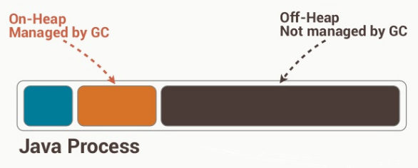
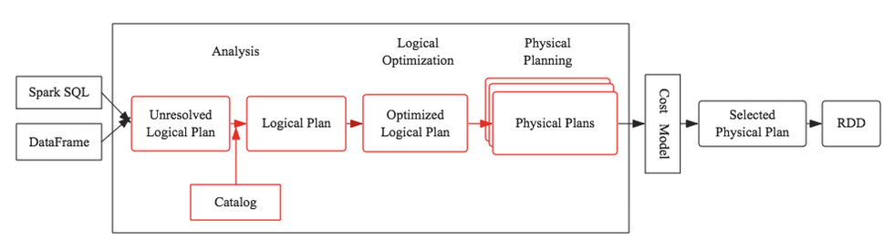
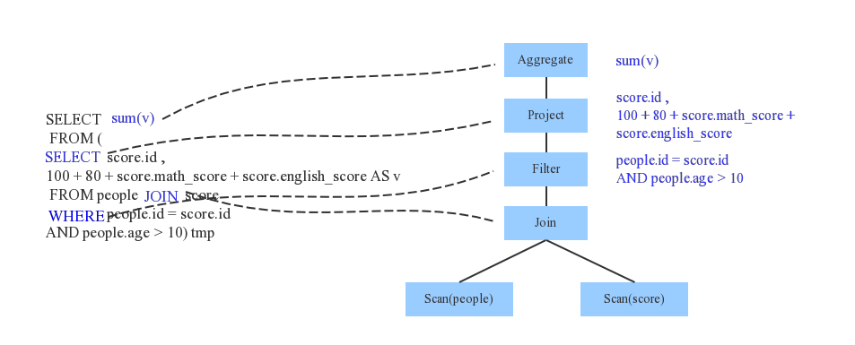
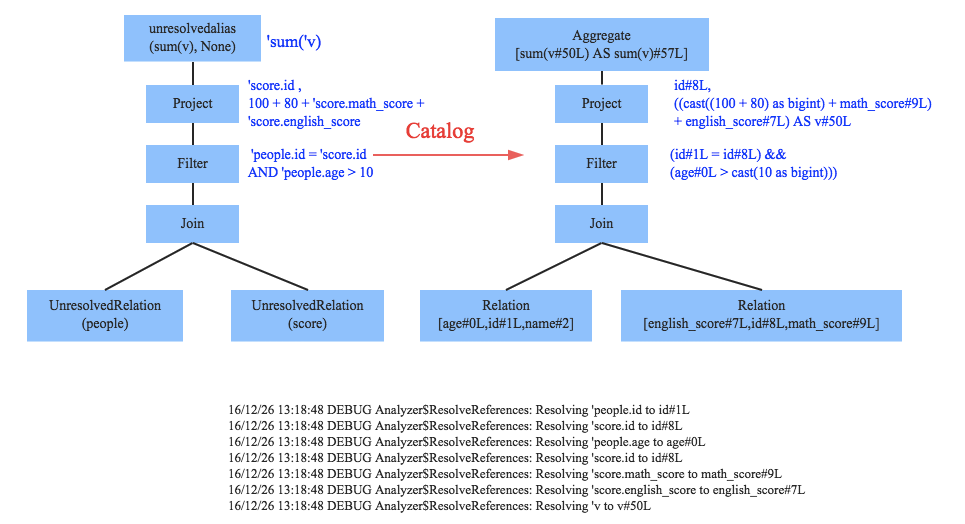
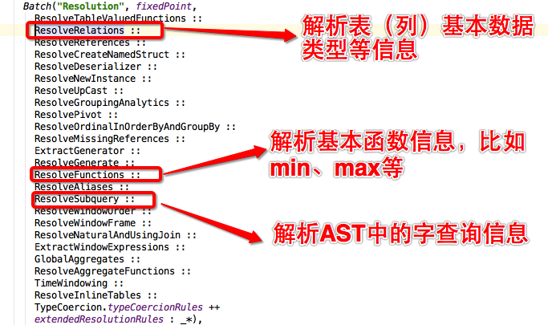
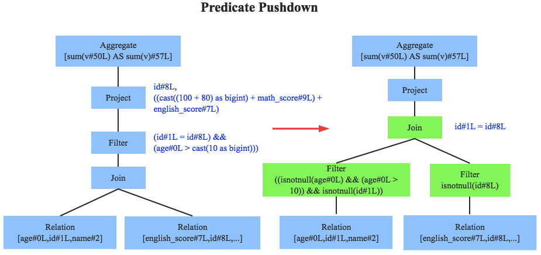
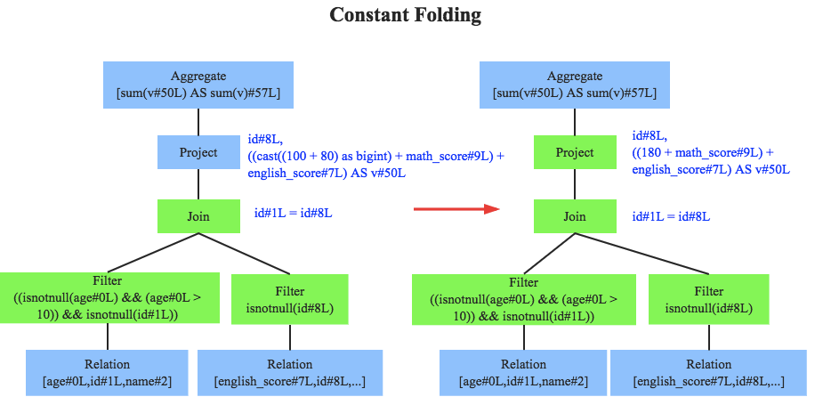

sparkSQL历史
============

对SparkSQL了解的童鞋或多或少听说过Shark，不错，Shark就是SparkSQL的前身。2011的时候，Hive可以说是SQL
On
Hadoop的唯一选择，负责将SQL解析成MR任务运行在大数据上，实现交互式查询、报表等功能。就在那个时候，Spark社区的小伙伴就意识到可以使用Spark作为执行引擎替换Hive中的MR，这样可以使Hive的执行效率得到极大提升。这个思想的产物就是Shark，所以从实现功能上来看，Shark更像一个Hive
On Spark实现版本。

改造完成刚开始，Shark确实比Hive的执行效率有了极大提升。然而，随着改造的深入，发现因为Shark继承了大量Hive代码导致添加优化规则等变得异常困难，优化的前景不再那么乐观。在意识到这个问题之后，Spark社区经过一段时间激烈的思想斗争之后，还是毅然决然的在2014年彻底放弃了Shark，转向SparkSQL。

sparkSQL体系结构
================

{width="4.978974190726159in"
height="2.6729166666666666in"}

sparkSQL体系结构整体由上到下分为三层：编程模型层、执行任务优化层以及任务执行引擎层。

(1)其中SparkSQL编程模型可以分为SQL和DataFrame两种。

(2)执行计划优化又称为Catalyst，该模块负责将SQL语句解析成AST（逻辑执行计划），并对原始逻辑执行计划进行优化，优化规则分为基于规则的优化策略和基于代价的优化策略两种，最终输出优化后的物理执行计划。

(3)任务执行引擎就是Spark内核，负责根据物理执行计划生成DAG，在任务调度系统的管理下分解为任务集并分发到集群节点上加载数据运行，Tungsten基于对内存和CPU的性能优化，使得Spark能够更好地利用当前硬件条件提升性能。

2.1编程模型 –DataFrame

第一次变革：MR编程模型 -&gt; DAG编程模型

和MR计算模型相比，DAG计算模型有很多改进：

(1)可以支持更多的算子，比如filter算子、sum算子等，不再像MR只支持map和reduce两种

(2)更加灵活的存储机制，RDD可以支持本地硬盘存储、缓存存储以及混合存储三种模式，用户可以进行选择。而MR目前只支持HDFS存储一种模式。很显然，HDFS存储需要将中间数据存储三份，而RDD则不需要，这是DAG编程模型效率高的一个重要原因之一。

(3)DAG模型带来了更细粒度的任务并发，不再像MR那样每次起个任务就要起个JVM进程，重死了；另外，DAG模型带来了另一个利好是很好的容错性，一个任务即使中间断掉了，也不需要从头再来一次。

(4)延迟计算机制一方面可以使得同一个stage内的操作可以合并到一起落在一块数据上，而不再是所有数据先执行a操作、再扫描一遍执行b操作，太浪费时间。另一方面给执行路径优化留下了可能性，随便你怎么优化…

第二次变革：DAG编程模型 -&gt; DataFrame编程模型

相比RDD，DataFrame增加了scheme概念，从这个角度看，DataFrame有点类似于关系型数据库中表的概念。

{width="5.347222222222222in"
height="3.6058016185476816in"}

(1)
RDD中每一行纪录都是一个整体，因此你不知道内部数据组织形式，这就使得你对数据项的操作能力很弱。表现出来就是支持很少的而且是比较粗粒度的算子，比如map、filter算子等。而DataFrame将一行切分了多个列，每个列都有一定的数据格式，这与数据库表模式就很相似了，数据粒度相比更细，因此就能支持更多更细粒度的算子，比如select算子、groupby算子、where算子等。

(2)DataFrame提供Schema视图，数据项的转换也都将是类型安全的，这对于较为复杂的数据计算程序的调试是十分有利的，很多数据类型不匹配的问题都可以在编译阶段就被检查出来，而对于不合法的数据文件，DataFrame也具备一定分辨能力。

(3)DataFrame
schema的存在，开辟了另一种数据存储形式：列式数据存储。列式存储是相对于传统的行式存储而言的，简单来讲，就是将同一列的所有数据物理上存储在一起。

2.  RDD、DataFrame 与DataSet

（1）RDD

(a)RDD是一个懒执行的不可变的可以支持Lambda表达式的并行数据集合。

(b)RDD的最大好处就是简单，API的人性化程度很高。

> (c)RDD的劣势是性能限制，它是一个JVM驻内存对象，这也就决定了存在GC的限制和数据增加时Java序列化成本的升高。

（2）DataFrame

(a)DataFrame是为数据提供了Schema的视图。可以把它当做数据库中的一张表来对待

(b)DataFrame也是懒执行的。

(c)性能上比RDD要高，主要有两方面原因：

> 内存使用
> ：数据以二进制的方式存在于非堆内存，节省了大量空间之外，还摆脱了GC的限制
>
> {width="4.388888888888889in"
> height="1.7674978127734033in"}

优化的执行计划 ：查询计划通过Spark catalyst optimiser进行优化.

(3)DataSet

(a)是Dataframe API的一个扩展，是Spark最新的数据抽象

(b)用户友好的API风格，既具有类型安全检查也具有Dataframe的查询优化特性。

(c)Dataset支持编解码器，当需要访问非堆上的数据时可以避免反序列化整个对象，提高了效率。

(d)样例类被用来在Dataset中定义数据的结构信息，样例类中每个属性的名称直接映射到DataSet中的字段名称。

(e)Dataframe是Dataset的特列，DataFrame=Dataset\[Row\]
，所以可以通过as方法将Dataframe转换为Dataset。Row是一个类型，跟Car、Person这些的类型一样，所有的表结构信息我都用Row来表示。

(f)DataSet是强类型的。

DataFrame只是知道字段，但是不知道字段的类型，所以在执行这些操作的时候是没办法在编译的时候检查是否类型失败的，比如你可以对一个String进行减法操作，在执行的时候才报错，而DataSet不仅仅知道字段，而且知道字段类型，所以有更严格的错误检查。就跟JSON对象和类对象之间的类比。

执行计划优化(Catalyst)
======================

3.1什么是Catalyst

Catalyst为SparkSQL的优化器，Catalyst支持基于规则和基于成本的优化。

Catalyst的核心是使用一个通用库生成树并使用规则操作这些树。在该框架的基础上，构建了用于关系查询处理库（例如表达式，逻辑查询计划）和处理执行查询不同阶段的几组规则：分析、逻辑优化、物理计划和代码生成。

{width="5.517946194225722in"
height="1.4861111111111112in"}

3.2 Catalyst工作流程

任何一个优化器工作原理都大同小异：SQL语句首先通过Parser模块被解析为语法树，此棵树称为Unresolved
Logical Plan；Unresolved Logical
Plan通过Analyzer模块借助于数据元数据解析为Logical
Plan；此时再通过各种基于规则的优化策略进行深入优化，得到Optimized
Logical
Plan；优化后的逻辑执行计划依然是逻辑的，并不能被Spark系统理解，此时需要将此逻辑执行计划转换为Physical
Plan。

\(1) Parser

Parser简单来说是将SQL字符串切分成一个一个Token，再根据一定语义规则解析为一棵语法树。Parser模块目前基本都使用第三方类库ANTLR进行实现，比如Hive、
Presto、SparkSQL等。下图是一个示例性的SQL语句（有两张表，其中people表主要存储用户基本信息，score表存储用户的各种成绩），通过Parser解析后的AST语法树如右图所示：

{width="5.736111111111111in"
height="2.317648731408574in"}

\(2) Analyzer

通过解析后的逻辑执行计划基本有了骨架，但是系统并不知道score、sum这些都是些什么鬼，此时需要基本的元数据信息来表达这些词素，最重要的元数据信息主要包括两部分：表的Scheme和基本函数信息，表的scheme主要包括表的基本定义（列名、数据类型）、表的数据格式（Json、Text）、表的物理位置等，基本函数信息主要指类信息。

Analyzer会再次遍历整个语法树，对树上的每个节点进行数据类型绑定以及函数绑定，比如people词素会根据元数据表信息解析为包含age、id以及name三列的表，people.age会被解析为数据类型为int的变量，sum会被解析为特定的聚合函数，如下图所示：

{width="5.282054899387576in"
height="2.8680555555555554in"}

SparkSQL中Analyzer定义了各种解析规则，有兴趣深入了解的童鞋可以查看Analyzer类，其中定义了基本的解析规则，如下：

{width="5.334718941382327in"
height="3.1631944444444446in"}

\(3) Optimizer

优化器是整个Catalyst的核心，上文提到优化器分为基于规则优化和基于代价优化两种，当前SparkSQL
2.1依然没有很好的支持基于代价优化（下文细讲），此处只介绍基于规则的优化策略，基于规则的优化策略实际上就是对语法树进行一次遍历，模式匹配能够满足特定规则的节点，再进行相应的等价转换。因此，基于规则优化说到底就是一棵树等价地转换为另一棵树。SQL中经典的优化规则有很多，下文结合示例介绍三种比较常见的规则：谓词下推（Predicate
Pushdown）、常量累加（Constant Folding）和列值裁剪（Column Pruning）。

{width="5.243055555555555in"
height="2.4712937445319336in"}

图左边是经过Analyzer解析后的语法树，语法树中两个表先做join，之后再使用age&gt;10对结果进行过滤。大家知道join算子通常是一个非常耗时的算子，耗时多少一般取决于参与join的两个表的大小，如果能够减少参与join两表的大小，就可以大大降低join算子所需时间。谓词下推就是这样一种功能，它会将过滤操作下推到join之前进行，上图中过滤条件age&gt;0以及id!=null两个条件就分别下推到了join之前。这样，系统在扫描数据的时候就对数据进行了过滤，参与join的数据量将会得到显著的减少，join耗时必然也会降低。

{width="5.404581146106737in"
height="2.6847222222222222in"}

常量累加其实很简单，就是上文中提到的规则  x+(1+2)  -&gt;
x+3，虽然是一个很小的改动，但是意义巨大。示例如果没有进行优化的话，每一条结果都需要执行一次100+80的操作，然后再与变量math\_score以及english\_score相加，而优化后就不需要再执行100+80操作。
