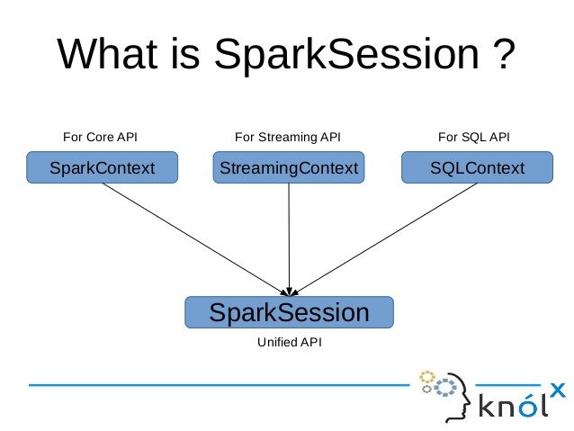

spark session
=============

SparkSession 是 Spark SQL 的入口。使用 Dataset 或者 Datafram 编写 Spark
SQL 应用的时候，第一个要创建的对象就是 SparkSession。你可以通过
SparkSession.builder 来创建一个 SparkSession 的实例,并通过 stop
函数来停止 SparkSession。

**SparkSession - Spark的新入口点**

{width="4.868055555555555in"
height="3.6548512685914263in"}

对于SQL sqlContext和hive hiveContext.，因为dataSet和DataFrame
API正在成为新的独立API，我们需要为它们构建入口点。 因此在spark
2.0中，我们为DataSet和DataFrame
API创建了一个新的入口点构建，称为Spark-Session。

1主要参数

(1)SparkSession.builder()

创建此方法用于构造SparkSession。

(2)master(“local”)

设置要连接的master URL，例如：

“local”在本地运行

“local\[4\]”以4核在本地运行

“spark://master:7077”在spark独立集群上运行

(3)appName( )

设置将在spark Web UI中显示的应用程序的名称。

如果未设置应用程序名称，则将使用随机生成的名称。

(4)Config()

设置使用此方法设置的配置选项会自动传递到'SparkConf'和'SparkSession'自己的配置，它的参数由键值对组成。
