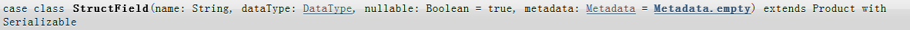
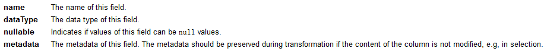
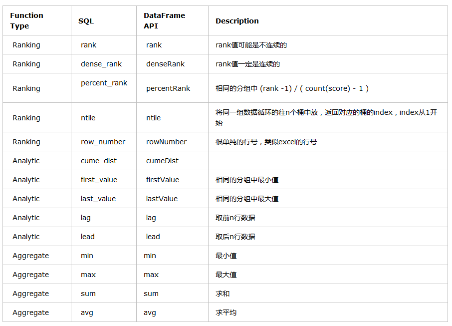

1.spark SQL操作
===============

1.1创建 dataframes（json源）

{"age":"40","name":"ls"}

{"age":"50","name":"ww"}

\[hadoop@h201 hadoop-2.7.2\]\$ bin/hadoop fs -put
/home/hadoop/people.json /

scala&gt; val df = spark.read.json("hdfs://h201:9000/people.json")

scala&gt; df.show()

（查看df中所有内容）

1.2 基本sql操作

scala&gt; df.printSchema()

(查看表结构, Schema就是我们数据的数据结构描述)

scala&gt; df.select("name").show()

（查看name字段）

scala&gt; df.select(\$"name", \$"age" + 1).show()

scala&gt; df.filter(\$"age" &gt; 31).show()

（过滤age大于31的）

scala&gt; df.groupBy("age").count().show()

（按年龄分组，计算每分组中的数量）

1.3运行标准sql

scala&gt; df.createOrReplaceTempView("people")

（需要先创建临时视图，才能使用标准sql）

scala&gt; val sqlDF = spark.sql("SELECT \* FROM people")

scala&gt; sqlDF.show()

1.4 创建全局视图

关闭当前会话前，所有会话生效

scala&gt; df.createGlobalTempView("people")

scala&gt; spark.sql("SELECT \* FROM global\_temp.people").show()

scala&gt; spark.newSession().sql("SELECT \* FROM
global\_temp.people").show()

1.5 创建dataset

**import spark**.implicits.\_

scala&gt; case class Person(name: String, age: Long)

scala&gt; val caseClassDS = Seq(Person("Andy", 32)).toDS()

scala&gt; caseClassDS.show()

scala&gt; val primitiveDS = Seq(1, 2, 3).toDS()

scala&gt; primitiveDS.map(\_ + 1).collect()

\[hadoop@h201 \~\]\$ vi people1.json

{"age":50,"name":"haha"}

{"age":60,"name":"hehe"}

（注意：格式要跟Person一样）

scala&gt; val peopleDS =
spark.read.json("hdfs://h201:9000/people1.json").as\[Person\]

(json 转换为dataset)

scala&gt; peopleDS.show()

1.6 rdd转换为dataframes （rdd源）

\[hadoop@h201 \~\]\$ vi people.txt

zhangsan,40

lisi,50

\[hadoop@h201 hadoop-2.7.2\]\$ bin/hadoop fs -put
/home/hadoop/people.txt /

scala&gt; case class Person(name: String, age: Long)

scala&gt; val peopleDF =
sc.textFile("hdfs://h201:9000/people.txt").map(\_.split(",")).map(a
=&gt; Person(a(0), a(1).trim.toInt)).toDF()

scala&gt; peopleDF.createOrReplaceTempView("people")

scala&gt; val teenagersDF = spark.sql("SELECT name, age FROM people
WHERE age BETWEEN 35 AND 45")

scala&gt; teenagersDF.map(teenager =&gt; "Name: " + teenager(0)).show()

（通过索引号访问DF）

scala&gt; teenagersDF.map(teenager =&gt; "Name: " +
teenager.getAs\[String\]("name")).show()

(通过列名访问)

scala&gt; implicit val mapEncoder =
org.apache.spark.sql.Encoders.kryo\[Map\[String, Any\]\]

(隐式转换，Encoders编码器后面的类型)

scala&gt; teenagersDF.map(teenager =&gt;
teenager.getValuesMap\[Any\](List("name", "age"))).collect()

1.7 StructType

1.7.1StructField

作用：

定义字段结构, 一个结构体内部的
一个StructField就像一个SQL中的一个字段一样

格式：

{width="5.768055555555556in"
height="0.1951388888888889in"}

{width="6.517361111111111in"
height="0.6680555555555555in"}

nullable: 指示这个字段的指是否可以为空值

metadata: 字段的元数据。如果不修改列的内容，则在转换期间应保存元数据

(常规情况下，我们只使用前3个参数)

scala&gt; import org.apache.spark.sql.types.\_

scala&gt; val abc = new StructField("aa",IntegerType)

scala&gt; println(abc.name)

scala&gt; println(abc.dataType)

scala&gt; println(abc.nullable)

scala&gt; println(abc.metadata)

1.7.2 structType

一个StructType对象，可以有多个StructField,同时也可以用名字（name）来提取,就想当于Map可以用key来提取value，但是他StructType提取的是整条字段的信息

scala&gt; import org.apache.spark.sql.types.\_

val innerStruct =

StructType(

StructField("f1", IntegerType, true) ::

StructField("f2", LongType, false) ::

StructField("f3", BooleanType, false) :: Nil)

val struct = StructType(

StructField("a", innerStruct, true) :: Nil)

注：

::为追加

Nil 为空list

StructType要求输入数StructField构成的数组Array，只有一列的情况下，加Nil运算生成Array

开发例子：

package com.spark6\
\
import org.apache.spark.sql.{Row, SparkSession}\
import org.apache.spark.sql.types.{IntegerType, StringType, StructField,
StructType}\
\
object ss {\
def main(args: Array\[String\]) {\
val ssql =
SparkSession.builder().master("local\[2\]").appName("sstest1")\
.config("spark.some.config.option", "some-value").getOrCreate()\
val personRDD =
ssql.sparkContext.textFile("c:\\\\abc1\\\\a.txt").map(\_.split(" "))\
//通过StructType直接指定每个字段的schema\
val schema = StructType(\
List(\
StructField("id", IntegerType, true),\
StructField("name", StringType, true),\
StructField("age", IntegerType, true)\
)\
)\
//将RDD映射到rowRDD\
val rowRDD = personRDD.map(p =&gt; Row(p(0).toInt, p(1).trim,
p(2).toInt))\
//将schema信息应用到rowRDD上\
val personDataFrame = ssql.createDataFrame(rowRDD, schema)\
personDataFrame.show()\
\
ssql.stop()\
}\
\
}

1.8指定schema 开发

没有使用case class方式

scala&gt; import org.apache.spark.sql.types.\_

scala&gt; import org.apache.spark.sql.\_

scala&gt; val peopleRDD = sc.textFile("hdfs://h201:9000/people.txt")

（创建RDD）

scala&gt; val schemaString = "name age"

scala&gt; val fields = schemaString.split(" ").map(fieldName =&gt;
StructField(fieldName, StringType, nullable = true))

scala&gt; val schema = StructType(fields)

scala&gt; val rowRDD = peopleRDD.map(\_.split(",")).map(attributes =&gt;
Row(attributes(0), attributes(1).trim))

scala&gt; val peopleDF = spark.createDataFrame(rowRDD, schema)

（使用schema 把RDD创建为DF）

scala&gt; peopleDF.createOrReplaceTempView("people")

scala&gt; val results = spark.sql("SELECT name FROM people")

scala&gt; results.map(attributes =&gt; "Name: " + attributes(0)).show()

2.spark sql窗口函数
===================

2.1 窗口函数分类

ranking 排名类、analytic 分析类、aggregate 聚合类

{width="5.768055555555556in"
height="4.157638888888889in"}

2.2函数使用方法

count(...) over(partition by ... order by ...)--求分组后的总数。

sum(...) over(partition by ... order by ...)--求分组后的和。

max(...) over(partition by ... order by ...)--求分组后的最大值。

min(...) over(partition by ... order by ...)--求分组后的最小值。

avg(...) over(partition by ... order by ...)--求分组后的平均值。

rank() over(partition by ... order by ...)--rank值可能是不连续的。

dense\_rank() over(partition by ... order by ...)--rank值是连续的。

first\_value(...) over(partition by ... order by
...)--求分组内的第一个值。

last\_value(...) over(partition by ... order by
...)--求分组内的最后一个值。

lag() over(partition by ... order by ...)--取出前n行数据。　　

lead() over(partition by ... order by ...)--取出后n行数据。

ratio\_to\_report() over(partition by ... order by
...)--Ratio\_to\_report() 括号中就是分子，over() 括号中就是分母。

2.3 函数应用

（1）**ntile(4) over (partition by lesson order by score desc ) as
ntile\_2**

Ntile\_2 单独出现一列，ntile(4)为索引号，即可以理解为分组排序后的排名

（如果分组中有5个值，也显示4个索引号（1,2,3,4））

（2）**row\_number() over (partition by lesson order by score desc ) as
row\_number**

分组排序后的 行号

（3）**rank() over (partition by lesson order by score desc ) as rank**

分组排序后的 排名（如果score相同，排名不变）

\[hadoop@h201 \~\]\$ hadoop-2.7.2/bin/hadoop fs -put s1.json /

\[hadoop@h201 \~\]\$ hadoop-2.7.2/bin/hadoop fs -cat /s1.json

{"name":"zs","lesson":"Math","score":100}

{"name":"ls","lesson":"Math","score":90}

{"name":"ww","lesson":"Math","score":80}

{"name":"zl","lesson":"Math","score":50}

{"name":"zs","lesson":"Chinese","score":99}

{"name":"ls","lesson":"Chinese","score":98}

{"name":"ww","lesson":"Chinese","score":75}

{"name":"zl","lesson":"Chinese","score":100}

{"name":"zs","lesson":"English","score":95}

{"name":"ls","lesson":"English","score":90}

{"name":"ww","lesson":"English","score":65}

{"name":"zl","lesson":"English","score":92}

编写脚本

**import** org.apache.spark.sql.SparkSession\
**object** SqlTest {\
**def** main(args: Array\[String\]): Unit = {\
**val** spark = SparkSession\
.*builder*()\
.appName(**"Spark SQL"**)\
.getOrCreate()\
**val** s1 = spark.read.json(**"hdfs://h201:9000/s1.json"**)\
s1.createOrReplaceTempView(**"score1"**)\
**val** sqll =\
**"""select name,lesson,score,ntile(4) over(partition by lesson order by
score desc) as ntile,row\_number() over(partition by lesson order by
score desc) as row\_number,rank() over(partition by lesson order by
score desc) as rank from score1 order by lesson,name,score"""\
**spark.sql(sqll).show()\
spark.stop()\
}\
}

\[hadoop@h201 \~\]\$ spark-2.1.1-bin-hadoop2.7/bin/spark-submit --class
"SqlTest" spark2020.jar
