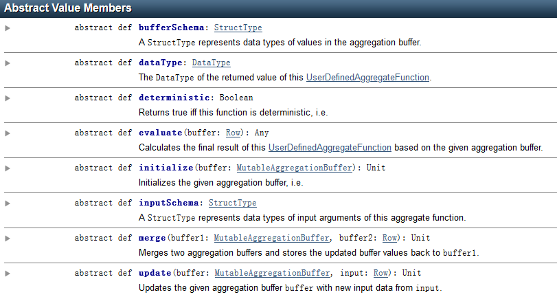
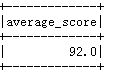
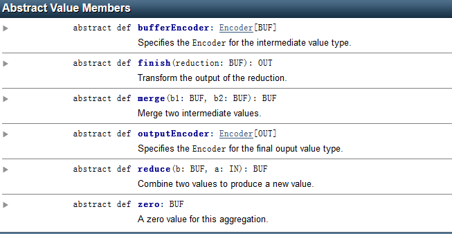
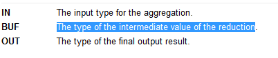
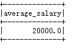

UDAF
====

### 什么是UDAF

UDAF（User Defined Aggregate
Function），即用户自定义的聚合函数，聚合函数和普通函数的区别是什么呢，普通函数是接受一行输入产生一个输出，聚合函数是接受一组（一般是多行）输入然后产生一个输出，即将一组的值想办法聚合一下（max、min、avg、count）。

### 1.1.1弱类型用户自定于聚合函数

实现弱类型的用户自定于聚合函数需要继承抽象类UserDefinedAggregateFunction，并重写该类的8个函数

{width="5.493055555555555in"
height="2.9458333333333333in"}

(1) bufferSchema

> 计算过程中产生的临时数据缓存的地方。
>
> （如：计算score的平均值时，需要用到score的总和sum以及score的总个数count这样的中间数据，那么就使用bufferSchema来定义它们）

(1) datatype

我们需要对自定义聚合函数的最终数据类型进行说明，使用dataType函数。

（如计算出的平均score是Double类型）

(1) deterministic

> deterministic函数用于对输入数据进行一致性检验，是一个布尔值，当为true时，表示对于同样的输入会得到同样的输出。
>
> (因为对于同样的score输入，肯定要得到相同的score平均值，所以定义为true)

(1) evaluate

> evaluate是一个计算方法，用于计算我们的最终结果。
>
> (如用于计算平均得分average(score)=sum(score)/count(score))

(1) initialize

> initialize用户初始化缓存数据。

(1) inputSchema

> 定义输入数据的Schema，要求类型是StructType，它的参数是由StructField类型构成的数组。

(1) merge

> merge将更新的缓存变量存入到缓存中

(1) update

> 当有新的输入数据时，update用户更新缓存变量。
>
> (比如这里当有新的score输入时，需要将它的值更新变量sum中，并将count加1)

### 1.1.2开发（UserDefinedAggregateFunction）

\[hadoop@h201 hadoop-2.7.2\]\$ bin/hadoop fs -put
/home/hadoop/score.json /

\[hadoop@h201 hadoop-2.7.2\]\$ bin/hadoop fs -cat /score.json

{"name":"zs","score":85.5}

{"name":"zs","score":90.5}

{"name":"zs","score":100}

自定义UADF函数求出平均分数

**package** com.zr1

**import** org.apache.spark.sql.{Row, SparkSession}\
**import** org.apache.spark.sql.expressions.{MutableAggregationBuffer,
UserDefinedAggregateFunction}\
**import** org.apache.spark.sql.types.\_\
**object** Mavg {\
**class** Mavg **extends** UserDefinedAggregateFunction{\
**override def** inputSchema: StructType = *StructType*(\
*StructField*(**"score\_column"**,DoubleType)::*Nil*)\
\
**override def** bufferSchema: StructType = *StructType*(\
*StructField*(**"sum"**,DoubleType)::*StructField*(**"count"**,LongType)::*Nil*)\
\
**override def** dataType: DataType = DoubleType\
\
**override def** deterministic: Boolean = **true\
\
override def** initialize(buffer: MutableAggregationBuffer): Unit = {\
*//sum=0.0\
*buffer(0)=0.0\
*//count=0\
*buffer(1)=0L\
}\
\
**override def** update(buffer: MutableAggregationBuffer, input: Row):
Unit = {\
*//输入非空\
***if**(!input.isNullAt(0)){\
*//sum=sum+输入的score\
*buffer(0)=buffer.getDouble(0)+input.getDouble(0)\
*//count=count+1\
*buffer(1)=buffer.getLong(1)+1\
}\
}\
\
**override def** merge(buffer1: MutableAggregationBuffer, buffer2: Row):
Unit = {\
buffer1(0)=buffer1.getDouble(0)+buffer2.getDouble(0)\
buffer1(1)=buffer1.getLong(1)+buffer2.getLong(1)\
}\
\
\
**override def** evaluate(buffer: Row): Double =
buffer.getDouble(0)/buffer.getLong(1)\
\
}\
\
**def** main(args: Array\[String\]): Unit = {\
**val** spark =
SparkSession.*builder*().master(**"local"**).appName(**"My-Average"**).getOrCreate()\
*//注册名为myAverage的自定义集成算子MyAverage\
*spark.udf.register(**"myAverage"**,**new** Mavg)\
\
*//读取HDFS文件系统数据data转换成指定列名的DataFrame\
***val** dataDF = spark.read.json(**"hdfs://h201:9000/score.json"**)\
*//创建临时视图\
*dataDF.createOrReplaceTempView(**"data"**)\
*//通过sql计算平均分数\
*spark.sql(**"select myAverage(score) as average\_score from
data"**).show()\
}\
}

服务器端执行

\[hadoop@h201 spark-2.1.1-bin-hadoop2.7\]\$ bin/spark-submit --class
"com.zr1.Mavg" /home/hadoop/qq/Mavg.jar

结果：

{width="1.2916666666666667in"
height="0.78125in"}

### 1.2.1强类型自定义函数 基于DataSet（Aggregator）

特点：

(1)继承Aggregator

(2)函数的使用必须是强类型数据集DataSet

(3)注意样例类case class以及Encoder编码器的使用方法

需要继承org.apache.spark.sql.expressions.Aggregator抽象类，并重写该类6个函数

{width="5.459027777777778in"
height="2.8256944444444443in"}

(1) bufferEncoder

缓冲数据编码方式

(1) finish

> 编写计算方法、计算最终的数据

(1) merge

> merge将更新的缓存变量存入到缓存中

(1) outputEncoder

最终数据输出编码方式

(1) reduce

> 相当与update函数，当有新的数据a时，更新中间数据b

(1) zero

> zero初始化函数，初始化存储数据

1.2.2 开发(Aggregator)

\[hadoop@h201 \~\]\$ hadoop-2.7.2/bin/hadoop fs -put emp.json /

\[hadoop@h201 \~\]\$ hadoop-2.7.2/bin/hadoop fs -cat /emp.json

{"name":"zs","sal":10000}

{"name":"ls","sal":20000}

{"name":"ww","sal":30000}

Aggregator\[Employee, Average, Double\]

Employee：为输入的数据

Average：为计算中，中间产生的数据

Double：为输出的数据

{width="4.1875in"
height="0.8854166666666666in"}

(1) 编写脚本

**package** com.zr1

**import** org.apache.spark.sql.expressions.Aggregator\
**import** org.apache.spark.sql.Encoder\
**import** org.apache.spark.sql.Encoders\
**import** org.apache.spark.sql.SparkSession\
*//\
\
***object** Myavg2 {\
\
*// 自定义输入类型和输出类型\
***case class** Employee(name: String, sal: Long)\
**case class** Average(**var** sum: Long, **var** count: Long)\
\
**object** MyAverage **extends** Aggregator\[Employee, Average, Double\]
{\
*// 0值\
***override def** zero: Average = *Average*(0L, 0L)\
*// 合并，输入和buffer\
***override def** reduce(buffer: Average, emp: Employee): Average = {\
buffer.sum += emp.sal\
buffer.count += 1\
buffer\
}\
*// 合并中间结果\
***override def** merge(b1: Average, b2: Average): Average = {\
b1.sum += b2.sum\
b1.count += b2.count\
b1\
}\
*// 转换reduce的输出类型\
***override def** finish(reduction: Average): Double =
reduction.sum.toDouble / reduction.count\
*// 为中间值类型指定编码器\
***override def** bufferEncoder: Encoder\[Average\] = Encoders.*product\
// 为输出类型指定编码器。\
***override def** outputEncoder: Encoder\[Double\] =
Encoders.*scalaDouble\
*}\
\
**def** main(args: Array\[String\]): Unit = {\
**val** spark = SparkSession\
.*builder*()\
.appName(**"Spark SQL user-defined Datasets aggregation example"**)\
.getOrCreate()\
\
**import** spark.implicits.\_\
\
**val** ds =
spark.read.json(**"hdfs://h201:9000/emp.json"**).as\[Employee\]\
ds.show()\
\
**val** averageSalary = MyAverage.toColumn.name(**"average\_salary"**)\
**val** result = ds.select(averageSalary)\
result.show()\
spark.stop()\
}\
}

（2）打成jar包，拷贝到spark上执行

\[hadoop@h201 \~\]\$ spark-2.1.1-bin-hadoop2.7/bin/spark-submit --class
"Myavg2" spark2020.jar

结果：

{width="1.34375in"
height="0.875in"}
