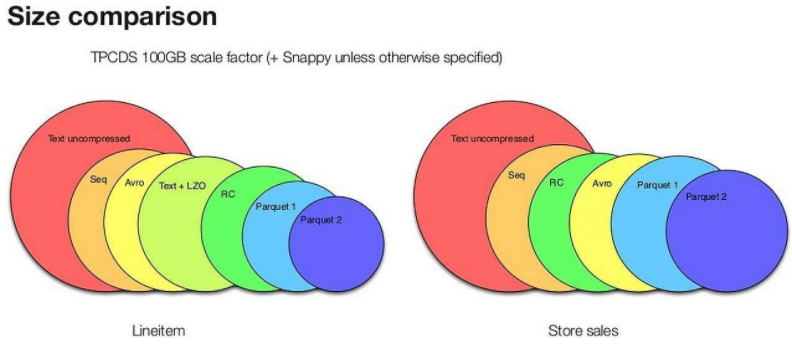

### Spark数据源

### 1.1Parquet文件

**1.1.1parquet格式**

Parquet
采用了一种嵌套的文件格式，简单理解为它的数据结构是树状层层嵌套的，类似于Json那种可以嵌套的格式。逻辑上，他的数据不是扁平的，有些字段可有可无。

**1.1.2parquet特点：**

Parquet的特点

1）Apache Parquet是一种能够有效存储嵌套数据的列式存储格式。

2）由于是列式存储格式，在文件大小和查询性能上表现优秀。

列式存储的优势：

由于每一列的数据类型相同，所以，可以针对不同数据类型的列进行不同的编码和压缩，大大降低数据存储所占空间。

使用不同存储格式来存储TPC-DS数据集中的两个不同的表数据的文件大小。可以看出，Parquet较其他二进制文件存储格式能够更有效地节省存储空间，尤其是新版的Parquet2，它使用了更高效的也存储方式。

读取数据的时候可以把映射下推，只需要读取需要的列，这样可以大大减少每次查询的I/O数据量。

由于每一列的数据类型相同，可以使用更加适合CPU
pipeline的编码方式，减小CPU的缓存失效。

{width="5.766666666666667in"
height="2.526388888888889in"}

3）灵活性:

Parquet分为2部分，一部分是以与语言无关的方式来定义文件格式的Parquet规范（Parquet-format），另一部分是不同语言的实现规范。（MapReduce，pig，Hive，Cascading，Crunch和Spark都支持Parquet格式）

Parquet的灵活性同样延伸至内存中的表示方法，Java的实现并没有绑定某一种表示方法，因而可以使用Avro，Thrift或者Protocol
Buffers等多种内存数据表示法来将数据写入Parquet或者从Parquet文件中读取数据到内存。

scala&gt; import spark.implicits.\_

scala&gt; val df1 = spark.read.json("hdfs://h201:9000/people.json")

保存为qarquet格式

scala&gt; df1.write.parquet("hdfs://h201:9000/p1.parquet")

读取parquet文件创建df

scala&gt; val parquetFileDF =
spark.read.parquet("hdfs://h201:9000/p1.parquet")

scala&gt; parquetFileDF.createOrReplaceTempView("parquetFile")

scala&gt; val namesDF = spark.sql("SELECT name FROM parquetFile WHERE
age BETWEEN 25 AND 45")

scala&gt; namesDF.map(attributes =&gt; "Name: " + attributes(0)).show()

### 1.2 Parquet合并

scala&gt; import spark.implicits.\_

scala&gt; val squaresDF = spark.sparkContext.makeRDD(1 to 5).map(i =&gt;
(i, i \* i)).toDF("value", "square")

scala&gt; squaresDF.write.parquet("data/test\_table/key=1")

scala&gt; val cubesDF = spark.sparkContext.makeRDD(6 to 10).map(i =&gt;
(i, i \* i \* i)).toDF("value", "cube")

scala&gt; cubesDF.write.parquet("data/test\_table/key=2")

读取两个表的父级目录，合并为一个表

scala&gt; val mergedDF = spark.read.option("mergeSchema",
"true").parquet("data/test\_table")

scala&gt; mergedDF.printSchema()

root

|-- value: integer (nullable = true)

|-- square: integer (nullable = true)

|-- cube: integer (nullable = true)

|-- key: integer (nullable = true)

### 1.3 json 数据集

scala&gt; val path = "hdfs://h201:9000/people.json"

scala&gt; val peopleDF = spark.read.json(path)

scala&gt; peopleDF.printSchema()
