### 什么是RDD

> RDD（Resilient Distributed
> Dataset）叫做弹性分布式数据集，是Spark中最基本的数据抽象，它代表一个不可变（只读）、可分区、里面的元素可并行计算的集合。
>
> 1.1分区
>
> 可以将 RDD
> 理解为一个分布式对象集合，本质上是一个只读的分区记录集合。每个 RDD
> 可以分成多个分区，每个分区就是一个数据集片段。
>
> 分区是RDD内部并行计算的一个计算单元，RDD的数据集在逻辑上被划分为多个分片，每一个分片称为分区，分区的格式决定了并行计算的粒度，而每个分区的数值计算都是在一个任务中进行的，因此任务的个数，也是由RDD的分区数决定。
>
> 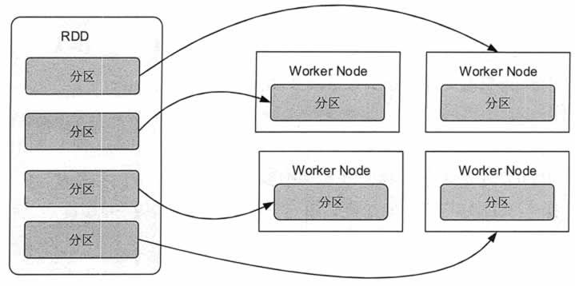{width="5.25in"
> height="2.6131944444444444in"}
>
> 分区的原则：
>
> RDD分区的一个分区原则是使得分区个数尽量等于集群中的CPU核心（core）数量。分区过多并不会增加执行速度。
>
> 例如，我们集群有10个core，我们分5个区，每个core执行一个分区操作，剩下5个core浪费。如果，我们分20分区，一个core执行一个分区，剩下的10分区将会排队等待。

默认分区数目：

> spark.default.parallelism这个参数值，来配置默认分区。

为什么要进行分区：

> Spark把rdd进行分区（分片），放在集群上并行计算。同一个rdd分片100个，10个节点，平均一个节点10个分区，当进行sum型的计算的时候，先进行每个分区的sum，然后把sum值shuffle传输到主程序进行全局sum，所以进行sum型计算对网络传输非常小。但对于进行join型的计算的时候，需要把数据本身进行shuffle，网络开销很大。
>
> 1.2RDD特性
>
> (1)只读：不能修改，只能通过转换操作生成新的 RDD。
>
> (2)分布式：可以分布在多台机器上进行并行处理。
>
> (3)弹性：计算过程中内存不够时它会和磁盘进行数据交换。
>
> (4)基于内存：可以全部或部分缓存在内存中，在多次计算间重用。

### RDD容错性

> RDD通过Lineage（血统）实现数据的容错性。
>
> 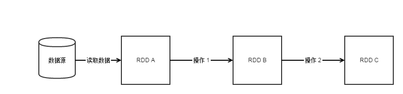{width="5.768055555555556in"
> height="1.354861111111111in"}
>
> 当假如我们在操作 2 时，发现RDD B 丢失，我们就可以直接从RDD A 进行 操作
> 1 而生成RDD B，接着我们就可以继续进行操作 2了。

### RDD依赖

> RDD通过操作算子进行转换，转换得到的新RDD包含了从其他RDDs衍生所必需的信息，RDD之间维护着这种血缘关系，也称之为依赖。依赖包括两种，一种是窄依赖，另一种是宽依赖。

1.  窄依赖

> 每个父RDD的一个Partition最多被子RDD的一个Partition所使用（1:1 或
> n:1）。例如map、filter、union等操作都会产生窄依赖；子RDD分区通常对应常数个父RDD分区(O(1)，与数据规模无关）。

(2)宽依赖

> 一个父RDD的Partition会被多个子RDD的Partition所使用，例如groupByKey
>
> 、reduceByKey、sortByKey等操作都会产生宽依赖；（1:m 或 n:m）。
>
> 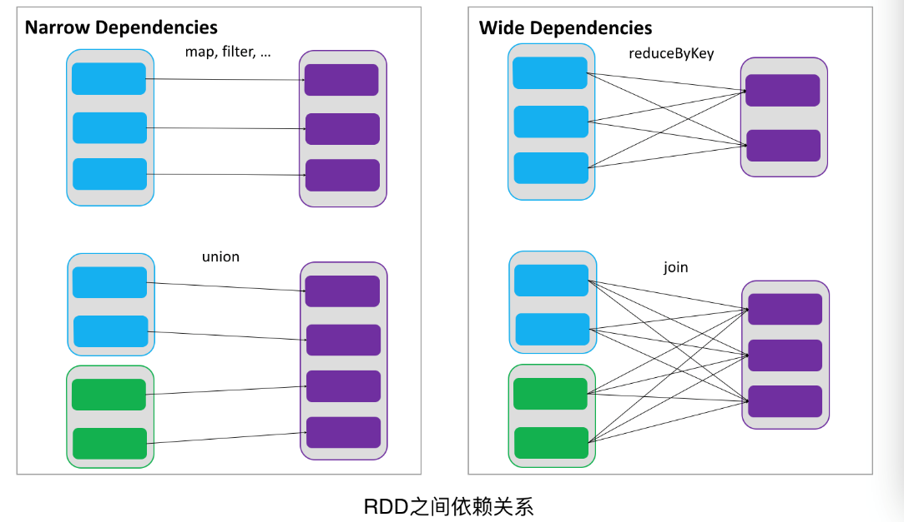{width="4.916666666666667in"
> height="2.848611111111111in"}
>
> 通过RDDs之间的这种依赖关系，一个任务流可以描述为DAG(有向无环图)，在实际执行过程中宽依赖对应于Shuffle(reduceByKey和join)，窄依赖中的所有转换操作可以通过类似于管道的方式一气呵成执行(map和union可以一起执行)。
>
> 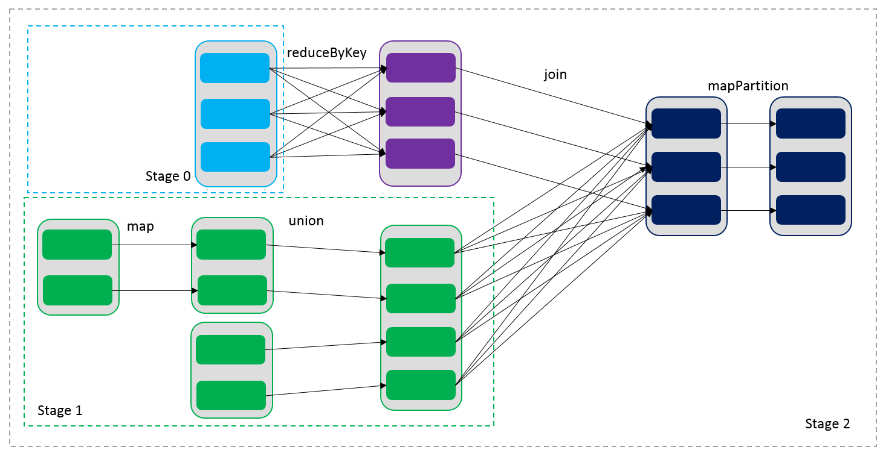{width="5.089583333333334in"
> height="2.611111111111111in"}
>
> 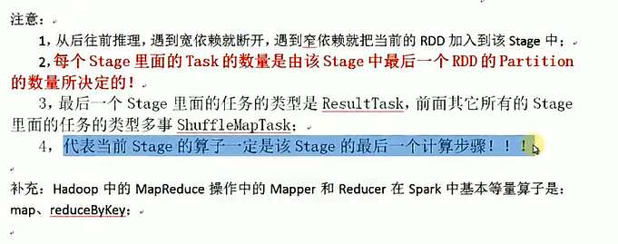{width="5.767361111111111in"
> height="2.2777777777777777in"}

1.  ### RDD依赖源码

    Spark官网scala API中搜索

    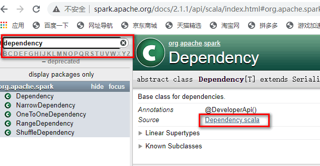{width="5.763888888888889in"
    height="2.98125in"}

RDD三种依赖关系，分别是
ShuffleDependency、RangeDependency和OneToOneDependency三种依赖关系。org.apache.spark.Dependency有两个一级子类，分别是
ShuffleDependency 和 NarrowDependency。其中，NarrowDependency
是一个抽象类，它有二个实现类，分别是OneToOneDependency、RangeDependency

1.  #### 窄依赖

    **1）OneToOneDependency的getParent实现如下**：

    override def getParents(partitionId: Int): List\[Int\] =
    List(partitionId)

    就一行代码，实现比较简单，子RDD对应的partition index 跟父 RDD
    的partition 的 index 一样。相当于父RDD 的 每一个partition 复制到
    子RDD 的对应分区中，分区的关系是一对一的。RDD的关系也是一对一的。

    **2）RangeDependency的 getParent 实现如下**

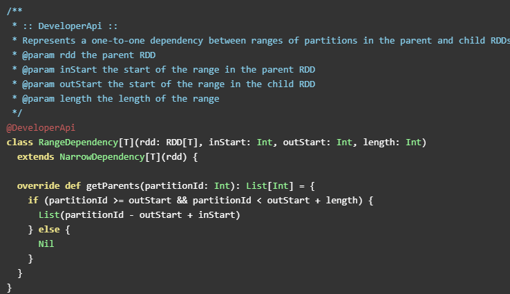{width="5.7659722222222225in"
height="3.3201388888888888in"}

首先解释三个变量：inStart：父RDD  range 的起始位置；outStart：子RDD
range 的起始位置；length：range 的长度。

获取 父RDD 的partition index 的规则是：如果子RDD 的 partition index
在父RDD 的range 内，则返回的 父RDD partition是 子RDD partition index -
父 RDD 分区range 起始 + 子RDD 分区range 起始。其中，（- 父 RDD 分区range
起始 + 子RDD 分区range 起始）即 子RDD 的分区的 range 起始位置和 父RDD
的分区的 range 的起始位置 的相对距离。子RDD 的 parttion index
加上这个相对距离就是 对应父的RDD partition。否则是无依赖的父 RDD
的partition index。父子RDD的分区关系是一对一的。RDD
的关系可能是一对一（length 是1 ，就是特殊的
OneToOneDependency），也可能是多对一，也可能是一对多。

1.  #### 宽依赖

    ShuffleDependency，ShuffleDependency代表的是 一个 shuffle stage
    的输出。先来看其构造方法，即其依赖的变量或实例：

    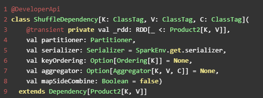{width="5.583333333333333in"
    height="2.0833333333333335in"}

    其中，\_rdd
    代指父RDD实例；partitioner是用于给shuffle的输出分区的分区器；serializer，主要用于序列化，默认是org.apache.spark.serializer.JavaSerializer，可以通过\`spark.serializer\`
    参数指定；keyOrdering RDD shuffle的key
    的顺序。aggregator，map或reduce 端用于RDD
    shuffle的combine聚合器；mapSideCombine 是否执行部分的聚合（即
    map端的预聚合，可以提高网络传输效率和reduce
    端的执行效率），默认是false。因为并不是所有的都适合这样做。比如求全局平均值，均值，平方差等，但像全局最大值，最小值等是适合用mapSideCombine
    的。注意，当mapSideCombine 为 true时， 必须设置combine聚合器，因为
    shuffle 前需要使用聚合器做 map-combine 操作。

    **　ShuffleId表示获取新的Id,下面的shuffleHandle表示向ShuffleManger注册Shuffle信息。**

    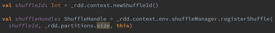{width="5.7652777777777775in"
    height="0.6972222222222222in"}

    **宽依赖支持两种类型的Shuffle
    Manager,即HashShuffleManager和SortShuffleManager。**

    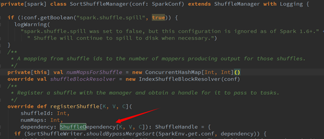{width="5.7652777777777775in"
    height="2.4868055555555557in"}

### 5.RDD的持久化 {#rdd的持久化 .ListParagraph}

> 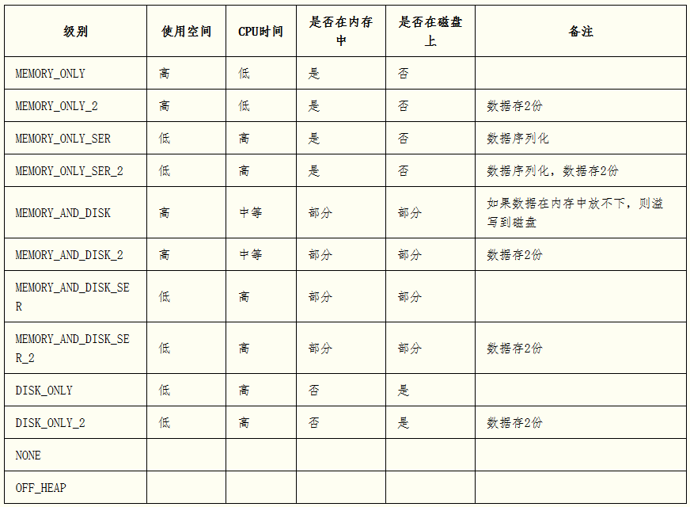{width="5.768055555555556in"
> height="4.233333333333333in"}

Spark的多个存储级别意味着在内存利用率和cpu利用效率间的不同权衡:

> (1)如果你的RDD适合默认的存储级别（MEMORY\_ONLY），就选择默认的存储级别。因为这是cpu利用率最高的选项，会使RDD上的操作尽可能的快。
>
> (2)如果不适合用默认的级别，选择MEMORY\_ONLY\_SER。选择一个更快的序列化库提高对象的空间使用率，但是仍能够相当快的访问。
>
> (3)除非函数计算RDD的花费较大或者它们需要过滤大量的数据，不要将RDD存储到磁盘上，否则，重复计算一个分区就会和重磁盘上读取数据一样慢。
>
> (4)如果你希望更快的错误恢复，可以利用重复(replicated)存储级别。所有的存储级别都可以通过重复计算丢失的数据来支持完整的容错，但是重复的数据能够使你在RDD上继续运行任务，而不需要重复计算丢失的数据。
>
> (5)OFF\_HEAP：在内存有限时，可以减少频繁GC及不必要的内存消耗（减少内存的使用），提升程序性能。
>
> 操作：
>
> scala&gt; val p1 = sc.parallelize(Array(1,2,3,4,5))
>
> （创建一个RDD）
>
> scala&gt; import org.apache.spark.storage.StorageLevel
>
> scala&gt; p1.persist(StorageLevel.DISK\_ONLY)
>
> （设置p1的缓存级别）
