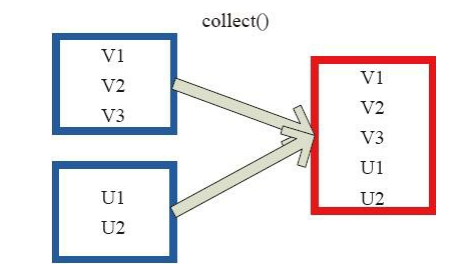

1.Transformation算子
--------------------

Transformation
变换/转换算子：这种变换并不触发提交作业，完成作业中间过程处理。

Transformation 操作是延迟计算的，也就是说从一个RDD 转换生成另一个 RDD
的转换操作不是马上执行，需要等到有 Action 操作的时候才会真正触发运算。

Action(行动)

transformations操作和Action操作的区别在于Spark计算RDD
的方式不同。对于在任何时候得到的新的RDD，Spark只会惰性计算。只有在一个行动操作中用到时，才会真正计算。这种策略也是spark性能高的部分原因。

比如，我们读取一个文本文件创建一个RDD，然后把其中包含spark的行筛选出来。如果Spark在我们运行lines
= sc.textFile(test.txt)
时就把文件中所有的行都读取到内存中并存储起来，内存开销会很大，而我们接下来的操作会筛选掉其中的很多数据。相反，
如果Spark
在知道了完整的转化操作链之后，它就可以只计算求结果时真正需要的数据。

事实上，在执行行动操作
first()时，Spark也只是扫描文件直到找到第一个匹配的行为止，而不是读取整个文件。

Hdfs上a1.txt文件

\[hadoop@h201 hadoop-2.7.2\]\$ bin/hadoop fs -cat /a1.txt

hello spark

hello spark

hello Hadoop

1.1Value数据类型的Transformation算子
------------------------------------

### 1.1.1 map 

将原来 RDD 的每个数据项通过 map 中的用户自定义函数 f
映射转变为一个新的元素。源码中 map 算子相当于初始化一个 RDD， 新 RDD
叫做 MappedRDD(this, sc.clean(f))。

{width="2.493571741032371in"
height="1.5919400699912511in"}

每个方框表示一个 RDD 分区，左侧的分区经过用户自定义函数 f:T-&gt;U
映射为右侧的新 RDD 分区。但是，实际只有等到 Action算子触发后，这个 f
函数才会和其他函数在一个stage 中对数据进行运算。在图 1
中的第一个分区，数据记录 V1 输入 f，通过 f
转换输出为转换后的分区中的数据记录 V’1。

创建rdd1

scala&gt; val rdd1 = sc.textFile("hdfs://h201:9000/a1.txt")

scala&gt; rdd1.map(x=&gt;x.split(" ")).collect

res0: Array\[Array\[String\]\] = Array(Array(hello, spark), Array(hello,
spark), Array(hello, hadoop))

scala&gt; rdd1.map(s=&gt;s.length).collect()

### 1.1.2flatMap

将原来 RDD 中的每个元素通过函数 f 转换为新的元素，并将生成的 RDD
的每个集合中的元素合并为一个集合，内部创建
FlatMappedRDD(this，sc.clean(f)),flatMap为一个扁平化操作。

{width="2.1944444444444446in"
height="1.616017060367454in"}

RDD 的 一 个 分 区 ，进 行 flatMap函 数 操 作， flatMap 中 传 入 的 函
数 为 f:T-&gt;U， T和 U
可以是任意的数据类型。将分区中的数据通过用户自定义函数 f
转换为新的数据。外部大方框可以认为是一个 RDD 分区，小方框代表一个集合。
V1、 V2、 V3 在一个集合作为 RDD
的一个数据项，可能存储为数组或其他容器，转换为V’1、 V’2、 V’3
后，将原来的数组或容器结合拆散，拆散的数据形成为 RDD 中的数据项。

scala&gt; rdd1.flatMap(x=&gt;x.split(" ")).collect

res1: Array\[String\] = Array(hello, spark, hello, spark, hello, hadoop)

### 1.1.3 filter

过滤算子，根据函数的规则返回(true的)一个过滤过后的rdd

scala&gt; rdd1.filter(x=&gt;x.contains("spark")).collect()

res2: Array\[String\] = Array(hello spark, hello spark)

scala&gt; rdd1.flatMap(x1=&gt;x1.split("
")).filter(x2=&gt;x2.contains("spark")).collect()

res3: Array\[String\] = Array(spark, spark)

### 1.1.4 mapPartitions

mapPartitions
函数获取到每个分区的迭代器,在函数中通过这个分区整体的迭代器
对整个分区的元素进行操作。内部实现是生成MapPartitionsRDD。

{width="2.6597222222222223in"
height="1.8430752405949256in"}

MapPartitions的优点：

如果是普通的map，比如一个partition中有1万条数据。ok，那么你的function要执行和计算1万次。

使用MapPartitions操作之后，一个task仅仅会执行一次function，function一次接收所有

的partition数据。只要执行一次就可以了，性能比较高。如果在map过程中需要频繁创建额外的对象(例如将rdd中的数据通过jdbc写入数据库,map需要为每个元素创建一个链接而mapPartition为每个partition创建一个链接),则mapPartitions效率比map高的多。

SparkSql或DataFrame默认会对程序进行mapPartition的优化。

MapPartitions的缺点：

如果是普通的map操作，一次function的执行就处理一条数据；那么如果内存不够用的情况下，
比如处理了1千条数据了，那么这个时候内存不够了，那么就可以将已经处理完的1千条数据从内存里面垃圾回收掉，或者用其他方法，腾出空间来吧。所以说普通的map操作通常不会导致内存的OOM异常。

但是MapPartitions操作，对于大量数据来说，比如甚至一个partition，100万数据，

一次传入一个function以后，那么可能一下子内存不够，但是又没有办法去腾出内存空间来，可能就OOM，内存溢出。

手工创建rdd2（,2为声明rdd2为2个分区）

scala&gt; val rdd2 = sc.parallelize(1 to 6,2)

查看分区数

scala&gt; rdd2.getNumPartitions

res4: Int = 2

def mapPartFunc(iter: Iterator\[Int\]):Iterator\[(Int)\]={

var res = List\[(Int)\]()

while (iter.hasNext){

val cur = iter.next

if(cur&gt;2){

res=res.::(cur)

}

}

res.iterator

}

val rdd3 = rdd2.mapPartitions(mapPartFunc)

scala&gt; rdd3.collect()

res3: Array\[Int\] = Array(3, 6, 5, 4)

**注：**

.::向列表中添加元素

### 1.1.5 mapPartitionsWithIndex

与mapPartitions类似，也是按照分区进行的map操作，不过mapPartitionsWithIndex传入的参数多了一个分区的值(可以理解为分区号)

rdd2.mapPartitionsWithIndex{

(partid,iter)=&gt;{

var part\_map = scala.collection.mutable.Map\[String,List\[Int\]\]()

var part\_name = "part\_" + partid

part\_map(part\_name) = List\[Int\]()

while(iter.hasNext){

part\_map(part\_name) :+= iter.next()

}

part\_map.iterator

}

}.collect

res4: Array\[(String, List\[Int\])\] = Array((part\_0,List(1, 2, 3)),
(part\_1,List(4, 5, 6)))

### 1.1.6 glom

glom函数将每个分区形成一个数组，内部实现是返回的GlommedRDD。每个方框代表一个RDD分区。该图表示含有V1、
V2、 V3的分区通过函数glom形成一数组Array\[（V1），（V2），（V3）\]

{width="3.8541666666666665in"
height="1.9801224846894139in"}

scala&gt; val rdd3 = sc.parallelize(1 to 9,3)

scala&gt; val rdd4 = rdd3.glom()

scala&gt; rdd4.collect()

res5: Array\[Array\[Int\]\] = Array(Array(1, 2, 3), Array(4, 5, 6),
Array(7, 8, 9))

（每分区形成一个数组）

### 1.1.8 cartesian

对两个RDD内的所有元素进行笛卡尔积操作。 操作后，
内部实现返回CartesianRDD。

{width="2.1903412073490816in"
height="2.156248906386702in"}

scala&gt; val rdd1 = sc.parallelize(1 to 3)

scala&gt; val rdd2 = sc.parallelize(2 to 5)

scala&gt; val rdd3 = rdd1.cartesian(rdd2)

### 1.1.7 union

使用 union 函数时需要保证两个 RDD 元素的数据类型相同，返回的 RDD
数据类型和被合并的 RDD
元素数据类型相同，并不进行去重操作，保存所有元素。如果想去重可以使用
distinct()。同时 Spark 还提供更为简洁的使用 union 的 API，通过 ++
符号相当于 union 函数操作。

scala&gt; val rdd1 = sc.parallelize(1 to 9,3)

scala&gt; val rdd2 = sc.parallelize(5 to 8,2)

scala&gt; val rdd3 = rdd1.union(rdd2)

### 1.1.8 cartesian

对两个RDD内的所有元素进行笛卡尔积操作。 操作后，
内部实现返回CartesianRDD。

{width="2.1903412073490816in"
height="2.156248906386702in"}

scala&gt; val rdd1 = sc.parallelize(1 to 3)

scala&gt; val rdd2 = sc.parallelize(2 to 5)

scala&gt; val rdd3 = rdd1.cartesian(rdd2)

### 1.1.9 groupBy

groupBy ：将元素通过函数生成相应的 Key，数据就转化为 Key-Value
格式，之后将 Key 相同的元素分为一组。

{width="2.7030588363954506in"
height="2.0833333333333335in"}

scala&gt; val rdd1 = sc.parallelize(1 to 9)

scala&gt; val rdd2 = rdd1.groupBy(x =&gt; { if (x % 2 == 0) "a" else "b"
})

scala&gt; rdd2.collect()

res12: Array\[(String, Iterable\[Int\])\] = Array((a,CompactBuffer(2, 4,
6, 8)), (b,CompactBuffer(1, 3, 5, 7, 9)))

### 1.1.10 distinct

distinct将RDD中的元素进行去重操作。图9中的每个方框代表一个RDD分区，通过distinct函数，将数据去重。

{width="3.4630872703412074in"
height="2.388888888888889in"}

scala&gt; val rdd1 = sc.parallelize(Array(1,2,2,3,4,5,5,5,6))

scala&gt; rdd1.distinct().collect()

res16: Array\[Int\] = Array(4, 1, 6, 3, 5, 2)

### 1.1.11 subtract

subtract相当于进行集合的差操作，但返回在RDD中出现，并且不在otherRDD中出现的元素，不去重。

scala&gt; val rdd1 = sc.parallelize(1 to 3)

scala&gt; val rdd2 = sc.parallelize(2 to 5)

scala&gt; rdd1.subtract(rdd2).collect

res0: Array\[Int\] = Array(1)

scala&gt; rdd2.subtract(rdd1).collect

res1: Array\[Int\] = Array(4, 5)

### 1.1.12 sample

sample 将 RDD
这个集合内的元素进行采样，获取所有元素的子集。用户可以设定是否有放回的抽样、百分比、随机种子，进而决定采样方式。

withReplacement=true，表示有放回的抽样。

withReplacement=false，表示无放回的抽样。

scala&gt; val rdd1 = sc.parallelize(1 to 50)

scala&gt; val rdd2 = rdd1.sample(true,0.1,3)

(从rdd1中随机且有放回的抽出10%的数据，随机种子值为3（即可能以1 2
3的其中一个起始值）)

scala&gt; rdd2.collect()

res2: Array\[Int\] = Array(1, 21, 48)

### 1.1.13 takeSample

takeSample（）函数和上面的sample函数是一个原理，但是不使用相对比例采样，而是按设定的采样个数进行采样，同时返回结果不再是RDD，而是相当于对采样后的数据进行Collect（），返回结果的集合为单机的数组。

scala&gt; val rdd1 = sc.parallelize(1 to 50)

scala&gt; rdd1.takeSample(true,5)

res23: Array\[Int\] = Array(5, 15, 22, 26, 14)

(返回的是一个数组)

scala&gt; var rdd2 = sc.parallelize(rdd1.takeSample(true,5))

### 1.1.14 cache

cache 将 RDD 元素从磁盘缓存到内存。 相当于 persist(MEMORY\_ONLY)
函数的功能。

scala&gt; rdd1.cache()

**1.1.15  persist**\
      persist 函数对 RDD 进行缓存操作。数据缓存在哪里依据 StorageLevel
这个枚举类型进行确定。 DISK 代表磁盘，MEMORY 代表内存， SER
代表数据是否进行序列化存储。

> scala&gt; import org.apache.spark.storage.StorageLevel
>
> scala&gt; p1.persist(StorageLevel.DISK\_ONLY)

1.2 **Key-Value数据类型的Transfromation算子**
---------------------------------------------

### 1.2.1 mapValues

mapValues ：针对（Key,Value）型数据中的 Value
进行Map操作，而不对Key进行处理。

{width="2.965686789151356in"
height="2.1006944444444446in"}

scala&gt; val list = List(("zs",22),("ls",20),("ww",23))

scala&gt; val rdd1 = sc.parallelize(list)

scala&gt; val rdd2 = rdd1.mapValues(\_+2)

scala&gt; rdd2.collect()

res0: Array\[(String, Int)\] = Array((zs,24), (ls,22), (ww,25))

### 1.2.2 **flatMapValues**

同基本转换操作中的flatMap，只不过flatMapValues是针对\[K,V\]中的V值进行flatMap操作。

scala&gt; val list = List(("zs",22),("ls",20),("ww",23))

scala&gt; val rdd1 = sc.parallelize(list)

scala&gt; val rdd2 = rdd1.flatMapValues(x=&gt;Array(x,"male"))

(x传递的为value值，（x,
"male"）前面必须增加集合声明，key对应集合中2个value，然后做扁平化处理)

### 1.2.3**comineByKey**

常用的基于key的聚合函数，返回的类型可以和输入的类型不一样

许多基于key的聚合函数有用到了它，像groupByKey()

combineByKey 函数的定义：

combineByKey\[C\](createCombiner:(V) C,

mergeValue:(C, V) C,

mergeCombiners:(C, C) C,

partitioner:Partitioner,

mapSideCombine:Boolean=true,

serializer:Serializer=null):RDD\[(K,C)\]

说明：

**(默认配置前3项就可以)**

createCombiner: V =&gt; C
，这个函数把当前的值作为参数，此时我们可以对其做些附加操作(类型转换)并把它返回
(这一步类似于初始化操作)

mergeValue: (C, V) =&gt;
C，该函数把元素V合并到之前的元素C(createCombiner)上
(这个操作在每个分区内进行)

mergeCombiners: (C, C) =&gt; C，该函数把2个元素C合并
(这个操作在不同分区间进行)

partitioner： Partitioner, Shuffle 时需要的 Partitioner。

mapSideCombine ： Boolean = true(默认为true)，为了减小传输量，很多
combine 可以在 map端先做，比如叠加，可以先在一个 partition
中把所有相同的 key 的 value 叠加，再 shuffle。

serializerClass： String = null，传输需要序列化，用户可以自定义序列化类

scala&gt; val rdd1 =
sc.parallelize(Array(("zs",200),("zs",500),("zs",1000),("ls",50),("ls",90)))

（近期的消费记录）

求出每人的平均消费？

val rdd2 = rdd1.combineByKey(

consume =&gt; (1, consume),

(c1: (Int,Int), newConsume) =&gt; (c1.\_1 + 1, c1.\_2 + newConsume),

(c1: (Int,Int), c2: (Int,Int)) =&gt; (c1.\_1 + c2.\_1, c1.\_2 + c2.\_2)

).map { case (name, (num, consume)) =&gt; (name, consume/num) }

解释：

（1）consume =&gt; (1, consume),返回附加的元组类型。
以"zs"为列，返回结果：（1,200）购买1次价格200。

（2）(c1: (Int,Int), newConsume) =&gt; (c1.\_1 + 1, c1.\_2 +
newConsume),注意这里的c1就是createCombiner初始化得到的（1,200）。在一个分区内，我们又碰到了"zs"的一个新的单价为500。当然我们要把之前的价格和当前价格加起来即c1.\_2
+ newConsume,然后把购买次数计算器加1即c1.\_1 + 1

（3）(c1: (Int,Int), c2: (Int,Int)) =&gt; (c1.\_1 + c2.\_1, c1.\_2 +
c2.\_2)，注意"zs"他购买的信息可能过多而分散在不同的分区中。所有的分区都进行mergeValue后,接下来就是对分区间进行合并了,分区间购买次数和购买次数相加，单价和单价相加就得到了总次数和总价格。scala&gt;
rdd2.collect()

res0: Array\[(String, Int)\] = Array((ls,70), (zs,566))

### 1.2.4 foldByKey

foldByKey操作作用于RDD\[K,V\]根据K将V做折叠、合并处理。

foldByKey(zeroValue: V, numPartitions: Int)(func: (V, V) =&gt; V):
RDD\[(K, V)\]

foldByKey(zeroValue: V)(func: (V, V) =&gt; V): RDD\[(K, V)\]

foldByKey(zeroValue: V, partitioner: Partitioner)(func: (V, V) =&gt; V):
RDD\[(K, V)\]

说明：

zeroVale：对V进行初始化，实际上是通过CombineByKey的createCombiner实现的
V =&gt; (zeroValue,V)，再通过func函数映射成新的值

scala&gt; val rdd1 =
sc.parallelize(Array(("zs",200),("zs",500),("zs",1000),("ls",50),("ls",90)))

scala&gt; val rdd2 = rdd1.foldByKey(0)(\_+\_)

解释：

先对每个V都加0，再对相同Key的value值相加。

scala&gt; rdd2.collect()

res1: Array\[(String, Int)\] = Array((ls,140), (zs,1700))

### 1.2.5reduceByKey

reduceByKey就是对元素为KV对的RDD中Key相同的元素的Value进行binary\_function的reduce操作，因此，Key相同的多个元素的值被reduce为一个值，然后与原RDD中的Key组成一个新的KV对。

scala&gt; val rdd1 =
sc.parallelize(Array(("zs",200),("zs",500),("zs",1000),("ls",50),("ls",90)))

scala&gt; val rdd2 = rdd1.reduceByKey(\_+\_)

scala&gt; rdd2.collect()

res2: Array\[(String, Int)\] = Array((ls,140), (zs,1700))

### 1.2.6 groupByKey

groupByKey是对每个key进行合并操作，但只生成一个sequence

scala&gt; val rdd1 =
sc.parallelize(Array(("zs",200),("zs",500),("zs",1000),("ls",50),("ls",90)))

val rdd2 = rdd1.groupByKey()

scala&gt; rdd2.collect()

res3: Array\[(String, Iterable\[Int\])\] = Array((ls,CompactBuffer(50,
90)), (zs,CompactBuffer(200, 500, 1000)))

foldByKey,reduceByKey,groupByKey函数最终都是通过调用combineByKey函数实现的

### 1.2.7 sortByKey

sortByKey 对key进行排序，默认为升序

scala&gt; val rdd1 =
sc.parallelize(Array(("a",5),("a",3),("c",9),("b",15),("b",5)))

scala&gt; val rdd2 = rdd1.sortByKey()

scala&gt; rdd2.collect()

res4: Array\[(String, Int)\] = Array((a,5), (a,3), (b,15), (b,5), (c,9))

### 1.2.8cogroup

对两个RDD(如:(K,V)和(K,W))相同Key的元素先分别做聚合，最后返回(K,Iterator&lt;V&gt;,Iterator&lt;W&gt;)形式的RDD,numPartitions设置分区数，提高作业并行度

{width="4.674983595800525in"
height="1.5444444444444445in"}

scala&gt; val rdd1 =
sc.parallelize(Array(("a",5),("a",3),("c",9),("b",15),("b",5)))

scala&gt; val rdd2 =
sc.parallelize(Array(("a","aa"),("a","aaa"),("c","cc"),("d","dd")))

scala&gt; val rdd3 = rdd1.cogroup(rdd2)

scala&gt; rdd3.collect()

res5: Array\[(String, (Iterable\[Int\], Iterable\[String\]))\] =
Array((d,(CompactBuffer(),CompactBuffer(dd))), (a,(CompactBuffer(5,
3),CompactBuffer(aa, aaa))), (b,(CompactBuffer(15, 5),CompactBuffer())),
(c,(CompactBuffer(9),CompactBuffer(cc))))

### 1.2.9 join

内连接的join，以某一个表为基础，KEY相同的打印出来，不相同的不打印

scala&gt; val rdd1 =
sc.parallelize(Array(("a",5),("a",3),("c",9),("b",15),("b",5)))

scala&gt; val rdd2 =
sc.parallelize(Array(("a","aa"),("a","aaa"),("c","cc"),("d","dd")))

scala&gt; val rdd3 = rdd1.join(rdd2)

scala&gt; rdd3.collect()

res7: Array\[(String, (Int, String))\] = Array((a,(5,aa)), (a,(5,aaa)),
(a,(3,aa)), (a,(3,aaa)), (c,(9,cc)))

### 1.2.10 leftOuterJoin

leftOuterJoin返回数据集左边的全部数据和数据集左边与右边有交集的数据

scala&gt; rdd1.leftOuterJoin(rdd2).collect()

res8: Array\[(String, (Int, Option\[String\]))\] =
Array((a,(5,Some(aa))), (a,(5,Some(aaa))), (a,(3,Some(aa))),
(a,(3,Some(aaa))), (b,(15,None)), (b,(5,None)), (c,(9,Some(cc))))

### 1.2.11 rightOuterJoin

rightOuterJoin返回数据集右边的全部数据和数据集右边与左边有交集的数据

scala&gt; rdd1.rightOuterJoin(rdd2).collect()

res9: Array\[(String, (Option\[Int\], String))\] = Array((d,(None,dd)),
(a,(Some(5),aa)), (a,(Some(5),aaa)), (a,(Some(3),aa)),
(a,(Some(3),aaa)), (c,(Some(9),cc)))

### 1.2.12 fullOuterJoin

返回左右数据集的全部数据，左右有一边不存在的数据以None填充

scala&gt; rdd1.fullOuterJoin(rdd2).collect()

res0: Array\[(String, (Option\[Int\], Option\[String\]))\] =
Array((d,(None,Some(dd))), (a,(Some(5),Some(aa))),
(a,(Some(5),Some(aaa))), (a,(Some(3),Some(aa))),
(a,(Some(3),Some(aaa))), (b,(Some(15),None)), (b,(Some(5),None)),
(c,(Some(9),Some(cc))))

2. Actions 算子
===============

本质上在 Action 算子中通过进行了提交作业的 runJob 操作，触发了RDD DAG
的执行。

### 2.1 foreach

foreach用于遍历RDD,将函数f应用于每一个元素。

{width="2.9791666666666665in"
height="2.2630205599300086in"}

(1) foreach(print) 与collect()对比

scala&gt; rdd1.foreach(print)

(a,5)(a,3)(c,9)(b,15)(b,5)

scala&gt; rdd1.collect()

res4: Array\[(String, Int)\] = Array((a,5), (a,3), (c,9), (b,15), (b,5))

scala&gt; rdd1.collect().foreach(println)

（2）

scala&gt; var r1 = sc.parallelize(1 to 10,2)

r1.foreach(x=&gt;

if(x&gt;5){

print(x+" ")

})

### 2.2 reduce

reduce(func):通过函数func先聚集各分区的数据集，再聚集分区之间的数据，func接收两个参数，返回一个新值，新值再做为参数继续传递给函数func，直到最后一个元素

scala&gt; var rdd1 = sc.parallelize(1 to 10,2)

scala&gt; rdd1.reduce(\_+\_)

res24: Int = 55

### 2.3 collect

collect():以数据的形式返回数据集中的所有元素给Driver程序，为防止Driver程序内存溢出，一般要控制返回的数据集大小

2.4 count

count()：返回数据集元素个数

scala&gt; rdd1.count

res25: Long = 10

{width="4.697916666666667in"
height="2.8020833333333335in"}

### 2.4first

first():返回数据集的第一个元素

scala&gt; rdd1.first

res30: Int = 1

### 2.5take

take(n):以数组的形式返回数据集上的前n个元素

scala&gt; rdd1.take(3)

res31: Array\[Int\] = Array(1, 2, 3)

### 2.6 top

top(n):按默认或者指定的排序规则返回前n个元素，默认按降序输出

scala&gt; rdd1.top(3)

res32: Array\[Int\] = Array(10, 9, 8)

### 2.7 takeOrdered

takeOrdered(n,\[ordering\]):
按自然顺序(自然顺序从底到高)或者指定的排序规则返回前n个元素

scala&gt; rdd1.takeOrdered(3)

res33: Array\[Int\] = Array(1, 2, 3)

### 2.8 countByKey()

countByKey():作用于K-V类型的RDD上，统计每个key的个数，返回(K,K的个数)

scala&gt; val rdd2 =
sc.parallelize(Array(("a","aa"),("a","aaa"),("c","cc"),("d","dd")))

scala&gt; rdd2.countByKey()

res1: scala.collection.Map\[String,Long\] = Map(d -&gt; 1, a -&gt; 2, c
-&gt; 1)

### 2.9 collectAsMap()

collectAsMap():作用于K-V类型的RDD上，作用与collect不同的是collectAsMap函数不包含重复的key，对于重复的key。后面的元素覆盖前面的元素

scala&gt; rdd2.collect()

res39: Array\[(String, String)\] = Array((a,aa), (a,aaa), (c,cc),
(d,dd))

scala&gt; rdd2.collectAsMap()

res40: scala.collection.Map\[String,String\] = Map(d -&gt; dd, a -&gt;
aaa, c -&gt; cc)

### 2.10 lookup

lookup(k)：作用于K-V类型的RDD上，返回指定K的所有V值

scala&gt; rdd2.lookup("a")

res41: Seq\[String\] = WrappedArray(aa, aaa)

### 2.11 aggregate 

通常为我们的spark程序计算是分布式的，所以我们通常需要聚合的数据都分部在不同的分区，不同的机器上。

该函数它会首先对每个分区内的数据基于初始值进行一个首次聚合，然后将每个分区聚合的结果，通过使用给定的聚合函数，再次基于初始值进行分区之间的聚合，并且最终函数的返回结果的类型，可以是与该RDD的类型相同

org.apache.spark.rdd下

{width="5.768055555555556in"
height="0.27847222222222223in"}

（1）zeroValue:U

　这个值代表的是我们需要设置的初始值，该初始值可以是不与原RDD的元素的类型相同，可以是Int，String，元组等等任何我们所需要的类型,根据自己的需求来，为了方便后面的表示，假设我把它定义为数值类型的元组(0,0)，注意，这里必须是具体的值，并非函数

（2）seqOp: (U, T) =&gt; U

这里需要定义一个函数，注意，是函数，U的类型与我们在第一步中定义的初始值得类型相同，这里的T代表的即为RDD中每个元素的值。

该函数的功能是，在每个分区内遍历每个元素，将每个元素与U进行聚合，具体的聚合方式，我们可以自定义，不过有一点需要注意，这里聚合的时候依然要基于初始值来进行计算

（3）combOp: (U, U) =&gt; U

这里同样需要定义一个函数，这里的U即为每个分区内聚合之后的结果，则这里的U也为该类型,该函数的主要作用就是对每个分区聚合之后的结果进行再次合并，即分区之间的合并，但是，同样，在合并的开始，也是要基于初始进行合并，其实这里我们可以发现，这里U的类型是与初始值的类型是相同的。

scala&gt; val rdd1 = sc.parallelize(Array(1,2,3,1,2,3),2)

val ag = rdd1.aggregate((0,0))(

(a,t) =&gt; (a.\_1 + t, a.\_2 + 1),

(p1,p2) =&gt; (p1.\_1 + p2.\_1, p1.\_2 + p2.\_2)

)

解释：

(1) (0,0) 为初始的值，（按照函数意思，可以随意声明）

(2) (a,t) =&gt; (a.\_1 + t, a.\_2 + 1)，a为初始值，t为rdd1中的值

> (a.\_1 + t, a.\_2 + 1)为函数计算规则
>
> a.\_1 + t,为0+上rdd1中的第一个值 0+1(分区内循环)
>
> a.\_2 +1 :a.\_2 为初始的第二个值，也为0,常数1为记录总次数

\(3) (p1,p2) =&gt; (p1.\_1 + p2.\_1, p1.\_2 + p2.\_2) :p1为第一个分区中
第二步结果，p2为第二个分区中 第二步结果。

scala&gt; print(ag.\_1/ag.\_2)

2

### 2.12 fold

fold()与reduce()类似，接收与reduce接收的函数签名相同的函数，区别再与：加上一个初始值作为第一次调用的结果。

scala&gt; val rdd1 = sc.parallelize(Array(1,2,3,1,2,3),2)

scala&gt; rdd1.fold(0)(\_+\_)
