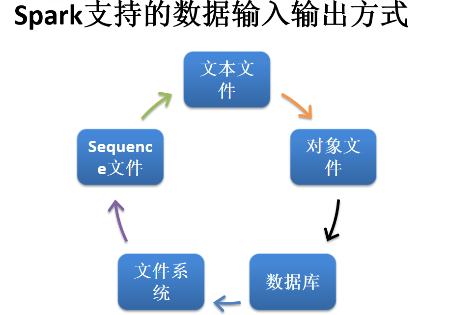

{width="5.253933727034121in"
height="3.6902777777777778in"}

1.文本文件
==========

> \[hadoop@h201 hadoop-2.7.2\]\$ bin/hadoop fs -cat /abc.txt
>
> hello spark
>
> hello hadoop
>
> hello hive

1.  读取hdfs上的一个文件

> scala&gt; val hdfsfile1 = sc.textFile("hdfs://h201:9000/abc.txt")

1.  写入文件（默认写入到hdfs中）

> scala&gt; hdfsfile1.saveAsTextFile("/sparkoutput")
>
> \[hadoop@h201 hadoop-2.7.2\]\$ bin/hadoop fs -cat
> /sparkoutput/part-00000
>
> hello spark
>
> hello hadoop
>
> hello hive

1.  读取hdfs上的一个目录

> （log1目录中有两个文件）

\[hadoop@h201 hadoop-2.7.2\]\$ bin/hadoop fs -ls /log1/

Found 2 items

-rw-r--r-- 2 hadoop supergroup 36 2019-10-02 04:16 /log1/abc.txt

> -rw-r--r-- 2 hadoop supergroup 37 2019-10-02 04:16 /log1/cba.txt
>
> 读取目录
>
> scala&gt; val hdfsfile2 = sc.wholeTextFiles("hdfs://h201:9000/log1")

1.  读取本地文件（linux文件系统下的文件）

> scala&gt; val hdfsfile3 = sc.textFile("file:///home/hadoop/abc.txt")

1.  扩展与优化

> 建立rdd1分区为5个
>
> scala&gt; val rdd1 = sc.parallelize(Array(1 to 1000),5)

scala&gt; rdd1.partitions.length

> res12: Int = 5
>
> 保存到hdfs目录中
>
> scala&gt; rdd1.collect()
>
> scala&gt; rdd1.saveAsTextFile("/sparkoutput11")
>
> \[hadoop@h201 hadoop-2.7.2\]\$ bin/hadoop fs -ls /sparkoutput11
>
> （发现出现5个输出文件，因为spark中为5个分区，每分区为一个输出文件）
>
> saveAsTextFile会按照执行task的多少生成多少个文件，比如part-00000一直到part-0000n，n自然就是task的个数，亦即是最后的stage的分区数。那么有没有办法最后只生成一个文件，而不是成百上千个文件了
>
> 解决方法
>
> （1）
>
> scala&gt; rdd1.coalesce(1,true).saveAsTextFile("/sparkoutput12")
>
> coalesce(1,true)意味着做完计算之后将数据汇集到一个分区，然后再执行保存的动作，显然，一个分区，Spark自然只起一个task来执行保存的动作，也就只有一个文件产生了。
>
> \[hadoop@h201 hadoop-2.7.2\]\$ bin/hadoop fs -ls /sparkoutput12
>
> （显示的为一个分区了）
>
> 或者
>
> rdd1.repartition(1).saveAsTextFile()
>
> **问题？？？**
>
> **虽然可以这么做，但代价是巨大的。因为Spark面对的是大量的数据，并且是并行执行的，如果强行要求最后只有一个分区，必然导致大量的磁盘IO和网络IO产生，如果你的数据很大，难以在单机内存上装下，以上操作可能会造成单机内存不足。**
>
> （2）
>
> \[hadoop@h201 hadoop-2.7.2\]\$ bin/hadoop fs -getmerge /sparkoutput11
> /home/hadoop/aaa.txt
>
> 或者
>
> \[hadoop@h201 hadoop-2.7.2\]\$ bin/hadoop fs -cat
> /sparkoutput11/part-\* &gt;/home/hadoop/aa.txt

2.Json文件
==========

> **注意：**
>
> **使用 RDD 读取 JSON 文件处理很复杂，同时 SparkSQL
> 集成了很好的处理JSON 文件的方式，所以生产环境中多是采用 SparkSQL 处理
> JSON 文件。**
>
> \[hadoop@h201 hadoop-2.7.2\]\$ bin/hadoop fs -cat /people.json
>
> {"name":"zs","age":20,"sal":10000}
>
> {"name":"ls","age":30,"sal":20000}
>
> {"name":"ww","age":40,"sal":30000}
>
> {"name":"zl","age":50,"sal":40000}

scala&gt; import scala.util.parsing.json.JSON

scala&gt; val jsonfile1 = sc.textFile("/people.json")

scala&gt; val result = jsonfile1.map(JSON.parseFull)

（解析json数据）

scala&gt; result.collect()

> res0: Array\[Option\[Any\]\] = Array(Some(Map(name -&gt; zs, age -&gt;
> 20.0, sal -&gt; 10000.0)), Some(Map(name -&gt; ls, age -&gt; 30.0, sal
> -&gt; 20000.0)), Some(Map(name -&gt; ww, age -&gt; 40.0, sal -&gt;
> 30000.0)), Some(Map(name -&gt; zl, age -&gt; 50.0, sal -&gt;
> 40000.0)))

1.  SequenceFile 文件是 Hadoop 用来存储二进制形式的 key-value
    对而设计的一种平面文件(Flat File)。Spark 有专门用来读取 SequenceFile
    的接口。在 SparkContext 中，可以调用 sequenceFile\[ keyClass,
    valueClass\](path)。

> scala&gt; val rdd = sc.parallelize(Array((1,2),(3,4),(5,6)))
>
> scala&gt; rdd.saveAsSequenceFile("file:///home/hadoop/seqFile")

\[hadoop@h201 \~\]\$ cat /home/hadoop/seqFile/part-00000

提示：

> SEQ org.apache.hadoop.io.IntWritable org.apache.hadoop.io.IntWritable
>
> 读取sequenceFile
>
> scala&gt; val seq =
> sc.sequenceFile\[Int,Int\]("file:///home/hadoop/seqFile/part-00000")
>
> scala&gt; seq.collect()

4.对象文件
==========

对象文件是将对象序列化后保存的文件，采用 Java 的序列化机制。可以通过

> objectFile\[k,v\](path) 函数接收一个路径，读取对象文件，返回对应的
> RDD，也可以通过调用 saveAsObjectFile()
> 实现对对象文件的输出。因为是序列化所以要指定类型。
>
> scala&gt; val rdd = sc.parallelize(Array(1,2,3,4))
>
> scala&gt; rdd.saveAsObjectFile("file:///home/hadoop/tt/objectFile")

查看

\[hadoop@h201 \~\]\$ cat /home/hadoop/tt/objectFile/part-00000

提示：

SEQ!org.apache.hadoop.io.NullWritable"org.apache.hadoop.io.BytesWritable?

读取object文件

scala&gt; val objFile =
sc.objectFile\[(Int)\]("file:///home/hadoop/tt/objectFile")

scala&gt; objFile.collect()

res9: Array\[Int\] = Array(1, 2, 3, 4)

5.数据库读取（mysql）

> 5.1
>
> []{#_Hlk28949063 .anchor}\[root@h201 \~\]\# service mysqld start
>
> mysql&gt; create user 'spark' identified by 'spark123';
>
> mysql&gt; grant all privileges on \*.\* to spark@'%' identified by
> 'spark123' with grant option;
>
> mysql&gt; grant all privileges on \*.\* to spark@h201 identified by
> 'spark123';
>
> \[hadoop@h201 \~\]\$ mysql -h h201 -u spark -p

mysql&gt; create database rdd;

mysql&gt; use rdd

mysql&gt; create table u1(id int,name varchar(20));

mysql&gt; insert into u1 (id,name)values(101,"zs");

mysql&gt; insert into u1 (id,name)values(102,"ls");

> mysql&gt; commit;

5.2 把mysql-connector-java-5.1.27.jar 拷贝到linux下

添加mysql-connector-java-5.1.27.jar
到/home/hadoop/spark-2.1.1-bin-hadoop2.7/jars 目录下

5.3

Idea中编写

**import** java.sql.DriverManager\
**import** org.apache.spark.rdd.JdbcRDD\
**import** org.apache.spark.{SparkConf,SparkContext}\
**object** MysqlRdd {\
**def** main(args: Array\[String\]): Unit = {\
**val** conf = **new** SparkConf().setAppName(**"mysqlrdd"**)\
**val** sc = **new** SparkContext(conf)\
\
**val** driver = **"com.mysql.jdbc.Driver"\
val** url = **"jdbc:mysql://h201:3306/rdd"\
val** userName = **"spark"\
val** passWd = **"spark123"\
\
val** rdd = **new** JdbcRDD(sc, () =&gt; {\
Class.*forName*(driver)\
DriverManager.*getConnection*(url, userName, passWd)\
},\
*//select \* from u1 where id&gt;=1 and id &lt;=200\
***"select \* from \`u1\` where \`id\` &gt;= ? and id &lt;= ?;"**,\
1,\
200,\
1,\
r =&gt; (r.getInt(1), r.getString(2))\
)\
\
rdd.saveAsTextFile(**"/sparkoutput321"**)\
sc.stop()\
}\
}

**IDEA中打成jar，拷贝到spark中**

\[hadoop@h201 spark-2.1.1-bin-hadoop2.7\]\$ bin/spark-submit --class
"MysqlRdd" /home/hadoop/spark2019.jar

结果：

\[hadoop@h201 hadoop-2.7.2\]\$ bin/hadoop fs -cat
/sparkoutput321/part-00000

(101,zs)

(102,ls)

1.  写入到数据库（mysql）

> **import** java.sql.DriverManager\
> **import** org.apache.spark.{SparkConf,SparkContext}\
> **import** java.sql.Connection\
> **object** RddMysql {\
> **def** main(args: Array\[String\]): Unit = {\
> **val** conf = **new** SparkConf().setAppName(**"rddmysql"**)\
> **val** sc = **new** SparkContext(conf)\
> **val** rdd2 = {\
> sc.parallelize(*Array*((108, **"tom"**), (109, **"jack"**)))\
> }\
> rdd2.foreachPartition(insertToMysql)\
> \
> **def** insertToMysql(iterator: Iterator\[(Int, String)\]): Unit = {\
> **val** driver = **"com.mysql.jdbc.Driver"\
> val** url = **"jdbc:mysql://h201:3306/rdd"\
> val** username = **"spark"\
> val** password = **"spark123"\
> var** con1: Connection = **null\
> **Class.*forName*(driver)\
> con1 = DriverManager.*getConnection*(url, username, password)\
> **val** sql = **"INSERT INTO u1 (\`id\`,\`name\`) VALUES (?,?)"\
> **iterator.foreach(data =&gt; {\
> **val** statement = con1.prepareStatement(sql)\
> statement.setInt(1, data.\_1)\
> statement.setString(2, data.\_2)\
> statement.executeUpdate()\
> })\
> }\
> sc.stop()\
> }\
> }
>
> 6.2 打包jar
>
> 6.3 spark上执行
>
> \[hadoop@h201 spark-2.1.1-bin-hadoop2.7\]\$ bin/spark-submit --class
> "RddMysql" /home/hadoop/spark2019.jar
>
> 查看结果：(多出了新插入的两行)
>
> {width="2.5732753718285215in"
> height="1.3960279965004374in"}

6.hive 输入输出
===============

6.1 环境准备

(1)拷贝hive-site.xml 到spark的conf目录下

\[hadoop@h201 conf\]\$ cp hive-site.xml
/home/hadoop/spark-2.1.1-bin-hadoop2.7/conf/

(2)修改pom.xml

增加

*&lt;!--spark hive依赖--&gt;\
*&lt;**dependency**&gt;\
&lt;**groupId**&gt;org.apache.spark&lt;/**groupId**&gt;\
&lt;**artifactId**&gt;spark-hive\_2.11&lt;/**artifactId**&gt;\
&lt;**version**&gt;\${spark.version}&lt;/**version**&gt;\
&lt;/**dependency**&gt;

6.2 读取hive数据

初始化sparkSession时，添加 .enableHiveSupport（）开启hive操作

提前在hive中创建a1表，并插入数据

**package** com.spark5

**import** org.apache.spark.sql.SparkSession\
**object** SpHive {\
**def** main(args: Array\[String\]): Unit = {\
**val** spark =
SparkSession.*builder*().master(**"local"**).appName(**"hhive"**).enableHiveSupport().getOrCreate()\
spark.sql(**"select \* from a1"**).show()\
spark.stop()\
}\
}

//a1 为hive 上的一个表

\[hadoop@h201 spark-2.1.1-bin-hadoop2.7\]\$ bin/spark-submit --class
"com.spark5.SpHive" /home/hadoop/spark20200.jar

6.3 （读取本地）写入到hive中

（1）保存到hive

\[hadoop@h201 hadoop-2.7.2\]\$ bin/hadoop fs -cat /people1.json

{"age":50,"name":"haha"}

{"age":60,"name":"hehe"}

scala&gt; val sh = spark.read.json("hdfs://h201:9000/people1.json")

scala&gt; sh.write.saveAsTable("hh2")

hive中查看

hive&gt; select \* from hh2;

50 haha

60 hehe

（2）追加数据

scala&gt; sh.write.mode("append").saveAsTable("hh2")

例子：

**package** com.spark5\
**import** org.apache.spark.sql.SparkSession\
**object** SpHive {\
**def** main(args: Array\[String\]): Unit = {\
**val** spark =
SparkSession.*builder*().master(**"local"**).appName(**"hhive"**).enableHiveSupport().getOrCreate()\
**val** sh1 = spark.read.json(**"hdfs://h201:9000/people1.json"**)\
sh1.write.saveAsTable(**"hh22"**)\
spark.stop()\
}\
}
