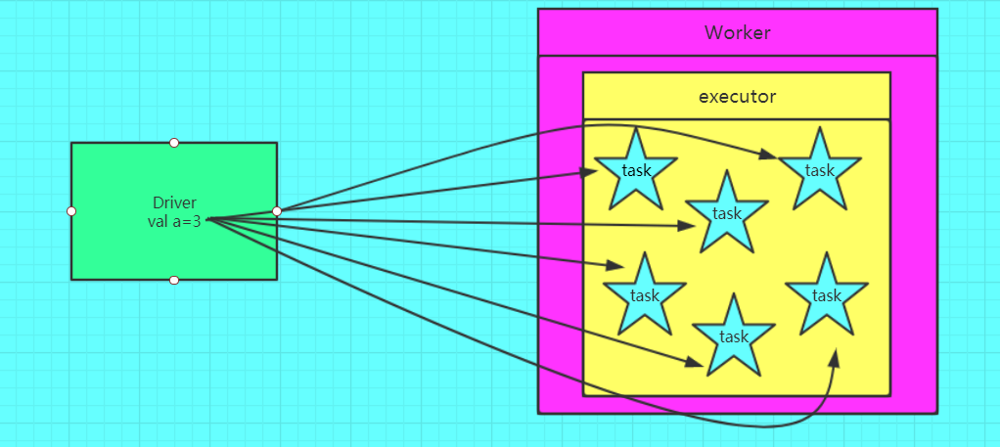
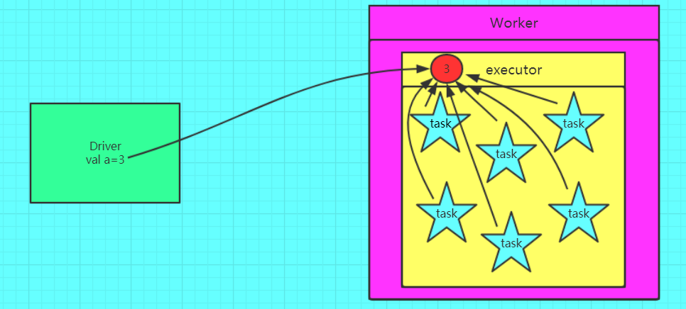
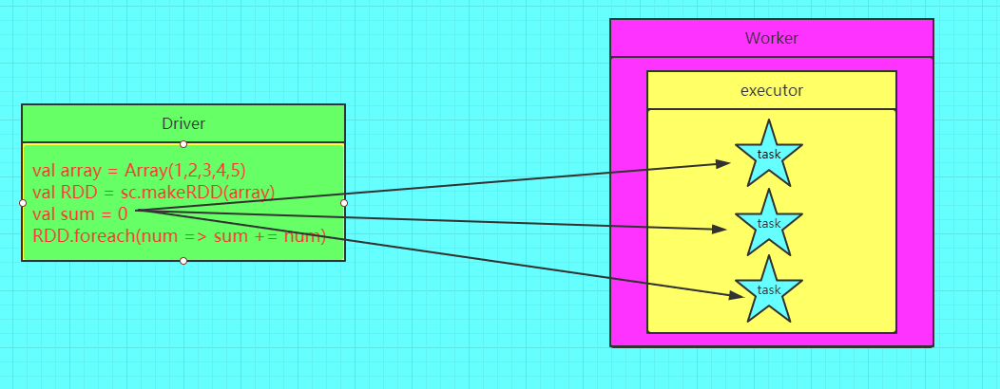
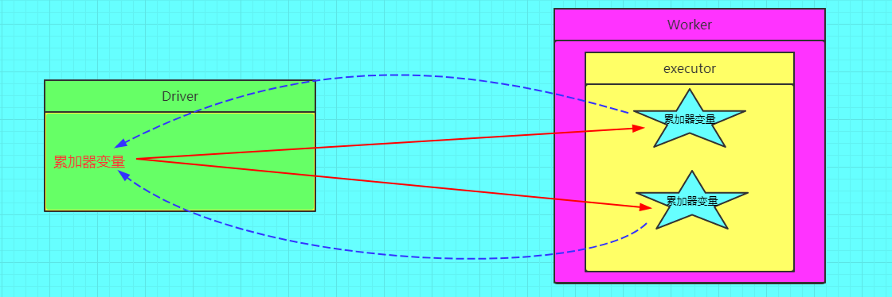
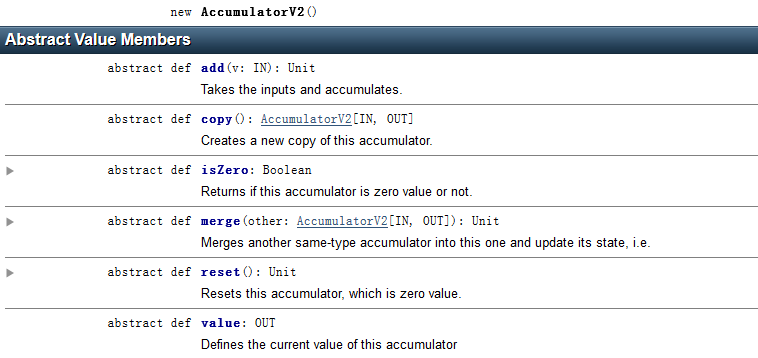

在spark程序中，当一个传递给Spark操作(例如map和reduce)的函数在远程节点上面运行时，Spark操作实际上操作的是这个函数所用变量的一个独立副本。这些变量会被复制到每台机器上，并且这些变量在远程机器上的所有更新都不会传递回驱动程序。通常跨任务的读写变量是低效的，但是，Spark还是为两种常见的使用模式提供了两种有限的共享变量：广播变量（broadcast
variable）和累加器（accumulator）

**1.广播变量broadcast variable**

1.1 广播变量的意义

如果我们要在分布式计算里面分发大对象，例如：字典，集合，黑白名单等，这个都会由Driver端进行分发，一般来讲，如果这个变量不是广播变量，那么每个task就会分发一份，这在task数目十分多的情况下Driver的带宽会成为系统的瓶颈，而且会大量消耗task服务器上的资源，如果将这个变量声明为广播变量，那么只是每个executor拥有一份，这个executor启动的task会共享这个变量，节省了通信的成本和服务器的资源。

1.2广播变量图解

错误的，不使用广播变量

{width="5.768055555555556in"
height="2.5791666666666666in"}

正确的，使用广播变量的情况

{width="5.768055555555556in"
height="2.6034722222222224in"}

注意事项:

(1)能不能将一个RDD使用广播变量广播出去？

不能，因为RDD是不存储数据的。可以将RDD的结果广播出去。

(2)广播变量只能在Driver端定义，不能在Executor端定义。

\(3) 在Driver端可以修改广播变量的值，在Executor端无法修改广播变量的值。

(4)如果executor端用到了Driver的变量，如果不使用广播变量在Executor有多少task就有多少Driver端的变量副本。

(5)如果Executor端用到了Driver的变量，如果使用广播变量在每个Executor中只有一份Driver端的变量副本。

1.3 广播变量操作

scala&gt; val broadcastVar = sc.broadcast(Array(1, 2, 3))

broadcastVar: org.apache.spark.broadcast.Broadcast\[Array\[Int\]\] =
Broadcast(0)

scala&gt; broadcastVar.value

res0: Array\[Int\] = Array(1, 2, 3)

**2 累加器的意义**

2.1在spark应用程序中，我们经常会有这样的需求，如异常监控，调试，记录符合某特性的数据的数目，这种需求都需要用到计数器，如果一个变量不被声明为一个累加器，那么它将在被改变时不会再driver端进行全局汇总，即在分布式运行时每个task运行的只是原始变量的一个副本，并不能改变原始变量的值，但是当这个变量被声明为累加器后，该变量就会有分布式计数的功能。

2.2 图解累加器

错误的图解

{width="5.768055555555556in"
height="2.247916666666667in"}

正确的图解

{width="5.768055555555556in"
height="1.926388888888889in"}

注意:

(1)累加器在Driver端定义赋初始值，累加器只能在Driver端读取最后的值，在Excutor端更新。

(2)累加器不是一个调优的操作，因为如果不这样做，结果是错的

2.3 累加器操作

默认情况下spark 只对数字类型，进行累加。

例子1：

2.3.1 在driver中定义累加器

scala&gt; val accum2 = sc.accumulator(0, "My Accumulator")

accum: spark.Accumulator\[Int\] = 0

2.3.2 在task端 执行累加

scala&gt; sc.parallelize(Array(1, 2, 3, 4),2).foreach(x =&gt;
accum2.add(x))

2.3.3 在driver端进行显示

scala&gt; accum2.value

例子2

scala&gt; val accum3 = sc.accumulator(0,"Accum3")

scala&gt; val rdd3 =
sc.parallelize(Array(1,2,3,4,5,6,7,8,9),2).filter(n=&gt;{

if(n%2!=0) accum3.add(1)

n%2==0

})

scala&gt; accum3.value

res0: Int = 0

结果为0

原因：

spark中的一系列transform操作会构成一串长的任务链，此时需要通过一个action操作来触发，accumulator也是一样，是Lazy的。因此在一个action操作之前，你调用value方法查看其数值，肯定是没有任何变化的。

所以需要执行一次action

scala&gt; rdd3.collect

再次查看

scala&gt; accum3.value

res2: Int = 5

结果为5 ，就是我们想要的结果了

再次执行action

scala&gt; rdd3.count

scala&gt; accum3.value

res4: Int = 10

结果变为10了，因为执行action动作时，把前面的transform动作又执行了一遍。

解决办法：

只要将任务之间的依赖关系切断就可以了。什么方法有这种功能呢？你们肯定都想到了，cache，persist。调用这个方法的时候会将之前的依赖切除，后续的累加器就不会再被之前的transfrom操作影响到了。

scala&gt; val accum5 = sc.accumulator(0,"Accum3")

scala&gt; val rdd5 =
sc.parallelize(Array(1,2,3,4,5,6,7,8,9),2).filter(n=&gt;{

if(n%2!=0) accum5.add(1)

n%2==0

})

**利用cache缓存，切断之前的依赖。**

scala&gt; rdd5.cache.count

scala&gt; accum5.value

res6: Int = 5

再次执行

scala&gt; rdd5.collect

scala&gt; accum5.value

res9: Int = 5

这样结果就还是5了

2.4 自定义累加器

在2.0版本后，累加器的易用性有了较大的改进，而且官方还提供了一个新的抽象类：AccumulatorV2来提供更加友好的自定义类型累加器的实现方式。

{width="5.768055555555556in"
height="2.7243055555555555in"}

add: 操作数据累加方法实现

copy: 拷贝一个新的AccumulatorV2

isZero: 当AccumulatorV2中存在类似数据不存在这种问题时，是否结束程序。

merge: 合并数据

reset: 重置AccumulatorV2中的数据

value: AccumulatorV2对外访问的数据结果

2.5 编写Acc1

**import** org.apache.spark.util.AccumulatorV2\
**import** org.apache.spark.{SparkConf, SparkContext}\
**import** scala.collection.JavaConversions.\_\
\
**class** Acc1 **extends** org.apache.spark.util.AccumulatorV2\[String,
java.util.Set\[String\]\] {\
**private val** *\_logArray*: java.util.Set\[String\] = **new**
java.util.HashSet\[String\]()\
\
**override def** isZero: Boolean = {\
*\_logArray*.isEmpty\
}\
\
**override def** reset(): Unit = {\
*\_logArray*.clear()\
}\
\
**override def** add(v: String): Unit = {\
*\_logArray*.add(v)\
}\
\
**override def** merge(other:
org.apache.spark.util.AccumulatorV2\[String, java.util.Set\[String\]\]):
Unit = {\
other **match** {\
**case** o: Acc1 =&gt; *\_logArray*.addAll(o.value)\
}\
\
}\
\
**override def** value: java.util.Set\[String\] = {\
java.util.Collections.*unmodifiableSet*(*\_logArray*)\
}\
\
**override def** copy():org.apache.spark.util.AccumulatorV2\[String,
java.util.Set\[String\]\] = {\
**val** newAcc = **new** Acc1()\
*\_logArray*.synchronized{\
newAcc.*\_logArray*.addAll(*\_logArray*)\
}\
newAcc\
}\
}\
\
*// 过滤掉带字母的\
***object** Acc1 {\
**def** main(args: Array\[String\]) {\
**val** conf=**new** SparkConf().setAppName(**"LogAccumulator"**)\
**val** sc=**new** SparkContext(conf)\
\
**val** accum = **new** Acc1\
sc.register(accum, **"logAccum"**)\
**val** sum = sc.parallelize(*Array*(**"1"**, **"2a"**, **"3"**,
**"4b"**, **"5"**, **"6"**, **"7cd"**, **"8"**, **"9"**), 2).filter(line
=&gt; {\
*//正则匹配\
***val** pattern = **"""\^-?(\\d+)"""\
val** flag = line.matches(pattern)\
**if** (!flag) {\
accum.add(line)\
}\
flag\
}).map(\_.toInt).reduce(\_ + \_)\
\
*println*(**"sum: "** + sum)\
**for** (v &lt;- accum.value) *print*(v + **""**)\
*println*()\
sc.stop()\
}\
}

idea 打成jar包

传递到spark上
