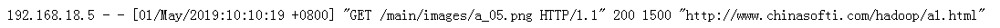

查看源码

浏览器：spark.apache.org

选择之前版本，对应你目前版本

{width="5.645833333333333in"
height="1.7897276902887138in"}

选择API Docs—》Scala

{width="5.768055555555556in"
height="1.1548611111111111in"}

点击SparkContext.scala,查看源码

{width="5.768055555555556in"
height="1.20625in"}

1.SparkContext源码
==================

SparkContext的初始化需要一个SparkConf对象，SparkConf包含了Spark集群配置的各种参数。初始化后，就可以使用SparkContext对象所包含的各种方法来创建和操作RDD和共享变量。

SparkContext是Spark的入口，相当于应用程序的main函数。目前在一个JVM进程中可以创建多个SparkContext，但是只能有一个active级别的。如果你需要创建一个新的SparkContext实例，必须先调用stop方法停掉当前active级别的SparkContext实例。

### 1.1 spark Session

在Spark2.0之后，Spark Session也是Spark 的一个入口，
为了引入dataframe和dataset的API，
同时保留了原来SparkContext的functionality，SparkSession内部封装了sparkContext.

如果想要使用 HIVE，SQL，Streaming的API， 就需要Spark Session作为入口。

{width="5.125in"
height="2.9845439632545934in"}

#### 1.1.1 创建sparksession

**import** org.apache.spark.sql.SparkSession\
**object** a {\
**def** main(args: Array\[String\]): Unit = {\
**val** spark = SparkSession.*builder*()\
.master(**"local\[2\]"**)\
.appName(**"test"**)\
.config(**"spark.some.config.option"**,**"some-value"**)\
.getOrCreate()\
}\
}

(1)SparkSession.builder()

创建此方法用于构造SparkSession。

(2)master(“local”)

设置要连接的master URL，例如：

“local”在本地运行

“local\[4\]”以4核在本地运行

“spark://master:7077”在spark独立集群上运行

(3)appName( )

设置将在spark Web UI中显示的应用程序的名称。

如果未设置应用程序名称，则将使用随机生成的名称。

(4)Config

设置使用此方法设置的配置选项会自动传递到'SparkConf'和'SparkSession'自己的配置，它的参数由键值对组成。

(5)GetOrElse

获取现有的SparkSession，或者，如果存在有效的线程本地SparkSession，如果是，则返回该SparkSession。
然后它检查是否存在有效的全局默认SparkSession，如果是，则返回该值。
如果不存在有效的全局SparkSession，则该方法将创建新的SparkSession并将新创建的SparkSession指定为全局默认值。

如果返回现有SparkSession，则此构建器中指定的config选项将应用于现有SparkSession

如果想进行RDD操作，使用spark.sparkContext，sparkSession内部封装了sparkContext

**val** sc = spark.sparkContext\
**val** a = sc.textFile(**"hdfs://h201:9000/a1.txt"**)

查看元数据

scala&gt; spark.catalog.listDatabases.show(false)

scala&gt; spark.catalog.listTables.show(false)

### spark context源码

相关组件：

SparkConf：Spark配置类，配置已键值对形式存储，封装了一个ConcurrentHashMap类实例settings用于存储Spark的配置信息。

SparkEnv
：SparkContext中非常重要的类，它维护着Spark的执行环境，所有的线程都可以通过SparkContext访问到同一个SparkEnv对象。有了
SparkEnv，就可以将数据存储在存储体系中；就能利用计算引擎对计算任务进行处理，就可以在节点间进行通信等。

LiveListenerBus ：SparkContext
中的事件总线，可以接收各种使用方的事件，并且异步传递Spark事件监听与SparkListeners监听器的注册。

SparkUI ：为Spark监控Web平台提供了Spark环境、任务的整个生命周期的监控。

TaskScheduler
：为Spark的任务调度器，Spark通过他提交任务并且请求集群调度任务。因其调度的
Task 由 DAGScheduler 创建，所以 DAGScheduler 是 TaskScheduler
的前置调度。

DAGScheduler ：为高级的、基于Stage的调度器， 负责创建 Job，将 DAG 中的
RDD 划分到不同的
Stage，并将Stage作为Tasksets提交给底层调度器TaskScheduler执行。

HeartbeatReceiver ：心跳接收器，所有 Executor 都会向HeartbeatReceiver
发送心跳，当其接收到 Executor 的心跳信息后，首先更新 Executor
的最后可见时间，然后将此信息交给 TaskScheduler 进一步处理。

ExecutorAllocationManager ：Executor
动态分配管理器，根据负载动态的分配与删除Executor，可通过其设置动态分配最小Executor、最大Executor、初始Executor数量等配置。

ContextClearner
：上下文清理器，为RDD、shuffle、broadcast状态的异步清理器，清理超出应用范围的RDD、ShuffleDependency、Broadcast对象。

SparkStatusTracker
：低级别的状态报告API，只能提供非常脆弱的一致性机制，对Job（作业）、Stage（阶段）的状态进行监控。

HadoopConfiguration
：Spark默认使用HDFS来作为分布式文件系统，用于获取Hadoop配置信息。

第一部分源码 初始

{width="5.768055555555556in"
height="2.55625in"}

（1） private val creationSite: CallSite = Utils.getCallSite()

创建了CallSite对象，那么这个对象是干什么的呢，它存储了线程栈中最靠近栈顶的用户类及最靠近栈底的Scala或者Spark核心类信息

（2）config.getBoolean("spark.driver.allowMultipleContexts", false)

是否运行创建多个sparkcontext，默认为false，只能创建一个（可以允许创建多个）

（3）SparkContext.markPartiallyConstructed(this, allowMultipleContexts)

用来确保SparkContext实例的唯一性，并将当前的SparkContext标记为正在构建中，以防止多个SparkContext实例同时成为active级别的。

第二部分源码 创建sparkenv

**SparkEnv
：SparkContext中非常重要的类，它维护着Spark的执行环境，所有的线程都可以通过SparkContext访问到同一个SparkEnv对象。有了
SparkEnv，就可以将数据存储在存储体系中；就能利用计算引擎对计算任务进行处理，就可以在节点间进行通信等。**

创建SparkEnv主要使用SparkEnv的createDriverEnv方法，有四个参数：conf、isLocal、listenerBus
以及在本地模式下driver运行executor需要的numberCores

conf：Spark 配置

isLocal：是否是本地模式

listenerBus：Spark 事件监听器

{width="5.768055555555556in"
height="1.051388888888889in"}

第三部分源码 createTaskScheduler

**TaskScheduler:每一个taskScheduler只为一个单独的SparkContext进行调度安排tasks，DAGScheduler会为每一个stage向TaskScheduler提交Tasksets（也就是说TaskSets是在DAGScheduler完成组装），TaskScheduler会负责向cluster发送tasks，并且调用backend来运行task。并且在tasks失败的时候，重试，然后会将运行task，重试task的事件返回给DAGScheduler。**

TaskScheduler负责不同的Application的Jobs之间的调度，在Task执行失败时启动重试机制，并为执行缓慢的Task启动备份任务

{width="5.768055555555556in"
height="1.0083333333333333in"}

{width="5.768055555555556in"
height="2.1020833333333333in"}

第四部分 TaskSchedulerImpl

作用

底层通过操作一个SchedulerBackend，SchedulerBackend负责与Cluster
Manager交互，取得分配给Application的资源，并将资源传给TaskScheduler，由TaskScheduler为Task最终分配计算资源

它也可以使用本地模式来启动一个task使用LocalBackend或者设置isLocal属性为true

它也负责一些通过的逻辑，比如任务的调度顺序（FIFO
etc…），启动推测的task执行等等

客户端应该首先调用initialize()和start()方法，然后通过runTasks()方法来提交task
set

{width="5.988240376202975in"
height="4.513888888888889in"}

第五部分DAGScheduler

DAGScheduler为高级的、基于stage的调度器，为提交给它的job计算stage，将stage作为tasksets提交给底层调度器TaskScheduler执行；DAGScheduler还会决定着stage的最优运行位置；

{width="4.333938101487314in"
height="2.0836242344706912in"}

spark 编程API
=============

### 2.1 二次排序

二次排序就是首先按照第一字段排序，然后再对第一字段相同的行按照第二字段排序，注意不能破坏第一次排序的结果。

**思路：**

我们可以通过sortByKey，sortBy(pair.\_2)来进行单列的排序，但是没法进行两列的同时排序。

那么我们该如何做呢？

我们可以自定义一个键值对的比较类来实现比较，

类似于JAVA中自定义类实现可比较性实现comparable接口。

我们需要继承Ordered和Serializable特质来实现自定义的比较类。

1.  原始数据

某用户 2015年-2015年的所有消费记录

\[hadoop@h201 \~\]\$ hadoop-2.7.2/bin/hadoop fs -cat /xx.txt

2015 100

2015 50

2016 900

2019 1000

2019 20

2015 10

2018 80

2018 100

2019 100

2019 18

2016 200

2017 500

2015 30

（2）开发

**import** org.apache.spark.{SparkConf, SparkContext}\
\
**class** Usort1 (**val** first:Int,**val** second:Int) **extends**
Ordered\[Usort1\] **with** Serializable {*//自定义比较类\
***override def** compare(that: Usort1): Int = {\
**if**(**this**.first - that.first !=
0){*//第一个值不相等的时候，直接返回大小\
***this**.first - that.first *//返回值\
*}\
**else** {*//第一个值相等的时候,比较第二个值\
***this**.second - that.second\
}\
}\
}\
**object** Sort2{\
**def** main(args:Array\[String\]): Unit ={\
*//初始化配置：设置主机名和程序主类的名字\
***val** conf = **new** SparkConf().setAppName(**"UdfSort"**);\
*//通过conf来创建sparkcontext\
***val** sc = **new** SparkContext(conf);\
**val** lines = sc.textFile(**"hdfs://h201:9000/xx.txt"**)\
*//转换为( udfsort( line(0),line(1) ),line ) 的形式 ,具有比较性\
***val** pair = lines.map(line =&gt; (**new** Usort1(line.split(**"
"**)(0).toInt,line.split(**" "**)(1).toInt),line))\
*//对key进行排序，然后取value\
***val** result = pair.sortByKey().map( x =&gt; x.\_2)\
result.saveAsTextFile(**"hdfs://h201:9000/out5"**)\
sc.stop()\
}\
}

执行：

\[hadoop@h201 \~\]\$ spark-2.1.1-bin-hadoop2.7/bin/spark-submit --class
"Sort2" spark20200.jar

结果：

{width="1.3231014873140858in"
height="2.0106977252843397in"}

1.  第一次降序 第二次升序

> class UDFSort (val first:Int,val second:Int) extends
> Ordered\[UDFSort\] with Serializable {
>
> override def compare(that: UDFSort): Int = {
>
> if(this.first - that.first != 0){
>
> that.first - this.first
>
> }
>
> else {
>
> this.second - that.second
>
> }
>
> }
>
> }

### groupbykey 二次排序

分组后进行排序

1.  原始数据

\[hadoop@h201 hadoop-2.7.2\]\$ bin/hadoop fs -cat /xxx.txt

2015 zs

2018 ls

2015 BBB

2015 aaa

2015 cba

2018 CCC

2018 dd

1.  开发1

> **import** org.apache.spark.SparkConf\
> **import** org.apache.spark.SparkContext\
> **object** gsort1 {\
> **def** main(args: Array\[String\]): Unit = {\
> **val** conf = **new** SparkConf()\
> **val** sc = **new** SparkContext(conf)\
> \
> **val** rdd1 = sc.textFile(**"hdfs://h201:9000/xxx.txt"**)\
> **val** rdd2 = rdd1.map(x=&gt;(x.split(**" "**)(0),x.split(**"
> "**)(1))).groupByKey.map(x=&gt;(x.\_1,x.\_2.toList.sortBy(a=&gt;a)))\
> rdd2.collect.foreach(*println*)\
> rdd2.saveAsTextFile(**"hdfs://h201:9000/out6"**)\
> sc.stop()\
> }\
> }

查看结果：

{width="2.802474846894138in"
height="0.3750524934383202in"}

2015年 排序不正常，因为有大小写，默认先排列大写

**开发2（忽略大小写）**

使用sortwith ，自定义比较类型（cc）

**package** com.spark5\
**import** org.apache.spark.SparkContext\
**import** org.apache.spark.SparkConf\
\
**object** gsort2 {\
**def** main(args: Array\[String\]): Unit = {\
**val** conf = **new** SparkConf()\
**val** sc = **new** SparkContext(conf)\
\
**def** cc(e1 :String,e2 :String):Boolean = {\
e1.toLowerCase &lt; e2.toLowerCase\
}\
\
**val** rdd1 = sc.textFile(**"hdfs://h201:9000/xxx.txt"**)\
**val** rdd2 = rdd1.map(x=&gt;(x.split(**" "**)(0),x.split(**"
"**)(1))).groupByKey.map(x=&gt;(x.\_1,x.\_2.toList.sortWith(cc)))\
rdd2.saveAsTextFile(**"hdfs://h201:9000/out6"**)\
sc.stop()\
}\
}

\[hadoop@h201 \~\]\$ spark-2.1.1-bin-hadoop2.7/bin/spark-submit --class
"com.spark5.gsort2" spark20200.jar

结果：

{width="2.5524398512685913in"
height="0.3125437445319335in"}

看到2015年，忽略了大小写，排序正常了

### 2.3分组操作

员工工资表

\[hadoop@h201 \~\]\$ hadoop-2.7.2/bin/hadoop fs -cat /g1.txt

zs,20191015,20000,5000

zs,20191115,20000,6000

zs,20191215,20000,8000

ls,20191215,15000,1000

ww,20190515,30000,10000

ww,20190615,30000,15000

ww,20190715,30000,12000

ww,20190815,30000,8000

ww,20190915,30000,6000

ww,20191015,30000,15000

ww,20191115,35000,15000

ww,20191215,35000,11000

### 2.3.1求出每人的平均工资

开发：

**package** com.spark5\
**import** org.apache.spark.{SparkContext,SparkConf}\
\
**object** avg1 {\
**def** main(args: Array\[String\]): Unit = {\
**val** conf = **new** SparkConf()\
**val** sc = **new** SparkContext(conf)\
\
**val** rdd1 = sc.textFile(**"hdfs://h201:9000/g1.txt"**)\
*//改变格式 ww,(42000,1)\
***val** rdd2 =
rdd1.map(x=&gt;(x.split(**","**)(0),(x.split(**","**)(2).toInt +
(x.split(**","**)(3).toInt)))).mapValues(x=&gt;(x,1))\
\
**val** rdd3 =
rdd2.reduceByKey((a,b)=&gt;(a.\_1+b.\_1,a.\_2+b.\_2)).map(x=&gt;(x.\_1,(x.\_2.\_1/x.\_2.\_2)))\
rdd3.saveAsTextFile(**"hdfs://h201:9000/out9"**)\
sc.stop()\
}\
}

结果：

\[hadoop@h201 \~\]\$ hadoop-2.7.2/bin/hadoop fs -cat /out9/part-00000

{width="1.6877351268591425in"
height="0.4792333770778653in"}

### 2.3.2 求出每人全年中，工资最高的一个月（分组TOP N）

开发

spark 编程案例**package** com.spark5\
**import** org.apache.spark.{SparkContext,SparkConf}\
\
**object** max1 {\
**def** main(args: Array\[String\]): Unit = {\
**val** conf = **new** SparkConf()\
**val** sc = **new** SparkContext(conf)\
\
**val** rdd1 = sc.textFile(**"hdfs://h201:9000/g1.txt"**)\
**val** rdd2 =
rdd1.map(x=&gt;(x.split(**","**)(0),(x.split(**","**)(2).toInt +
(x.split(**","**)(3).toInt))))\
**val** rdd3 = rdd2.groupByKey().map(x=&gt;{\
**val** a1 = x.\_1\
**val** a2 = x.\_2\
(a1,a2.toList.sorted.reverse.take(1))\
})\
rdd3.saveAsTextFile(**"hdfs://h201:9000/out1"**)\
sc.stop()\
}\
}

\[hadoop@h201 \~\]\$ hadoop-2.7.2/bin/hadoop fs -cat /out1/part-00000

结果：

{width="1.5418821084864391in"
height="0.5209055118110236in"}

### 2.3.3 groupbykey 优化

groupByKey的性能，相对来说，是有问题的

因为，它是不会进行本地聚合的，而是原封不动的，把ShuffleMapTask的输出，拉取到ResultTask的内存中，所以这样的话，会导致，所有的数据，都要进行网络传输，从而导致网络传输的性能开销很大

reduceByKey:在进行Shuffle操作前，先本地聚合，在进行不同节点间的数据拉取，再进行后续结果计算

groupByKey:直接进行数据拉取

所以能够使用reduceByKey的情况下，尽量使用reduceByKey，不要在特别大的数据集上使用groupbykey。

scala&gt; val rdd1=sc.parallelize(Array(("A",5),("A",2),("B",2)))

分组求和：

方法1：

scala&gt; val rdd2 = rdd1.reduceByKey(\_+\_)

方法2：

scala&gt; val rdd3 = rdd1.groupByKey().map(a=&gt;(a.\_1,a.\_2.sum))

两种方法实现的结果一样，但是reduceByKey 性能更优一些。

### 2.4统计每日新增用户

某新闻类网站，运营部门需要上个月每日新增用户的报表

统计每个日期在列一出现的次数，即为对应日期新增用户数

\[hadoop@h201 \~\]\$ hadoop-2.7.2/bin/hadoop fs -cat /u1.txt

2018-01-01 a

2018-01-01 b

2018-01-01 c

2018-01-02 d

2018-01-02 c

2018-01-03 e

2018-01-03 a

2018-01-03 f

开发：

**package** com.spark5\
**import** org.apache.spark.{SparkContext,SparkConf}\
\
**object** xu1 {\
**def** main(args: Array\[String\]): Unit = {\
**val** conf = **new** SparkConf()\
**val** sc = **new** SparkContext(conf)\
\
**val** rdd1 = sc.textFile(**"hdfs://h201:9000/u1.txt"**)\
**val** rdd2 = rdd1.map(x=&gt;(x.split(**" "**)(0),x.split(**"
"**)(1))).map(x1=&gt;(x1.\_2,x1.\_1))\
\
**val** rdd3 =
rdd2.groupByKey().map(x=&gt;(x.\_2.min,1)).reduceByKey(\_+\_)\
rdd3.saveAsTextFile(**"hdfs://h201:9000/out2"**)\
sc.stop()\
\
}\
}

结果

{width="1.375191382327209in"
height="0.5104877515310586in"}

Spakr API案例
=============

### 3.1网站访问的日常访问kpi指标

PV：即 page view，浏览量

UV：即Unique Visitor，独立访客数(IP)

VV：即Visit View，访客的访问次数

Time：用户每小时PV统计

Source：用户来源地域的统计

Volume：用户的访问流量

### 3.2日志格式：

{width="5.768055555555556in"
height="0.16319444444444445in"}

日志格式说明：

（1）远程主机IP：表明访问网站的是谁

（2）默认空白：此网页不必认证，所以logname 为空

（3）默认空白：此网页不必认证，所以username 为空

（4）请求时间：用方括号包围，而且采用“公用日志格式”或者“标准英文格式”。
时间信息最后的“+0800”表示服务器所处时区位于UTC之后的8小时。

（5）方法+资源+协议：服务器收到的是一个什么样的请求。该项信息的典型格式是“METHOD
RESOURCE PROTOCOL”，即“方法 资源 协议”。

METHOD: GET、POST、HEAD、……

RESOURCE: /、index.html、/default/index.php、……（请求的文件）

PROTOCOL: HTTP+版本号

（6）状态代码：请求是否成功，或者遇到了什么样的错误。大多数时候，这项值是200，它表示服务器已经成功地响应浏览器的请求，一切正常。

（7）发送字节数：表示发送给客户端的总字节数。它告诉我们传输是否被打断（该数值是否和文件的大小相同）。把日志记录中的这些值加起来就可以得知服务器在一天、一周或者一月内发送了多少数据。

模拟日志数据:

192.168.18.5 - zs \[01/May/2019:10:10:19 +0800\] "GET
/main/images/a\_05.png HTTP/1.1" 200 1500
"http://www.chinasofti.com/hadoop/a1.html"

192.168.18.5 - zs \[01/May/2019:10:10:19 +0800\] "GET
/main/images/a\_06.png HTTP/1.1" 200 1500
"http://www.chinasofti.com/spark/a1.html"

192.168.18.5 - zs \[01/May/2019:11:10:12 +0800\] "GET
/main/images/a\_06.png HTTP/1.1" 200 1500
"http://www.chinasofti.com/hadoop/a1.html"

192.168.18.5 - zs \[01/May/2019:10:10:19 +0800\] "GET
/main/images/a\_06.png HTTP/1.1" 200 1500
"http://www.chinasofti.com/spark/a1.html"

192.168.18.5 - zs \[01/May/2019:10:10:19 +0800\] "GET
/main/images/a\_06.png HTTP/1.1" 200 1500
"http://www.chinasofti.com/spark/a5.html"

192.168.18.5 - zs \[01/May/2019:11:10:19 +0800\] "GET
/main/images/a\_06.png HTTP/1.1" 200 1500
"http://www.chinasofti.com/python/a1.html"

192.168.18.5 - zs \[01/Apr/2019:11:10:19 +0800\] "GET
/main/images/a\_06.png HTTP/1.1" 200 500
"http://www.chinasofti.com/pyhon/a1.html"

192.168.18.8 - ls \[01/Apr/2019:11:10:19 +0800\] "GET
/main/images/a\_06.png HTTP/1.1" 200 500
"http://www.chinasofti.com/spark/a2.html"

192.168.18.5 - zs \[01/Apr/2019:11:10:19 +0800\] "GET
/main/images/a\_06.png HTTP/1.1" 200 1500
"http://www.chinasofti.com/spark/a1.html"

192.168.18.5 - zs \[01/May/2019:12:10:19 +0800\] "GET
/main/images/a\_06.png HTTP/1.1" 200 1800
"http://www.chinasofti.com/hbase/a1.html"

192.168.18.5 - zs \[01/May/2019:10:10:19 +0800\] "GET
/main/images/a\_06.png HTTP/1.1" 200 1500
"http://www.chinasofti.com/spark/a1.html"

192.168.18.5 - zs \[01/May/2019:12:10:19 +0800\] "GET
/main/images/a\_06.png HTTP/1.1" 200 1500
"http://www.chinasofti.com/spark/a6.html"

192.168.18.5 - z1 \[01/May/2019:10:10:19 +0800\] "GET
/main/images/a\_06.png HTTP/1.1" 200 500
"http://www.chinasofti.com/spark/a1.html"

192.168.18.8 - ls \[01/May/2019:12:10:19 +0800\] "GET
/main/images/a\_06.png HTTP/1.1" 200 500
"http://www.chinasofti.com/spark/a1.html"

192.168.18.8 - ls \[01/May/2019:10:10:19 +0800\] "GET
/main/images/a\_06.png HTTP/1.1" 200 1500
"http://www.chinasofti.com/spark/a1.html"

192.168.18.5 - zs \[01/May/2019:11:10:19 +0800\] "GET
/main/images/a\_05.png HTTP/1.1" 200 1500
"http://www.chinasofti.com/hadoop/a1.html"

192.168.18.5 - z1 \[01/May/2019:10:10:19 +0800\] "GET
/main/images/a\_06.png HTTP/1.1" 200 1500
"http://www.chinasofti.com/spark/a1.html"

192.168.18.8 - ls \[01/May/2019:11:10:12 +0800\] "GET
/main/images/a\_06.png HTTP/1.1" 200 2500
"http://www.chinasofti.com/hadoop/a8.html"

192.168.18.8 - ls \[01/May/2019:10:10:19 +0800\] "GET
/main/images/a\_06.png HTTP/1.1" 200 2500
"http://www.chinasofti.com/spark/a8.html"

192.168.18.8 - ls \[01/May/2019:12:10:19 +0800\] "GET
/main/images/a\_06.png HTTP/1.1" 200 1500
"http://www.chinasofti.com/spark/a5.html"

192.168.18.8 - ls \[01/May/2019:12:10:19 +0800\] "GET
/main/images/a\_06.png HTTP/1.1" 200 1500
"http://www.chinasofti.com/python/a1.html"

192.168.18.8 - ls \[01/Apr/2019:12:10:19 +0800\] "GET
/main/images/a\_06.png HTTP/1.1" 200 500
"http://www.chinasofti.com/pyhon/a3.html"

192.168.18.8 - ls \[01/Apr/2019:12:10:19 +0800\] "GET
/main/images/a\_06.png HTTP/1.1" 200 500
"http://www.chinasofti.com/spark/a2.html"

192.168.18.8 - ls \[01/Apr/2019:12:10:19 +0800\] "GET
/main/images/a\_06.png HTTP/1.1" 200 1500
"http://www.chinasofti.com/spark/a1.html"

192.168.18.8 - ls \[01/May/2019:10:10:19 +0800\] "GET
/main/images/a\_06.png HTTP/1.1" 200 1800
"http://www.chinasofti.com/hbase/a1.html"

192.168.18.5 - z1 \[01/May/2019:10:10:19 +0800\] "GET
/main/images/a\_06.png HTTP/1.1" 200 1500
"http://www.chinasofti.com/spark/a1.html"

192.168.18.5 - z1 \[01/May/2019:12:10:19 +0800\] "GET
/main/images/a\_06.png HTTP/1.1" 200 1500
"http://www.chinasofti.com/spark/a6.html"

192.168.18.5 - zs \[01/May/2019:10:10:19 +0800\] "GET
/main/images/a\_06.png HTTP/1.1" 200 500
"http://www.chinasofti.com/spark/a1.html"

192.168.18.8 - zs \[01/May/2019:10:10:19 +0800\] "GET
/main/images/a\_06.png HTTP/1.1" 200 500
"http://www.chinasofti.com/spark/a1.html"

192.168.18.5 - zs \[01/May/2019:10:10:19 +0800\] "GET
/main/images/a\_06.png HTTP/1.1" 200 1500
"http://www.chinasofti.com/spark/a1.html"

192.168.18.5 - zs \[01/May/2019:10:10:19 +0800\] "GET
/main/images/a\_05.png HTTP/1.1" 200 1500
"http://www.chinasofti.com/hadoop/a1.html"

192.168.18.5 - zs \[01/May/2019:10:10:19 +0800\] "GET
/main/images/a\_06.png HTTP/1.1" 200 1500
"http://www.chinasofti.com/spark/a1.html"

192.168.18.5 - zs \[01/May/2019:11:10:12 +0800\] "GET
/main/images/a\_06.png HTTP/1.1" 200 1500
"http://www.chinasofti.com/hadoop/a1.html"

192.168.18.5 - zs \[01/May/2019:10:10:19 +0800\] "GET
/main/images/a\_06.png HTTP/1.1" 200 1500
"http://www.chinasofti.com/spark/a1.html"

192.168.18.5 - zs \[01/May/2019:10:10:19 +0800\] "GET
/main/images/a\_06.png HTTP/1.1" 200 1500
"http://www.chinasofti.com/spark/a5.html"

192.168.18.5 - zs \[01/May/2019:11:10:19 +0800\] "GET
/main/images/a\_06.png HTTP/1.1" 200 1500
"http://www.chinasofti.com/python/a1.html"

192.168.18.5 - zs \[01/Apr/2019:11:10:19 +0800\] "GET
/main/images/a\_06.png HTTP/1.1" 200 500
"http://www.chinasofti.com/pyhon/a1.html"

192.168.18.8 - ls \[01/Apr/2019:11:10:19 +0800\] "GET
/main/images/a\_06.png HTTP/1.1" 200 500
"http://www.chinasofti.com/spark/a2.html"

192.168.18.5 - zs \[01/Apr/2019:11:10:19 +0800\] "GET
/main/images/a\_06.png HTTP/1.1" 200 1500
"http://www.chinasofti.com/spark/a1.html"

192.168.18.5 - zs \[01/May/2019:12:10:19 +0800\] "GET
/main/images/a\_06.png HTTP/1.1" 200 1800
"http://www.chinasofti.com/hbase/a1.html"

192.168.18.5 - zs \[01/May/2019:10:10:19 +0800\] "GET
/main/images/a\_06.png HTTP/1.1" 200 1500
"http://www.chinasofti.com/spark/a1.html"

192.168.18.5 - zs \[01/May/2019:12:10:19 +0800\] "GET
/main/images/a\_06.png HTTP/1.1" 200 1500
"http://www.chinasofti.com/spark/a6.html"

192.168.18.5 - z1 \[01/May/2019:10:10:19 +0800\] "GET
/main/images/a\_06.png HTTP/1.1" 200 500
"http://www.chinasofti.com/spark/a1.html"

192.168.18.8 - ls \[01/May/2019:12:10:19 +0800\] "GET
/main/images/a\_06.png HTTP/1.1" 200 500
"http://www.chinasofti.com/spark/a1.html"

192.168.18.8 - ls \[01/May/2019:10:10:19 +0800\] "GET
/main/images/a\_06.png HTTP/1.1" 200 1500
"http://www.chinasofti.com/spark/a1.html"

192.168.18.5 - zs \[01/May/2019:11:10:19 +0800\] "GET
/main/images/a\_05.png HTTP/1.1" 200 1500
"http://www.chinasofti.com/hadoop/a1.html"

192.168.18.5 - z1 \[01/May/2019:10:10:19 +0800\] "GET
/main/images/a\_06.png HTTP/1.1" 200 1500
"http://www.chinasofti.com/spark/a1.html"

192.168.18.8 - ls \[01/May/2019:11:10:12 +0800\] "GET
/main/images/a\_06.png HTTP/1.1" 200 2500
"http://www.chinasofti.com/hadoop/a8.html"

192.168.18.8 - ls \[01/May/2019:10:10:19 +0800\] "GET
/main/images/a\_06.png HTTP/1.1" 200 2500
"http://www.chinasofti.com/spark/a8.html"

192.168.18.8 - ls \[01/May/2019:12:10:19 +0800\] "GET
/main/images/a\_06.png HTTP/1.1" 200 1500
"http://www.chinasofti.com/spark/a5.html"

192.168.18.8 - ls \[01/May/2019:12:10:19 +0800\] "GET
/main/images/a\_06.png HTTP/1.1" 200 1500
"http://www.chinasofti.com/python/a1.html"

192.168.18.8 - ls \[01/Apr/2019:12:10:19 +0800\] "GET
/main/images/a\_06.png HTTP/1.1" 200 500
"http://www.chinasofti.com/pyhon/a3.html"

192.168.18.8 - ls \[01/Apr/2019:12:10:19 +0800\] "GET
/main/images/a\_06.png HTTP/1.1" 200 500
"http://www.chinasofti.com/spark/a2.html"

192.168.18.8 - ls \[01/Apr/2019:12:10:19 +0800\] "GET
/main/images/a\_06.png HTTP/1.1" 200 1500
"http://www.chinasofti.com/spark/a1.html"

192.168.18.8 - ls \[01/May/2019:10:10:19 +0800\] "GET
/main/images/a\_06.png HTTP/1.1" 200 1800
"http://www.chinasofti.com/hbase/a1.html"

192.168.18.5 - z1 \[01/May/2019:10:10:19 +0800\] "GET
/main/images/a\_06.png HTTP/1.1" 200 1500
"http://www.chinasofti.com/spark/a1.html"

192.168.18.5 - z1 \[01/May/2019:12:10:19 +0800\] "GET
/main/images/a\_06.png HTTP/1.1" 200 1500
"http://www.chinasofti.com/spark/a6.html"

192.168.18.5 - zs \[01/May/2019:10:10:19 +0800\] "GET
/main/images/a\_06.png HTTP/1.1" 200 500
"http://www.chinasofti.com/spark/a1.html"

192.168.18.8 - zs \[01/May/2019:10:10:19 +0800\] "GET
/main/images/a\_06.png HTTP/1.1" 200 500
"http://www.chinasofti.com/spark/a1.html"

192.168.18.5 - zs \[01/May/2019:10:10:19 +0800\] "GET
/main/images/a\_06.png HTTP/1.1" 200 1500
[*http://www.chinasofti.com/spark/a1.html*](http://www.chinasofti.com/spark/a1.html)

### 3.3 需求开发

(1)

**import** org.apache.spark.SparkContext\
**import** org.apache.spark.SparkConf\
**object** sp1 {\
**def** main(args: Array\[String\]): Unit = {\
**val** conf = **new** SparkConf()\
**val** sc = **new** SparkContext(conf)\
\
**val** rdd1 = sc.textFile(**"hdfs://h201:9000/weblog.txt"**)\
*//pv\
***val** rdd2 = rdd1.map(line =&gt; (**"pv"**,1)).reduceByKey(\_+\_)\
*//或者\
***val** rdd22 = rdd1.count()\
rdd2.collect().foreach(x=&gt;{\
**val** xx= x.toString().split(**","**)(0)\
**val** xxx = x.toString().split(**","**)(1)\
*println*(**"pv:"**+xx+**","**+xxx)\
})\
\
*//uv\
***val** rdd3 = rdd1.map(line =&gt; (line.split(**"
"**)(0),1)).reduceByKey(\_+\_)\
\
rdd3.collect().foreach(x=&gt;{\
**val** xx= x.toString().split(**","**)(0)\
**val** xxx = x.toString().split(**","**)(1)\
*println*(**"uv:"**+xx+**","**+xxx)\
})\
*//vv\
***val** rdd4 = rdd1.map(line =&gt; (line.split(**"
"**)(2),1)).reduceByKey(\_+\_)\
\
rdd4.collect().foreach(x=&gt;{\
**val** xx= x.toString().split(**","**)(0)\
**val** xxx = x.toString().split(**","**)(1)\
*println*(**"vv:"**+xx+**","**+xxx)\
})\
*//TIME(5月1日 每小时的访问次数)\
***val** rdd5 = rdd1.filter(line =&gt;
line.contains(**"01/May/2019"**)).map(line1 =&gt; (line1.split(**"
"**)(3)).split(**":"**)(1)).map(line2 =&gt;
(line2,1)).reduceByKey(\_+\_)\
\
rdd5.collect().foreach(x=&gt;{\
**val** xx= x.toString().split(**","**)(0)\
**val** xxx = x.toString().split(**","**)(1)\
*println*(**"TIME:"**+xx+**","**+xxx)\
})\
*//Source\
***val** rdd6 = rdd1.map(line =&gt; {\
**val** a = line.split(**" "**)(0)\
**var** A1:Map\[String,String\] = *Map*()\
A1 +=(**"192.168.18.5"**-&gt;**"bj"**)\
A1 +=(**"192.168.18.8"**-&gt;**"tj"**)\
**val** b = A1(a)\
(b,1)\
}).reduceByKey(\_+\_)\
\
rdd6.collect().foreach(x=&gt;{\
**val** xx= x.toString().split(**","**)(0)\
**val** xxx = x.toString().split(**","**)(1)\
*println*(**"Source:"**+xx+**","**+xxx)\
})\
*//Volume\
***val** rdd7 = rdd1.map(line =&gt; {\
**val** line1 = line.split(**" "**)(0)\
**val** line2 = line.split(**" "**)(9)\
(line1,line2.toInt)\
}).reduceByKey(\_+\_)\
\
rdd7.collect().foreach(x=&gt;{\
**val** xx= x.toString().split(**","**)(0)\
**val** xxx = x.toString().split(**","**)(1)\
*println*(**"Volume:"**+xx+**","**+xxx)\
})\
sc.stop()\
}\
}

(2)idea 中打成jar包

file-&gt;Porject Structure-&gt;Artifacts-&gt;绿色的加号-&gt;JAR-&gt;from
modules...

然后build-&gt;build Artifacts

(3)拷贝jar包到本地

\[hadoop@h201 \~\]\$ cp /ff/sparkjar/spark2019.jar .

(4)spark 上执行

\[hadoop@h201 \~\]\$ spark-2.1.1-bin-hadoop2.7/bin/spark-submit --class
"sp1" spark2019.jar
