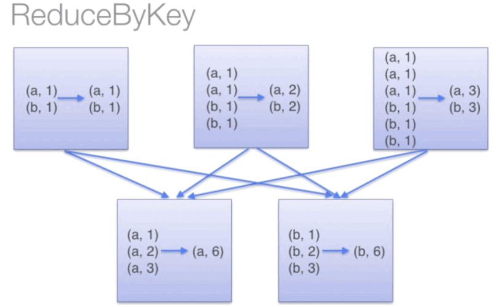

1.  ### Map

    数据集中的每个元素经过用户自定义的函数转换形成一个新的RDD，新的RDD叫MappedRDD

    将函数应用于RDD中的每个元素，将返回值构成新的RDD

    开发：

    package com.jspark1;\
    \
    import org.apache.spark.SparkConf;\
    import org.apache.spark.api.java.JavaRDD;\
    import org.apache.spark.api.java.JavaSparkContext;\
    import org.apache.spark.api.java.function.Function;\
    import org.apache.spark.api.java.function.VoidFunction;\
    \
    \
    import java.util.ArrayList;\
    import java.util.List;\
    \
    public class a1 {\
    public static void main (String\[\] args)throws Exception{\
    SparkConf conf = new
    SparkConf().setMaster("local").setAppName("javamap");\
    JavaSparkContext jsc = new JavaSparkContext(conf);\
    List&lt;Integer&gt; l1 = new ArrayList();\
    l1.add(1);\
    l1.add(2);\
    l1.add(3);\
    JavaRDD&lt;Integer&gt; rdd1 = jsc.parallelize(l1);\
    JavaRDD&lt;Integer&gt; rdd2 = rdd1.map(new Function&lt;Integer,
    Integer&gt;() {\
    @Override\
    public Integer call(Integer ii) throws Exception {\
    return ii+1;\
    }\
    });\
    \
    rdd2.foreach(new VoidFunction&lt;Integer&gt;() {\
    @Override\
    public void call(Integer s) throws Exception {\
    System.out.println(+s);\
    }\
    });\
    }\
    }

    输出时或者

System.***out***.println(rdd2.collect());

### 2.flatmap

将函数应用于RDD中的每个元素，将返回的迭代器的所有内容构成新的RDD，通常用来切分单词。与map的区别是：这个函数返回的值是list的一个，去除原有的格式

package com.jspark1;\
\
import org.apache.spark.SparkConf;\
import org.apache.spark.api.java.JavaRDD;\
import org.apache.spark.api.java.JavaSparkContext;\
import org.apache.spark.api.java.function.FlatMapFunction;\
import org.apache.spark.api.java.function.VoidFunction;\
\
import java.util.Arrays;\
import java.util.Iterator;\
import java.util.List;\
\
public class a2 {\
public static void main (String\[\] args)throws Exception {\
SparkConf conf = new
SparkConf().setMaster("local").setAppName("javamap");\
JavaSparkContext jsc = new JavaSparkContext(conf);\
List&lt;String&gt; q1 = Arrays.asList("hello spark","hello
hadoop","hello flink");\
JavaRDD rdd1 = jsc.parallelize(q1);\
\
JavaRDD rdd2 = rdd1.flatMap(new FlatMapFunction&lt;String,String&gt;()
{\
@Override\
public Iterator call(String o) throws Exception {\
String\[\] aa = o.split(" ");\
return Arrays.asList(aa).iterator();\
}\
});\
\
rdd2.foreach(new VoidFunction() {\
@Override\
public void call(Object o) throws Exception {\
System.out.println(o);\
}\
});\
}\
}

Arrays.asList()用法

使用Arrays.asList()的原因无非是想将数组或一些元素转为集合,而你得到的集合并不一定是你想要的那个集合。

### 3.mapPartitions

mapPartitions函数会对每个分区依次调用分区函数处理，然后将处理的结果(若干个Iterator)生成新的RDDs。

mapPartitions与map类似，但是如果在映射的过程中需要频繁创建额外的对象，使用mapPartitions要比map高效的过。

package com.jspark1;\
\
import org.apache.spark.SparkConf;\
import org.apache.spark.api.java.JavaRDD;\
import org.apache.spark.api.java.JavaSparkContext;\
import org.apache.spark.api.java.function.FlatMapFunction;\
import org.apache.spark.api.java.function.VoidFunction;\
\
import java.util.ArrayList;\
import java.util.Arrays;\
import java.util.Iterator;\
import java.util.List;\
\
public class a3 {\
public static void main (String\[\] args)throws Exception {\
SparkConf conf = new
SparkConf().setMaster("local").setAppName("javamap");\
JavaSparkContext jsc = new JavaSparkContext(conf);\
List&lt;Integer&gt; q1 = Arrays.asList(1,2,3,4,5,2);\
\
JavaRDD rdd1 = jsc.parallelize(q1,2);\
JavaRDD rdd2 = rdd1.mapPartitions(new
FlatMapFunction&lt;Iterator&lt;Integer&gt;,Integer &gt;() {\
List&lt;Integer&gt; aa = new ArrayList&lt;Integer&gt;();\
@Override\
public Iterator&lt;Integer&gt; call(Iterator&lt;Integer&gt; o) throws
Exception {\
int a =0;\
while (o.hasNext()){\
a = o.next();\
if(a&gt;2) {\
aa.add(a);\
}\
}\
return aa.iterator();\
}\
});\
\
rdd2.foreach(new VoidFunction() {\
@Override\
public void call(Object o) throws Exception {\
System.out.println(o);\
}\
});\
}\
}

### 4.sortBy

sortBy根据给定的f函数将RDD中的元素进行排序。

package com.jspark1;\
\
import org.apache.spark.SparkConf;\
import org.apache.spark.api.java.JavaRDD;\
import org.apache.spark.api.java.JavaSparkContext;\
import org.apache.spark.api.java.function.Function;\
import org.apache.spark.api.java.function.VoidFunction;\
import org.apache.spark.sql.sources.In;\
\
import java.util.Arrays;\
import java.util.List;\
\
public class a4 {\
public static void main (String\[\] args)throws Exception {\
SparkConf conf = new
SparkConf().setMaster("local").setAppName("javamap");\
JavaSparkContext jsc = new JavaSparkContext(conf);\
List&lt;Integer&gt; q1 = Arrays.asList(1,9,18,2,6,12,55);\
JavaRDD rdd1 = jsc.parallelize(q1);\
JavaRDD rdd2 = rdd1.sortBy(new Function() {\
@Override\
public Object call(Object o) throws Exception {\
return o;\
}\
},false,1);\
\
rdd2.foreach(new VoidFunction() {\
@Override\
public void call(Object o) throws Exception {\
System.out.println(o);\
}\
});\
\
}\
}

5.  ### Reduce

    def reduce(f: JFunction2\[T, T, T\]): T

    根据映射函数f，对RDD中的元素进行二元计算（满足交换律和结合律），返回计算结果。

    package com.jspark1;\
    \
    import org.apache.spark.SparkConf;\
    import org.apache.spark.api.java.JavaRDD;\
    import org.apache.spark.api.java.JavaSparkContext;\
    import org.apache.spark.api.java.function.Function2;\
    \
    import java.util.Arrays;\
    import java.util.List;\
    \
    public class a5 {\
    public static void main (String\[\] args)throws Exception {\
    SparkConf conf = new
    SparkConf().setMaster("local").setAppName("javamap");\
    JavaSparkContext jsc = new JavaSparkContext(conf);\
    List&lt;Integer&gt; q1 = Arrays.asList(1, 9, 18, 2, 6, 12, 55);\
    JavaRDD rdd1 = jsc.parallelize(q1);\
    Integer rr = (Integer) rdd1.reduce(new
    Function2&lt;Integer,Integer,Integer&gt;() {\
    @Override\
    public Integer call(Integer o, Integer o2) throws Exception {\
    return o+o2;\
    }\
    });\
    System.out.println(rr);\
    \
    }\
    }

### 6.distinct

def distinct(): JavaRDD\[T\]

def distinct(numPartitions: Int): JavaRDD\[T\]

第一个函数是基于第二函数实现的，只是numPartitions默认为partitions.length，partitions为parent
RDD的分区。

distinct() 功能是 deduplicate RDD
中的所有的重复数据。由于重复数据可能分散在不同的 partition
里面，因此需要 shuffle 来进行 aggregate 后再去重。然而，shuffle
要求数据类型是 &lt;K, V&gt; 。如果原始数据只有 Key（比如例子中 record
只有一个整数），那么需要补充成 &lt;K, null&gt; 。这个补充过程由 map()
操作完成，生成 MappedRDD。然后调用上面的 reduceByKey() 来进行
shuffle，在 map 端进行 combine，然后 reduce 进一步去重，生成
MapPartitionsRDD。最后，将 &lt;K, null&gt; 还原成 K，仍然由 map()
完成，生成 MappedRDD。

package com.jspark1;\
\
import org.apache.spark.SparkConf;\
import org.apache.spark.api.java.JavaRDD;\
import org.apache.spark.api.java.JavaSparkContext;\
\
import java.util.Arrays;\
import java.util.List;\
\
public class a6 {\
public static void main (String\[\] args)throws Exception{\
SparkConf conf = new
SparkConf().setMaster("local").setAppName("javamap");\
JavaSparkContext jsc = new JavaSparkContext(conf);\
List&lt;Integer&gt; l1 = Arrays.asList(1, 2, 4, 3, 5, 6, 5, 1, 2);\
JavaRDD&lt;Integer&gt; javaRDD = jsc.parallelize(l1);\
\
JavaRDD&lt;Integer&gt; distinctRDD1 = javaRDD.distinct();\
System.out.println(distinctRDD1.collect());\
JavaRDD&lt;Integer&gt; distinctRDD2 = javaRDD.distinct(2);\
//System.out.println(distinctRDD2.collect());\
jsc.stop();\
}\
}

### 7.reduceByKey {#reducebykey .ListParagraph}

reduceByKey就是对元素为KV对的RDD中Key相同的元素的Value进行binary\_function的reduce操作，因此，Key相同的多个元素的值被reduce为一个值，然后与原RDD中的Key组成一个新的KV对。

{width="5.766666666666667in"
height="3.5729166666666665in"}

package com.jspark1;\
\
import org.apache.spark.SparkConf;\
import org.apache.spark.api.java.JavaPairRDD;\
import org.apache.spark.api.java.JavaRDD;\
import org.apache.spark.api.java.JavaSparkContext;\
import org.apache.spark.api.java.function.Function;\
import org.apache.spark.api.java.function.Function2;\
import org.apache.spark.api.java.function.PairFunction;\
import org.apache.spark.api.java.function.VoidFunction;\
import scala.Tuple1;\
import scala.Tuple2;\
\
import java.util.ArrayList;\
import java.util.List;\
\
public class a7 {\
public static void main (String\[\] args)throws Exception{\
SparkConf conf = new
SparkConf().setMaster("local").setAppName("javamap");\
JavaSparkContext jsc = new JavaSparkContext(conf);\
List&lt;String&gt; l1 = new ArrayList();\
l1.add("aa");\
l1.add("bb");\
l1.add("aa");\
JavaRDD&lt;String&gt; rdd1 = jsc.parallelize(l1);\
JavaPairRDD&lt;String,Integer&gt; rdd2 = rdd1.mapToPair(new
PairFunction&lt;String, String, Integer&gt;() {\
@Override\
public Tuple2&lt;String,Integer&gt; call(String s) throws Exception {\
return new Tuple2&lt;String,Integer&gt;(s,1);\
}\
});\
JavaPairRDD&lt;String,Integer&gt; rdd3 = rdd2.reduceByKey(new
Function2&lt;Integer, Integer, Integer&gt;() {\
@Override\
public Integer call(Integer i1, Integer i2) throws Exception {\
return i1+i2;\
}\
});\
\
System.out.println(rdd3.collect());\
\
\
\
}\
}

或者：

List&lt;Tuple2&lt;String,Integer&gt;&gt; list = Arrays.asList(

new Tuple2&lt;String,Integer&gt;("w1",1),

new Tuple2&lt;String,Integer&gt;("w2",2),

new Tuple2&lt;String,Integer&gt;("w3",3),

new Tuple2&lt;String,Integer&gt;("w2",22),

new Tuple2&lt;String,Integer&gt;("w1",11)

);

JavaPairRDD&lt;String,Integer&gt; pairRdd = sc.parallelizePairs(list);
