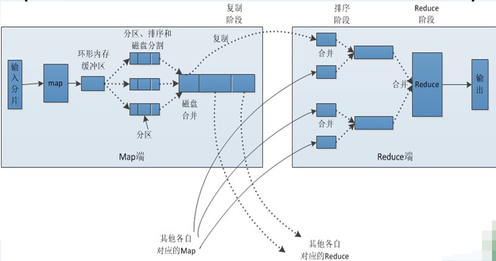
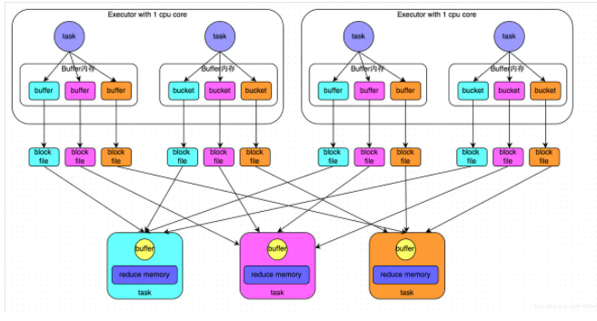
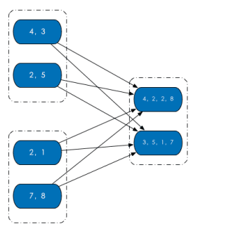

### 一、分区原理

1.  ### 为什么要分区？

    为了减少网络传输，需要增加cpu计算负载。数据分区，在分布式集群里，网络通信的代价很大，减少网络传输可以极大提升性能。mapreduce框架的性能开支主要在io和网络传输，io因为要大量读写文件，它是不可避免的，但是网络传输是可以避免的，把大文件压缩变小文件，
    从而减少网络传输，但是增加了cpu的计算负载。

Spark里面io也是不可避免的，但是网络传输spark里面进行了优化。spark把rdd进行分区（分片），放在集群上并行计算。同一个rdd分片100个，10个节点，平均一个节点10个分区，当进行sum型的计算的时候，先进行每个分区的sum，然后把sum值shuffle传输到主程序进行全局sum，所以进行sum型计算对网络传输非常小。但对于进行join型的计算的时候，需要把数据本身进行shuffle，网络开销很大。

1.  ### spark是如何优化这个问题的呢？

    Hadoop shuffle

    {width="5.967361111111111in"
    height="3.147222222222222in"}

    Spark shuffle

    {width="5.7625in"
    height="3.095833333333333in"}

mapreduce分区：就是说mapreduce的网络传输主要在shuffle阶段，shuffle的根本原因是相同的key存在不同的节点上，按key进行聚合的时候不得不进行shuffle。shuffle是非常影响网络的，它要把所有的数据混在一起走网络，然后它才能把相同的key的数据拉到一起。要进行shuffle是存储决定的。

spark分区：spark会基于key进行分区，也就是key的hashcode进行分区（相同的key，它的hashcode相同）。所以，它进行分区的时候100t的数据分成10份，每部分10个t，它能确保相同的key肯定在一个分区里面，而且它能保证存储的时候相同的key能够存在同一个节点上。例如，一个rdd分成了100份，集群有10个节点，所以每个节点存10份，每一份称为一个分区，spark能保证相同的key存在同一个节点上，实际上相同的key存在同一个分区。

key的分布不均决定了有的分区大有的分区小。没法保证分区数据量完全相等，但它会保证在一个接近的范围。所以对于mapreduce做的某些工作里边，spark就不需要shuffle了，spark解决网络传输这块的根本原理就是这个。

进行join的时候是两个表，不可能把两个表都分区好，通常情况下是把用的频繁的大表事先进行分区，小表进行关联它的时候小表进行shuffle过程。

大表不需要shuffle。

RDD
内部的数据集合在逻辑上（以及物理上）被划分成多个小集合，这样的每一个小集合被称为分区。像是下面这图中，三个
RDD，每个 RDD 内部都有两个分区。

{width="3.7083333333333335in"
height="3.7083333333333335in"}

在源码级别，RDD 类内存储一个 Partition 列表。每个 Partition
对象都包含一个 index 成员，通过 RDD 编号 + index 就能从唯一确定分区的
Block 编号，持久化的 RDD 就能通过这个 Block
编号从存储介质中获得对应的分区数据。（RDD + index-&gt; Block
编号-&gt;分区数据）

### 二、Spark分区原则及方法

1.RDD分区的一个分区原则：尽可能是得分区的个数等于集群核心数目。

下面我们仅讨论Spark默认的分区个数，这里分别就parallelize和textFile具体分析其默认的分区数：

无论是本地模式、Standalone模式、YARN模式或Mesos模式，我们都可以通过spark.default.parallelism来配置其默认分区个数，若没有设置该值，则根据不同的集群环境确定该值。

本地模式：默认为本地机器的CPU数目，若设置了local\[N\],则默认为N

Apache Mesos：默认的分区数为8

Standalone或YARN：默认取集群中所有核心数目的总和，或者2，取二者的较大值。对于parallelize来说，没有在方法中的指定分区数，则默认为spark.default.parallelism，对于textFile来说，没有在方法中的指定分区数，则默认为min(defaultParallelism,2)，而defaultParallelism对应的就是spark.default.parallelism。如果是从hdfs上面读取文件，其分区数为文件分片数(128MB/片)

2.如何创建分区？

有两种情况，创建 RDD 时和通过转换操作得到新 RDD
时。其实就是创建RDD的2种方法。

对于前者，在调用 textFile 和 parallelize
方法时候手动指定分区个数即可。例如 sc.parallelize(Array(1, 2, 3, 5, 6),
2) 指定创建得到的 RDD 分区个数为 2。

对于后者，直接调用 repartition
方法即可。实际上，分区的个数是根据转换操作对应多个 RDD
之间的依赖关系来确定的。

1）窄依赖，子 RDD 由父 RDD 分区个数决定，例如 map 操作，父 RDD 和子 RDD
分区个数一致；

2）Shuffle 依赖，则由分区器（Partitioner）决定，例如 groupByKey(new
HashPartitioner(2)) 或者直接 groupByKey(2) 得到的新 RDD 分区个数等于 2。

3.spark shuffle中的partitioner的执行时机具体是哪里？

partitioner在worker节点上执行，每个stage（除了最后一个）的最后一步就是将数据分区后，写入磁盘，然后把分区信息上报给master。

master在启动新的stage是会将上一个stage的分区信息携带给新的task,这样新的task就知道去哪读取数据了。

分区是spark并行中的最小粒度，也就是说一个分区的数据必定需要一个线程来处理，不可拆分。几个分区就是并行几个task。

例如，假定一个RDD的数据来源于2个hdfs文件，那么加载数据集时一开始默认是2个分区，可以并行处理2个文件。如果你有100个节点，每个节点有一个core，那么最多只能利用2个节点，这时我想提高并行度，就可以对这些数据进行重分区，把这两个文件分成100个分区，这时候就会使用hashpartitioner把这些数据散列到100个分区。

怎么做呢？

因为一开始是2个分区，所以产生2个任务，分散到2个节点，每个任务各自利用hashpartitioner开始分区，分区完成的数据写入磁盘，这个时候2个节点的本地各自都会有100个分区的数据，编号0-99。也就是说一个分区的数据实际位于2个节点。然后它们把这些分区信息上报给driver，这样driver就知道这些分区的位置了。这个过程就是shuffle。

接下来假设，我们需要对这个重分区后的RDD计数，此时就有100个分区，可以利用集群100个节点，。对每个分区来看，其实就是从driver上获取分区信息，然后从两个节点把该分区的数据通过网络捞出来，做累加计算（聚合reduce）。
