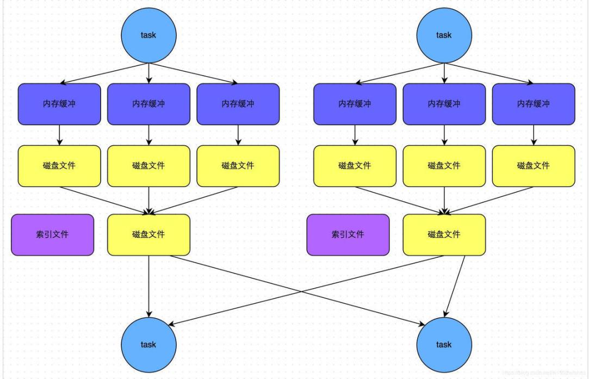

在spark-1.6版本之前，一直使用HashShuffle，在spark-1.6版本之后使用Sort-Base
Shuffle，因为HashShuffle存在的不足所以就替换了HashShuffle,(Hash
Shuffle在spark2.0+被移除)

Shuffle概念
-----------

Driver和Executor

Spark在执行每个Application的过程中会启动Driver和Executor两种JVM进程：

Driver进程为主控进程，负责执行用户Application中的main方法，提交Job，并将Job转化为Task，在各个Executor进程间协调Task的调度。

运行在Worker上的Executor进程负责执行Task，并将结果返回给Driver，同时为需要缓存的RDD提供存储功能。

{width="4.763888888888889in"
height="2.286111111111111in"}

Shuffle为边界，Spark将一个Job划分为不同的Stage，这些Stage构成了一个大粒度的DAG。Spark的Shuffle分为Write和Read两个阶段，分属于两个不同的Stage。

{width="4.597222222222222in"
height="2.466666666666667in"}

### hashshuffle

所谓Shuffle就是将不同节点上相同的Key拉取到一个节点的过程。这之中涉及到各种IO，所以执行时间势必会较长，Spark的Shuffle在1.2之前默认的计算引擎是HashShuffleManager，不过HashShuffleManager有一个十分严重的弊端，就是会产生大量的中间文件。在1.2之后默认Shuffle改为SortShuffleManager，相对于之前，在每个Task虽然也会产生大量中间文件，但是最后会将所有的临时文件合并（merge）成一个文件。因此Shuffle
read只需要读取时，根据索引拿到每个磁盘的部分数据就可以了

每一个 ShuffleMapTask 都会为每一个 ReducerTask
创建一个单独的文件，总的文件数是 M \* R，其中 M 是 ShuffleMapTask
的数量，R 是 ShuffleReduceTask 的数量。

{width="5.006944444444445in"
height="2.5618055555555554in"}

在HashShuffle没有优化之前，每一个ShufflleMapTask会为每一个ReduceTask创建一个bucket缓存，并且会为每一个bucket创建一个文件。这个bucket存放的数据就是经过Partitioner操作(默认是HashPartitioner)之后找到对应的bucket然后放进去，最后将数据

刷新bucket缓存的数据到磁盘上，即对应的block file.

然后ShuffleMapTask将输出作为MapStatus发送到DAGScheduler的MapOutputTrackerMaster，每一个MapStatus包含了每一个ResultTask要拉取的数据的位置和大小

ResultTask然后去利用BlockStoreShuffleFetcher向MapOutputTrackerMaster获取MapStatus，看哪一份数据是属于自己的，然后底层通过BlockManager将数据拉取过来

拉取过来的数据会组成一个内部的ShuffleRDD，优先放入内存，内存不够用则放入磁盘，然后ResulTask开始进行聚合，最后生成我们希望获取的那个MapPartitionRDD

也正是上述原因，该 HashShuffle 如今已退出历史舞台

。

### 1.2优化后 HashShuffle

{width="5.766666666666667in"
height="2.9819444444444443in"}

{width="5.125in"
height="3.9715277777777778in"}

每一个Executor进程根据核数，决定Task的并发数量，比如executor核数是2，就是可以并发运行两个task，如果是一个则只能运行一个task

假设executor核数是1，ShuffleMapTask数量是M,那么它依然会根据ResultTask的数量R，创建R个bucket缓存，然后对key进行hash，数据进入不同的bucket中，每一个bucket对应着一个block
file,用于刷新bucket缓存里的数据

然后下一个task运行的时候，那么不会再创建新的bucket和block
file，而是复用之前的task已经创建好的bucket和block
file。即所谓同一个Executor进程里所有Task都会把相同的key放入相同的bucket缓冲区中

这样的话，生成文件的数量就是(本地worker的executor数量\*executor的cores\*ResultTask数量)如上图所示，即2\*1\*3
=
6个文件，每一个Executor的shuffleMapTask数量100,ReduceTask数量为100，那么

未优化的HashShuffle的文件数是2\*1\*100\*100
=20000，优化之后的数量是2\*1\*100 = 200文件，相当于少了100倍

### 1.3 Sort-Based Shuffle

为了缓解Shuffle过程产生文件数过多和Writer缓存开销过大的问题，spark引入了类似于hadoop
Map-Reduce的shuffle机制。该机制每一个ShuffleMapTask不会为后续的任务创建单独的文件，而是会将所有的Task结果写入同一个文件，并且对应生成一个索引文件。以前的数据是放在内存缓存中，等到数据完了再刷到磁盘，现在为了减少内存的使用，在内存不够用的时候，可以将输出溢写到磁盘，结束的时候，再将这些不同的文件联合内存的数据一起进行归并，从而减少内存的使用量。一方面文件数量显著减少，另一方面减少Writer缓存所占用的内存大小，而且同时避免GC的风险和频率。

由于 HashShuffle 会产生很多的磁盘文件，引入 Consolidation
机制虽然在一定程度上减少了磁盘文件数量，但是不足以有效提高 Shuffle
的性能，适合中小型数据规模的大数据处理。

为了让 Spark 在更大规模的集群上更高性能处理更大规模的数据，因此在 Spark
1.1 版本中，引入了 SortShuffle。

基于sort的shuffle\
sort-based的shuffle，会把输入的记录根据目标分区id(partition
ids)进行排序。然后写入单个的map输出文件中。为了读取map的输出部分，Reducers获取此文件的连续区域
。当map输出的数据太大而内存无法存放时，输出的排序子集可以保存到磁盘，这些磁盘文件被合并后，生成最终的输出文件。

{width="5.759722222222222in"
height="3.15in"}

Sort-Based
Shuffle有几种不同的策略：BypassMergeSortShuffleWriter、SortShuffleWriter和UnasfeSortShuffleWriter。

**对于hash shuffle**
--------------------

就是说对于数据的特征，分片策略采用hash
code的方式来进行，简单暴力直接，如果后续的stage需要有10个reducer，那么直接按10取模，数据就分好了。

如果当前的stage的task是5，那么每个task会对应10个reducer，这样会将5个结果文件，分为50个小文件存储在磁盘上，后续的stage直接来取50个小文件就完毕，这是初级hash
shuffle

这个带来的问题就是磁盘IO太多，内存可能溢出

所以一般会将50个结果文件进行一个consolidate，原则是产生当前executor的cpu数\*10个文件，存储在磁盘，比如是2个core的机器，那么只产生20个文件，这就是优化的hash
shuffle

 

**对于sort shuffle**
--------------------

对生成的结果进行排序，然后生成小文件，再对小文件进行总的归并排序，生成一个大文件和一个索引文件，存储在磁盘上面

这样磁盘IO做到最小，索引文件保证了reducer的读取效率

2 spark shuffle三种writer原理
-----------------------------

### 2.1BypassMergeSortShuffleWriter

首先，BypassMergeSortShuffleWriter的运行机制的触发条件如下：

> (1)shuffle reduce
> task(即partition)数量小于spark.shuffle.sort.bypassMergeThreshold参数的值(默认为200)。

(2)没有map side aggregations。

> (3)note: map side
> aggregations是指在map端的聚合操作，通常来说一些聚合类的算子都会都map端的aggregation。不过对于groupByKey
> 和combineByKey， 如果设定mapSideCombine为false，就不会有 map side
> aggregations。

写入磁盘文件是通过 Java的 BufferedOutputStream
实现的，BufferedOutputStream 是 Java
的缓冲输出流，首先会将数据缓冲在内存中，当内存缓冲满溢之后再一次写入磁盘文件中，这样可以减少磁盘
IO 次数，提升性能。所以图中会有内存缓冲的概念。

{width="4.923611111111111in"
height="3.167361111111111in"}

(1)正常应该有3个reduce task,key先计算成hash值，再存放到对应文件

(2)最后，会将所有临时文件合并成一个磁盘文件，并创建一个索引文件标识下游各个
reduce task 的数据在文件中的 start offset与 end offset

(3)而且它只保证分区索引的排序，而并不保证数据的排序。（数据不排序，节省了资源）

### 2.2 SortShuffleWriter

这种writer 思想上照抄了mapreduce 的shuffle。

该模式下，数据首先写入一个内存数据结构中，此时根据不同的shuffle算子，可能选用不同的数据结构。如果是reduceByKey这种聚合类的shuffle算子，那么会选用Map数据结构，一边通过Map进行聚合，一边写入内存；如果是join这种普通的shuffle算子，那么会选用Array数据结构，直接写入内存。接着，每写一条数据进入内存数据结构之后，就会判断一下，是否达到了某个临界阈值。如果达到临界阈值的话，那么就会尝试将内存数据结构中的数据溢写到磁盘，然后清空内存数据结构。

在溢写到磁盘文件之前，会先根据key对内存数据结构中已有的数据进行排序。排序过后，会分批将数据写入磁盘文件。默认的batch数量是10000条，也就是说，排序好的数据，会以每批1万条数据的形式分批写入磁盘文件。写入磁盘文件也是通过Java的BufferedOutputStream实现的。

一个task将所有数据写入内存数据结构的过程中，会发生多次磁盘溢写操作，也就会产生多个临时文件。最后会将之前所有的临时磁盘文件都进行合并，这就是merge过程，此时会将之前所有临时磁盘文件中的数据读取出来，然后依次写入最终的磁盘文件之中。此外，由于一个task就只对应一个磁盘文件，也就意味着该task为下游stage的task准备的数据都在这一个文件中，因此还会单独写一份索引文件，其中标识了下游各个task的数据在文件中的start
offset与end offset。

BypassMergeSortShuffleWriter
与该机制相比：第一，磁盘写机制不同；第二，不会进行排序。也就是说，启用BypassMerge机制的最大好处在于，shuffle
write过程中，不需要进行数据的排序操作，也就节省掉了这部分的性能开销，当然需要满足那两个触发条件。

### 2.3 UnsafeShuffleWriter

使用UnSafeShuffleWriter的话，数据是不会进行反序列化的，所以使用Long类型的变量记录记录一条数据的原信息：PartitionId
+ pageNum +
offsetInPage，它们的长度分别分别是24,13,27位，所以设置一个Page的大小不能超过2\^27
= 128M，排序操作的就是这些元数据信息。

{width="5.768055555555556in"
height="0.48541666666666666in"}

满足条件：

(1)map-side
aggregation：从上面的实现也可以看出，UnsafeShuffleWriter不是类似HashMap的数据结构，无法聚合key对应的value，所以无法支持map端的aggregation。

(2)Partition数小于16777216：参考第一幅图，存储PartitionId信息使用24bit，能表示的最大值为
(1 &lt;&lt; 24) = 16777215，因此Partition数要小于16777216。

(3)Serializer支持relocation：原始数据首先被序列化处理，并且再也不需要反序列，在其对应的元数据被排序后，需要Serializer支持relocation，在指定位置读取对应数据

{width="5.768055555555556in"
height="1.0972222222222223in"}

{width="5.766666666666667in"
height="5.18125in"}
