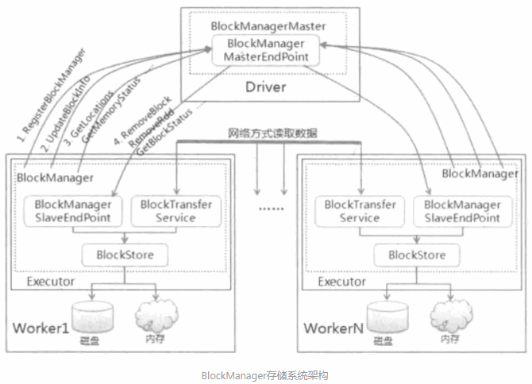
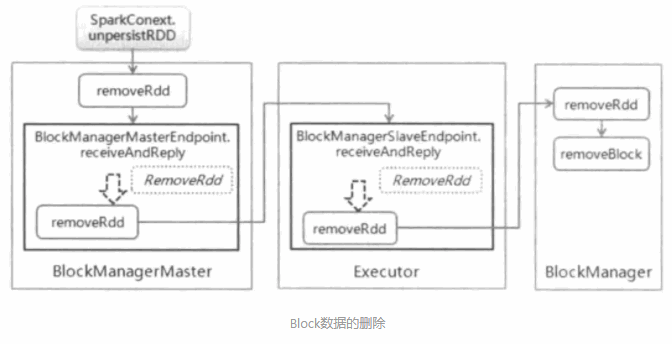
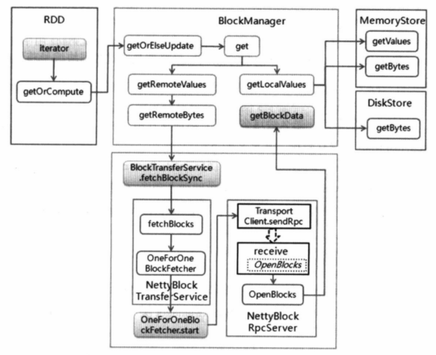
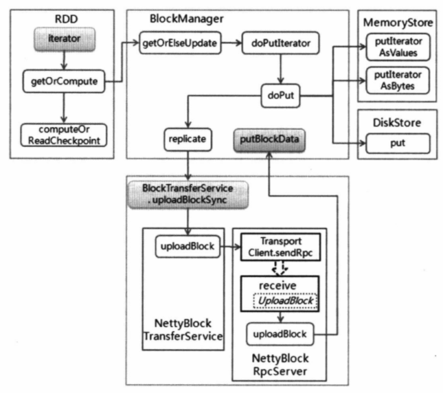

### 1.blockmanager介绍

BlockManager 在一个 spark 应用中作为一个本地缓存运行在所有的节点上，
包括所有 driver 和 executor上。BlockManager 对本地和远程提供一致的 get
和set 数据块接口，BlockManager 本身使用不同的存储方式来存储这些数据，
包括 memory, disk, off-heap。

#### （1）BlockManagerMaster

BlockManagerMaster负责整个应用程序运行期间的数据块的元数据管理和维护。BlockManager（Slave）负责将本地数据块的状态信息上报给BlockManagerMaster，同时接受从BlockManagerMaster传过来的执行命令，如获取数据块状态，删除数据块等命令。每个BlockManager中都存在数据传输通道，根据需要进行远程数据的读取和写入。

在应用程序启动期间，SparkContext会创建Driver端的SparkEnv，在该SparkEnv中实例化BlockManagerMaster，在BlockManagerMaster内部创建消息通信的端点BlockManagerMasterEndpoint。

#### （2）Executor端 BlockManager

同理，在Executor启动时，也会创建SparkEnv，在该SparkEnv中实例化BlockManager和负责网络数据传输服务的BlockTransferService。BlockManager初始化过程中，会加入BlockManagerMasterEndpoint端点的引用，同时也会创建BlockManagerSlaveEndpoint端点，并把该端点的引用注册到Driver中，这样Driver和Executor互相持有通信端点的引用，可以在应用程序执行过程中进行消息通信。BlockTransferService中使用了基于Netty的数据传输方式，该传输方式隐藏了集群间不同节点的消息传输操作，可以类似于本地数据操作方式进行数据读写，大大简化了网络间数据传输的复杂程度。

{width="5.764583333333333in"
height="4.164583333333334in"}

### 2.工作过程

#### （1）数据块位置信息的获取

应用程序在完成数据存储后，后续的task在获取远程节点数据，获取rdd执行的首选位置等操作需要根据数据块的编号查询出数据块所处的位置，此时发送getLocation或者getLocationMultipleBlockIds等消息给BlockManagerMasterEndpoint端点，通过对元数据的查询获取数据块的位置信息。

#### （2）数据块的删除

Spark提供删除RDD，数据块和广播变量的方式，当数据需要删除时，提交删除。当数据需要删除时，提交删除消息给BlockManagerSlaveEndpoint端点，在该端点对应发起删除操作，删除操作一方面需要先通知Driver端删除数据块的元数据信息，另一方面需要发送消息通知Executor，删除对应的物理数据。这里需要注意这个先后顺序，以免物理数据删除完毕之后，还存在元数据未删除。

{width="5.768055555555556in"
height="2.952777777777778in"}

#### （3）数据块的读取

Executor的BlockManager接受到读取数据的请求时候，根据数据块所在的节点是否在本地，调用BlockManager的不同方法去处理，如果在本地则调用MemoryStore或者DiskStore中的取方法，进行读取，如果在远程，则调用BlockTransferService的服务去远程节点上获取数据。

{width="5.7652777777777775in"
height="4.694444444444445in"}

#### （4）数据块的写入

当Executor的BlockManager接受到写数据的请求时，如果不需要创建副本，则调用BlockStore的接口方法去进行处理，根据数据写入的存储类型，决定调用对应的写入方法。

{width="5.764583333333333in"
height="5.1125in"}

### 消息分类

BlockManagerMasterEndpoint 接受的消息

-   

  ------------------------------ -----------------------------------------------------------------------------------------------------------------------------------
  **消息**                       **处理**
  RegisterBlockManager           slave 注册自己的消息，会保存在自己的blockManagerInfo中
  UpdateBlockInfo                一个Block的更新消息，BlockId作为一个Block的唯一标识，会保存Block所在的节点和位置关系，以及block 存储级别，大小 占用内存和磁盘大小
  GetLocationsMultipleBlockIds   获取多个Block所在 的位置，位置中会反映Block位于哪个 executor, host 和端口
  GetPeers                       一个block有可能在多个节点上存在，返回一个节点列表
  GetExecutorEndpointRef         根据BlockId,获取所在executorEndpointRef 也就是 BlockManagerSlaveEndpoint的引用
  GetMemoryStatus                获取所有节点上的BlockManager的最大内存和剩余内存
  GetStorageStatus               获取所有节点上的BlockManager的最大磁盘空间和剩余磁盘空间
  GetBlockStatus                 获取一个Block的状态信息，位置，占用内存和磁盘大小
  GetMatchingBlockIds            获取一个Block的存储级别和所占内存和磁盘大小
  RemoveRdd                      删除Rdd对应的Block数据
  RemoveBroadcast                删除Broadcast对应的Block数据
  RemoveBlock                    删除一个Block数据，会找到数据所在的slave,然后向slave发送一个删除消息
  RemoveExecutor                 从BlockManagerInfo中删除一个BlockManager, 并且删除这个 BlockManager上的所有的Blocks
  BlockManagerHeartbeat          slave 发送心跳给 master , 证明自己还活着
  ------------------------------ -----------------------------------------------------------------------------------------------------------------------------------

-   

BlockManagerSlaveEndpoint 接受的消息

-   

  ----------------- ---------------------------------------------
  **消息**          **处理**
  RemoveBlock       slave删除自己BlockManager上的一个Block
  RemoveRdd         删除Rdd对应的Block数据
  RemoveShuffle     删除 shuffleId对应的BlockId的Block
  RemoveBroadcast   删除 BroadcastId对应的BlockId的Block
  GetBlockStatus    获取一个Block的存储级别和所占内存和磁盘大小
  ----------------- ---------------------------------------------

