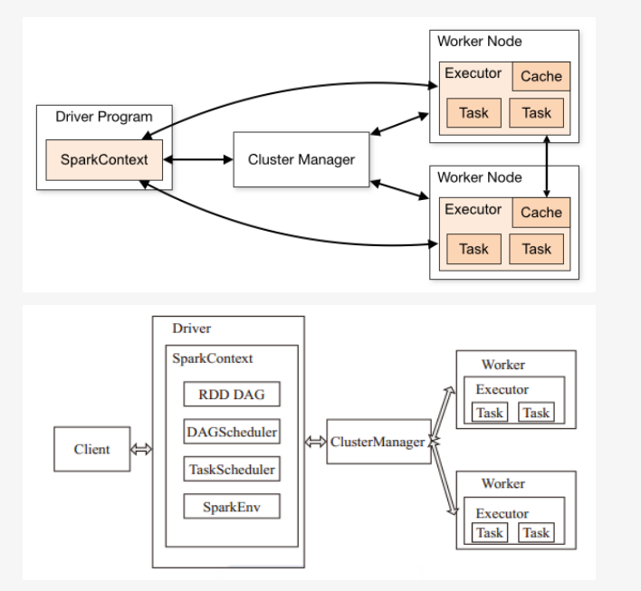
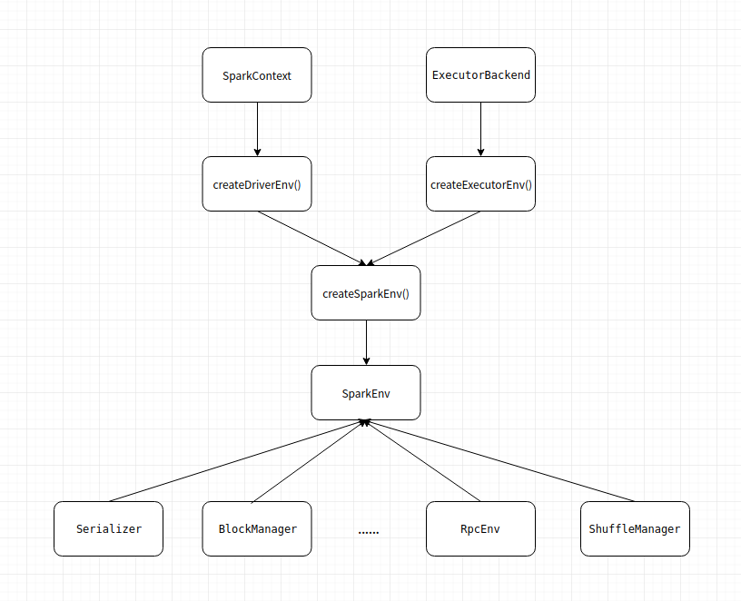

Job:

调用RDD的一个action，如count，即触发一个Job，spark中对应实现为ActiveJob，DAGScheduler中使用集合activeJobs和jobIdToActiveJob维护Job

Stage:

代表一个Job的DAG，会在发生shuffle处被切分，切分后每一个部分即为一个Stage，每组任务被称为Stage，也叫做TaskSet，一个作业分为多个阶段。

Task:

最终被发送到Executor执行的任务。

{width="5.429245406824147in"
height="5.007638888888889in"}

1.RDD DAG
---------

> DAG，有向无环图，Directed Acyclic
> Graph的缩写，常用于建模。Spark中使用DAG对RDD的关系进行建模，描述了RDD的依赖关系，这种关系也被称之为lineage,DAG在Spark中的对应的实现为DAGScheduler。

2.DAGScheduler
--------------

(1)DAGScheduler的建立

用户提交编写的sparkcontext时就创建了DAGScheduler和TaskScheduler。

(2)job提交

job产生发生在RDD执行动作时，这个动作运行方法runjob,来监听job的运行情况。DAGSheduler通过内部的方法submitJob来提交，但此时的提交只是job最终提交的一小步。此时提交job并生成jobid，将job放入队列中，由DAGSheduler中的方法来依次处理。最后的提交是送给了DAGScheduler.handleJobSubmitted，这个方法会进行处理job并进行阶段划分。

(3)stage划分

stage的划分是从最后往前逆推的，依宽依赖作为划分的准则，遇到宽依赖就划分出一个stage，遇到窄依赖就压入栈中。从stage到父stage以及从RDD找出依赖，均是从最后执行动作的RDD，根据依赖信息往前探寻，为了避免重复访问或者说重复运算，将访问过的RDD存入Hashset中。递归调用方法getparentStage来不断划分stage,每次划分阶段都会生成一个stageid，因为递归调用所以命名的id越往前越小，也就是说从后面先划分的stageid是最大的，越小的阶段之后提交后先被运算。以这样的步骤划分阶段，直到阶段宽依赖划分完毕或者第一个RDD被访问完成。

DAGScheduler将包含一组task的stage提交给TaskScheduler

3.TaskScheduler
---------------

TaskScheduler维护所有TaskSet，当Executor向Driver发送心跳时，TaskScheduler会根据其资源剩余情况分配
相应的Task。另外TaskScheduler还维护着所有Task的运行状态，重试失败的Task。

（1）为每一个TaskSet构建一个TaskSetManager 实例管理这个TaskSet
的生命周期

（2）数据本地性决定每个Task最佳位置

（3）提交 taskset( 一组task) 到集群运行并监控

（4）推测执行，碰到计算缓慢任务需要放到别的节点上重试

（5）重新提交Shuffle输出丢失的Stage给DAGScheduler

4.SparkEnv
----------

SparkEnv 保存着 Application 运行时的环境信息，包括
RpcEnv、Serializer、Block Manager 和 ShuffleManager 等，并为 Driver 端和
Executor 端分别提供了不同的创建方式。

RpcEnv 维持着 Spark
节点间的通信，并负责将传递过来的消息转发给监听者(通信端)。

{width="4.8178412073490815in"
height="3.908333333333333in"}
