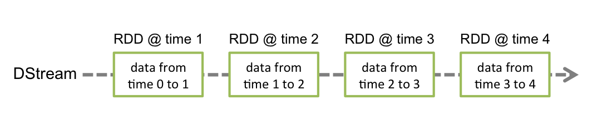

离线和流处理的区别

(1)离线处理是针对一个批次，这个批次一般情况下都比较大流处理对应的数据是连续不断产生，处理时间间隔非常短的数据

(2)离线处理程序，因为数据是有限的（bounded），所以会终止流数据因为是连续不断的产生，所以数据是无限的（unbounded）

由于数据的特征，一般离线处理比较缓慢，流数据处理相对较快

{width="4.402777777777778in"
height="1.425in"}

1.1什么是spark streaming
------------------------

(1)Spark Streaming
其实就是一种spark提供的，对于大数据，进实时计算的一种框架。基本的计算模型，

(2)针对实时计算的特点，在RDD之上，进行了一层封装，叫做DStream。

(3)Spark的运行模式多种多样，灵活多变，部署在单机上时，既以用本地模式运行，也可以用伪分布式模式运行。

(4）Spark Streaming是Spark Core
API的一种扩展，它可以用于进行大规模、高吞吐量、容错的实时数据流的处理。它支持从很多种数据源中读取数据，比如Kafka、Flume等。并且能够使用类似高阶函数的复杂算法来进行数据处理，比如map、reduce、join和window。处理后的数据可以被保存到文件系统、数据库等存储中。

1.2 spark streaming 工作流程
----------------------------

Spark Streaming
是将流式计算分解成一系列短小的批处理作业。这里的批处理引擎是 Spark
Core。

Spark Streaming 首先把输入数据按照批段大小（如 1
秒）分成一段一段的数据（DStream），并把每一段数据都转换成 Spark 中的
RDD，然后将 Spark Streaming 中对 DStream 的 Transformation 操作变为
Spark 中对 RDD 的 Transformation 操作，并将操作的中间结果保存在内存中。

{width="5.768055555555556in"
height="0.9944444444444445in"}

离散数据流（DStream）是Spark
Streaming最基本的抽象。它代表了一种连续的数据流，要么从某种数据源提取数据，要么从其他数据流映射转换而来。DStream内部是由一系列连续的RDD组成的，每个RDD都是不可变、分布式的数据集。每个RDD都包含了特定时间间隔内的一批数据

{width="5.768055555555556in"
height="1.2638888888888888in"}

1.3spark streaming 具体实现思路
-------------------------------

**（1）静态的 RDD DAG 的模板**

假设我们有一小块数据，那么通过 RDD API，我们能够构造出一个进行数据处理的
RDD DAG（如下图所示）。

{width="4.447916666666667in"
height="1.6770833333333333in"}

（2）动态的工作控制器

我们对连续的 streaming data 进行切片处理 —— 比如将最近 200ms 时间的
event 积攒一下 —— 每个切片就是一个 batch，然后使用第一步中的 RDD DAG
对这个 batch 的数据进行处理。

注意: 这里我们使用的是 batch 的概念 —— 其实 200ms
在其它同类系统中通常叫做 mini-batch，不过既然 Spark Streaming
官方的叫法就是 batch，我们这里就用 batch 表达 mini-batch 的意思了 :)

所以，针对连续不断的 streaming data 进行多次切片，就会形成多个
batch，也就对应出来多个 RDD DAG（每个 RDD DAG 针对一个 batch
的数据）。如此一来，这多个 RDD DAG
之间相互同构，却又是不同的实例。我们用下图来表示这个关系：

{width="4.5in"
height="4.697916666666667in"}

所以，我们将需要：

\(a) 一个静态的 RDD DAG 的模板，来表示处理逻辑；

\(b) 一个动态的工作控制器，将连续的 streaming data
切分数据片段，并按照模板复制出新的 RDD DAG 的实例，对数据片段进行处理；

{width="5.761111111111111in"
height="3.053472222222222in"}

(3) **原始数据的产生和导入**

    我们回过头来看 streaming data 本身的产生。

    Hadoop MapReduce, Spark RDD API 进行批处理时，一般默认数据已经在
    HDFS, HBase 或其它存储上。而 streaming data —— 比如 twitter 流 ——
    又有可能是在系统外实时产生的，就需要能够将这些数据导入到 Spark
    Streaming 系统里，就像 Apache Storm 的 Spout，Apache S4 的 Adapter
    能够把数据导入系统里的作用是一致的。所以，我们将需要：

\(c) 原始数据的产生和导入；

4.  **对长时运行任务的保障**

    我们考虑，有了以上 (a)(b)(c) 3 部分，就可以顺利用 RDD API 处理
    streaming data 了吗？其实相对于 batch job
    通常几个小时能够跑完来讲，streaming job 的运行时间是
    +∞（正无穷大）的，所以我们还将需要：

(d)
对长时运行任务的保障，包括输入数据的失效后的重构，处理任务的失败后的重调。

至此，streaming data 的特点决定了，如果我们想基于 Spark Core 进行
streaming data 的处理，还需要在 Spark Core 的框架上解决刚才列出的
(a)(b)(c)(d) 这四点问题：

\(1) 热备：热备是指在存储块数据时，将其存储到本 executor、并同时
replicate 到另外一个 executor 上去。这样在一个 replica
失效后，可以立刻无感知切换到另一份 replica
进行计算。实现方式是，在实现自己的 Receiver 时，即指定一下StorageLevel
为 MEMORY\_ONLY\_2 或 MEMORY\_AND\_DISK\_2 就可以了。

// 1.5.2 update 这已经是默认了。

\(2) 冷备：冷备是每次存储块数据前，先把块数据作为 log 写出到
WriteAheadLog 里，再存储到本 executor。executor 失效时，就由另外的
executor 去读 WAL，再重做 log 来恢复块数据。WAL 通常写到可靠存储如 HDFS
上，所以恢复时可能需要一段 recover time。

\(3) 重放：如果上游支持重放，比如 Apache
Kafka，那么就可以选择不用热备或者冷备来另外存储数据了，而是在失效时换一个
executor 进行数据重放即可。

(3) 忽略：最后，如果应用的实时性需求大于准确性，那么一块数据丢失后我们也可以选择忽略、不恢复失效的源头数据。

    {width="4.416666666666667in"
    height="3.4270833333333335in"}

1.4 spark streaming 架构
------------------------

Spark Streaming
的业务应用场景包括异常监测、网页点击、用户行为以及用户地图迁徙等场景。按计算模型来看大体可分为无状态的计算模型以及状态计算模型两种。在实际的应用场景中，我们采用Kafka作为实时输入源，Spark
Streaming 作为计算引擎处理完数据之后，再持久化到存储中，包括
MySQL、HDFS、ElasticSearch 以及 MongoDB 等；同时 Spark Streaming
数据清洗后也会写入 Kafka，然后经由 Flume 持久化到
HDFS；接着基于持久化的内容做一些 UI 的展现。

{width="5.208333333333333in"
height="5.302083333333333in"}

{width="6.506944444444445in"
height="1.8263888888888888in"}
