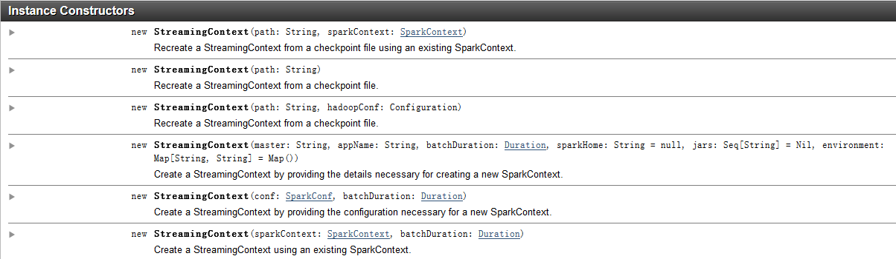
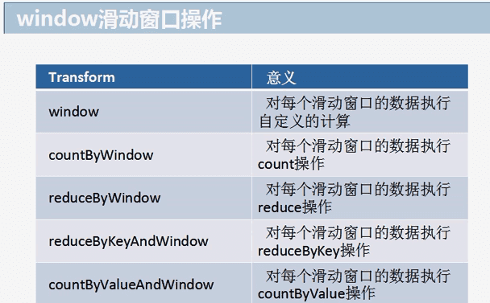
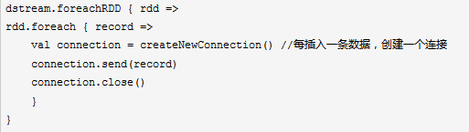
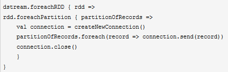

1.spark streaming 
------------------

(1)基础数据源：StreamingContext
API中直接提供了对这些数据源的支持，比如文件、socket、Akka Actor等。

(2)高级数据源：诸如Kafka、Flume、Kinesis、Twitter等数据源，通过第三方工具类提供支持。这些数据源的使用，需要引用其依赖。

(3)自定义数据源：我们可以自己定义数据源，来决定如何接受和存储数据。

### 1.1 编写脚本（例子1）

**import** org.apache.spark.\_\
**import** org.apache.spark.streaming.\_\
**object** SparkS {\
**def** main(args: Array\[String\]): Unit = {\
*// Create a local StreamingContext with two working thread and batch
interval of 15 second.\
// The master requires 2 cores to prevent from a starvation scenario.\
***val** conf = **new**
SparkConf().setMaster(**"local\[2\]"**).setAppName(**"NetworkWordCount"**)\
**val** ssc = **new** StreamingContext(conf, *Seconds*(15))\
\
*// Create a DStream that will connect to hostname:port, like
localhost:9999\
***val** lines = ssc.socketTextStream(**"localhost"**, 9999)\
\
**val** words = lines.flatMap(\_.split(**" "**))\
**val** pairs = words.map(word =&gt; (word, 1))\
**val** wordCounts = pairs.reduceByKey(\_ + \_)\
\
wordCounts.print()\
ssc.start() *// Start the computation\
*ssc.awaitTermination() *// Wait for the computation to terminate\
*}\
}

### 1.2 nc -lk 9999

> nc是netcat工具的命令，是一个很好用的网络工具。比如，可以用来端口扫描，文件传输等网络功能。
>
> \[hadoop@h201 \~\]\$ nc -lk 9999

### 1.3执行spark streaming脚本

> \[hadoop@h201 \~\]\$ spark-2.1.1-bin-hadoop2.7/bin/spark-submit
> --class "SparkS" spark2020.jar

### 1.4在netcat模式下输入内容

> Hello spark
>
> Hello spark

### 1.5代码解释：

要初始化任何一个Spark
Streaming程序，都需要在入口代码中创建一个StreamingContext对象。

{width="5.768055555555556in"
height="1.676388888888889in"}

1.5.1

**val** conf = **new**
SparkConf().setMaster(**"local\[2\]"**).setAppName(**"NetworkWordCount"**)

appName():是你给该应用起的名字，这个名字会展示在Spark集群的web UI上

master() :
如果支持本地测试，你也可以用”local\[\*\]”为其赋值(\*是启动的线程数)

**val** ssc = **new** StreamingContext(conf, *Seconds*(15))\
StreamingContext在内部会创建一个 SparkContext
对象（SparkContext是所有Spark应用的入口，在StreamingContext对象中可以这样访问：ssc.sparkContext）。

StreamingContext还有另一个构造参数，即：批次间隔，这个值的大小需要根据应用的具体需求和可用的集群资源来确定。

context对象创建后，你还需要如下步骤：

(1)创建DStream对象，并定义好输入数据源。

(2)基于数据源DStream定义好计算逻辑和输出。

(3)调用streamingContext.start() 启动接收并处理数据。

(4)调用streamingContext.awaitTermination()
等待流式处理结束（不管是手动结束，还是发生异常错误）

(5)你可以主动调用 streamingContext.stop() 来手动停止处理流程。

context对象创建后，你还需要如下步骤：

(1)创建DStream对象，并定义好输入数据源。

(2)基于数据源DStream定义好计算逻辑和输出。

(3)调用streamingContext.start() 启动接收并处理数据。

(4)调用streamingContext.awaitTermination()
等待流式处理结束（不管是手动结束，还是发生异常错误）

(5)你可以主动调用 streamingContext.stop() 来手动停止处理流程。

**context对象创建后,需要关注重点：**

(1)一旦streamingContext启动，就不能再对其计算逻辑进行添加或修改。

(2)一旦streamingContext被stop掉，就不能restart。

(3)单个JVM虚机同一时间只能包含一个active的StreamingContext。

(4)StreamingContext.stop()
也会把关联的SparkContext对象stop掉，如果不想把SparkContext对象也stop掉，可以将StreamingContext.stop的可选参数
stopSparkContext 设为false。

(5)一个SparkContext对象可以和多个StreamingContext对象关联，只要先对前一个StreamingContext.stop(sparkContext=false)，然后再创建新的StreamingContext对象即可。

1.5.2数据源

**val** lines = ssc.socketTextStream(**"localhost"**, 9999)

2. updateStateByKey算子\
------------------------

UpdateStateByKey：统计全局的key的状态。

定义状态 - 状态可以是任意数据类型。

定义状态更新功能 -
使用函数指定如何使用上一个状态更新状态，并从输入流中指定新值。

如果要使用updateStateByKey,就需要设置一个checkpoint目录，开启checkpoint机制。因为key的state是在内存维护的，如果宕机，则重启之后之前维护的状态就没有了，所以要长期保存它的话需要启用checkpoint，以便恢复数据。

### 2.1 编写脚本

**import** org.apache.spark.\_\
**import** org.apache.spark.streaming.\_\
**object** SupdatestateByKey {\
**def** main(args: Array\[String\]): Unit = {\
**val** conf=**new**
SparkConf().setAppName(**"updateStateByKey"**).setMaster(**"local\[2\]"**)\
**val** ssc=**new** StreamingContext(conf,*Seconds*(15))\
ssc.checkpoint(**"hdfs://h201:9000/sparkinput"**)\
\
**val** lines=ssc.socketTextStream(**"localhost"**,9999)\
\
*//分隔单词，并将分隔后的每个单词出现次数记录为１\
***val** pairs=lines.flatMap(\_.split(**" "**))\
.map(word=&gt;(word,1))\
**val**
result=pairs.updateStateByKey((values:Seq\[Int\],state:Option\[Int\])=&gt;{\
*//创建一个变量，用于记录单词出现次数\
***var** newValue=state.getOrElse(0)
*//getOrElse相当于if....else....（上一次的结果）\
***for**(value &lt;- values){\
newValue +=value *//将单词出现次数累计相加\
*}\
*Option*(newValue)\
})\
result.print()\
ssc.start()\
ssc.awaitTermination()\
}\
}

### 2.2 执行脚本

\[hadoop@h201 \~\]\$ spark-2.1.1-bin-hadoop2.7/bin/spark-submit --class
"SupdatestateByKey" spark2020.jar

### 2.3 nc

\[hadoop@h201 \~\]\$ nc -lk 9999

Hello spark

Hello spark

### 2.4 查看统计结果

Hello，2

Spark，2

然后再次在nc控制台 输入

Hello haha

结果

Hello，3

Spark，2

Haha，1

3.window 滑动窗口
-----------------

Spark-Streaming之window滑动窗口应用，Spark
Streaming提供了滑动窗口操作的支持，从而让我们可以对一个滑动窗口内的数据执行计算操作。每次掉落在窗口内的RDD的数据，会被聚合起来执行计算操作，然后生成的RDD，会作为window
DStream的一个RDD。

网官图中所示，就是对每三秒钟的数据执行一次滑动窗口计算，这3秒内的3个RDD会被聚合起来进行处理，然后过了两秒钟，又会对最近三秒内的数据执行滑动窗口计算。所以每个滑动窗口操作，都必须指定两个参数，窗口长度以及滑动间隔，而且这两个参数值都必须是batch间隔的整数倍。

(如：batch间隔10秒，统计1分钟内交易量)

{width="5.768055555555556in"
height="2.251388888888889in"}

### 3.1 窗口函数

{width="5.768055555555556in"
height="3.576388888888889in"}

reduceByKeyAndWindow详解：

reduceByKeyAndWindow((v1:Int, v2:Int) =&gt; v1 + v2, Seconds(60),
Seconds(10))

参数1：(v1:Int, v2:Int) =&gt; v1 + v2

按value 累加

参数2：Seconds(60)

计算60秒周期内的数据

参数3：Seconds(10)

注意：一定要是batch间隔的整数倍

窗口滑动的间隔，每隔10秒计算一次（每隔10秒计算出60秒内的结果）

等待我们的滑动间隔到了以后，10秒到了，会将之前60秒的RDD，假如batch间隔是5秒，所以之前60秒，就有12个RDD，给聚合起来，然后统一执行reduceByKey操作

### 3.2 开发

**import** org.apache.spark.\_\
**import** org.apache.log4j.{Level, Logger}\
**import** org.apache.spark.streaming.\_\
**object** Swindow {\
**def** main(args: Array\[String\]): Unit = {\
*//设置日志级别\
*Logger.*getLogger*(**"org"**).setLevel(Level.*WARN*)\
*//基础配置\
***val** conf = **new**
SparkConf().setAppName(**"updateStateByKey"**).setMaster(**"local\[2\]"**)\
**val** ssc = **new** StreamingContext(conf, *Seconds*(10))\
\
**val** linesDStream = ssc.socketTextStream(**"localhost"**, 9999)\
linesDStream.flatMap(\_.split(**" "**)).map((\_,
1)).reduceByKeyAndWindow((x: Int, y: Int) =&gt; x + y, *Seconds*(60),
*Seconds*(20))\
.transform(rdd =&gt; {\
**val** info: Array\[(String, Int)\] = rdd.sortBy(\_.\_2,
**false**).take(3)\
*//将Array转换为resultRDD\
***val** resultRDD = ssc.sparkContext.parallelize(info)\
resultRDD\
})\
.map(x =&gt; **s"\$**{x.\_1}**出现的次数是：\$**{x.\_2}**"**)\
.print()\
\
ssc.start()\
ssc.awaitTermination()\
}\
}

解释：

map(x =&gt; **s"\$**{x.\_1}**出现的次数是：\$**{x.\_2}**"**)\
s后代表处理的是字符串,\$代表的是引用变量

4. foreachRDD
=============

DStream中的foreachRDD是一个非常强大函数，它允许你把数据发送给外部系统。因为输出操作实际上是允许外部系统消费转换后的数据，它们触发的实际操作是DStream转换。所以要掌握它，对它要有深入了解。

### 4.1创建mysql 用户和表

> \[root@h201 \~\]\# service mysqld start
>
> mysql&gt; create user 'spark' identified by 'spark123';
>
> mysql&gt; grant all privileges on \*.\* to spark@'%' identified by
> 'spark123' with grant option;
>
> mysql&gt; grant all privileges on \*.\* to spark@h201 identified by
> 'spark123';
>
> \[hadoop@h201 \~\]\$ mysql -h h201 -u spark -p

mysql&gt; create database spark1;

mysql&gt; use spark1;

mysql&gt; create table s1(word varchar(50),count int);

拷贝mysql驱动包到spark下jars目录中

\[hadoop@h201 ff\]\$ cp mysql-connector-java-5.1.27.jar
/home/hadoop/spark-2.1.1-bin-hadoop2.7/jars/

### 4.2 foreachRDD代码介绍\

错误操作：

{width="5.344444444444444in"
height="1.5104166666666667in"}

连接对象的创建和销毁都是很消耗时间的。因此频繁地创建和销毁连接对象，可能会导致降低spark作业的整体性能和吞吐量。

解决方法：

对DStream中的RDD，调用foreachPartition，对RDD中每个分区创建一个连接对象，使用一个连接对象将一个分区内的数据都写入数据库中。这样可以大大减少创建的连接对象的数量。

def foreachPartition(f: Iterator\[T\] =&gt; Unit): Unit = withScope {

val cleanF = sc.clean(f)

sc.runJob(this, (iter: Iterator\[T\]) =&gt; cleanF(iter))

}

{width="4.885416666666667in"
height="1.5416666666666667in"}

### 4.3 foreachRDD开发

**import** java.sql.DriverManager\
**import** org.apache.spark.SparkConf\
**import** org.apache.spark.streaming.{Seconds, StreamingContext}\
\
**object** SforeachRDD {\
\
**def** main(args: Array\[String\]): Unit = {\
\
**val** conf = **new**
SparkConf().setAppName(**"Sforeachrdd"**).setMaster(**"local\[2\]"**)\
**val** ssc = **new** StreamingContext(conf, *Seconds*(10))\
\
**val** lines = ssc.socketTextStream(**"localhost"**, 9999)\
**val** results = lines.flatMap(\_.split(**"
"**)).map((\_,1)).reduceByKey(\_+\_)\
results.foreachRDD(rdd =&gt;{\
rdd.foreachPartition(partition=&gt;{\
**val** connection = *createConnetion*()\
\
partition.foreach(pair =&gt;{\
**val** sql =**s"insert into s1(word,count)
values('\$**{pair.\_1}**',\$**{pair.\_2}**);"\
**connection.createStatement().execute(sql)\
})\
connection.close()\
})\
})\
ssc.start()\
ssc.awaitTermination()\
}\
\
**def** createConnetion() ={\
Class.*forName*(**"com.mysql.jdbc.Driver"**)\
DriverManager.*getConnection*(**"jdbc:mysql://h201:3306/spark1"**,**"spark"**,**"spark123"**)\
}\
\
}

执行

查看结果：

Mysql 的s1表中出现了 spark streaming计算的数据。

5.案例（黑名单过滤）
====================

背景：

某网站过滤掉在黑名单中的用户访问行为（不允许黑名单用户访问）

### 生产环境中声明：

生产环境中，黑名单是动态生成的（触发安全限制规则），自动写入到mysql或redis中，很少有手工创建黑名单

### 5.1 开发

**import** org.apache.spark.SparkConf\
**import** org.apache.spark.streaming.{Seconds, StreamingContext}\
\
**object** SFilter {\
**def** main(args: Array\[String\]): Unit = {\
**val** sparkconf = **new**
SparkConf().setMaster(**"local\[2\]"**).setAppName(**"SparkFilter"**)\
**val** ssc = **new** StreamingContext(sparkconf,*Seconds*(10))\
\
*//模拟黑名单\
***val** blacks = *List*(**"zs"**, **"ls"**)\
**val** blacksRDD = ssc.sparkContext.parallelize(blacks)\
.map(x =&gt; (x, **true**))\
\
**val** lines = ssc.socketTextStream(**"localhost"**, 9999)\
\
*//模拟input数据格式（时间，名字） 转换格式为（名字，（时间，名字））\
//leftOuterJoin进行左外连接，保留左边表（访问表）\
//filter过滤最后一部分不等于true, 默认格式为：（name,((time,name),
boolean)）\
//map显示第二部分下的第一个值\
***val** ads = lines.map(x =&gt; (x.split(**","**)(1), x))\
.transform(rdd =&gt; {\
rdd.leftOuterJoin(blacksRDD).filter(x =&gt;
x.\_2.\_2.getOrElse(**false**) != **true**).map(x =&gt; x.\_2.\_1)\
})\
ads.print()\
\
ssc.start()\
ssc.awaitTermination()\
}\
}

### 5.2测试

\[hadoop@h201 \~\]\$ spark-2.1.1-bin-hadoop2.7/bin/spark-submit --class
"SFilter" spark2020.jar

Nc控制台输入

20191212,zs 没有显示，因为zs是黑名单中的用户

20191212,haha 输出显示
