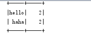

在SparkStreaming程序中如果有复杂业务逻辑的统计，使用scala代码实现起来比较困难，也不易于别人理解。但如果在SparkSteaming中也使用SQL来做统计分析，是不是就简单的多呢？

1.声明

开发

package com.spark7\
\
import org.apache.spark.SparkConf\
import org.apache.spark.rdd.RDD\
import org.apache.spark.sql.SparkSession\
import org.apache.spark.streaming.{Seconds, StreamingContext, Time}\
\
case class abc(word: String)\
object smsql {\
\
def main(args: Array\[String\]): Unit = {\
val conf = new
SparkConf().setAppName("SQLtest").setMaster("local\[2\]")\
val ssc = new StreamingContext(conf, Seconds(15))\
val lines = ssc.socketTextStream("192.168.8.66", 9999)\
val words = lines.flatMap(\_.split(" "))\
words.foreachRDD { (rdd: RDD\[String\], time: Time) =&gt;\
// Get the singleton instance of SparkSession\
//val spark = SparkSession.builder().config("spark.some.config.option",
"some-value").getOrCreate()\
val spark = SparkSessionSingleton.getInstance(rdd.sparkContext.getConf)\
import spark.implicits.\_\
\
// Convert RDD\[String\] to RDD\[case class\] to DataFrame\
val wordsDataFrame = rdd.map(x =&gt;abc(x)).toDF()\
\
// Creates a temporary view using the DataFrame\
wordsDataFrame.createOrReplaceTempView("words")\
\
// Do word count on table using SQL and print it\
val wordCountsDataFrame =\
spark.sql("select word, count(\*) as total from words group by word")\
println(s"========= \$time =========")\
wordCountsDataFrame.show()\
}\
ssc.start()\
ssc.awaitTermination()\
\
}\
\
\
}\
\
object SparkSessionSingleton {\
@transient private var instance: SparkSession = \_\
def getInstance(sparkConf: SparkConf): SparkSession = {\
if (instance == null) {\
instance = SparkSession\
.builder\
.config(sparkConf)\
.getOrCreate()\
}\
instance\
}\
\
}

结果：

Window nc 中输入

hello haha

hello haha

{width="1.9375in"
height="0.8645833333333334in"}

方法2：

import org.apache.spark.SparkConf\
import org.apache.spark.rdd.RDD\
import org.apache.spark.sql.SparkSession\
import org.apache.spark.streaming.{Seconds, StreamingContext, Time}\
\
case class abc(word: String)\
object smsql {\
\
def main(args: Array\[String\]): Unit = {\
val conf = new
SparkConf().setAppName("SQLtest").setMaster("local\[2\]")\
val ssc = new StreamingContext(conf, Seconds(15))\
val ssq =
SparkSession.builder().master("local\[2\]").appName("sstest1")\
.config("spark.some.config.option", "some-value").getOrCreate()\
\
val lines = ssc.socketTextStream("192.168.8.66", 9998)\
val words = lines.flatMap(\_.split(" "))\
words.foreachRDD { rdd =&gt;\
import ssq.implicits.\_

val wordsDataFrame = rdd.map(x =&gt;abc(x)).toDF()\
\
wordsDataFrame.createOrReplaceTempView("words")\
\
val wordCountsDataFrame =\
ssq.sql("select word, count(\*) as total from words group by word")\
wordCountsDataFrame.show()\
}\
ssc.start()\
ssc.awaitTermination()\
\
}\
\
\
}
