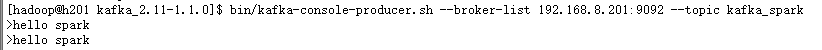
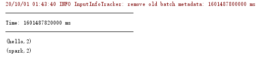

### kafka dstream方法

kafka作为一个实时的分布式消息队列，实时的生产和消费消息，这里我们可以利用SparkStreaming实时计算框架实时地读取kafka中的数据然后进行计算。在spark1.3版本后，kafkaUtils里面提供了两个创建dstream的方法，一种为KafkaUtils.createDstream(需要receiver接收)，另一种为KafkaUtils.createDirectStream

#### （1）KafkaUtils.createDirectStream

其中推荐使用KafkaUtils.createDirectStream的方式相比基于Receiver方式有几个优点：

1）简化并行

不需要创建多个kafka输入流，然后union它们，sparkStreaming将会创建和kafka分区一种的rdd的分区数，而且会从kafka中并行读取数据，spark中RDD的分区数和kafka中的分区数据是一一对应的关系。

2）高效

第一种实现数据的零丢失是将数据预先保存在WAL中，会复制一遍数据，会导致数据被拷贝两次，第一次是被kafka复制，另一次是写到WAL中。而没有receiver的这种方式消除了这个问题。

3）恰好一次语义(Exactly-once-semantics)

Receiver读取kafka数据是通过kafka高层次api把偏移量写入zookeeper中，虽然这种方法可以通过数据保存在WAL中保证数据不丢失，但是可能会因为sparkStreaming和ZK中保存的偏移量不一致而导致数据被消费了多次。EOS通过实现kafka低层次api，偏移量仅仅被ssc保存在checkpoint中，消除了zk和ssc偏移量不一致的问题。缺点是无法使用基于zookeeper的kafka监控工具。

4）版本限制

除了以上的原因，由于在学习Kafka时安装的版本是2.2.0，查询官方文档Spark
Streaming整合Kafka在0.10已经不支持Receiver的方式。

2.  #### createDirectStream方法

    建kafka的DStream数据源，传入有三个参数：ssc，LocationStrategies，ConsumerStrategies。

    **1）LocationStrategies有三种策略：PreferBrokers，PreferConsistent，PreferFixed**

    PreferBrokers：只有当executors数量等于brokers数量时使用

    PreferConsistent：大多数使用，在所有的executors分配分区

    PreferFixed：如果负载不平衡，把特定的TopicPartitions放在特定的hosts，不在这个map中的TopicPartition采用PreferConsistent策略

    2）ConsumerStrategies消费者策略：Subscribe，SubscribePattern，Assign，订阅和分配

    Subscribe：consumer自动分配partition，有内部算法保证topic-partitions以最优的方式均匀分配给同group下的不同consumer

    Assign：consumer手动、显示的指定需要消费的topic-partitions，不受group.id限制，相当于指定的group无效

#### （3）kafka版本说明

举例：kafka\_2.11-1.1.0.tgz

2.11为scala版本

1.1.0为kafka版本

#### （4）修改windows host文件

C:\\Windows\\System32\\drivers\\etc路径下修改host文件

添加：

192.168.8.201 h201

192.168.8.202 h202

192.168.8.203 h203

### pom添加依赖

&lt;**dependency**&gt;\
&lt;**groupId**&gt;org.apache.kafka&lt;/**groupId**&gt;\
&lt;**artifactId**&gt;kafka\_2.11&lt;/**artifactId**&gt;\
&lt;**version**&gt;1.1.0&lt;/**version**&gt;\
&lt;/**dependency**&gt;

&lt;**dependency**&gt;\
&lt;**groupId**&gt;org.apache.kafka&lt;/**groupId**&gt;\
&lt;**artifactId**&gt;kafka-clients&lt;/**artifactId**&gt;\
&lt;**version**&gt;1.1.0&lt;/**version**&gt;\
&lt;/**dependency**&gt;

&lt;**dependency**&gt;\
&lt;**groupId**&gt;org.apache.spark&lt;/**groupId**&gt;\
&lt;**artifactId**&gt;spark-streaming-kafka-0-10\_2.11&lt;/**artifactId**&gt;\
&lt;**version**&gt;2.1.1&lt;/**version**&gt;\
&lt;/**dependency**&gt;

### 3.开发（读取kafka数据）

package com.spark7\
\
import org.apache.spark.SparkConf\
import org.apache.spark.streaming.kafka010.{ConsumerStrategies,
KafkaUtils, LocationStrategies}\
import org.apache.spark.streaming.{Seconds, StreamingContext}\
\
import scala.collection.mutable\
\
object\
smkafka {\
def main(args: Array\[String\]): Unit = {\
val conf = new
SparkConf().setAppName("DirectKafka").setMaster("local\[2\]")\
val ssc = new StreamingContext(conf, Seconds(10))\
\
val topicsSet = Array("kafka\_spark")\
val kafkaParams = mutable.HashMap\[String, String\]()\
\
kafkaParams.put("bootstrap.servers", "192.168.8.201:9092")\
kafkaParams.put("group.id", "group1")\
kafkaParams.put("key.deserializer",
"org.apache.kafka.common.serialization.StringDeserializer")\
kafkaParams.put("value.deserializer",
"org.apache.kafka.common.serialization.StringDeserializer")\
val messages = KafkaUtils.createDirectStream\[String, String\](\
ssc,\
LocationStrategies.PreferConsistent,\
ConsumerStrategies.Subscribe\[String, String\](topicsSet, kafkaParams\
)\
)\
\
\
val lines = messages.map(\_.value)\
val words = lines.flatMap(\_.split(" "))\
val wordCounts = words.map(x =&gt; (x, 1L)).reduceByKey(\_ + \_)\
wordCounts.print()\
\
ssc.start()\
ssc.awaitTermination()\
}\
\
}

拷贝spark-streaming-kafka包

\[hadoop@h201 \~\]\$ cp /ff/spark-streaming-kafka-0-10\_2.11-2.1.1.jar
spark-2.1.1-bin-hadoop2.7/jars/

打包传递到linux平台

### 4.运行

Linux

\[hadoop@h201 zookeeper-3.4.5-cdh5.5.2\]\$ bin/zkServer.sh start

\[hadoop@h202 zookeeper-3.4.5-cdh5.5.2\]\$ bin/zkServer.sh start

\[hadoop@h203 zookeeper-3.4.5-cdh5.5.2\]\$ bin/zkServer.sh start

\[hadoop@sh201kafka\_2.12-0.10.2.1\]\$ bin/kafka-server-start.sh
config/server.properties &

\[hadoop@h202kafka\_2.12-0.10.2.1\]\$ bin/kafka-server-start.sh
config/server.properties &

\[hadoop@h203kafka\_2.12-0.10.2.1\]\$ bin/kafka-server-start.sh
config/server.properties &

1）创建topic

bin/kafka-topics.sh --create --zookeeper 192.168.8.201:2181
--replication-factor 1 --partitions 3 --topic kafka\_spark

2）Kafka上启动producer

\[hadoop@h201 kafka\_2.11-1.1.0\]\$ bin/kafka-console-producer.sh
--broker-list 192.168.8.201:9092 --topic kafka\_spark

3）Idea中运行smkafka

4.  linux下producer中输入内容

    {width="5.7625in"
    height="0.3506944444444444in"}

5.  idea中查看结果

    {width="5.395833333333333in"
    height="1.2708333333333333in"}

