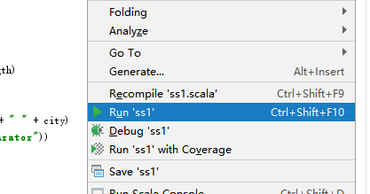
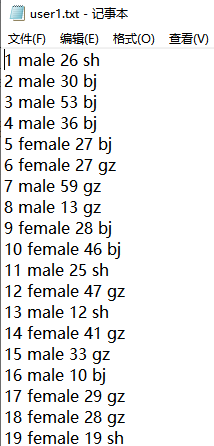
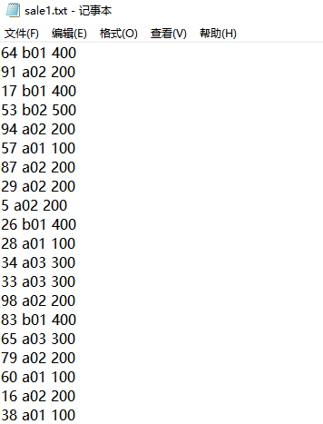
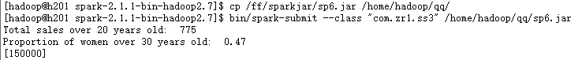

### 需求分析

某电商平台，收集用户的交易信息，进行统计分析，需要使用用户注册数据和交易数据进行join后形成完整数据后，进行计算。

1.  大于20岁消费者的总销量

2.  大于30岁的女性用户在所有女性用户中的占比

3.  男性用户的总消费金额

    集群运行时输出日志info类信息较多不方便查看结果，关闭info日志信息的输出

    日志信息去除info

    \[hadoop@h201 conf\]\$ cp log4j.properties.template log4j.properties

    \[hadoop@h201 conf\]\$ vi log4j.properties

    log4j.rootCategory=INFO, console

    更改为

    log4j.rootCategory=ERROR, console

### 产生数据

1.  #### 用户信息表

    用户信息表格式：

    用户Id,性别,年龄，城市

    Scala开发生成用户信息表：

**package** com.zr1\
\
**import** java.io.FileWriter\
**import** scala.util.Random\
**object** ss1 {\
**val** *FILE\_PATH* = **"D:/abc/user1.txt"\
val** *city1* = *Array*\[String\](**"bj"**, **"sh"**, **"gz"**)\
**val** *MAX\_AGE* = 60\
**val** *MAX\_RECORDS* = 100\
\
**def** main(args: Array\[String\]): Unit = {\
*generateDataFile*(*FILE\_PATH* , *MAX\_RECORDS*)\
}\
**def** generateDataFile(filePath : String, recordNum: Int): Unit = {\
**var** writer: FileWriter = **null\
\
try** {\
writer = **new** FileWriter(filePath, **true**)\
**val** rand = **new** Random()\
**for** (i &lt;- 1 to recordNum) {\
**var** gender = *getRandomGender\
\
***var** age = rand.nextInt(*MAX\_AGE*)\
**if** (age &lt; 10) {\
age = age + 20\
}\
**var** cityIndex:Int = rand.nextInt(*city1*.length)\
**var** city = *city1*(cityIndex)\
\
writer.write(i + **" "** + gender + **" "** + age + **" "** + city)\
writer.write(System.*getProperty*(**"line.separator"**))\
\
}\
}**catch** {\
**case** e:Exception =&gt; *println*(**"Error occurred:"** + e)\
}**finally** {\
**if** (writer != **null**)\
writer.close()\
}\
*println*(**"User Data File generated successfully."**)\
}\
\
**def** getRandomGender: String ={\
**val** rand = **new** Random()\
**val** randNum = rand.nextInt(2) + 1\
**if** (randNum % 2 == 0) {\
**"male"\
**} **else** {\
**"female"\
**}\
}\
}

Idea中 右键Run ‘ss1’运行

{width="4.34375in"
height="2.28125in"}

结果：（输出目录d:/abc中查看user1.txt文件）

{width="2.2291666666666665in"
height="4.645833333333333in"}

#### 交易信息表

交易信息表格式：

用户id，商品id，商品价格

**package** com.zr1\
\
**import** java.io.FileWriter\
**import** scala.util.Random\
\
**object** ss2 {\
**val** *FILE\_PATH* = **"D:/abc/sale1.txt"\
val** *PRODUCT\_ID* = *Array*\[String\](**"a01"**, **"a02"**,
**"a03"**,**"b01"**,**"b02"**)\
**val** *MAX\_RECORDS* = 1000\
**val** *MAX\_SUM* = 100\
**val** *PRODUCT\_PRICE* =
*Map*(**"a01"**-&gt;100,**"a02"**-&gt;200,**"a03"**-&gt;300,**"b01"**-&gt;400,**"b02"**-&gt;500)\
**def** main(args: Array\[String\]): Unit = {\
*generateDataFile*(*FILE\_PATH* , *MAX\_RECORDS*)\
}\
**def** generateDataFile(filePath : String, recordNum: Int): Unit = {\
**var** writer: FileWriter = **null\
\
try** {\
writer = **new** FileWriter(filePath, **true**)\
**val** rand = **new** Random()\
**for** (i &lt;- 1 to recordNum) {\
**var** userid = rand.nextInt(*MAX\_SUM*)+1\
\
**var** pIndex:Int = rand.nextInt(*PRODUCT\_ID*.length)\
**var** product = *PRODUCT\_ID*(pIndex)\
**var** product\_price = *PRODUCT\_PRICE*.getOrElse(product,1)\
\
writer.write(userid+ **" "** +product+ **" "** +product\_price)\
writer.write(System.*getProperty*(**"line.separator"**))\
*//换行\
*}\
}**catch** {\
**case** e:Exception =&gt; *println*(**"Error occurred:"** + e)\
}**finally** {\
**if** (writer != **null**)\
writer.close()\
}\
*println*(**"User Sale1 File generated successfully."**)\
}\
}

结果：（输出目录d:/abc中查看sale1.txt文件）

{width="3.7083333333333335in"
height="4.864583333333333in"}

Copy到spark集群中

挂载window的共享目录到 linux下ff目录中（8.66是idea所在的windows机器）

**注意：**

**上传到linux下有多种做法，可以使用工具上传（如：MobXterm）**

\[root@h201 \~\]\# mount //192.168.8.66/ISO /ff -o
username=administrator,password=abc

\[hadoop@h201 \~\]\$ cp /ff/sparkjar/sale1.txt /home/hadoop/qq/

\[hadoop@h201 \~\]\$ cp /ff/sparkjar/user1.txt /home/hadoop/qq/

上传到hdfs中

\[hadoop@h201 qq\]\$ hadoop fs -put user1.txt /spark1/

\[hadoop@h201 qq\]\$ hadoop fs -put sale1.txt /spark1/

### 开发

User1表

用户Id,性别,年龄，城市

Sale1 表

用户id，商品id，商品价格

**package** com.zr1\
\
**import** org.apache.spark.sql.SQLContext\
**import** org.apache.spark.storage.StorageLevel\
**import** org.apache.spark.{SparkConf, SparkContext}\
\
**case class** user1(userid:String,gender:String,age:Int,city:String)\
**case class** sale1(userid:String,productid:String,prict:BigInt)\
\
**object** ss3 {\
**def** main(args: Array\[String\]): Unit = {\
**val** conf = **new**
SparkConf().setMaster(**"local\[2\]"**).setAppName(**"sparkSQL"**)\
**val** sc = **new** SparkContext(conf)\
**val** sqlsc = **new** SQLContext(sc)\
\
**import** sqlsc.implicits.\_\
*//隐式转换\
***val** userDF =
sc.textFile(**"hdfs://h201:9000/spark1/user1.txt"**).map(\_.split(**"
"**)).map(\
u =&gt; *user1*(u(0), u(1), u(2).toInt,u(3))).toDF()\
\
**val** saleDF =
sc.textFile(**"hdfs://h201:9000/spark1/sale1.txt"**).map(\_.split(**"
"**)).map(\
u =&gt; *sale1*(u(0), u(1), u(2).toInt)).toDF()\
\
\
userDF.persist(StorageLevel.*MEMORY\_ONLY\_SER*)\
saleDF.persist(StorageLevel.*MEMORY\_ONLY\_SER*)\
\
**val** count1 =
userDF.filter(userDF(**"age"**)&gt;20).join(saleDF,userDF(**"userid"**).equalTo(saleDF(**"userid"**))).count()\
*println*(**"Total sales over 20 years old: "**+**" "**+count1)\
\
**val** fcount : Double =
userDF.filter(userDF(**"gender"**).contains(**"female"**)).count()\
**val** f30count : Double =
userDF.filter(userDF(**"age"**)&gt;30).filter(userDF(**"gender"**).contains(**"female"**)).count()\
**val** ffc :Double = f30count/fcount\
\
*//保留小数点后两位\
println*(**"Proportion of women over 30 years old: "**+**"
"**+ffc.formatted(**"%.2f"**) )\
\
userDF.createOrReplaceTempView(**"u1"**)\
saleDF.createOrReplaceTempView(**"s1"**)\
**val** msum = sqlsc.sql(**"select sum(b.prict) from u1 a,s1 b where
a.userid=b.userid and a.gender='male'"**)\
\
*//运行sql\
*msum.collect().foreach{*println*}\
\
}\
}

### 运行

Idea 形成jar包

拷贝到集群上

\[hadoop@h201 spark-2.1.1-bin-hadoop2.7\]\$ cp /ff/sparkjar/sp6.jar
/home/hadoop/qq/

集群模式运行

\[hadoop@h201 spark-2.1.1-bin-hadoop2.7\]\$ bin/spark-submit --class
"com.zr1.ss3" /home/hadoop/qq/sp6.jar

结果：

{width="5.7659722222222225in"
height="0.59375in"}
