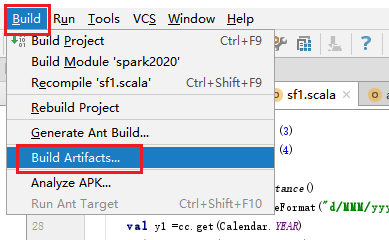
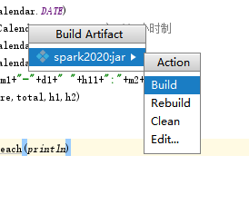

### 需求分析

整理分析数据，其中一个很重要的工作就是数据清洗。数据清洗是指对“脏”数据进行对应方式的处理，脏在这里意味着数据的质量不够好，会掩盖数据的价值，更会对其后的数据分析带来不同程度的影响。有调查称，一个相关项目的进展，80%的时间都可能会花费在这个工作上面

清洗数据的方式分类:筛选、清除、补充、纠正

本例中的访问日志的数据是日后公司做数据分析的重要数据，想要更好的分析出结果，需要数据预处理也就是有效的进行数据整理。

清洗流程：

(1)过滤掉原始数据中的空白行

(2)时间字段格式转换：YYYY-MM-DD hh24:mm:ss

(3)行截取提取出后期数据分析相关字段

数据输出格式：

（源ip,访问时间，访问方法（get/post），特征码，返回数据大小，一级分类，页面名称）

2.  ### 原始数据

    \[hadoop@h201 hhh\]\$ cat accesslog.txt

    192.168.8.5 \[01/May/2019:12:12:19 +0800\] "GET / HTTP/1.1" 200 45
    http://www.zr.com/sport/a.html

    192.168.8.5 \[01/May/2019:12:21:15 +0800\] "GET / HTTP/1.1" 200 45
    http://www.zr.com/sport/a.html

    192.168.8.5 \[01/May/2019:12:21:19 +0800\] "GET / HTTP/1.1" 200 45
    http://www.zr.com/sport/b.html

    192.168.8.15 \[01/May/2019:12:21:19 +0800\] "GET / HTTP/1.1" 200 45
    http://www.zr.com/news/a.html

    192.168.8.15 \[01/May/2019:12:21:22 +0800\] "GET / HTTP/1.1" 200 45
    http://www.zr.com/news/b.html

    192.168.8.15 \[01/May/2019:12:20:19 +0800\] "GET / HTTP/1.1" 200 45
    http://www.zr.com/news/b.html

    192.168.8.55 \[01/May/2019:12:21:19 +0800\] "GET / HTTP/1.1" 200 45
    http://www.zr.com/music/a.html

    192.168.8.55 \[01/May/2019:12:21:25 +0800\] "GET / HTTP/1.1" 200 45
    http://www.zr.com/music/a.html

    192.168.8.55 \[01/May/2019:12:21:35 +0800\] "GET / HTTP/1.1" 200 45
    http://www.zr.com/music/b.html

    上传数据到HDFS的根目录下

    \[hadoop@h201 hhh\]\$ hadoop fs -put accesslog.txt /

    \[hadoop@h201 spark-2.1.1-bin-hadoop2.7\]\$ bin/spark-submit --class
    "com.zr1.sf1" /home/hadoop/qq/s5.jar

### 3开发：

**package** com.zr1\
**import** java.text.SimpleDateFormat\
**import** java.util.{Calendar, Locale}\
\
**import** org.apache.spark.{SparkConf, SparkContext}\
\
**object** sf1 {\
**def** main(args: Array\[String\]): Unit = {\
**val** conf = **new**
SparkConf().setMaster(**"local\[2\]"**).setAppName(**"sf1"**)\
**val** sc = **new** SparkContext(conf)\
**val** data = sc.textFile(**"hdfs://h201:9000/accesslog.txt"**)\
*//日志数据\
// 192.168.8.55 \[01/May/2019:12:21:35 +0800\] "GET / HTTP/1.1" 200 45
http://www.zr.com/music/b.html\
\
***val** filter1 = data.filter(\_.length() &gt; 0)\
**val** data1 =filter1.map(a=&gt;{\
**val** ff =a.split(**" "**)\
**val** ip =ff(0)\
**val** sj =ff(1).substring(1)\
**val** acc =ff(3).substring(1)\
**val** feature =ff(6)\
**val** total =ff(7)\
**val** h1 =ff(8).split(**"/"**)(3)\
**val** h2 =ff(8).split(**"/"**)(4)\
\
**val** cc = Calendar.*getInstance*()\
cc.setTime(**new** SimpleDateFormat(**"d/MMM/yyyy:h:m:s"**,
Locale.*ENGLISH*).parse(sj))\
**val** y1 =cc.get(Calendar.*YEAR*)\
**val** m1 =cc.get(Calendar.*MONTH*)\
**val** d1 =cc.get(Calendar.*DATE*)\
**val** h11 =cc.get(Calendar.*HOUR\_OF\_DAY*) *//24小时制\
***val** m2 =cc.get(Calendar.*MINUTE*)\
**val** s1 =cc.get(Calendar.*SECOND*)\
**val** cc1 =y1+**"-"**+m1+**"-"**+d1+**" "**+h11+**":"**+m2+**":"**+s1\
(ip,cc1,acc,feature,total,h1,h2)\
})\
\
data1.collect().foreach(*println*)\
}\
}

Idea打包

{width="4.052083333333333in"
height="2.5in"}

{width="2.8541666666666665in"
height="2.34375in"}

执行：

\[hadoop@h201 spark-2.1.1-bin-hadoop2.7\]\$ bin/spark-submit --class
"com.zr1.sf1" /home/hadoop/qq/s8.jar

结果：

(192.168.8.5,2019-4-1 5:12:19,GET,200,45,sport,a.html)

(192.168.8.5,2019-4-1 5:21:15,GET,200,45,sport,a.html)

(192.168.8.5,2019-4-1 5:21:19,GET,200,45,sport,b.html)

(192.168.8.15,2019-4-1 5:21:19,GET,200,45,news,a.html)

(192.168.8.15,2019-4-1 5:21:22,GET,200,45,news,b.html)

(192.168.8.15,2019-4-1 5:20:19,GET,200,45,news,b.html)

(192.168.8.55,2019-4-1 5:21:19,GET,200,45,music,a.html)

(192.168.8.55,2019-4-1 5:21:25,GET,200,45,music,a.html)

(192.168.8.55,2019-4-1 5:21:35,GET,200,45,music,b.html)
