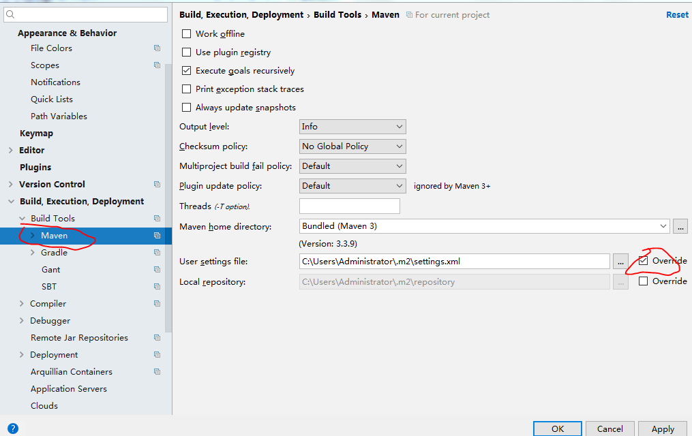

1.  在IDEA中打开“Settings”（快捷键Ctrl+Alt+S）

2.  在搜索框中输入“maven”，找到Maven设置菜单，点击进去，在红框所示路径新建“settings.xml”文件，并写入如下内容，勾选“”override

> {width="5.768055555555556in"
> height="3.6368055555555556in"}

1.  进入上图中的目录创建settings文件

> 添加

*&lt;?***xml version="1.0" encoding="UTF-8"***?&gt;\
*&lt;**settings xmlns="http://maven.apache.org/SETTINGS/1.0.0"\
xmlns:xsi="http://www.w3.org/2001/XMLSchema-instance"\
xsi:schemaLocation="http://maven.apache.org/SETTINGS/1.0.0
http://maven.apache.org/xsd/settings-1.0.0.xsd"**&gt;\
&lt;**mirrors**&gt;\
*&lt;!-- mirror\
| Specifies a repository mirror site to use instead of a given
repository. The repository that\
| this mirror serves has an ID that matches the mirrorOf element of this
mirror. IDs are used\
| for inheritance and direct lookup purposes, and must be unique across
the set of mirrors.\
|\
&lt;mirror&gt;\
&lt;id&gt;mirrorId&lt;/id&gt;\
&lt;mirrorOf&gt;repositoryId&lt;/mirrorOf&gt;\
&lt;name&gt;Human Readable Name for this Mirror.&lt;/name&gt;\
&lt;url&gt;http://my.repository.com/repo/path&lt;/url&gt;\
&lt;/mirror&gt;\
--&gt;\
\
*&lt;**mirror**&gt;\
&lt;**id**&gt;alimaven&lt;/**id**&gt;\
&lt;**name**&gt;aliyun maven&lt;/**name**&gt;\
&lt;**url**&gt;http://maven.aliyun.com/nexus/content/groups/public/&lt;/**url**&gt;\
&lt;**mirrorOf**&gt;central&lt;/**mirrorOf**&gt;\
&lt;/**mirror**&gt;\
\
&lt;**mirror**&gt;\
&lt;**id**&gt;uk&lt;/**id**&gt;\
&lt;**mirrorOf**&gt;central&lt;/**mirrorOf**&gt;\
&lt;**name**&gt;Human Readable Name for this Mirror.&lt;/**name**&gt;\
&lt;**url**&gt;http://uk.maven.org/maven2/&lt;/**url**&gt;\
&lt;/**mirror**&gt;\
\
&lt;**mirror**&gt;\
&lt;**id**&gt;CN&lt;/**id**&gt;\
&lt;**name**&gt;OSChina Central&lt;/**name**&gt;\
&lt;**url**&gt;http://maven.oschina.net/content/groups/public/&lt;/**url**&gt;\
&lt;**mirrorOf**&gt;central&lt;/**mirrorOf**&gt;\
&lt;/**mirror**&gt;\
\
&lt;**mirror**&gt;\
&lt;**id**&gt;nexus&lt;/**id**&gt;\
&lt;**name**&gt;internal nexus repository&lt;/**name**&gt;\
*&lt;!--
&lt;url&gt;http://192.168.1.100:8081/nexus/content/groups/public/&lt;/url&gt;--&gt;\
*&lt;**url**&gt;http://repo.maven.apache.org/maven2&lt;/**url**&gt;\
&lt;**mirrorOf**&gt;central&lt;/**mirrorOf**&gt;\
&lt;/**mirror**&gt;\
\
&lt;/**mirrors**&gt;\
&lt;/**settings**&gt;
