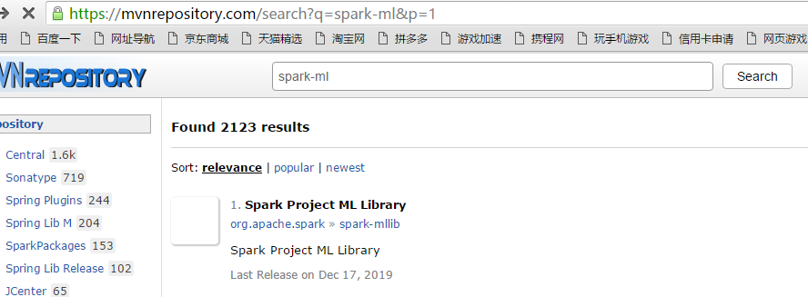
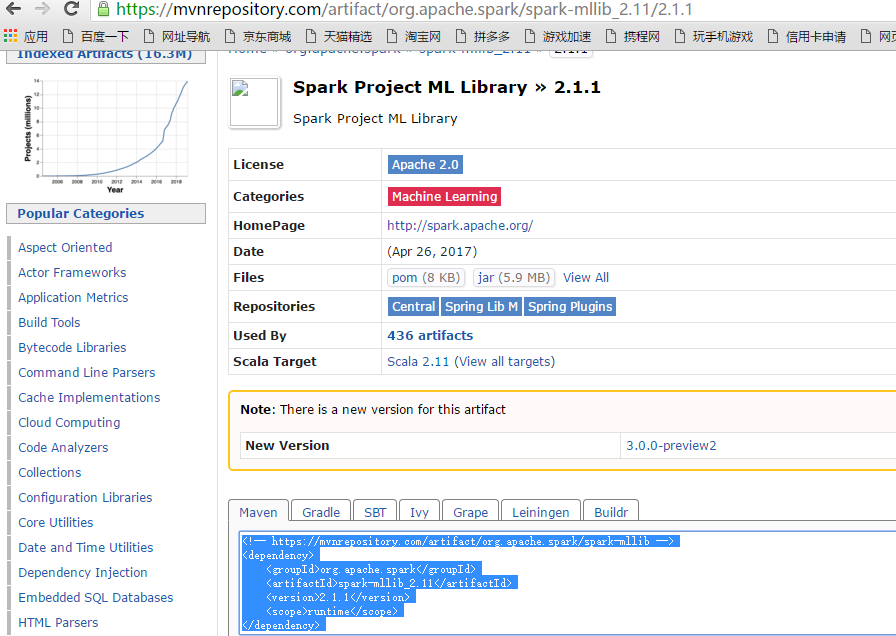
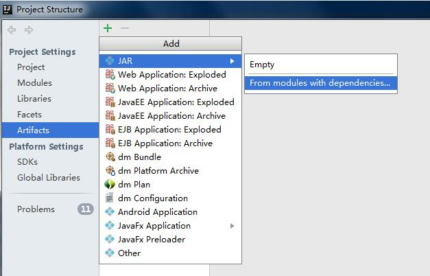
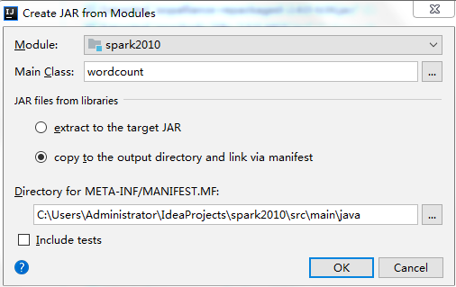
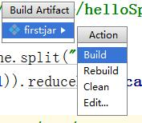

maven 支持

*https://mvnrepository.com/*

搜索spark-ml

{width="5.7625in"
height="2.1222222222222222in"}

选择相应的版本

{width="5.768055555555556in"
height="4.094444444444444in"}

导入scala支持

FileProject StructureLibraries

修改pom.xml

添加以下内容

&lt;?**xml version="1.0" encoding="UTF-8"**?&gt;*\
*&lt;**project xmlns="http://maven.apache.org/POM/4.0.0"\
xmlns:xsi="http://www.w3.org/2001/XMLSchema-instance"\
xsi:schemaLocation="http://maven.apache.org/POM/4.0.0
http://maven.apache.org/xsd/maven-4.0.0.xsd"**&gt;\
&lt;**modelVersion**&gt;4.0.0&lt;/**modelVersion**&gt;\
\
&lt;**groupId**&gt;com.ws.spark&lt;/**groupId**&gt;\
&lt;**artifactId**&gt;spark&lt;/**artifactId**&gt;\
&lt;**version**&gt;1.0-SNAPSHOT&lt;/**version**&gt;\
\
&lt;**properties**&gt;\
&lt;**maven.compiler.source**&gt;1.8&lt;/**maven.compiler.source**&gt;\
&lt;**maven.compiler.target**&gt;1.8&lt;/**maven.compiler.target**&gt;\
&lt;**scala.version**&gt;2.11.8&lt;/**scala.version**&gt;\
&lt;**spark.version**&gt;2.1.1&lt;/**spark.version**&gt;\
&lt;**hadoop.version**&gt;2.7.2&lt;/**hadoop.version**&gt;\
&lt;**encoding**&gt;UTF-8&lt;/**encoding**&gt;\
&lt;/**properties**&gt;\
\
&lt;**dependencies**&gt;\
*&lt;!-- 导入scala的依赖 --&gt;\
*&lt;**dependency**&gt;\
&lt;**groupId**&gt;org.scala-lang&lt;/**groupId**&gt;\
&lt;**artifactId**&gt;scala-library&lt;/**artifactId**&gt;\
&lt;**version**&gt;\${scala.version}&lt;/**version**&gt;\
&lt;/**dependency**&gt;\
\
*&lt;!-- 导入spark的依赖 --&gt;\
*&lt;**dependency**&gt;\
&lt;**groupId**&gt;org.apache.spark&lt;/**groupId**&gt;\
&lt;**artifactId**&gt;spark-core\_2.11&lt;/**artifactId**&gt;\
&lt;**version**&gt;\${spark.version}&lt;/**version**&gt;\
&lt;/**dependency**&gt;\
\
*&lt;!--spark sql依赖--&gt;\
*&lt;**dependency**&gt;\
&lt;**groupId**&gt;org.apache.spark&lt;/**groupId**&gt;\
&lt;**artifactId**&gt;spark-sql\_2.11&lt;/**artifactId**&gt;\
&lt;**version**&gt;\${spark.version}&lt;/**version**&gt;\
&lt;/**dependency**&gt;\
&lt;**dependency**&gt;\
&lt;**groupId**&gt;org.apache.spark&lt;/**groupId**&gt;\
&lt;**artifactId**&gt;spark-streaming\_2.11&lt;/**artifactId**&gt;\
&lt;**version**&gt;\${spark.version}&lt;/**version**&gt;\
&lt;/**dependency**&gt;\
\
*&lt;!-- 指定hadoop-client API的版本 --&gt;\
*&lt;**dependency**&gt;\
&lt;**groupId**&gt;org.apache.hadoop&lt;/**groupId**&gt;\
&lt;**artifactId**&gt;hadoop-client&lt;/**artifactId**&gt;\
&lt;**version**&gt;\${hadoop.version}&lt;/**version**&gt;\
&lt;/**dependency**&gt;\
\
*&lt;!-- https://mvnrepository.com/artifact/mysql/mysql-connector-java
--&gt;\
*&lt;**dependency**&gt;\
&lt;**groupId**&gt;mysql&lt;/**groupId**&gt;\
&lt;**artifactId**&gt;mysql-connector-java&lt;/**artifactId**&gt;\
&lt;**version**&gt;6.0.6&lt;/**version**&gt;\
&lt;/**dependency**&gt;\
\
*&lt;!-- https://mvnrepository.com/artifact/org.apache.kafka/kafka
--&gt;\
*&lt;**dependency**&gt;\
&lt;**groupId**&gt;org.apache.kafka&lt;/**groupId**&gt;\
&lt;**artifactId**&gt;kafka\_2.11&lt;/**artifactId**&gt;\
&lt;**version**&gt;0.8.2.1&lt;/**version**&gt;\
&lt;/**dependency**&gt;\
*&lt;!--spark streaming 和 --&gt;\
*&lt;**dependency**&gt;\
&lt;**groupId**&gt;org.apache.spark&lt;/**groupId**&gt;\
&lt;**artifactId**&gt;spark-streaming-kafka-0-8\_2.11&lt;/**artifactId**&gt;\
&lt;**version**&gt;\${spark.version}&lt;/**version**&gt;\
&lt;/**dependency**&gt;\
\
&lt;**dependency**&gt;\
&lt;**groupId**&gt;redis.clients&lt;/**groupId**&gt;\
&lt;**artifactId**&gt;jedis&lt;/**artifactId**&gt;\
&lt;**version**&gt;2.9.0&lt;/**version**&gt;\
&lt;/**dependency**&gt;\
\
\
&lt;/**dependencies**&gt;\
&lt;**build**&gt;\
&lt;**plugins**&gt;\
\
*&lt;!-- 在maven项目中既有java又有scala代码时配置 maven-scala-plugin
插件打包时可以将两类代码一起打包 --&gt;\
*&lt;**plugin**&gt;\
&lt;**groupId**&gt;org.scala-tools&lt;/**groupId**&gt;\
&lt;**artifactId**&gt;maven-scala-plugin&lt;/**artifactId**&gt;\
&lt;**version**&gt;2.15.2&lt;/**version**&gt;\
&lt;**executions**&gt;\
&lt;**execution**&gt;\
&lt;**goals**&gt;\
&lt;**goal**&gt;compile&lt;/**goal**&gt;\
&lt;**goal**&gt;testCompile&lt;/**goal**&gt;\
&lt;/**goals**&gt;\
&lt;/**execution**&gt;\
&lt;/**executions**&gt;\
&lt;/**plugin**&gt;\
\
*&lt;!-- maven 打jar包需要插件 --&gt;\
*&lt;**plugin**&gt;\
&lt;**artifactId**&gt;maven-assembly-plugin&lt;/**artifactId**&gt;\
&lt;**version**&gt;2.4&lt;/**version**&gt;\
&lt;**configuration**&gt;\
*&lt;!-- 设置false后是去掉
MySpark-1.0-SNAPSHOT-jar-with-dependencies.jar 后的
“-jar-with-dependencies” --&gt;\
&lt;!--&lt;appendAssemblyId&gt;false&lt;/appendAssemblyId&gt;--&gt;\
*&lt;**descriptorRefs**&gt;\
&lt;**descriptorRef**&gt;jar-with-dependencies&lt;/**descriptorRef**&gt;\
&lt;/**descriptorRefs**&gt;\
&lt;**archive**&gt;\
&lt;**manifest**&gt;\
&lt;**mainClass**&gt;com.bjsxt.scalaspark.sql.windows.OverFunctionOnHive&lt;/**mainClass**&gt;\
&lt;/**manifest**&gt;\
&lt;/**archive**&gt;\
&lt;/**configuration**&gt;\
&lt;**executions**&gt;\
&lt;**execution**&gt;\
&lt;**id**&gt;make-assembly&lt;/**id**&gt;\
&lt;**phase**&gt;package&lt;/**phase**&gt;\
&lt;**goals**&gt;\
&lt;**goal**&gt;assembly&lt;/**goal**&gt;\
&lt;/**goals**&gt;\
&lt;/**execution**&gt;\
&lt;/**executions**&gt;\
&lt;/**plugin**&gt;\
\
&lt;/**plugins**&gt;\
&lt;/**build**&gt;\
\
&lt;/**project**&gt;

Idea打包

**import** org.apache.spark.SparkContext\
**import** org.apache.spark.SparkConf\
**object** wordcount {\
**def** main(args: Array\[String\]): Unit = {\
**val** conf = **new** SparkConf().setAppName(**"WC"**)\
**val** sc = **new** SparkContext(conf)\
\
**val** input = sc.textFile(**"README.md"**)\
**val** pythonLines = input.filter(line =&gt;
line.contains(**"Python"**))\
**val** words = pythonLines.flatMap(line =&gt; line.split(**" "**))\
**val** counts = words.map(word =&gt; (word, 1)).reduceByKey(\_ + \_)\
\
counts.saveAsTextFile(**"outputFile"**)\
sc.stop()\
}\
}

1.

file-&gt;Porject Structure-&gt;Artifacts-&gt;绿色的加号-&gt;JAR-&gt;from
modules...

{width="5.768055555555556in"
height="3.6979166666666665in"}

跳出以下对话框，选择要打包的类，然后选择copy
to.....选项，这里的意思是只打包这一个类。

{width="5.271527777777778in"
height="3.3229166666666665in"}

点击ok,然后ok。然后build-&gt;build Artifacts

{width="1.84375in"
height="1.6041666666666667in"}

在输出的目录中就能查看到相应的jar包，把jar 包copy到spark中运行。

3.spark 执行

在windows 目录中找到jar包

Copy到 spark上

\[hadoop@h201 \~\]\$ spark-2.1.1-bin-hadoop2.7/bin/spark-submit --class
" wordcount" spark2010.jar
