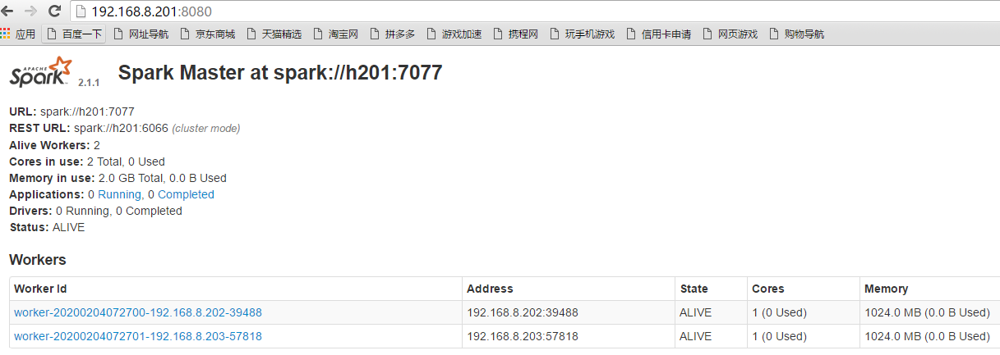

### 1.spark安装模式

{width="5.767361111111111in"
height="4.179166666666666in"}

（1）local(本地模式)：常用于本地开发测试，本地还分为local单线程和local-cluster多线程

（2）standalone(集群模式)：典型的Mater/slave模式，不过也能看出Master是有单点故障的；Spark支持ZooKeeper来实现
HA

（3）on yarn(集群模式)： 运行在 yarn 资源管理器框架之上，由 yarn
负责资源管理，Spark 负责任务调度和计算

（4）on mesos(集群模式)： 运行在 mesos 资源管理器框架之上，由 mesos
负责资源管理，Spark 负责任务调度和计算

5.  on cloud(集群模式)：比如 AWS 的 EC2，使用这个模式能很方便的访问
    Amazon的 S3;Spark 支持多种分布式存储系统：HDFS 和 S3

### 2.spark standalone模式安装

  ------ --------
  H201   Master
  H202   worker
  H203   worker
  ------ --------

2.1 安装环境准备

Jdk1.8

Ssh证书

Hadoop（HDFS当做spark的持久化层）

2.2

解压缩

\[hadoop@h201 \~\]\$ tar -zxvf spark-2.1.1-bin-hadoop2.7.tgz

2.3 配置文件修改

\[hadoop@h201 \~\]\$ cd spark-2.1.1-bin-hadoop2.7/conf/

\[hadoop@h201 conf\]\$ cp spark-env.sh.template spark-env.sh

\[hadoop@h201 conf\]\$ vi spark-env.sh

添加

export SPARK\_MASTER\_HOST=h201

export SPARK\_MASTER\_PORT=7077

export JAVA\_HOME=/usr/jdk1.8.0\_131

2.4 配置slaves

\[hadoop@h201 conf\]\$ vi slaves

添加：

h202

h203

2.5 同步到其他节点

\[hadoop@h201 \~\]\$ scp -r spark-2.1.1-bin-hadoop2.7 h202:/home/hadoop/

\[hadoop@h201 \~\]\$ scp -r spark-2.1.1-bin-hadoop2.7 h203:/home/hadoop/

2.6 从节点修改

\[hadoop@h202 conf\]\$ vi spark-env.sh

export SPARK\_LOCAL\_IP=h202

\[hadoop@h203 conf\]\$ vi spark-env.sh

export SPARK\_LOCAL\_IP=h203

2.7 启动集群

\[hadoop@h201 spark-2.1.1-bin-hadoop2.7\]\$ sbin/start-all.sh

2.8 验证

主节点

\[hadoop@h201 spark-2.1.1-bin-hadoop2.7\]\$ jps

32164 Master

从节点

\[hadoop@h202 \~\]\$ jps

31605 Worker

浏览器

*http://192.168.8.201:8080*

{width="6.779861111111111in"
height="2.4125in"}
