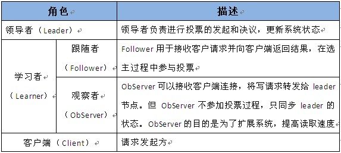

1.  ### zookeeper作用

    **（1）节点选举**

    Master节点，主节点挂了之后，从节点就会接手工作

    并且，保证这个节点是唯一的，这就是首脑模式，从而保证集群的高可用

    **（2）统一配置文件管理**

    只需要部署一台服务器

    则可以把相同的配置文件，同步更新到其他所有服务器，

    此操作在云计算中，用的特别多

    比如，修改了redis统一配置

    **（3）发布与订阅**

    类似消息队列MQ、amq、rmq，dubbo

    发布者把数据存在znode节点上，订阅者会读取这个数据

    **（4）提供分布式锁**

    分布式环境中，不同进程之间争夺资源

    类似于多线程中的的锁

    **（5）集群管理**

    集群中，保证数据的一致性

### 2.Zookeeper的角色

　领导者（leader），负责进行投票的发起和决议，更新系统状态

　学习者（learner），包括跟随者（follower）和观察者（observer），follower用于接受客户端请求并想客户端返回结果，在选主过程中参与投票

　
Observer可以接受客户端连接，将写请求转发给leader，但observer不参加投票过程，只同步leader的状态，observer的目的是为了扩展系统，提高读取速度

　客户端（client），请求发起方

{width="7.447916666666667in"
height="2.8958333333333335in"}

{width="5.96875in"
height="2.6770833333333335in"}

**（1）zookeeper工作原理**

Zookeeper的核心是原子广播，这个机制保证了各个Server之间的同步。实现这个机制的协议叫做Zab协议。Zab协议有两种模式，它们分别是恢复模式（选主）和广播模式（同步）。当服务启动或者在领导者崩溃后，Zab就进入了恢复模式，当领导者被选举出来，且大多数Server完成了和leader的状态同步以后，恢复模式就结束了。状态同步保证了leader和Server具有相同的系统状态。

为了保证事务的顺序一致性，zookeeper采用了递增的事务id号（zxid）来标识事务。所有的提议（proposal）都在被提出的时候加上了zxid。实现中zxid是一个64位的数字，它高32位是epoch用来标识leader关系是否改变，每次一个leader被选出来，它都会有一个新的epoch，标识当前属于那个leader的统治时期。低32位用于递增计数。

每个Server在工作过程中有三种状态：

　　　LOOKING：当前Server不知道leader是谁，正在搜寻

　　　LEADING：当前Server即为选举出来的leader

　　　FOLLOWING：leader已经选举出来，当前Server与之同步

（2）Zookeeper 的读写机制

Zookeeper是一个由多个server组成的集群

一个leader，多个follower

每个server保存一份数据副本

全局数据一致

分布式读写

更新请求转发，由leader实施

（3）Zookeeper 的保证　

更新请求顺序进行，来自同一个client的更新请求按其发送顺序依次执行

数据更新原子性，一次数据更新要么成功，要么失败

全局唯一数据视图，client无论连接到哪个server，数据视图都是一致的

实时性，在一定事件范围内，client能读到最新数据

### 3.Zookeeper节点数据操作流程

{width="6.6375in"
height="4.251388888888889in"}

1.在Client向Follwer发出一个写的请求

2.Follwer把请求发送给Leader

3.Leader接收到以后开始发起投票并通知Follwer进行投票

4.Follwer把投票结果发送给Leader

5.Leader将结果汇总后如果需要写入，则开始写入同时把写入操作通知给Leader，然后commit;

6.Follwer把请求结果返回给Client

　　　　　

Follower主要有四个功能：

　　　　• 1.
向Leader发送请求（PING消息、REQUEST消息、ACK消息、REVALIDATE消息）；

　　　　• 2 .接收Leader消息并进行处理；

　　　　• 3 .接收Client的请求，如果为写请求，发送给Leader进行投票；

　　　　• 4 .返回Client结果。

Follower的消息循环处理如下几种来自Leader的消息：

　　　　• 1 .PING消息： 心跳消息；

　　　　• 2 .PROPOSAL消息：Leader发起的提案，要求Follower投票；

　　　　• 3 .COMMIT消息：服务器端最新一次提案的信息；

　　　　• 4 .UPTODATE消息：表明同步完成；

　　　　• 5
.REVALIDATE消息：根据Leader的REVALIDATE结果，关闭待revalidate的session还是允许其接受消息；

　　　　• 6
.SYNC消息：返回SYNC结果到客户端，这个消息最初由客户端发起，用来强制得到最新的更新。

### 4.Zookeeper leader 选举　　

半数通过

　　　　– 3台机器 挂一台 2&gt;3/2

　　　　– 4台机器 挂2台 2！&gt;4/2

　　

　•A提案说，我要选自己，B你同意吗？C你同意吗？B说，我同意选A；C说，我同意选A。(注意，这里超过半数了，其实在现实世界选举已经成功了。但是计算机世界是很严格，另外要理解算法，要继续模拟下去。)

　　•
接着B提案说，我要选自己，A你同意吗；A说，我已经超半数同意当选，你的提案无效；C说，A已经超半数同意当选，B提案无效。

　　•
接着C提案说，我要选自己，A你同意吗；A说，我已经超半数同意当选，你的提案无效；B说，A已经超半数同意当选，C的提案无效。

　　•
选举已经产生了Leader，后面的都是follower，只能服从Leader的命令。而且这里还有个小细节，就是其实谁先启动谁当头。
